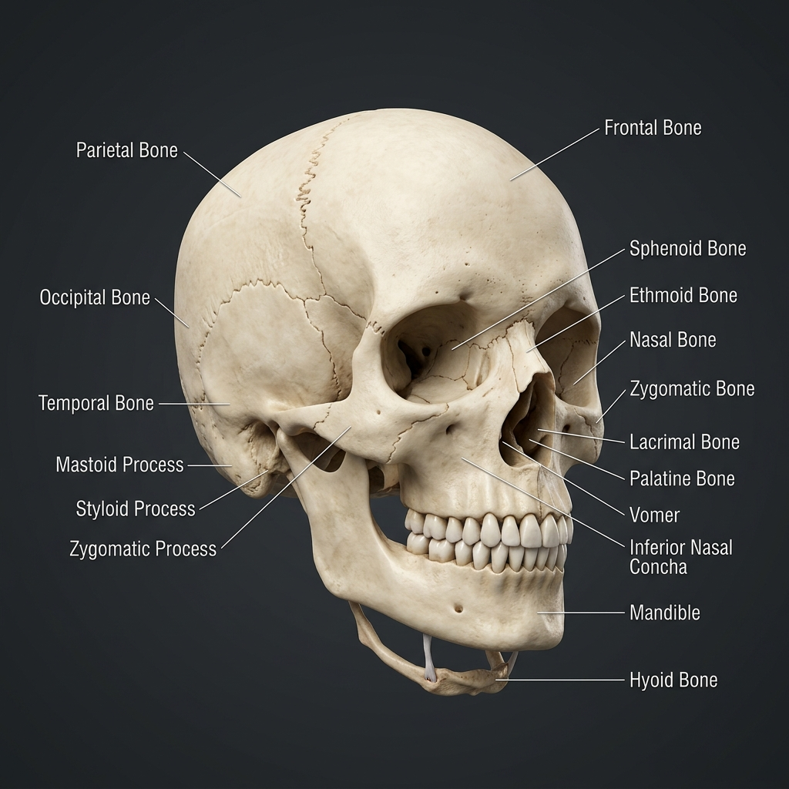

# 💀 Skull & Hyoid Bone Reference Guide (29 Bones)

This guide catalogs the 28 bones of the human skull (divided into the neurocranium, facial skeleton, and middle ear ossicles) plus the hyoid bone of the neck, and maps how muscles anchor to them.

---

## 🎨 Labeled Skeletal Illustration

---

## 📂 Complete Bone Inventory

The Head and Neck region contains exactly **29 bones**:

### 1. Neurocranium (8 Cranial Bones)
These bones form the cranial cavity that encloses and protects the brain:
*   **Frontal Bone (1):** Forms the forehead and the superior roof of the orbits (eye sockets).
*   **Parietal Bones (2):** Form the superior and lateral walls of the cranium.
*   **Occipital Bone (1):** Forms the posterior wall and base of the skull. Contains the *Foramen Magnum* (large opening for the spinal cord).
*   **Temporal Bones (2):** Form the lower lateral walls and base of the skull, housing the middle and inner ear structures.
*   **Sphenoid Bone (1):** A butterfly-shaped bone forming the central base of the skull; binds the cranium and facial skeleton together.
*   **Ethmoid Bone (1):** Located anteriorly at the cranial floor; forms the roof of the nasal cavity and parts of the orbit.

### 2. Viscerocranium (14 Facial Bones)
These bones form the facial framework, support teeth, and house sensory organs (vision, taste, smell):
*   **Mandible (1):** The lower jawbone; the only movable bone of the skull (excluding ossicles).
*   **Maxillae (2):** Form the upper jaw, hard palate, and lateral floor of the nasal cavity.
*   **Zygomatic Bones (2):** The cheekbones; form the lateral walls of the orbits.
*   **Nasal Bones (2):** Form the bridge of the nose.
*   **Lacrimal Bones (2):** Tiny bones at the medial wall of the orbits; contain the tear duct path.
*   **Palatine Bones (2):** Form the posterior section of the hard palate.
*   **Inferior Nasal Conchae (2):** Curved bones projecting into the nasal cavity to create turbulent airflow.
*   **Vomer (1):** Forms the inferior portion of the nasal septum.

### 3. Auditory Ossicles (6 Middle Ear Bones)
These tiny bones reside inside the middle ear cavity of the temporal bone, mechanical-transmitting sound vibrations to the inner ear:
*   **Malleus (2):** The "Hammer", attached to the eardrum.
*   **Incus (2):** The "Anvil", middle bone.
*   **Stapes (2):** The "Stirrup", vibrates against the oval window. (The smallest bone in the human body).

### 4. Cervical Girdle (1 Neck Bone)
*   **Hyoid Bone (1):** A U-shaped bone suspended in the mid-neck below the mandible. It does **not** articulate directly with any other bone, suspended entirely by muscles and ligaments.

---

## 🔗 Muscle-Skeleton Linkage Map

The bones of the head and neck feature specialized landmarks that serve as attachment anchors for facial and cervical muscles:

| Bony Landmark | Anatomical Location | Attached Muscle | Type | Mechanical Function & Link |
| :--- | :--- | :--- | :--- | :--- |
| **Mastoid Process** | Infero-posterior temporal bone | **[Sternocleidomastoid (SCM)](../../muscles/regions/01_head_neck_face/anatomy.md#4-lateral--posterior-cervical-muscles)** | Insertion | Pulls skull forward (bilateral flexion) or rotates head (unilateral) |
| **Mastoid Process** | Infero-posterior temporal bone | **[Splenius Capitis](../../muscles/regions/01_head_neck_face/anatomy.md#4-lateral--posterior-cervical-muscles)** | Insertion | Extends and rotates head |
| **Styloid Process** | Thin projection of temporal bone | **[Stylohyoid](../../muscles/regions/01_head_neck_face/anatomy.md#3-anterior-neck--hyoid-muscles)** | Origin | Elevates and retracts the hyoid bone during swallowing |
| **Coronoid Process** | Superior anterior ramus of mandible | **[Temporalis](../../muscles/regions/01_head_neck_face/anatomy.md#2-muscles-of-mastication-chewing)** | Insertion | Elevates mandible, closing jaw firmly |
| **Angle & Ramus** | Posterior inferior corner of mandible | **[Masseter](../../muscles/regions/01_head_neck_face/anatomy.md#2-muscles-of-mastication-chewing)** | Insertion | Lever for powerful chewing force |
| **Superior Nuchal Line** | Curved ridge on occipital bone | **[Trapezius](../../muscles/regions/02_back_spine/anatomy.md#1-superficial-layer-appendicular-back-muscles)** | Origin | Elevates scapula and controls neck posture extension |
| **Hyoid Body & Horns** | Midline anterior neck | **[Suprahyoids / Infrahyoids](../../muscles/regions/01_head_neck_face/anatomy.md#3-anterior-neck--hyoid-muscles)** | Multiple | Serves as mechanical anchor for speech and swallowing kinematics |

---

## 🤸 Study & Practice Links
*   **[Anatomy Reference: Head & Neck Muscles](../../muscles/regions/01_head_neck_face/anatomy.md)**
*   **[Pose Corrections: Head & Neck](../../muscles/regions/01_head_neck_face/pose_corrections.md)**
*   **[Bones Master Directory](../README.md)**
