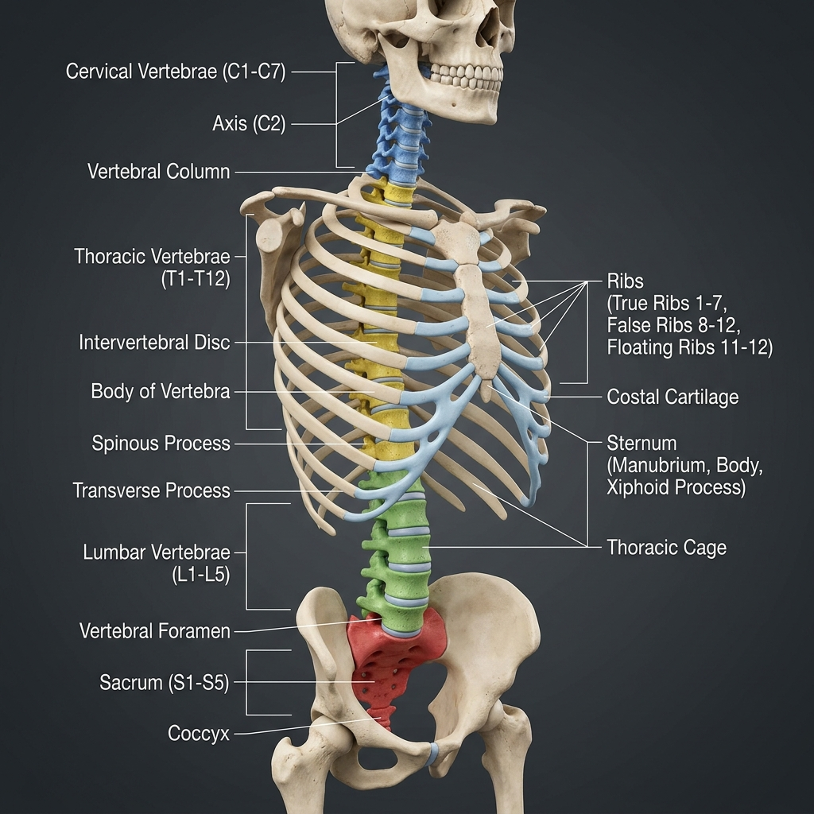

# 🦴 Vertebrae & Thorax Reference Guide (51 Bones)

This guide catalogs the 26 bones of the vertebral column and the 25 bones of the thoracic cage (ribs and sternum), and maps how muscles anchor to them.

---

## 🎨 Labeled Skeletal Illustration

---

## 📂 Complete Bone Inventory

The Spine and Thoracic regions contain exactly **51 bones**:

### 1. Vertebral Column (26 Bones)
The spine consists of 24 individual articulating vertebrae plus the sacrum and coccyx:
*   **Cervical Vertebrae (7):** Located in the neck.
    *   **C1 (Atlas):** Lacks a body; supports the skull, allowing for "yes" head nodding.
    *   **C2 (Axis):** Features the *dens* (odontoid process) around which C1 rotates, allowing for "no" head shaking.
    *   **C3–C7:** Standard cervical vertebrae with transverse foramina for vertebral arteries.
*   **Thoracic Vertebrae (12):** Located in the mid-back (*T1–T12*). Each features costal facets for articulation with the ribs.
*   **Lumbar Vertebrae (5):** Located in the lower back (*L1–L5*). Largest, thickest bodies designed to bear body weight.
*   **Sacrum (1):** A triangular bone formed by the fusion of 5 sacral vertebrae, forming the posterior wall of the pelvis.
*   **Coccyx (1):** The tailbone, formed by the fusion of 3–5 coccygeal vertebrae.

### 2. Thoracic Cage (25 Bones)
The chest cavity protects the heart and lungs, providing the structural framework for respiration:
*   **Sternum (1):** The breastbone, divided into three anatomical parts:
    *   **Manubrium:** Superior portion; articulates with clavicles and Rib 1.
    *   **Body (Gladiolus):** Midportion; articulates with costal cartilages of Ribs 2–7.
    *   **Xiphoid Process:** Inferior cartilaginous tip (ossifies in adulthood).
*   **Ribs (24 / 12 pairs):** Flat, curved bones:
    *   **True Ribs (Pairs 1–7):** Articulate directly with the sternum via costal cartilage.
    *   **False Ribs (Pairs 8–10):** Articulate indirectly; their costal cartilages fuse with the cartilage of Rib 7.
    *   **Floating Ribs (Pairs 11–12):** Do not articulate anteriorly; end in abdominal muscle walls.

---

## 🔗 Muscle-Skeleton Linkage Map

The spine, ribs, and sternum feature specialized landmarks that serve as attachment anchors for the back, chest, and abdominal muscles:

| Bony Landmark | Anatomical Location | Attached Muscle | Type | Mechanical Function & Link |
| :--- | :--- | :--- | :--- | :--- |
| **Spinous Processes (C7-T12)** | Posterior midline spine projection | **[Trapezius](../../muscles/regions/02_back_spine/anatomy.md#1-superficial-layer-appendicular-back-muscles)** | Origin | Scapular retraction and head stabilization |
| **Spinous Processes (T7-L5)** | Posterior midline spine projection | **[Latissimus Dorsi](../../muscles/regions/02_back_spine/anatomy.md#1-superficial-layer-appendicular-back-muscles)** | Origin | Lever for shoulder extension and pulling |
| **Transverse Processes (C1-C4)** | Lateral spine projections | **[Levator Scapulae](../../muscles/regions/02_back_spine/anatomy.md#1-superficial-layer-appendicular-back-muscles)** | Origin | Elevates the scapula and rotates neck |
| **Transverse Processes (L1-L5)** | Lateral lumbar spine projections | **[Psoas Major](../../muscles/regions/03_thorax_abdomen/anatomy.md#4-posterior-abdominal-wall)** | Origin | Primary hip flexor linkage from spine |
| **Transverse Processes (L1-L4)** | Lateral lumbar spine projections | **[Quadratus Lumborum (QL)](../../muscles/regions/03_thorax_abdomen/anatomy.md#4-posterior-abdominal-wall)** | Insertion | Lateral spinal flexion stabilizer |
| **Costal Margin & L1-L3 Bodies** | Inferior inner thoracic cage rim | **[Diaphragm](../../muscles/regions/03_thorax_abdomen/anatomy.md#2-muscles-of-respiration--intercostals)** | Origin | Drives breathing by contracting downward |
| **Ribs 1-8 (Outer Aspect)** | Lateral thoracic cage | **[Serratus Anterior](../../muscles/regions/03_thorax_abdomen/anatomy.md#1-anterior-thorax--pectoral-region)** | Origin | Pins scapula to chest wall, prevents winging |
| **Sternum & Ribs 1-6 Cartilage** | Anterior chest wall | **[Pectoralis Major](../../muscles/regions/03_thorax_abdomen/anatomy.md#1-anterior-thorax--pectoral-region)** | Origin | Arm pushing and horizontal adduction |
| **Ribs 3-5 (Anterior Surface)** | Upper anterior chest | **[Pectoralis Minor](../../muscles/regions/03_thorax_abdomen/anatomy.md#1-anterior-thorax--pectoral-region)** | Origin | Depresses and protracts the scapula |

---

## 🤸 Study & Practice Links
*   **[Anatomy Reference: Back & Spinal Muscles](../../muscles/regions/02_back_spine/anatomy.md)**
*   **[Anatomy Reference: Thorax & Abdomen Muscles](../../muscles/regions/03_thorax_abdomen/anatomy.md)**
*   **[Pose Corrections: Back & Spine](../../muscles/regions/02_back_spine/pose_corrections.md)**
*   **[Bones Master Directory](../README.md)**
