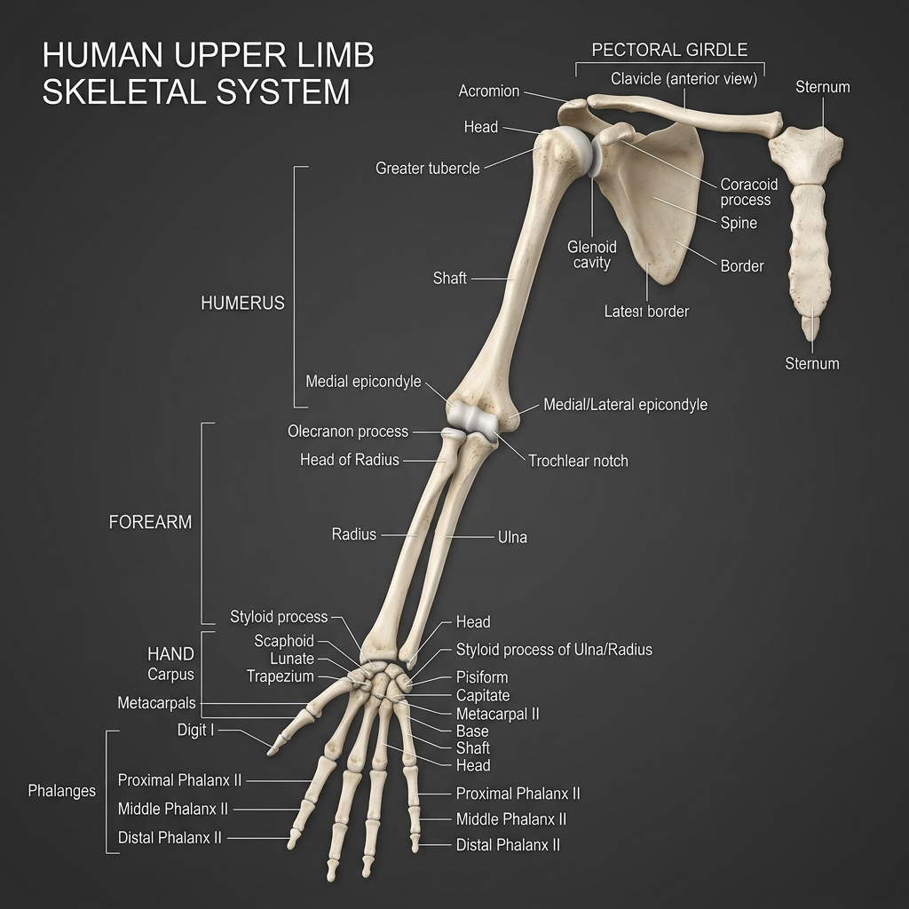

# 🦾 Pectoral Girdle & Upper Limb Reference Guide (64 Bones)

This guide catalogs the 4 bones of the pectoral girdle and the 60 bones of the upper limbs, and maps how muscles anchor to them.

---

## 🎨 Labeled Skeletal Illustration

---

## 📂 Complete Bone Inventory

The Pectoral Girdle and Upper Limbs contain exactly **64 bones** (32 per side):

### 1. Pectoral Girdle (4 Bones / 2 Pairs)
These bones connect the upper limbs to the axial skeleton:
*   **Clavicle (2):** The collarbone. An S-shaped double-curved long bone acting as a strut to keep the scapula suspended away from the thorax.
*   **Scapula (2):** The shoulder blade. A flat, triangular bone resting on the posterior thoracic wall. It does not articulate directly with the ribs, sliding on a muscular bed.

### 2. Arm / Brachium (2 Bones / 1 Pair)
*   **Humerus (2):** The arm bone. The largest and longest bone of the upper limb; articulates with the scapula at the shoulder (glenohumeral joint) and the radius/ulna at the elbow.

### 3. Forearm / Antebrachium (4 Bones / 2 Pairs)
*   **Radius (2):** The lateral forearm bone (thumb side). Its disc-like head rotates on the ulna, allowing for forearm pronation/supination.
*   **Ulna (2):** The medial forearm bone (pinky side). Its *olecranon process* forms the hard point of the elbow.

### 4. Wrist / Carpus (16 Bones / 8 Pairs)
Eight small carpal bones arranged in two rows (proximal and distal) that facilitate wrist articulation:
*   **Proximal Row (lateral to medial):**
    *   **Scaphoid (2):** Boat-shaped; most commonly fractured wrist bone.
    *   **Lunate (2):** Crescent moon-shaped.
    *   **Triquetrum (2):** Three-cornered bone.
    *   **Pisiform (2):** A pea-shaped sesamoid bone embedded in the flexor carpi ulnaris tendon.
*   **Distal Row (lateral to medial):**
    *   **Trapezium (2):** Four-sided table; forms saddle joint with the thumb.
    *   **Trapezoid (2):** Wedge-shaped.
    *   **Capitate (2):** Head-shaped; the largest carpal bone.
    *   **Hamate (2):** Hooked bone.

### 5. Hand / Metacarpus (10 Bones / 5 Pairs)
*   **Metacarpals I-V (10):** Form the palm of the hand, numbered 1 (thumb) through 5 (little finger).

### 6. Fingers / Phalanges (28 Bones / 14 Pairs)
*   **Proximal Phalanges (10):** Articulate with metacarpals.
*   **Middle Phalanges (8):** Thumb lacks a middle phalanx.
*   **Distal Phalanges (10):** The fingertips.

---

## 🔗 Muscle-Skeleton Linkage Map

The shoulder girdle and limb bones feature crucial landmarks that serve as attachment points for the upper body pushing, pulling, and gripping muscles:

| Bony Landmark | Anatomical Location | Attached Muscle | Type | Mechanical Function & Link |
| :--- | :--- | :--- | :--- | :--- |
| **Coracoid Process** | Hook projection of anterior scapula | **[Biceps Brachii (Short Head)](../../muscles/regions/04_upper_limb/anatomy.md#2-muscles-of-the-arm-brachium)** | Origin | Supination and elbow flexion leverage |
| **Coracoid Process** | Hook projection of anterior scapula | **[Pectoralis Minor](../../muscles/regions/03_thorax_abdomen/anatomy.md#1-anterior-thorax--pectoral-region)** | Insertion | Depresses and stabilizes the scapula |
| **Glenoid Cavity** | Lateral socket of scapula | **[Supraspinatus / Infraspinatus](../../muscles/regions/04_upper_limb/anatomy.md#1-shoulder--rotator-cuff-muscles)** | Origin | Rotator cuff cuffing stabilizes joint socket |
| **Greater Tubercle** | Lateral head of humerus | **[Rotator Cuff (SIT)](../../muscles/regions/04_upper_limb/anatomy.md#1-shoulder--rotator-cuff-muscles)** | Insertion | Rotator cuff insertion point (Supra/Infra/Teres Min) |
| **Lesser Tubercle** | Anterior head of humerus | **[Subscapularis](../../muscles/regions/04_upper_limb/anatomy.md#1-shoulder--rotator-cuff-muscles)** | Insertion | Stabilizes and internally rotates humerus |
| **Intertubercular Groove** | Anterior bicipital groove of humerus | **[Latissimus Dorsi](../../muscles/regions/02_back_spine/anatomy.md#1-superficial-layer-appendicular-back-muscles)** | Insertion | Anchor for powerful down-pulling leverage |
| **Deltoid Tuberosity** | Lateral shaft of humerus | **[Deltoid](../../muscles/regions/04_upper_limb/anatomy.md#1-shoulder--rotator-cuff-muscles)** | Insertion | Leverage for shoulder abduction |
| **Medial Epicondyle** | Medial projection of distal humerus | **[Common Flexors (FCR/FCU/FDS)](../../muscles/regions/04_upper_limb/anatomy.md#3-muscles-of-the-forearm-antebrachium)** | Origin | Common origin for wrist/finger flexor group |
| **Lateral Epicondyle** | Lateral projection of distal humerus | **[Common Extensors (ECR/ED/ECU)](../../muscles/regions/04_upper_limb/anatomy.md#3-muscles-of-the-forearm-antebrachium)** | Origin | Common origin for wrist/finger extensor group |
| **Radial Tuberosity** | Medial projection of proximal radius | **[Biceps Brachii](../../muscles/regions/04_upper_limb/anatomy.md#2-muscles-of-the-arm-brachium)** | Insertion | Insertion; pulls radius to supinate and flex elbow |
| **Olecranon Process** | Hard hook of proximal posterior ulna | **[Triceps Brachii](../../muscles/regions/04_upper_limb/anatomy.md#2-muscles-of-the-arm-brachium)** | Insertion | Primary leverage anchor for elbow extension |

---

## 🤸 Study & Practice Links
*   **[Anatomy Reference: Upper Limb Muscles](../../muscles/regions/04_upper_limb/anatomy.md)**
*   **[Pose Corrections: Upper Limb](../../muscles/regions/04_upper_limb/pose_corrections.md)**
*   **[Bones Master Directory](../README.md)**
