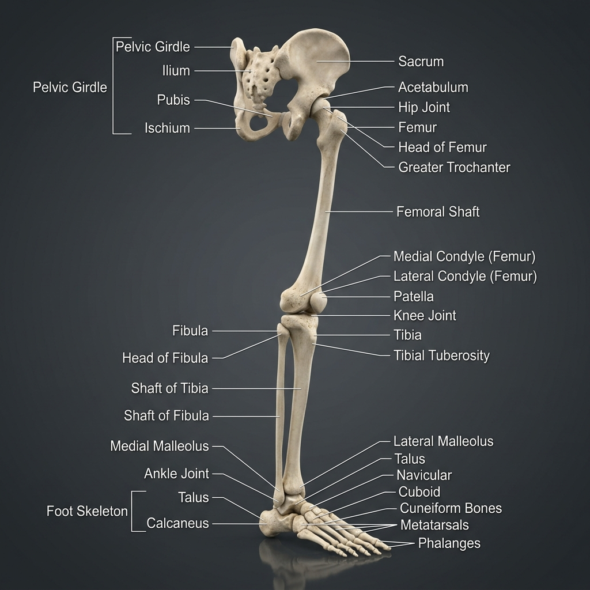

# 🦵 Pelvic Girdle & Lower Limb Reference Guide (62 Bones)

This guide catalogs the 2 bones of the pelvic girdle and the 60 bones of the lower limbs. It explains the anatomical variations that lead to the **208+ bones** count and maps how muscles anchor to them.

---

## 🎨 Labeled Skeletal Illustration

---

## 📂 Complete Bone Inventory

The Pelvic Girdle and Lower Limbs contain exactly **62 bones** (31 per side):

### 1. Pelvic Girdle (2 Bones)
*   **Coxal / Hip Bones (2):** Large, irregular bones that form the pelvic girdle, anchoring the lower limbs to the sacrum. Each coxal bone is formed by the fusion of three separate bones during adolescence, meeting at the deep hip socket (**Acetabulum**):
    *   **Ilium:** The superior, fan-shaped portion forming the hip crest.
    *   **Ischium:** The posterior, inferior portion; the "sit bone."
    *   **Pubis:** The anterior, inferior portion; meets at the pubic symphysis.

### 2. Thigh (2 Bones / 1 Pair)
*   **Femur (2):** The thigh bone. The largest, longest, and strongest bone in the human body. Its head fits into the acetabulum to form the hip joint.

### 3. Knee (2 Bones / 1 Pair)
*   **Patella (2):** The kneecap. A large, triangular sesamoid bone embedded in the quadriceps tendon. It protects the knee joint and acts as a pulley, increasing the mechanical advantage of the quadriceps muscle by ~30%.

### 4. Leg (4 Bones / 2 Pairs)
*   **Tibia (2):** The shin bone. The medial, larger, weight-bearing bone of the leg; articulates with the femur and talus.
*   **Fibula (2):** The lateral calf bone. Thin and non-weight-bearing; acts primarily as a muscular attachment anchor and stabilizes the ankle joint.

### 5. Ankle & Heel / Tarsus (14 Bones / 7 Pairs)
Seven tarsal bones that form the ankle, heel, and proximal arches of the foot:
*   **Talus (2):** Articulates with the tibia and fibula to form the ankle joint.
*   **Calcaneus (2):** The heel bone; the largest and strongest bone of the foot.
*   **Navicular (2):** Boat-shaped bone on the medial side.
*   **Cuboid (2):** Cube-shaped bone on the lateral side.
*   **Cuneiforms (6 / 3 pairs):** *Medial, Intermediate,* and *Lateral* cuneiforms.

### 6. Sole / Metatarsus (10 Bones / 5 Pairs)
*   **Metatarsals I-V (10):** Form the sole/instep of the foot, numbered 1 (great toe) through 5 (little toe).

### 7. Toes / Phalanges (28 Bones / 14 Pairs)
*   **Proximal Phalanges (10):** Articulate with metatarsals.
*   **Middle Phalanges (8):** The big toe lacks a middle phalanx.
*   **Distal Phalanges (10):** The tips of the toes.

---

## 💡 The 208+ Bones Count Variation
While medical textbooks standardly cite **206 bones** in the adult human body, skeletal counts often vary between **208 to 212+** based on:
1.  **Hallucal Sesamoids (+2):** There are two tiny, pea-sized sesamoid bones consistently located within the flexor hallucis brevis tendon underneath the head of the **1st Metatarsal** of each foot. Including these brings the standard adult count to exactly **208 bones**.
2.  **Sutural / Wormian Bones:** Small, irregular extra bones that occasionally develop within the suture lines of the skull.
3.  **Cervical / Lumbar Ribs:** Rare accessory ribs arising from the C7 or L1 vertebrae.

---

## 🔗 Muscle-Skeleton Linkage Map

The hip, thigh, leg, and foot bones feature high-load landmarks that serve as attachment points for the lower body power generators:

| Bony Landmark | Anatomical Location | Attached Muscle | Type | Mechanical Function & Link |
| :--- | :--- | :--- | :--- | :--- |
| **Iliac Crest** | Superior border of the ilium | **[Transversus Abdominis](../../muscles/regions/03_thorax_abdomen/anatomy.md#3-anterior--lateral-abdominal-wall)** | Origin | Direct link for core compression and IAP |
| **Iliac Crest** | Superior border of the ilium | **[External Oblique](../../muscles/regions/03_thorax_abdomen/anatomy.md#3-anterior--lateral-abdominal-wall)** | Insertion | Stabilizes the pelvis during torso rotations |
| **ASIS** (Ant. Sup. Iliac Spine) | Anterior corner of iliac crest | **[Sartorius](../../muscles/regions/06_lower_limb/anatomy.md#2-muscles-of-the-thigh)** | Origin | Pulls thigh into external rotation (tailor's pose) |
| **ASIS** (Ant. Sup. Iliac Spine) | Anterior corner of iliac crest | **[Tensor Fasciae Latae (TFL)](../../muscles/regions/06_lower_limb/anatomy.md#1-gluteal-region--deep-hip-rotators)** | Origin | Abducts and stabilizes hip during stance |
| **AIIS** (Ant. Inf. Iliac Spine) | Below ASIS on anterior ilium | **[Rectus Femoris](../../muscles/regions/06_lower_limb/anatomy.md#2-muscles-of-the-thigh)** | Origin | Dual-joint leverage for hip flexion & knee extension |
| **Ischial Tuberosity** | Postero-inferior ischium | **[Hamstrings (Biceps Femoris/Semi)](../../muscles/regions/06_lower_limb/anatomy.md#2-muscles-of-the-thigh)** | Origin | Main leverage point for hip extension power |
| **Greater Trochanter** | Lateral proximal femur | **[Gluteus Medius / Minimus](../../muscles/regions/06_lower_limb/anatomy.md#1-gluteal-region--deep-hip-rotators)** | Insertion | Key stabilizer preventing pelvic drop in gait |
| **Lesser Trochanter** | Medial proximal femur | **[Iliopsoas (Psoas/Iliacus)](../../muscles/regions/03_thorax_abdomen/anatomy.md#4-posterior-abdominal-wall)** | Insertion | Primary anchor for deep hip flexion |
| **Linea Aspera** | Posterior ridge of femoral shaft | **[Adductor Longus/Brevis/Magnus](../../muscles/regions/06_lower_limb/anatomy.md#2-muscles-of-the-thigh)** | Insertion | Adducts and stabilizes femur during load |
| **Tibial Tuberosity** | Anterior proximal tibia | **[Quadriceps Femoris](../../muscles/regions/06_lower_limb/anatomy.md#2-muscles-of-the-thigh)** | Insertion | Insertion via patellar tendon; drives knee extension |
| **Pes Anserinus** | Medial proximal tibia | **[Sartorius / Gracilis / Semitendinosus](../../muscles/regions/06_lower_limb/anatomy.md#2-muscles-of-the-thigh)** | Insertion | Three tendons forming a "goose foot" stabilizing knee |
| **Calcaneus Tuberosity** | Posterior surface of heel | **[Gastrocnemius / Soleus](../../muscles/regions/06_lower_limb/anatomy.md#3-muscles-of-the-leg-crus)** | Insertion | Driven via Achilles tendon for powerful plantarflexion |

---

## 🤸 Study & Practice Links
*   **[Anatomy Reference: Pelvis & Perineum Muscles](../../muscles/regions/05_pelvis_perineum/anatomy.md)**
*   **[Anatomy Reference: Lower Limb Muscles](../../muscles/regions/06_lower_limb/anatomy.md)**
*   **[Pose Corrections: Pelvis & Perineum](../../muscles/regions/05_pelvis_perineum/pose_corrections.md)**
*   **[Pose Corrections: Lower Limb](../../muscles/regions/06_lower_limb/pose_corrections.md)**
*   **[Bones Master Directory](../README.md)**
