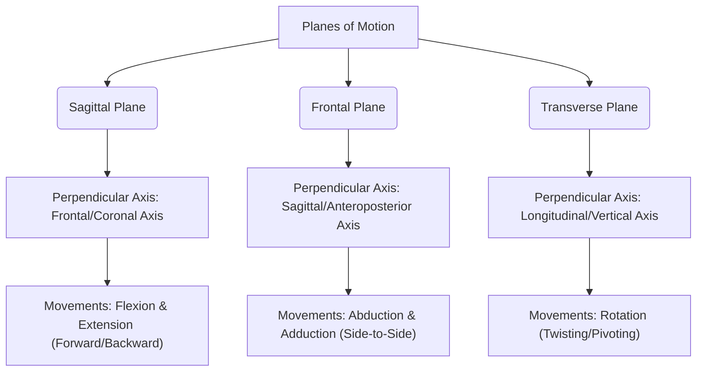
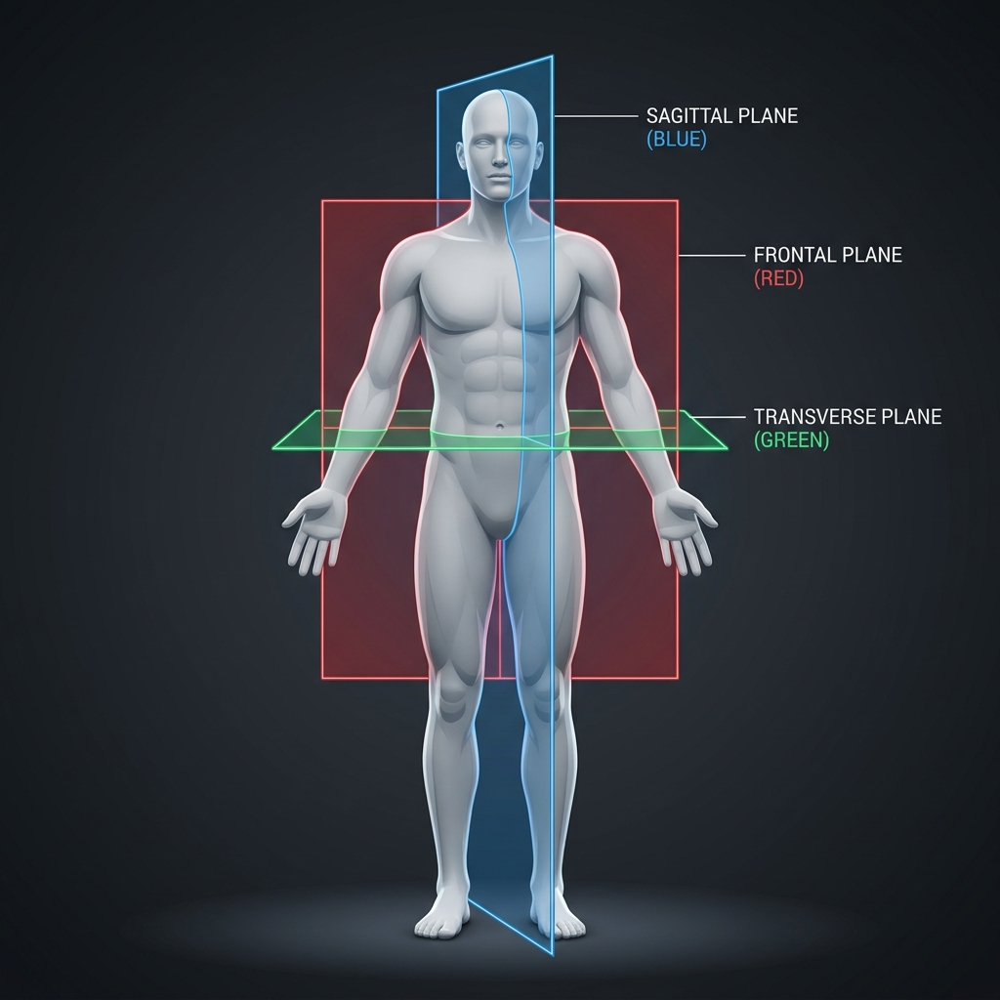

# Day 1: Planes of Motion & Axes of Rotation

- **Estimated Study Time:** 25 minutes
- **Anatomical Focus:** Joint axes, planes of movement, human biomechanics
- **Key Movement Application:** Postural correction, push-ups/squats (sagittal), side planks (frontal), rotations (transverse)

---

## 🎯 Daily Learning Objectives
*   Master the three cardinal anatomical planes of motion.
*   Understand the relationship between planes of motion and their corresponding axes of rotation.
*   Analyze calisthenics and yoga movements to identify their primary planes of movement.
*   Identify and correct postural deviations using plane analysis.

---

## 📖 Core Anatomical Concept

To analyze human movement, biomechanists divide the body using three imaginary flat sheets called **planes of motion**. These planes are perpendicular to one another and intersect at the body's center of mass (when in the standard **Anatomical Position**).

Whenever a movement occurs along a plane, it rotates around an imaginary pin called an **axis of rotation**. The axis of rotation is always perpendicular ($90^\circ$) to the plane of motion itself.

---

### 1. The Sagittal Plane
The **Sagittal Plane** slices the body vertically from front to back, dividing it into **left and right halves**.

*   **Axis of Rotation:** **Mediolateral (Frontal) Axis** (runs side-to-side, like a bar connecting your hips).
*   **Primary Joint Actions:**
    *   **Flexion:** Decreasing the angle between two bones (bending a joint forward, except for the knee where flexion bends backward).
    *   **Extension:** Increasing the angle between two bones (straightening a joint).
    *   **Hyperextension:** Extending a joint beyond its normal anatomical position.
*   **Visualizing Movement:** Any movement that occurs along a wall running parallel to your sides (forward and backward movements).

---

### 2. The Frontal (Coronal) Plane
The **Frontal Plane** slices the body vertically from side to side, dividing it into **anterior (front) and posterior (back) halves**.

*   **Axis of Rotation:** **Anteroposterior (Sagittal) Axis** (runs front-to-back, like a pin inserted through your belly button).
*   **Primary Joint Actions:**
    *   **Abduction:** Moving a limb away from the midline of the body.
    *   **Adduction:** Moving a limb toward the midline of the body.
    *   **Elevation/Depression:** Shrugging shoulders up/down.
    *   **Inversion/Eversion:** Tilting the sole of the foot inward/outward.
    *   **Lateral Flexion:** Bending the spine side-to-side.
*   **Visualizing Movement:** Any movement that occurs parallel to a wall you are standing flat against (sideways movements).

---

### 3. The Transverse (Horizontal) Plane
The **Transverse Plane** slices the body horizontally, dividing it into **superior (upper) and inferior (lower) halves**.

*   **Axis of Rotation:** **Longitudinal (Vertical) Axis** (runs straight down through the top of the head).
*   **Primary Joint Actions:**
    *   **Internal (Medial) Rotation:** Rotating a bone inward toward the midline.
    *   **External (Lateral) Rotation:** Rotating a bone outward away from the midline.
    *   **Horizontal Abduction/Adduction:** Moving limbs horizontally (e.g. chest flies).
    *   **Pronation/Supination:** Rotating the forearm so palm faces down/up.
    *   **Spinal Rotation:** Twisting the torso left or right.
*   **Visualizing Movement:** Rotational or twisting movements parallel to the floor.

---

## 🎨 Visual Diagram

Here is a 3D conceptualization of the anatomical planes slicing through the human body in the standard anatomical position.

---

## 🔄 Movement Application (Calisthenics & Yoga)

Movement is rarely isolated to a single plane. However, recognizing the **dominant plane** is crucial for diagnosing weaknesses, correcting form, and preventing injuries.

### 🤸 Calisthenics Application

#### 1. Push-ups & Squats (Dominant Sagittal Plane)
*   **Mechanics:** In both a push-up and a squat, your hips, knees, shoulders, and elbows flex and extend. They are sagittal movements.
*   **Common Sagittal Fault:** **Elbow Flaring.** During a push-up, if the elbows flare outwards ($90^\circ$ to the body), the movement shifts away from the sagittal plane and forces the shoulder into horizontal abduction (transverse plane), placing excessive shearing stress on the rotator cuff.
*   **Correction:** Keep elbows tucked at a $30^\circ$ to $45^\circ$ angle relative to your torso. This keeps the elbow and shoulder joints moving cleanly in the sagittal plane, loading the pectoralis major and triceps brachii biomechanically.

#### 2. Handstand Lateral Balance (Dominant Frontal Plane)
*   **Mechanics:** While handstand entries are sagittal (kicking up), *maintaining lateral balance* is a frontal plane challenge.
*   **Correction:** When falling sideways, you must depress the opposite shoulder (shoulder girdle depression in the frontal plane) and abduct/adduct your legs to bring your center of mass back to the vertical line.

---

### 🧘 Yoga Posture Correction

| Yoga Pose | Primary Plane of Motion | Dominant Joint Action |
| :--- | :---: | :--- |
| **Uttanasana (Forward Fold)** | Sagittal | Hip Flexion, Spinal Flexion |
| **Bhujangasana (Cobra Pose)** | Sagittal | Spinal Extension, Shoulder Extension |
| **Trikonasana (Triangle Pose)** | Frontal | Spinal Lateral Flexion, Hip Abduction |
| **Ardha Matsyendrasana (Half Lord of the Fishes)** | Transverse | Spinal Rotation, Hip Internal/External Rotation |

#### Pose Correction: Triangle Pose (Trikonasana)
*   **The Goal:** Moving cleanly in the **Frontal Plane**. The entire body should feel as if it is sandwiched between two panes of glass.
*   **Common Alignment Deviation:** **Transverse/Sagittal Sag.** Because of tight hamstrings or hip adductors, practitioners often rotate their torso toward the floor (transverse plane rotation) and flex at the hips (sagittal plane).
*   **Correction:** Back out of the depth. Place the bottom hand higher up on the shin or a block. Press the hips forward (extension) and roll the top chest open (external rotation) until the shoulders and hips align in the frontal plane.

---

## 🔬 Biomechanics Lab: Desk-side Drill

Let's feel the difference between isolated planes of motion and mixed movements.

### Drill 1: The "Pane of Glass" Wall Test (Frontal Plane Isolation)
1.  **Setup:** Stand with your heels, glutes, upper back, and back of your head flat against a wall.
2.  **Execution:** Without letting your shoulders or head leave the wall, slide your right hand down towards your right knee, bending sideways.
3.  **Mind-Muscle Connection:** Notice that you are moving exclusively in the **Frontal Plane**. You will feel a deep stretch on the opposite side of your torso (the lateral obliques and quadratus lumborum). If your opposite shoulder pulls off the wall, you are cheating by introducing sagittal flexion.

### Drill 2: Elbow Rotation Check (Transverse Plane Rotation)
1.  **Setup:** Bend your elbows to $90^\circ$ and tuck them tightly against your ribs. Keep your palms facing up (supinated).
2.  **Execution:** Without moving your elbows away from your ribs, rotate your hands outward as far as possible.
3.  **Mind-Muscle Connection:** This movement (external rotation of the humerus) occurs in the **Transverse Plane** rotating around the vertical axis of the upper arm bone. You should feel the muscles in the back of your shoulder (Infraspinatus and Teres Minor) activating.

---

## 🎥 Reference Videos

*   [Muscle and Motion - Planes of Movement](https://www.youtube.com/watch?v=r0pVf60fTIA) - *Excellent 3D animation showing sagittal, frontal, and transverse movements in real-time.*
*   [Squat University - Squat Form For Your Anatomy](https://www.youtube.com/watch?v=7FF6VLej_bY) - *A deep dive into sagittal plane squats and how your bone structure dictates your stance width and depth.*
*   [Muscle and Motion - Triangle Pose Anatomy, Common Problems & Solutions](https://www.youtube.com/watch?v=xFOB-ph8KdE) - *An anatomical and biomechanical analysis of Trikonasana, focusing on frontal plane constraints.*

---

## 🧠 Daily Knowledge Check

### Questions
1.  During a standard Pull-up, as you pull your chest up to the bar, in which plane of motion do your elbows move when they draw down and out to the sides? What is the perpendicular axis of rotation?
2.  If a yoga practitioner is rotating their hips outward in Virabhadrasana II (Warrior 2), in which plane of motion does this hip external rotation primarily occur?
3.  When you perform a "hollow body hold" in calisthenics, you are keeping your spine stable to resist hyperextension. Which plane of motion are you resisting?

🔑 Click to reveal answers and explanations

### Answers
1.  **Answer:** If the elbows draw down and out to the sides (adduction of the shoulder), the movement occurs in the **Frontal Plane**. The perpendicular axis of rotation is the **Anteroposterior (Sagittal) Axis** running front-to-back. (Note: If you pull with elbows tucked forward, it shifts to the sagittal plane around a mediolateral axis).
2.  **Answer:** External rotation of the femur inside the hip socket occurs around the vertical axis of the bone, which lies in the **Transverse (Horizontal) Plane**.
3.  **Answer:** Hyperextension is a movement of bending backward, which is a forward-backward action. Therefore, you are resisting extension/hyperextension in the **Sagittal Plane** around a **Mediolateral Axis**.

