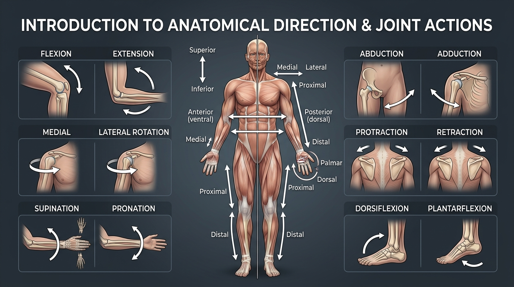

# Day 2: Directional Terms & Joint Action Vocabulary

- **Estimated Study Time:** 25 minutes
- **Anatomical Focus:** Directional vectors (Anterior/Posterior, Superior/Inferior, Medial/Lateral, Proximal/Distal), anatomical landmarks, and cardinal joint action vocabulary.
- **Key Movement Application:** Translating anatomical language into calisthenics coaching cues, understanding yoga alignment instructions (Sanskrit & English), and diagnosing posture.

---

## 🎯 Daily Learning Objectives
*   Master the **Standard Anatomical Position** as the universal origin point ($0^\circ$ baseline) for all human movement.
*   Fluently utilize directional terminology to describe bone locations, muscle attachments, and injury sites.
*   Differentiate between paired cardinal joint actions across the sagittal, frontal, and transverse planes.
*   Translate everyday movement cues (*"tuck elbows"*, *"dome back"*, *"wrap armpits"*) into their precise biomechanical actions (*"humeral external rotation"*, *"scapular protraction"*, *"posterior pelvic tilt"*).

---

## 📖 Core Anatomical Concept

### 🧍 1. The Standard Anatomical Position
In anatomy, every spatial description assumes the body is in the **Standard Anatomical Position**:
*   Body standing upright (erect), feet parallel and flat on the floor, pointing forward.
*   Head level, eyes facing directly forward.
*   Arms resting at the sides with **palms facing forward (supinated)** and thumbs pointing outward (away from the body).

> [!NOTE]
> All directional descriptions (e.g., *"the biceps are anterior to the triceps"*) apply **regardless** of whether the person is lying down, hanging from a pull-up bar, or upside-down in a headstand.

### 🧭 Spatial Coordinates & Movement Categories Master Matrix

| Anatomical Dimension / Category | Paired Terminology | Reference Baseline | Interpretation & Movement Example |
| :--- | :--- | :--- | :--- |
| **Vertical Axis** | **Superior** (Cranial) vs. **Inferior** (Caudal) | Head vs. Feet | Cranial (toward skull) vs. Caudal (toward tail). *E.g., Head is superior to pelvis.* |
| **Front-to-Back Axis** | **Anterior** (Ventral) vs. **Posterior** (Dorsal) | Front vs. Back of body | Ventral (belly side) vs. Dorsal (spine side). *E.g., Pecs are anterior to rhomboids.* |
| **Midline Relative** | **Medial** vs. **Lateral** | Imaginary center line | Medial (closer to midline) vs. Lateral (further outward). *E.g., Sternum is medial to shoulders.* |
| **Appendicular Limbs** | **Proximal** vs. **Distal** | Limb attachment point | Proximal (closer to trunk) vs. Distal (further down limb). *E.g., Elbow is proximal to wrist.* |
| **Tissue Depth** | **Superficial** vs. **Deep** | Skin surface | Superficial (surface layer) vs. Deep (internal). *E.g., Trapezius is superficial to multifidus.* |
| **Angular Movements** | **Flexion** vs. **Extension** | Joint angle | Decreasing angle / bending (flexion) vs. Increasing angle / straightening (extension). |
| **Coronal Movements** | **Abduction** vs. **Adduction** | Body midline | Moving limb away from midline (abduction) vs. toward midline (adduction). |
| **Rotational Movements** | **Internal** vs. **External Rotation** | Anterior bone surface | Rotating inward toward midline vs. rotating outward away from midline. |
| **Scapular Mechanics** | **Protraction** vs. **Retraction** **Elevation** vs. **Depression** | Shoulder blade position | Doming upper back vs. pinching blades together; shrugging up vs. packing down. |
| **Pelvic Mechanics** | **Anterior Tilt (APT)** vs. **Posterior Tilt (PPT)** | Pelvic bowl angle | Tipping pelvis forward (arches lower back) vs. tucking tailbone (flattens lower back). |

---

### 🧭 2. Cardinal Directional Terms

Directional terms always exist in **mutually opposing pairs**:

| Term | Latin / Greek Root | Definition | Anatomical Example |
| :--- | :--- | :--- | :--- |
| **Superior (Cranial / Cephalic)** | *Super* (above), *Kranion* (skull) | Toward the head or upper part of a structure | The **cervical spine** is *superior* to the lumbar spine. |
| **Inferior (Caudal)** | *Inferus* (below), *Cauda* (tail) | Away from the head or toward the lower body | The **sacrum** is *inferior* to the thoracic cage. |
| **Anterior (Ventral)** | *Ante* (before), *Venter* (belly) | Toward or at the front of the body | The **Pectoralis Major** is *anterior* to the Subscapularis. |
| **Posterior (Dorsal)** | *Post* (behind), *Dorsum* (back) | Toward or at the back of the body | The **Rhomboids** are *posterior* to the rib cage. |
| **Medial** | *Medius* (middle) | Toward or at the midline of the body | The **sternum** is *medial* to the shoulders; the big toe (hallux) is *medial* to the little toe. |
| **Lateral** | *Latus* (side) | Away from the midline of the body | The **Deltoid** is *lateral* to the sternum; the radius is *lateral* to the ulna in anatomical position. |
| **Proximal** | *Proximus* (nearest) | Closer to the origin of the limb / trunk attachment | The **elbow** is *proximal* to the wrist; the femur head is *proximal* to the knee. |
| **Distal** | *Distare* (stand apart) | Farther from the origin of the limb / trunk attachment | The **phalanges (fingers)** are *distal* to the metacarpals. |
| **Superficial (External)** | *Superficies* (surface) | Toward or at the body surface | The **Trapezius** is *superficial* to the Rhomboids and Multifidus. |
| **Deep (Internal)** | — | Away from the surface; more internal | The **Transversus Abdominis** is *deep* to the Rectus Abdominis. |
| **Ipsilateral** | *Ipse* (same) | On the same side of the body | The right hand and right foot are *ipsilateral*. |
| **Contralateral** | *Contra* (opposite) | On the opposite side of the body | In a running stride, the right arm swings forward with the *contralateral* (left) leg. |

> [!WARNING]
> **Common Trap:** Never use *Superior/Inferior* for limbs (arms/legs). For limbs, **always use Proximal/Distal**. (e.g., The wrist is *distal* to the elbow, not inferior).

---

### 🔄 3. Cardinal Joint Action Vocabulary

Joint actions are the movements that occur at specific articulations (joints):

#### A. Sagittal Plane Actions (Hinging / Angular)
*   **Flexion:** Decreasing the joint angle between two articulating bones (bending).
    *   *Examples:* Bending the elbow in a chin-up; bending the hip forward in **Uttanasana**. (*Exception:* Knee flexion bends the lower leg posteriorly).
*   **Extension:** Increasing the joint angle between two articulating bones (straightening back to anatomical zero).
    *   *Examples:* Straightening the elbow at the top of a dip; standing up from a squat.
*   **Hyperextension:** Extending a joint beyond its normal anatomical neutral ($0^\circ$).
    *   *Examples:* Arching the lower back into **Bhujangasana** (lumbar hyperextension); bending the neck back in **Ustrasana**.

#### B. Frontal Plane Actions (Side-to-Side / Coronal)
*   **Abduction:** Moving a limb laterally *away* from the midline of the body.
    *   *Example:* Lifting arms out to shoulder height in **Virabhadrasana II** or dumbbell lateral raises.
*   **Adduction:** Moving a limb medially *toward* or across the midline of the body.
    *   *Example:* Squeezing thighs together in **Setu Bandhasana** or pulling gymnastics rings back to the hips.
*   **Lateral Flexion:** Bending the spine (cervical or lumbar) to the left or right side.
    *   *Example:* Tilting the torso sideways in **Utthita Trikonasana**.

#### C. Transverse Plane Actions (Rotational & Pivoting)
*   **Internal (Medial) Rotation:** Turning the anterior surface of a limb *inward* toward the midline.
    *   *Example:* Turning toes inward ("pigeon-toed") or rotating arms inward.
*   **External (Lateral) Rotation:** Turning the anterior surface of a limb *outward* away from the midline.
    *   *Example:* Rolling the armpits forward and outer shoulders back in **Adho Mukha Svanasana** or turning feet outward for squats.
*   **Horizontal Adduction:** Moving an abducted arm horizontally across the chest toward the midline.
    *   *Example:* The pushing phase of a barbell bench press or ring chest fly.
*   **Horizontal Abduction:** Moving the arm horizontally away from the chest out to the side.
    *   *Example:* The opening phase of a rear-delt fly.

#### D. Specialized Joint Actions (Hands, Feet & Scapula)

| Joint / Region | Action Pair | Definition & Biomechanical Purpose |
| :--- | :--- | :--- |
| **Forearm (Radioulnar Joint)** | **Supination** vs. **Pronation** | **Supination:** Rotating forearm so palm faces anteriorly/up (carrying a cup of *soup*). **Pronation:** Rotating forearm so palm faces posteriorly/down. |
| **Ankle (Talocrural Joint)** | **Dorsiflexion** vs. **Plantarflexion** | **Dorsiflexion:** Pulling toes up toward the shin (heel striking). **Plantarflexion:** Pointing toes downward into the ground (tiptoeing / calf raise). |
| **Foot (Subtalar Joint)** | **Inversion** vs. **Eversion** | **Inversion:** Tilting the sole of the foot inward toward midline (sprained ankle mechanism). **Eversion:** Tilting the sole of the foot outward away from midline. |
| **Scapula (Shoulder Blade)** | **Protraction** vs. **Retraction** | **Protraction:** Spreading shoulder blades apart / doming upper back (*Planche / Push-up top*). **Retraction:** Squeezing shoulder blades together (*Row / Bench press setup*). |
| **Scapula (Shoulder Blade)** | **Elevation** vs. **Depression** | **Elevation:** Shrugging shoulder blades upward toward ears (*Handstand lockout*). **Depression:** Driving shoulder blades down away from ears (*Active hang / Dips lockout*). |
| **Pelvis** | **Anterior** vs. **Posterior Pelvic Tilt** | **Anterior Tilt (APT):** Pelvis tips forward like pouring water out the front (arches lumbar spine). **Posterior Tilt (PPT):** Tailbone tucks under, pubic bone lifts (flattens lumbar spine in *Hollow Body*). |

---

## 🎨 Visual Diagram

Here is a 3D medical visual atlas illustrating standard anatomical orientation vectors and the primary joint action pairs:

---

## 🔄 Movement Application (Calisthenics & Yoga)

### 🤸 1. Calisthenics Coaching Translations

| Common Calisthenics Cue | Precise Anatomical Joint Action | Target Muscle Mechanics & Joint Protection |
| :--- | :--- | :--- |
| *"Dome your upper back!"* | **Scapular Protraction** | Recruits **Serratus Anterior**; locks scapulae against the rib cage to prevent winging during push-ups, planches, and crow holds. |
| *"Pack your shoulders down!"* | **Scapular Depression** | Recruits **Lower Trapezius** & **Pectoralis Minor**; clears the subacromial space to prevent rotator cuff impingement at the top of dips and L-sits. |
| *"Break the bar in half!"* | **Glenohumeral External Rotation** | Recruits **Infraspinatus** & **Teres Minor**; centers the humeral head in the glenoid fossa during push-ups and pull-ups. |
| *"Hollow your body!"* | **Posterior Pelvic Tilt (PPT) + Trunk Flexion** | Recruits **Rectus Abdominis** & **Transversus Abdominis**; neutralizes lumbar lordosis to eliminate shear stress during handstands and levers. |

---

### 🧘 2. Yoga Alignment Translations (Sanskrit & Biomechanics)

| Asana (Sanskrit & English) | Key Joint Action Sequence | 🛡️ Joint Safety Tip |
| :--- | :--- | :--- |
| **Adho Mukha Svanasana** *(Downward-Facing Dog)* | **Scapular Upward Rotation** + **Humeral External Rotation** + **Ankle Dorsiflexion** | Wrapping the outer armpits forward (external rotation) widens the subacromial space, protecting the supraspinatus tendon from being pinched between the humerus and acromion process. |
| **Salamba Shirshasana** *(Supported Headstand)* | **Forearm Pronation / Fixed Anchor** + **Scapular Elevation** + **Cervical Axial Neutral** | Actively pushing through forearms and elevating the scapulae bears 80% of body weight, keeping the cervical spine stacked in neutral without axial compression. |
| **Setu Bandhasana** *(Bridge Pose)* | **Hip Extension** + **Femoral Adduction** + **Scapular Retraction** | Squeezing the inner thighs (adduction) co-activates the pelvic floor (**Mula Bandha**) and prevents the knees from flaring, protecting the sacroiliac (SI) joints and sacrum. |
| **Uttanasana** *(Standing Forward Fold)* | **Hip Flexion (Hinge)** + **Knee Extension (Micro-bent)** | Contracting the quadriceps triggers reciprocal inhibition, relaxing the hamstrings and preventing excessive strain at their origin on the ischial tuberosity. |

---

## 🔬 Biomechanics Lab: Desk-side Drill

Perform these 3 tactile drills to physically imprint directional and joint vocabulary:

### Drill 1: The Scapular 4-Way Compass (Shoulder Blade Control)
1.  **Elevate:** Shrug your shoulder blades straight up to your ears. Feel the **Upper Trapezius** fire.
2.  **Retract:** Squeeze your shoulder blades straight back together. Feel your **Rhomboids** pinch.
3.  **Depress:** Drive your shoulder blades down toward your back pockets. Feel your **Lower Trapezius** engage.
4.  **Protract:** Push your palms forward and dome your upper back. Feel your **Serratus Anterior** wrapping around your ribs.

### Drill 2: Pronation vs. Supination (Biceps Mechanical Leverage)
1.  Bend your right elbow to $90^\circ$ and place your left hand firmly on your right biceps muscle belly.
2.  **Pronate** your right hand (turn palm face down). Notice your biceps feels soft and flat.
3.  **Supinate** your right hand (turn palm face up). Feel your biceps immediately swell and harden!
4.  *Biomechanical Takeaway:* The **Biceps Brachii** is not just an elbow flexor—it is the body's most powerful forearm **supinator**! This is why chin-ups (supinated grip) recruit more biceps than pull-ups (pronated grip).

### Drill 3: Pelvic Tilt Compass (The Lower Back Saver)
1.  Place hands on your hips (iliac crests).
2.  **Anterior Tilt:** Tip your pelvis forward, sticking your tailbone out. Feel the arch in your lower back increase and lumbar erectors tighten.
3.  **Posterior Tilt:** Tuck your tailbone under and squeeze your glutes. Feel your lower abdomen flatten and your lumbar spine decompress.

---

## 🧠 Daily Knowledge Check

Test your mastery of directional terms and joint actions before logging your progress:

### Questions
1.  **Limb Vector Question:** Is the knee *proximal* or *distal* to the ankle? Explain why using the term "superior" is technically incorrect in human anatomical terminology.
2.  **Muscle Depth Question:** In the abdominal wall, which muscle is the most *superficial*, and which is the most *deep*?
3.  **Movement Identification:** When performing a Barbell Bicep Curl, what joint action occurs at the elbow during the lifting (concentric) phase, and what action occurs during the lowering (eccentric) phase?
4.  **Yoga Asana Translation:** In **Vrikshasana (Tree Pose)**, what two joint actions occur at the hip of the lifted, bent leg?
5.  **Biomechanics Troubleshooting:** If a practitioner's knees cave inward during a squat (valgus collapse), what abnormal joint action is occurring at the femur/hip?

---

🔑 Click to reveal answers and explanations

### Answers & Explanations

1.  **Answer:** The knee is **proximal** to the ankle because it is closer to the limb's point of attachment to the trunk. Using "superior" is incorrect for appendicular limbs because directional terms for limbs must remain constant regardless of limb position (e.g., if you raise your leg over your head, the knee is still *proximal* to the ankle).
2.  **Answer:** The **Rectus Abdominis** (and External Oblique) is the most **superficial**, while the **Transversus Abdominis (TVA)** is the most **deep**.
3.  **Answer:** 
    *   Lifting phase: **Elbow Flexion** (decreasing the joint angle).
    *   Lowering phase: **Elbow Extension** (increasing the joint angle).
4.  **Answer:** The lifted hip undergoes **Hip Flexion** + **Hip Abduction** + **Hip External (Lateral) Rotation**.
5.  **Answer:** Inward knee cave (valgus collapse) is caused by uncontrolled **Femoral Internal Rotation** and **Hip Adduction**, indicating weakness or under-activation of the **Gluteus Medius / Maximus** (the primary external rotators and abductors).

---

## 🔗 Connected Guides & References
*   **[Master Muscle Directory](../../muscles/README.md)**
*   **[Master Skeletal Directory](../../bones/README.md)**
*   **[Master Skeletomuscular Map](../../muscles/guides/skeletomuscular_map.md)**
*   **[Master Pose Corrections Directory](../../pose_corrections/README.md)**
*   **[Day 1: Planes of Motion & Axes of Rotation](../day-001-planes-of-motion/README.md)**
