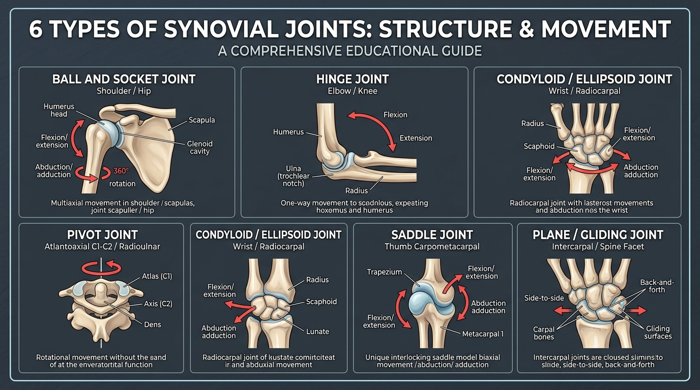

# Day 3: The Skeletal System & Joint Classifications

- **Estimated Study Time:** 25 minutes
- **Anatomical Focus:** Axial vs. Appendicular Skeleton, Bone Remodeling (Wolff's Law), Functional & Structural Joint Classifications, and the 6 Types of Synovial Joints.
- **Key Movement Application:** Joint stability vs. mobility trade-offs, protecting modified hinge joints (knees/elbows), wrist load distribution, and avoiding meniscal/labral tears in calisthenics and yoga.

---

## 🎯 Daily Learning Objectives
*   Differentiate between the **Axial Skeleton** (80 bones) and **Appendicular Skeleton** (126 bones).
*   Understand **Wolff's Law** and how mechanical loading stimulates bone mineral density and remodeling.
*   Classify human joints both **structurally** (Fibrous, Cartilaginous, Synovial) and **functionally** (Synarthroses, Amphiarthroses, Diarthroses).
*   Master the **6 Types of Synovial Joints**, their degrees of freedom, and mechanical axes of rotation.
*   Apply joint morphology rules to prevent joint strain (e.g., preventing rotational torque on hinge joints during **Padmasana** and dips).

---

## 📖 Core Anatomical Concept

### 🦴 1. The Human Skeletal Framework (206 Adult Bones)
The adult human skeleton is organized into two primary structural divisions:

### 🦴 Master Framework: Skeletal Divisions & Regional Bone Inventory

| Skeletal Division | Total Bone Count | Regional Subdivisions & Bone Inventory | Primary Biomechanical Function |
| :--- | :---: | :--- | :--- |
| **1. Axial Skeleton**<br>*(Central Longitudinal Core)* | **80 Bones** | • **Skull & Associated (29):** Cranium (8), Face (14), Auditory Ossicles (6), Hyoid (1)<br>• **Vertebral Column (26):** Cervical (7), Thoracic (12), Lumbar (5), Sacrum (1), Coccyx (1)<br>• **Thoracic Cage (25):** Ribs (24), Sternum (1) | **Protection & Axial Posture:** Encloses brain, spinal cord, and thoracic organs; provides origin anchors for respiratory & spinal muscles. |
| **2. Appendicular Skeleton**<br>*(Limbs & Girdles)* | **126 Bones** | • **Pectoral Girdle (4):** Clavicles (2), Scapulae (2)<br>• **Upper Limbs (60):** Humerus (2), Radius (2), Ulna (2), Carpals (16), Metacarpals (10), Phalanges (28)<br>• **Pelvic Girdle (2):** Coxal Hip Bones (2)<br>• **Lower Limbs (60):** Femur (2), Patella (2), Tibia (2), Fibula (2), Tarsals (14), Metatarsals (10), Phalanges (28) | **Locomotion & Force Transmission:** Maximizes multi-planar movement, ground reaction force absorption, and manipulation. |

---

*   **Axial Skeleton (80 Bones):** Forms the central longitudinal axis of the body. Its primary function is **protection** of vital organs (brain, spinal cord, heart, lungs) and providing central postural anchor points.
    *   *Skull (22 bones)* + *Auditory Ossicles (6)* + *Hyoid Bone (1)* = 29 bones.
    *   *Vertebral Column (26 bones):* 7 Cervical, 12 Thoracic, 5 Lumbar, 1 Sacrum (5 fused), 1 Coccyx (4 fused).
    *   *Thoracic Cage (25 bones):* 24 Ribs (12 pairs) + 1 Sternum.
*   **Appendicular Skeleton (126 Bones):** Comprises the upper and lower limbs and their supporting girdles. Its primary function is **locomotion, manipulation, and force transmission**.
    *   *Pectoral Girdle (4 bones):* 2 Clavicles + 2 Scapulae.
    *   *Upper Limbs (60 bones):* Humerus, Radius, Ulna, 8 Carpals, 5 Metacarpals, 14 Phalanges per side.
    *   *Pelvic Girdle (2 bones):* 2 Coxal (Hip) bones (formed by fused Ilium, Ischium, and Pubis).
    *   *Lower Limbs (60 bones):* Femur, Patella, Tibia, Fibula, 7 Tarsals, 5 Metatarsals, 14 Phalanges per side (plus hallucal sesamoids).

---

### 🔬 2. Bone Physiology & Wolff's Law
Bone is dynamic, living tissue constantly undergoing cellular turnover:
*   **Osteoblasts:** Bone-*building* cells that secrete collagen and deposit calcium phosphate matrix.
*   **Osteoclasts:** Bone-*resorbing* cells that break down old or damaged bone tissue.
*   **Osteocytes:** Mature bone cells that act as **mechanosensors**, detecting physical strains.

> [!IMPORTANT]
> **Wolff's Law (1892):** Bone grows and remodels in response to the mechanical forces placed upon it. 
> *   When a bone experiences high compressive or tensile stress (such as during heavy barbell deadlifts, calisthenics active hangs, or gymnastic landings), osteocytes signal osteoblasts to lay down thicker **compact (cortical) bone** along lines of maximum stress.
> *   Conversely, unweighted sedentary states or immobilization cause rapid osteoclastic resorption, leading to bone density loss (osteopenia/osteoporosis).

---

### 🧩 3. Joint Classifications: Structural vs. Functional

Joints (articulations) occur wherever two or more bones meet. They are classified by **structure** (binding material) and **function** (range of motion):

| Structural Classification | Binding Material | Functional Type | Mobility Degree | Anatomical Examples |
| :--- | :--- | :--- | :--- | :--- |
| **1. Fibrous** | Dense collagen fibers; no joint cavity | **Synarthrosis** | **Immovable** ($0^\circ$) | • **Sutures:** Coronal/Sagittal skull sutures.<br>• **Gomphoses:** Teeth in alveolar sockets.<br>• **Syndesmoses:** Interosseous membrane between radius & ulna. |
| **2. Cartilaginous** | Hyaline or fibrocartilage; no joint cavity | **Amphiarthrosis** | **Slightly Movable** | • **Synchondroses (Hyaline):** Epiphyseal growth plates, 1st costosternal joint.<br>• **Symphyses (Fibrocartilage):** Intervertebral discs, Pubic symphysis. |
| **3. Synovial** | Fluid-filled joint cavity enclosed by a fibrous capsule | **Diarthrosis** | **Freely Movable** | • Shoulder, Elbow, Wrist, Hip, Knee, Ankle, Facet joints. |

---

### 💧 4. Anatomy of a Synovial Joint
All synovial joints share six fundamental structural components:
1.  **Articular Cartilage:** A glassy, ultra-smooth layer of **hyaline cartilage** covering articulating bone ends, providing friction-free glide and absorbing shock.
2.  **Joint (Articular) Capsule:** A two-layered sleeve enclosing the joint space. The outer layer is tough fibrous collagen; the inner layer is the **synovial membrane**.
3.  **Synovial Fluid:** An egg-white-like, hyaluronic-acid-rich fluid that lubricates surfaces, nourishes avascular cartilage cells, and reduces friction to near zero.
4.  **Reinforcing Ligaments:** Dense connective tissue straps connecting bone to bone (intrinsic capsular ligaments or extrinsic extracapsular/intracapsular bands like the ACL/PCL).
5.  **Fibrocartilaginous Pads / Discs:** 
    *   **Menisci (Knee):** Improve joint congruency, distribute compressive loads, and absorb impact.
    *   **Glenoid / Acetabular Labrum (Shoulder / Hip):** A fibrocartilage lip that deepens shallow bone sockets to prevent dislocation.
6.  **Bursae & Tendon Sheaths:** Synovial-fluid-filled sacs that cushion tendons and prevent friction where they glide across bone ridges.

---

### ⚙️ 5. Master Matrix: The 6 Types of Synovial Joints

| Synovial Joint Type | Mechanical Model | Degrees of Freedom (DoF) | Primary Movements | Anatomical Articulations | 🛡️ Clinical Joint Strain Risk |
| :--- | :--- | :---: | :--- | :--- | :--- |
| **1. Ball & Socket** *(Spheroidal)* | Ball fitting into a cup | **Triaxial (3 DoF)** | Flexion / Extension, Abduction / Adduction, Internal / External Rotation, Circumduction | • **Glenohumeral Joint** (Shoulder)<br>• **Acetabulofemoral Joint** (Hip) | **Highest Mobility / Lowest Stability.** Risk of subluxation, labral tears, and impingement under extreme end-ranges. |
| **2. Hinge** *(Ginglymus)* | Door hinge | **Uniaxial (1 DoF)** | Pure **Flexion** and **Extension** in the sagittal plane | • **Humeroulnar Joint** (Elbow)<br>• **Interphalangeal Joints** (Fingers/Toes)<br>• **Talocrural Joint** (Ankle) | **Zero Rotational Capacity.** Forcing axial rotation or lateral torque on a hinge tears collateral ligaments (e.g., MCL/LCL). |
| **3. Pivot** *(Trochoid)* | Axle inside a ring | **Uniaxial (1 DoF)** | Pure **Axial Rotation** around a longitudinal axis | • **Atlantoaxial Joint** (C1 Atlas rotating on C2 Axis dens — "No" head shake)<br>• **Proximal & Distal Radioulnar Joints** (Pronation/Supination) | Excessive rotational torque can tear the annular ligament of the radius or cause cervical facet subluxation. |
| **4. Condyloid / Ellipsoid** *(Biaxial)* | Oval convex surface in an oval concave depression | **Biaxial (2 DoF)** | Flexion / Extension, Abduction / Adduction (Radial/Ulnar deviation), Circumduction (*No axial rotation*) | • **Radiocarpal Joint** (Wrist)<br>• **Metacarpophalangeal (MCP) Joints** (Knuckles 2–5)<br>• **Atlanto-occipital Joint** (C1-Skull — "Yes" head nod) | Hyperextension with axial compression (e.g., poor handstand hand placement) compresses the scaphoid/lunate carpals. |
| **5. Saddle** *(Sellar)* | Rider sitting in an interlocking saddle | **Biaxial (2 DoF)** | Flexion / Extension, Abduction / Adduction, Circumduction, and **Opposition** | • **1st Carpometacarpal (CMC) Joint** (Base of Thumb)<br>• **Sternoclavicular (SC) Joint** | Repetitive gripping or heavy compressive loads on the thumb base can cause basal joint arthritis or subluxation. |
| **6. Plane / Gliding** *(Planar)* | Flat sliding plates | **Non-axial / Multiaxial translation** | Gliding / sliding motions across flat joint facets | • **Intercarpal & Intertarsal Joints**<br>• **Acromioclavicular (AC) Joint**<br>• **Facet (Zygapophysial) Joints** of spine | Lumbar extension under heavy axial load pinches and inflames spinal facet joint capsules. |

---

## 🎨 Visual Diagram

Here is a 3D medical visual infographic illustrating the mechanics, articulating surfaces, and motion axes of all **6 Types of Synovial Joints**:



---

## 🔄 Movement Application (Calisthenics & Yoga)

### 🤸 1. Calisthenics: The Joint Stability-Mobility Tradeoff

#### The Danger of Torquing Hinge Joints (Dips & Muscle-ups)
*   **The Anatomy:** The **Glenohumeral Joint** (shoulder) is a triaxial ball-and-socket built for multidirectional mobility. The **Humeroulnar Joint** (elbow) is a strict uniaxial hinge designed solely for flexion and extension.
*   **The Fault:** During deep dips or muscle-up transitions, allowing the elbows to flare outward ($90^\circ$) forces the elbow into **abduction and external rotation** under high bodyweight load.
*   **The Consequence:** Because a hinge cannot rotate, this torque shears the **Ulnar Collateral Ligament (UCL)** and crushes the medial epicondyle (Golfer's elbow).
*   **Correction:** Keep elbows pinned tight ($30^\circ-45^\circ$) to track strictly within the sagittal plane, allowing the ball-and-socket shoulder to absorb the multi-planar transition.

---

### 🧘 2. Yoga Alignment & Joint Protection (Sanskrit Mechanics)

#### Padmasana (Lotus Pose): The Knee-vs-Hip Rotational Trap
*   **The Anatomy:** The **Acetabulofemoral (Hip) Joint** is a ball-and-socket capable of extensive **external rotation**. The **Tibiofemoral (Knee) Joint** is a modified hinge with minimal rotational leeway (and *zero* rotation when fully extended).
*   **The Dangerous Cheat:** When a practitioner with tight hip capsules attempts **Padmasana (Lotus Pose)**, the hip stops rotating. To force the foot onto the opposite thigh, they crank the lower leg upward.
*   **The Injury Mechanism:** This introduces a violent **varus/valgus rotational torque** directly into the knee hinge. The femur grinds against the **medial meniscus**, pinching and tearing fibrocartilage, while stretching the **Medial Collateral Ligament (MCL)**.
*   **Safe Correction:** All rotational range of motion for Padmasana must originate from **femoral external rotation at the hip socket**. If the hip cannot rotate sufficiently, modify with **Sukhasana (Easy Pose)** or elevate hips on a block. **Never twist the knee to achieve a yoga shape!**

```
❌ DANGEROUS PATH: Tight Hip Socket ──▶ Force Twist at Knee (Hinge) ──▶ Torn Medial Meniscus & MCL Strain
✅ SAFE PATH:       Mobilize Hip (Ball-and-Socket) ──▶ Knee Remains Pure Hinge ──▶ Zero Meniscal Shear
```

---

## 🔬 Biomechanics Lab: Desk-side Drill

Perform these 3 tactile drills right now to physically feel joint classifications:

### Drill 1: The "No" vs. "Yes" Head Articulation (Pivot vs. Condyloid)
1.  **"Yes" Nod (Atlanto-occipital Condyloid Joint):** Nod your head up and down. Feel the base of your skull (occipital condyles) rocking in the cups of C1 (atlas). This is a biaxial rocking motion.
2.  **"No" Shake (Atlantoaxial Pivot Joint):** Shake your head left to right. Place a finger gently at the base of your skull. C1 (atlas) is spinning around the peg-like **dens (odontoid process)** of C2 (axis). Over $50\%$ of all neck rotation occurs purely at this single pivot joint!

### Drill 2: Hinge vs. Ball-and-Socket Isolation (The Knee vs. Hip Test)
1.  Sit on a chair. Straighten your right knee completely ($0^\circ$ extension).
2.  Try to twist your lower leg left and right without moving your thigh. Notice it is **impossible**—the knee hinge is locked in extension.
3.  Now, rotate your entire leg inward and outward from the groin. Notice the movement happens smoothly at the **ball-and-socket hip joint**.

### Drill 3: The Saddle Joint Thumb Opposition Test
1.  Touch the tip of your thumb to the tip of your pinky finger (**Opposition**).
2.  Place your index finger on the base of your thumb just above the wrist (the **1st Carpometacarpal joint**).
3.  Feel the unique concave-convex saddle surfaces sliding over one another. This unique saddle joint is what gives humans an opposable grip!

---

## 🧠 Daily Knowledge Check

Test your understanding of skeletal classifications and joint mechanics:

### Questions
1.  **Skeletal Division:** To which skeletal division (Axial or Appendicular) does the **Scapula** belong, and what is its primary functional role compared to the ribs?
2.  **Joint Mechanics:** Why is the shoulder (Glenohumeral) joint significantly more prone to dislocation than the hip (Acetabulofemoral) joint, even though both are ball-and-socket synovial joints?
3.  **Movement Diagnosis:** When performing a Barbell Biceps Curl, which joint acts as the primary **Hinge (1 DoF)**, and which joint acts as a **Pivot (1 DoF)** when turning the palms upward?
4.  **Clinical Pathology:** According to **Wolff's Law**, what happens to the bone density of the femur neck in an athlete who performs regular high-load squats versus a bedridden patient?
5.  **Yoga Joint Protection:** In **Padmasana (Lotus Pose)**, why is it anatomically dangerous to pull the foot up toward the hip if the hip socket lacks external rotation?

---

<details>
<summary>🔑 Click to reveal answers and explanations</summary>

### Answers & Explanations

1.  **Answer:** The **Scapula** belongs to the **Appendicular Skeleton** (as part of the Pectoral Girdle). Its role is to provide dynamic, multidirectional mobility and an anchor base for upper limb movement, whereas the **Ribs** belong to the **Axial Skeleton**, whose primary role is rigid protection of the heart/lungs and stabilizing the respiratory cylinder.
2.  **Answer:** The Glenohumeral joint features a **shallow glenoid cavity** (like a golf ball on a tee) that covers only ~$\frac{1}{3}$ of the humeral head, maximizing rotational mobility at the cost of bony stability. In contrast, the hip's **acetabulum** is a deep bony socket reinforced by a thick labrum and massive iliofemoral ligaments, covering over half of the femoral head for maximum load-bearing stability.
3.  **Answer:** 
    *   The **Humeroulnar Joint** acts as the **Hinge Joint** (performing elbow flexion/extension).
    *   The **Radioulnar Joints** (proximal and distal) act as the **Pivot Joint** (performing forearm supination to turn the palm up).
4.  **Answer:** Under regular high-load squats, osteocytes sense mechanical strain and stimulate osteoblasts to deposit thicker cortical bone matrix and denser trabecular lattices, **increasing bone mineral density**. In a bedridden patient, lack of mechanical stress shifts the balance toward osteoclastic resorption, causing rapid **bone demineralization and atrophy**.
5.  **Answer:** The knee is a modified hinge joint with zero rotational tolerance in extension. Forcing the foot upward when the hip is tight transfers rotational torque into the knee, pinching and **tearing the medial meniscus** between the femur and tibia and straining the **Medial Collateral Ligament (MCL)**.

</details>

---

## 🔗 Connected Guides & References
*   **[Master Skeletal Directory](../../bones/README.md)**
*   **[Skeletal Reference: Skull & Hyoid](../../bones/regions/01_skull_hyoid.md)**
*   **[Skeletal Reference: Vertebrae & Thorax](../../bones/regions/02_vertebrae_thorax.md)**
*   **[Skeletal Reference: Pectoral & Upper Limb Bones](../../bones/regions/03_pectoral_upper_limb.md)**
*   **[Skeletal Reference: Pelvic & Lower Limb Bones](../../bones/regions/04_pelvic_lower_limb.md)**
*   **[Master Skeletomuscular Map](../../muscles/guides/skeletomuscular_map.md)**
*   **[Master Pose Corrections Directory](../../pose_corrections/README.md)**
*   **[Day 2: Directional Terms & Joint Action Vocabulary](../day-002-directional-terms-joint-actions/README.md)**
