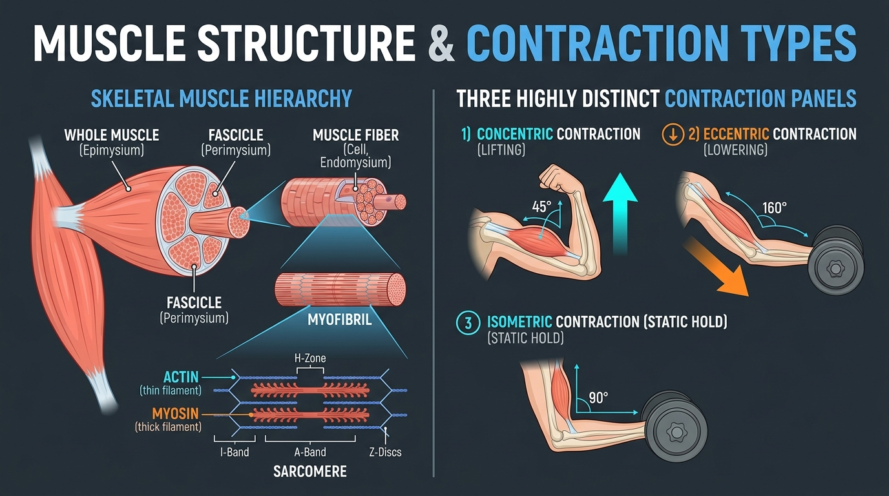

# Day 4: Skeletal Muscle Anatomy & Contraction Types

- **Estimated Study Time:** 25 minutes
- **Anatomical Focus:** Muscle connective tissue sheaths (Epimysium, Perimysium, Endomysium), Sarcomere architecture, Sliding Filament Theory, and Contraction Types (Concentric, Eccentric, Isometric).
- **Key Movement Application:** Eccentric overload in calisthenics skill progressions (e.g., negative pull-ups), isometric joint stability in yoga holds, and muscle fiber recruitment strategies.

---

## 🎯 Daily Learning Objectives
*   Trace the structural hierarchy of skeletal muscle from the whole muscle belly down to the microscopic **sarcomere**.
*   Master the molecular mechanics of the **Sliding Filament Theory** and cross-bridge cycling.
*   Distinguish between **Concentric**, **Eccentric**, and **Isometric** muscle actions and understand why eccentric actions generate $20–40\%$ more mechanical force.
*   Compare **Type I (Slow-Twitch)** vs. **Type IIa / IIx (Fast-Twitch)** muscle fibers and their functional adaptations.

---

## 📖 Core Anatomical Concept

### 🥩 1. Structural Organization of Skeletal Muscle

Skeletal muscle is organized into nested concentric layers of connective tissue sheaths that converge at each end to form dense, tensile **tendons**:

| Structural Level | Anatomical Description | Connective Tissue Sheath | Functional Role |
| :--- | :--- | :--- | :--- |
| **1. Whole Muscle Belly** | The complete macroscopic organ (e.g., Biceps Brachii, Gluteus Maximus). | **Epimysium** *(Dense irregular collagen)* | Encloses entire muscle; prevents friction against adjacent muscles and bones. |
| **2. Muscle Fascicle** | A bundled cluster of 10 to 100+ individual muscle fibers. | **Perimysium** *(Collagen & elastin sleeve)* | Routes blood vessels and nerves; organizes muscle fibers into functional pull vectors. |
| **3. Muscle Fiber (Myocyte)** | A single, elongated, multinucleated muscle cell ($10–100\,\mu\text{m}$ diameter). | **Endomysium** *(Delicate reticular matrix)* | Surrounds the cell membrane (**sarcolemma**); electrically insulates each muscle fiber. |
| **4. Myofibril** | Cylindrical intracellular protein rods packed within the sarcoplasm. | Surrounded by **Sarcoplasmic Reticulum** | Contains the contractile machinery aligned in repeating longitudinal units. |
| **5. Sarcomere** | The microscopic, functional contractile unit of a muscle ($2–3\,\mu\text{m}$ long). | Spans from **Z-disc to Z-disc** | Houses alternating thick (**Myosin**) and thin (**Actin**) protein myofilaments. |

---

### ⚡ 2. The Sliding Filament Theory & Cross-Bridge Cycle

Muscle contraction occurs when microscopic myofilaments slide past one another to shorten the sarcomere without the individual protein filaments changing length:

1.  **Neural Excitation:** An action potential arrives at the neuromuscular junction, releasing **Acetylcholine (ACh)**, which depolarizes the sarcolemma.
2.  **Calcium Release:** The electrical signal travels down the **T-tubules**, causing the sarcoplasmic reticulum to flood the myofibrils with **Calcium ions ($\text{Ca}^{2+}$)**.
3.  **Unmasking the Binding Site:** $\text{Ca}^{2+}$ binds to **Troponin C**, shifting **Tropomyosin** away from the active binding sites on the actin filament.
4.  **Cross-Bridge Formation & Power Stroke:** The **Myosin head** (energized by ATP hydrolysis into $\text{ADP} + \text{P}_i$) binds to actin. Release of $\text{P}_i$ triggers the neck lever arm to pivot $45^\circ$ (the **Power Stroke**), pulling the actin filament $\sim 10\,\text{nm}$ toward the center **M-line**.
5.  **Detachment & Reset:** A fresh **ATP** molecule binds to the myosin head, releasing it from actin to repeat the cycle as long as calcium and energy remain available. *(Without ATP, the cross-bridge remains permanently locked, causing **Rigor Mortis**).*

#### 🔬 Molecular Deep Dive: The Contractile Proteins

| Protein Filament | Structural Components | Regulatory / Functional Mechanism |
| :--- | :--- | :--- |
| **Actin** *(Thin Filament)* | • **G-Actin & F-Actin:** Globular sub-units polymerize into a double-helix strand. • **Tropomyosin:** Rope-like protein blocking myosin binding sites at rest. • **Troponin Complex:** **TnT** (attaches to tropomyosin), **TnI** (inhibits binding), **TnC** (binds $\text{Ca}^{2+}$). | Anchored to **Z-discs** by $\alpha$-actinin; serves as the physical track along which myosin pulls. |
| **Myosin** *(Thick Filament)* | • **Tail:** Coiled heavy chains anchored at the central **M-line**. • **Heads:** 2 globular heads containing an **Actin-Binding Site** and an **ATPase enzyme site**. | Hydrolyzes ATP to generate mechanical torque; pulls actin inward during cross-bridge cycling. |

---

### 🔄 3. Master Comparison Matrix: Muscle Contraction Types

Muscle force production is categorized into three primary modes based on changes in muscle length under load:

| Contraction Type | Muscle Length Change | Internal vs. External Force | Mechanical Force Output | Real-World Movement Example |
| :--- | :--- | :--- | :---: | :--- |
| **1. Concentric** *(Acceleration / Lifting)* | **Shortens** *(Z-discs pull closer together)* | Internal Muscle Force **>** External Load | **Lowest** (~$100\%$ baseline) | • Pulling up toward the bar in a Pull-up. • Ascending from a barbell squat. • Concentric phase of a bicep curl. |
| **2. Eccentric** *(Deceleration / Lowering)* | **Lengthens** *(Z-discs pulled apart under tension)* | Internal Muscle Force **<** External Load | **Highest** (~$120–140\%$ baseline) | • Lowering down slowly (negative) from a pull-up. • Descending slowly into **Chaturanga Dandasana**. • Lowering down to the bottom of a squat. |
| **3. Isometric** *(Fixation / Static Hold)* | **Unchanged** *(Sarcomere length remains constant)* | Internal Muscle Force **=** External Load | **Intermediate** (~$110–120\%$ baseline) | • Holding a static **L-Sit** on parallel bars. • Isometric balance in **Virabhadrasana II**. • Plank hold / Hollow body hold. |

> [!TIP]
> **The Force-Velocity Relationship:** 
> *   Muscles produce their **maximum force during slow eccentric contractions** (because the passive elastic protein **Titin** resists stretch alongside active cross-bridges).
> *   Muscles produce their **lowest force during rapid concentric contractions** (because cross-bridges cannot form and detach fast enough).

---

### 🧬 4. Skeletal Muscle Fiber Types

Human muscles are composed of a mosaic of three distinct fiber phenotypes:

| Fiber Characteristic | Type I (Slow Oxidative) | Type IIa (Fast Oxidative-Glycolytic) | Type IIx (Fast Glycolytic) |
| :--- | :--- | :--- | :--- |
| **Color Appearance** | **Red** *(High myoglobin & capillaries)* | **Pink / Intermediate** | **White** *(Low myoglobin & blood supply)* |
| **Primary Energy Pathway** | Aerobic (Mitochondrial respiration) | Mixed Aerobic & Anaerobic Glycolysis | Anaerobic Glycolysis (ATP-PC) |
| **Contraction Speed** | Slow | Fast | **Extremely Fast (Explosive)** |
| **Fatigue Resistance** | **Extremely High** *(Tireless)* | Moderate | **Low** *(Fatigues within 10–30 seconds)* |
| **Force / Power Output** | Low | High | **Maximum / Peak Power** |
| **Movement Specialty** | Postural endurance, long holds (**Vrikshasana**, marathon) | Mid-rep calisthenics (8–15 pull-ups), 400m sprint | 1-Rep Max deadlifts, plyometric box jumps, muscle-up bursts |

---

### ⚖️ 5. Biological Sex Differences in Muscle Physiology (Males vs. Females)

At the **single-molecule level, actin and myosin proteins are identical** in biological males and females. However, significant differences exist in fiber distribution, fatigue kinetics, and hormonal recovery:

| Metric | Biological Females | Biological Males | Biomechanical & Training Relevance |
| :--- | :--- | :--- | :--- |
| **Individual Cross-Bridge Force** | $\sim 3–6\,\text{pN}$ per single myosin head | $\sim 3–6\,\text{pN}$ per single myosin head | **Identical:** Single-molecule force generation is equal across sexes. |
| **Specific Tension (Force / $\text{cm}^2$)** | $\sim 20–30\,\text{N/cm}^2$ of muscle tissue | $\sim 20–30\,\text{N/cm}^2$ of muscle tissue | **Identical:** Force per unit physiological cross-sectional area is equal. |
| **Fiber Type Proportion** | **Higher % Type I (Slow-Twitch)** fibers ($\sim 10–15\%$ higher). | **Higher % Type IIa / IIx (Fast-Twitch)** fibers. | • **Females:** Greater endurance and faster set-to-set recovery. • **Males:** Higher peak explosive power and Rate of Force Development. |
| **Capillary Density & Perfusion** | **Higher capillary-to-fiber ratio**; greater blood flow. | Lower capillary-to-fiber ratio per unit muscle mass. | Females clear metabolic byproducts ($\text{H}^+, \text{P}_i$) faster, delaying muscular fatigue. |
| **Submaximal Fatigue Resistance** | **Significantly higher endurance** at $60–80\%$ 1RM loads. | Faster fatigue during sustained isometric/high-rep sets. | Females excel at high-volume calisthenics and long-hold yoga postures (**Virabhadrasana II**). |
| **Hormonal Milieu & Hypertrophy** | **Estrogen ($17\beta$-Estradiol)** + Progesterone. | **Testosterone** ($15–20\times$ higher resting levels). | Testosterone drives larger total muscle cross-sectional area; relative % strength gains from training are identical. |
| **Post-Exercise Muscle Recovery** | **Faster structural repair; less soreness (DOMS).** | Higher eccentric cross-bridge micro-damage. | **Estrogen acts as a membrane stabilizer and anti-inflammatory**, protecting sarcolemma from exercise damage. |
| **Tendon & Fascial Compliance** | **Higher compliance (more flexible / pliant).** | **Higher stiffness (greater Young's modulus).** | • **Females:** Greater joint flexibility; requires active muscular control to stabilize joints. • **Males:** Superior elastic recoil in explosive sprinting and bounding. |

---

## 🎨 Visual Diagram

Here is a 3D medical visual atlas detailing the hierarchical architecture of skeletal muscle alongside comparative force curves for concentric, eccentric, and isometric contractions:

---

## 🔄 Movement Application (Calisthenics & Yoga)

### 🤸 1. Calisthenics: The Power of Eccentric Overload (The "Negative" Method)
*   **The Problem:** Beginners often lack the concentric strength to complete a single pull-up or parallel bar dip.
*   **The Biomechanical Solution:** Because **eccentric strength is $20–40\%$ higher than concentric strength**, a practitioner can jump above the bar and lower down slowly over 5 to 8 seconds.
*   **Why It Works:** Slow eccentric lowering triggers maximal micro-mechanical tension on cross-bridges and the structural protein **titin**, inducing robust neuromuscular adaptations and myofibrillar hypertrophy without needing concentric success.

---

### 🧘 2. Yoga: Isometric Stabilization & Asymmetric Holds

#### Chaturanga Dandasana (Eccentric Control) to Bhujangasana (Concentric Arc)
*   **Chaturanga Descent:** The transition from Plank down to low hover is an **eccentric contraction** of the **Triceps Brachii** and **Pectoralis Major**. Sinking passively without eccentric braking collapses the anterior humeral head into the glenoid capsule.
*   **Virabhadrasana II (Warrior 2):** Holding the lead thigh parallel to the ground for 5 breaths requires a sustained **isometric contraction** of the **Quadriceps** and **Gluteus Medius** (Type I slow-twitch recruitment), maintaining joint congruence while resisting gravity.

---

## 🔬 Biomechanics Lab: Desk-side Drill

Experience the 3 contraction modes and the force-velocity relationship right now:

### Drill 1: The Biceps Contraction Triad
1.  **Concentric:** Hold a water bottle or small weight in your hand. Curl it upward toward your shoulder. Notice the biceps muscle belly actively **shortens, bunches, and thickens**.
2.  **Isometric:** Stop halfway when your elbow is at $90^\circ$. Hold it perfectly still for 10 seconds. Notice the muscle belly maintains constant tension without moving the joint.
3.  **Eccentric:** Very slowly, over 6 full seconds, lower the weight back down. Place your opposite hand on your biceps. Feel how the muscle remains rock-hard and actively firing even as it **lengthens**!

### Drill 2: The Chair Hover Test (Type I vs. Type IIx Fatigue)
1.  Stand up and lower yourself until your thighs are almost parallel to your chair, hovering 2 inches above the seat.
2.  Hold this static position (**isometric quadriceps contraction**).
3.  *0–15 seconds:* Feels easy as fast-twitch motor units fire.
4.  *30–60 seconds:* Trembling begins as Type II fibers exhaust glycogen stores and the nervous system frantically shifts the load to Type I oxidative fibers.

---

## 🧠 Daily Knowledge Check

Test your mastery of muscle physiology and contraction types:

### Questions
1.  **Tissue Sheath Question:** If a surgeon cuts into a whole muscle belly, through which connective tissue layer must they cut first, and which layer encloses individual muscle fibers?
2.  **Molecular Mechanism:** What specific ion must bind to **Troponin** to move **Tropomyosin** off the actin binding sites, initiating the cross-bridge cycle?
3.  **Force Hierarchy:** Rank the three muscle contraction types (Concentric, Eccentric, Isometric) in order from **highest mechanical force capacity** to **lowest**.
4.  **Movement Application:** When lowering yourself down slowly from the top of a dip, what type of muscle contraction are your Triceps Brachii and Pectorals performing?
5.  **Fiber Type Selection:** Why are postural muscles like the **Soleus** and spinal **Multifidus** composed predominantly of **Type I** muscle fibers rather than Type IIx?

---

🔑 Click to reveal answers and explanations

### Answers & Explanations

1.  **Answer:** The surgeon cuts through the **Epimysium** first (which wraps the whole muscle belly). Individual muscle fibers are surrounded by the **Endomysium**.
2.  **Answer:** **Calcium ions ($\text{Ca}^{2+}$)** must bind to Troponin.
3.  **Answer:** **Eccentric** (highest, ~120–140%) $>$ **Isometric** (intermediate, ~110–120%) $>$ **Concentric** (lowest, ~100%).
4.  **Answer:** They are performing an **Eccentric Contraction** (lengthening under load to decelerate body weight against gravity).
5.  **Answer:** Postural muscles must fire continuously for hours to maintain upright alignment against gravity. **Type I fibers** are rich in mitochondria, myoglobin, and capillaries, making them exceptionally fatigue-resistant and capable of sustained aerobic metabolism.

---

## 🔗 Connected Guides & References
*   **[Master Muscle Directory](../../muscles/README.md)**
*   **[Master Skeletomuscular Map](../../muscles/guides/skeletomuscular_map.md)**
*   **[Master Pose Corrections Directory](../../pose_corrections/README.md)**
*   **[Day 3: The Skeletal System & Joint Classifications](../day-003-skeletal-system-joints/README.md)**
