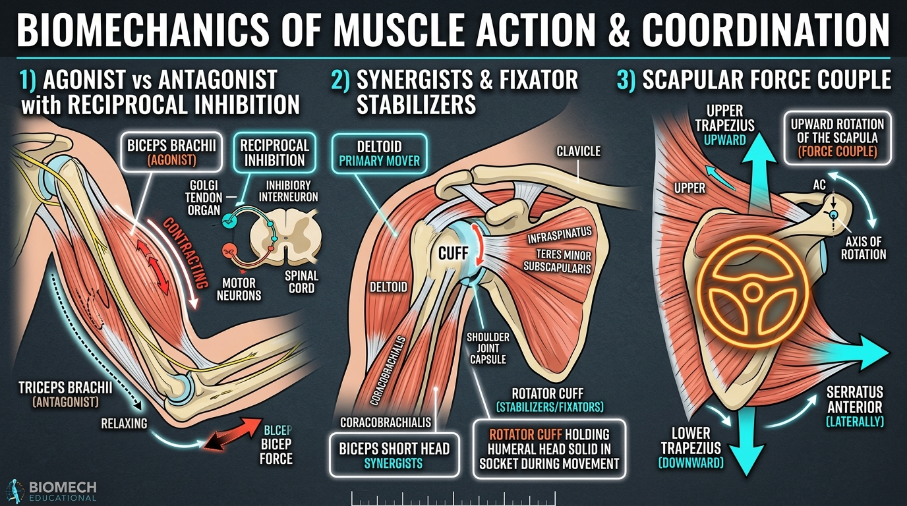

# Day 5: Muscle Roles & Joint Stabilization

- **Estimated Study Time:** 25 minutes
- **Anatomical Focus:** Functional classifications of muscle action (Agonist, Antagonist, Synergist, Fixator/Stabilizer), Reciprocal Inhibition reflex mechanics, and Muscular Force Couples.
- **Key Movement Application:** Using reciprocal inhibition to safely deepen flexibility in yoga (**Uttanasana**, **Anjaneyasana**), and mastering stabilizer recruitment in calisthenics push-ups and handstands.

---

## 🎯 Daily Learning Objectives
*   Categorize muscles dynamically based on their instantaneous functional roles: **Agonist (Prime Mover)**, **Antagonist**, **Synergist**, and **Fixator (Stabilizer)**.
*   Master the neuromuscular reflex of **Reciprocal Inhibition** and utilize it to release tight antagonist muscles safely without passive tearing.
*   Analyze **Muscular Force Couples**—how multiple muscles pulling in completely different anatomical directions coordinate to rotate a joint smoothly.
*   Diagnose movement dysfunctions caused by **Synergistic Dominance** and stabilizer inhibition.

---

## 📖 Core Anatomical Concept

### 🎭 1. Functional Roles of Muscles During Movement

No muscle acts in isolation. For every human movement, the central nervous system coordinates muscles into four synchronized functional roles:

| Functional Role | Definition | Biomechanical Mechanism | Real-World Example (Pull-up) |
| :--- | :--- | :--- | :--- |
| **1. Agonist** *(Prime Mover)* | The primary muscle whose concentric contraction generates the majority of force for the desired joint movement. | Has the optimal line of pull, largest physiological cross-sectional area (PCSA), and best mechanical moment arm. | **Latissimus Dorsi** & **Biceps Brachii** (driving shoulder adduction & elbow flexion). |
| **2. Antagonist** *(Opposing Muscle)* | The muscle situated on the opposite side of the joint that lengthens and relaxes to allow smooth movement. | Provides eccentric braking, controls movement velocity, and protects the joint capsule from deceleration shock. | **Triceps Brachii** & **Pectoralis Major / Anterior Deltoid** (relaxing to permit flexion/adduction). |
| **3. Synergist** *(Helper / Assistant)* | Muscles that assist the prime mover by contributing supplemental force or guiding the movement trajectory. | Eliminates unwanted intermediate joint motions; steps in when the agonist nears fatigue. | **Brachialis**, **Brachioradialis**, and **Teres Major** (assisting elbow flexion and shoulder adduction). |
| **4. Fixator / Stabilizer** *(Anchor / Base Support)* | Muscles that contract isometrically to immobilize the bone of origin, creating a rigid platform. | Anchors proximal joints so distal segments can express force without energy leakage or capsular collapse. | **Rotator Cuff (SITS)** (centers humeral head) + **Core (TVA / Glutes)** (stabilizes spine/pelvis). |

---

### ⚡ 2. The Reciprocal Inhibition Reflex Arc

**Reciprocal Inhibition** is a hardwired spinal cord reflex designed to prevent agonist and antagonist muscles from fighting each other simultaneously:

1.  When the **Agonist** receives an excitatory signal from $\alpha$-motor neurons to contract, sensory **muscle spindles** detect the shortening.
2.  Collateral axon branches synapse in the spinal cord onto **Ia Inhibitory Interneurons**.
3.  These interneurons immediately **suppress and inhibit** the motor neurons of the opposing **Antagonist** muscle.
4.  **Result:** The antagonist instantly relaxes and releases muscular tone, allowing the agonist to move the joint freely without resistance.

> [!TIP]
> **Bio-Hack for Flexibility:** To rapidly and safely lengthen tight hamstrings in a forward bend (**Uttanasana**), do NOT aggressively force the stretch. Instead, **actively flex your Quadriceps (agonists)**. This automatically triggers reciprocal inhibition in the spinal cord, forcing the hamstrings (antagonists) to shut off active tone and lengthen with zero resistance!

---

### 🔄 3. Muscular Force Couples

A **Force Couple** is a biomechanical synergy where two or more muscles with **different anatomical lines of pull** contract simultaneously to produce **pure rotational torque** around a joint axis:

| Force Couple | Participating Muscles | Direction of Force Vectors | Joint Motion Produced | Movement Application |
| :--- | :--- | :--- | :--- | :--- |
| **1. Scapular Upward Rotation** | • **Upper Trapezius** • **Lower Trapezius** • **Serratus Anterior** | • Upper Trap pulls **upward & inward**. • Lower Trap pulls **downward & inward**. • Serratus Anterior pulls **outward & forward**. | Rotates the scapula upward like turning a steering wheel ($60^\circ$). | Clears subacromial space during overhead pressing, pull-ups, and **Adho Mukha Svanasana**. |
| **2. Anterior Pelvic Tilt (APT)** | • **Iliopsoas & Rectus Femoris** • **Lumbar Erector Spinae** | • Hip flexors pull anterior pelvis **downward**. • Lower back erectors pull posterior pelvis **upward**. | Rotates pelvic bowl forward; increases lumbar lordosis. | Arches back into **Bhujangasana** (Cobra) or barbell squat setup. |
| **3. Posterior Pelvic Tilt (PPT)** | • **Rectus Abdominis & Obliques** • **Gluteus Maximus & Hamstrings** | • Abdominals pull anterior pelvis **upward**. • Glutes/Hamstrings pull posterior pelvis **downward**. | Tucks tailbone under; flattens and decompresses lumbar spine. | Locks rigid hollow body hold in gymnastics, planches, and **Chaturanga**. |

---

## 🎨 Visual Diagram

Here is a 3D medical biomechanics infographic illustrating Agonist-Antagonist pairs, the Reciprocal Inhibition neural arc, and the Scapular Upward Rotation Force Couple:

---

## 🔄 Movement Application (Calisthenics & Yoga)

### 🤸 1. Calisthenics: Synergistic Dominance & Joint Impingement
*   **The Pathology:** When a prime mover or deep stabilizer is weak or inhibited (e.g., weak **Lower Trapezius** or dormant **Gluteus Maximus**), synergists are forced to take over the entire workload.
*   **Clinical Example (The Dip Trap):** If the **Serratus Anterior** is inhibited during dips or push-ups, the **Pectoralis Minor** attempts to stabilize the scapula alone. Because the pec minor attaches to the coracoid process, it pulls the shoulder blade into an anterior downward tilt, pinching the rotator cuff tendons against the acromion bone.
*   **Correction:** Activate the prime stabilizers (Serratus Anterior protraction and Lower Trapezius depression) before loading compound calisthenics movements.

---

### 🧘 2. Yoga: Reciprocal Inhibition in Hip Openers

#### Anjaneyasana (Crescent Lunge): Releasing the Psoas via Glute Activation
*   **The Problem:** The **Psoas Major** and **Iliacus** (hip flexors) are chronically shortened from prolonged sitting, resisting extension of the rear leg in lunges.
*   **The Biomechanical Solution:** Instead of aggressively arching the lower back to fake hip depth, **actively squeeze the rear Gluteus Maximus**.
*   **Neuromuscular Result:** Glute activation fires reciprocal inhibitory interneurons to the lumbar spinal cord, automatically shutting down psoas resistance and allowing the hip joint to open smoothly and pain-free.

---

## 🔬 Biomechanics Lab: Desk-side Drill

Experience reciprocal inhibition and force couple stabilization right now:

### Drill 1: The Instant Hamstring Release Test (Reciprocal Inhibition)
1.  Stand upright and extend your right leg forward, heel on the floor.
2.  Try to bend forward slightly at the hip. Feel the baseline stretch tension in your right hamstring.
3.  Now, **actively flex your right Quadriceps as hard as you can** (pull your kneecap up toward your hip).
4.  While maintaining that hard quad squeeze, hinge forward again.
5.  *Notice:* Your hamstring immediately yields and allows you to fold $2–3$ inches deeper with zero painful resistance!

### Drill 2: The Scapular Steering Wheel (Force Couple Feeling)
1.  Place your left hand on the base of your right shoulder blade (lower trapezius / serratus border).
2.  Slowly raise your right arm out to the side and overhead into full abduction ($180^\circ$).
3.  Feel how the lower tip of the scapula swings dramatically outward and upward along your ribs, driven by the coordinated pull of your Upper Trap, Lower Trap, and Serratus Anterior working as a team.

---

## 🧠 Daily Knowledge Check

Test your understanding of muscle roles and joint synergies:

### Questions
1.  **Functional Classification:** During a Barbell Bench Press, what is the functional role of the **Pectoralis Major**, the **Triceps Brachii**, the **Rotator Cuff**, and the **Latissimus Dorsi**?
2.  **Neuromuscular Reflex:** Explain how **Reciprocal Inhibition** allows a gymnast to achieve a deeper split without injuring the antagonist hamstring or groin muscles.
3.  **Force Couple Mechanics:** What three muscles form the primary force couple that rotates the scapula upward during an overhead handstand press?
4.  **Movement Pathology:** What is **Synergistic Dominance**, and why does it frequently cause tendonitis in assistant muscles like the Teres Major or Hamstrings?
5.  **Yoga Alignment:** When holding **Virabhadrasana III (Warrior 3)** on one leg, what is the role of the standing leg's **Gluteus Medius**?

---

🔑 Click to reveal answers and explanations

### Answers & Explanations

1.  **Answer:** 
    *   **Pectoralis Major:** **Agonist (Prime Mover)** for horizontal shoulder adduction.
    *   **Triceps Brachii:** **Synergist** assisting elbow extension.
    *   **Rotator Cuff (SITS):** **Fixator / Stabilizer** dynamically centering the humeral head in the glenoid socket.
    *   **Latissimus Dorsi:** **Antagonist** relaxing to allow shoulder horizontal adduction.
2.  **Answer:** By actively contracting the **Agonist muscles** (e.g., flexing the Quadriceps and Glutes), the spinal cord sends inhibitory signals through Ia interneurons to the **Antagonist muscles** (Hamstrings and Hip Flexors), reducing muscle spindle tone and allowing safe passive lengthening without reflexive protective spasm.
3.  **Answer:** The **Upper Trapezius** (pulls up), **Lower Trapezius** (pulls down), and **Serratus Anterior** (pulls laterally).
4.  **Answer:** Synergistic Dominance occurs when a prime mover or primary stabilizer is inhibited or weak, forcing smaller helper synergists to absorb excessive mechanical load, leading to chronic overuse, trigger points, and tendonitis (e.g., Teres Major compensating for a weak Latissimus Dorsi).
5.  **Answer:** The standing Gluteus Medius acts as a crucial **Fixator / Stabilizer**, contracting isometrically to prevent the pelvis from dropping on the opposite side (Trendelenburg sign) and keeping the sacrum level in the frontal plane.

---

## 🔗 Connected Guides & References
*   **[Master Muscle Directory](../../muscles/README.md)**
*   **[Master Skeletomuscular Map](../../muscles/guides/skeletomuscular_map.md)**
*   **[Master Pose Corrections Directory](../../pose_corrections/README.md)**
*   **[Day 4: Skeletal Muscle Anatomy & Contraction Types](../day-004-muscle-anatomy-contractions/README.md)**
