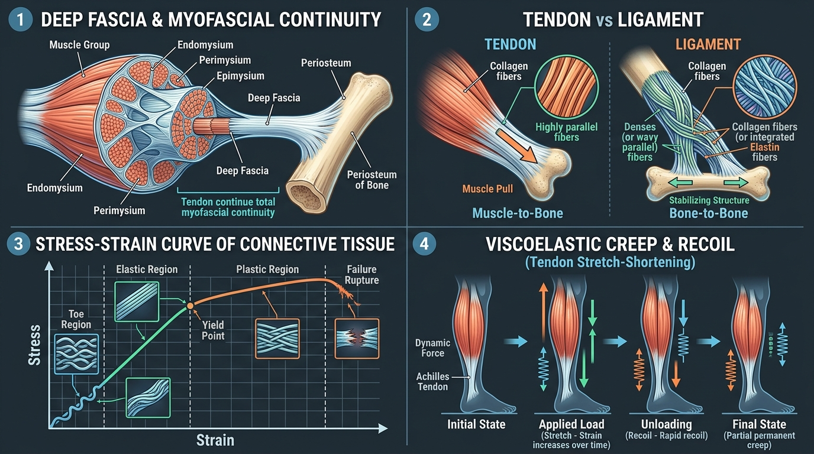

# Day 6: Connective Tissue, Fascia, & Viscoelasticity

- **Estimated Study Time:** 25 minutes
- **Anatomical Focus:** Extracellular Matrix (Collagen & Elastin), Tendons vs. Ligaments, Deep Fascial Continuity, the Mechanical Stress-Strain Curve, and Viscoelastic Phenomena (Creep, Hysteresis, Stretch-Shortening Cycle).
- **Key Movement Application:** Preventing tendonitis/tendinopathy in calisthenics, harnessing tendon elastic recoil in plyometrics, and safely remodeling fascia in long-hold yoga postures (**Yin Yoga**).

---

## 🎯 Daily Learning Objectives
*   Differentiate between **Tendons** (muscle-to-bone force transmitters) and **Ligaments** (bone-to-bone joint limiters).
*   Understand the **Myofascial Continuum** and how lateral force transmission through deep fascia distributes muscular tension across entire kinetic chains.
*   Master the **5 Stages of the Mechanical Stress-Strain Curve** (Toe, Elastic, Yield Point, Plastic, Failure).
*   Explain the biomechanical properties of **Viscoelasticity** (**Creep**, **Stress Relaxation**, and **Hysteresis**).
*   Apply tendon elastic recoil to maximize power output while preventing chronic overuse tendinopathy.

---

## 📖 Core Anatomical Concept

### 🕸️ 1. The Building Blocks of Connective Tissue

Connective tissue forms the structural scaffolding of the human body, composed of specialized cells embedded within an **Extracellular Matrix (ECM)**:

| Matrix Component | Structural Makeup | Biomechanical Property | Anatomical Location |
| :--- | :--- | :--- | :--- |
| **1. Type I Collagen** | Triple-helix protein bundles (thick & dense) | **Immense Tensile Strength** *(Resists pulling forces; stronger than steel per unit weight)* | Tendons, Joint Capsules, Annulus Fibrosus of discs. |
| **2. Type III Collagen** | Delicate reticular meshwork | **Compliant Structural Scaffold** *(First collagen laid down during tissue repair)* | Endomysium, superficial fascia, blood vessel walls. |
| **3. Elastin Fibers** | Cross-linked protein coils | **High Elastic Compliance** *(Can stretch $150\%$ and snap back instantly)* | Ligamentum Flavum of spine, skin, arterial walls. |
| **4. Ground Substance** | Gel-like water, Proteoglycans, and **Hyaluronic Acid** | **Hydraulic Cushion & Lubricant** *(Allows smooth fascial sliding and absorbs shock)* | Synovial fluid, intervertebral discs, fascial planes. |

---

### ⚖️ 2. Tendons vs. Ligaments: Structural Comparison

| Structural Feature | Tendons (Muscle-to-Bone) | Ligaments (Bone-to-Bone) |
| :--- | :--- | :--- |
| **Primary Function** | Transmits muscular contraction force to move bones; stores and releases elastic energy. | Restrains excessive joint motion; guides arthrokinematic glide; stabilizes joint capsules. |
| **Collagen Fiber Alignment** | **Strictly Parallel** (optimized for unidirectional tensile pulling force). | **Wavy / Crisscrossed** (designed to resist multi-directional twisting and shearing loads). |
| **Elastin Content** | Low (~$1–2\%$) $\rightarrow$ High stiffness, minimal stretch. | Higher (~$5–10\%$, up to $70\%$ in ligamentum flavum) $\rightarrow$ Pliant, resilient. |
| **Vascularity & Healing** | Low blood supply (hypovascular) $\rightarrow$ Slow healing ($12–24$ weeks for remodeling). | Extremely low blood supply $\rightarrow$ Very slow healing; severe sprains form weak scar tissue. |
| **Proprioception** | Contains **Golgi Tendon Organs (GTO)** to sense tension. | Richly innervated with **Ruffini & Pacinian mechanoreceptors** to detect joint position. |

---

### 📈 3. The Mechanical Stress-Strain Curve

When connective tissue (a tendon or ligament) is pulled under mechanical load, it progresses through five predictable mechanical zones:

```
STRESS (Load) 
  ▲
  │                                    Plastic Region (Micro-tears)
  │                                ┌───────────────────────────❌ FAILURE / RUPTURE (>8-10% Strain)
  │                   Yield Point ─┘
  │                 ┌─ (4% Strain)
  │  Elastic Region │
  │       ┌─────────┘
  │       │ (2-4% Linear Elasticity)
  │  Toe  │
  │ ┌─────┘ (0-2% Uncrimping)
  └─┴─────────────────────────────────────────────────────────────► STRAIN (Elongation %)
```

| Region on Curve | Strain % Range | Internal Structural Event | Movement & Clinical Relevance |
| :--- | :---: | :--- | :--- |
| **1. Toe Region** | $0\% – 2\%$ | Wavy, relaxed collagen fibers straighten out (uncrimping) under light initial tension. | Normal daily gentle movements; taking up slack in a muscle during a warmup. |
| **2. Elastic Region** | $2\% – 4\%$ | Collagen fibers stretch linearly. When load is released, **tissue snaps back completely to resting length** with zero permanent deformation. | Dynamic stretching, running, calisthenics pull-ups, and active yoga flows. |
| **3. Yield Point** | $\sim 4\%$ | The physiological limit of elastic recovery. Mechanical stress exceeds intermolecular cross-link strength. | The boundary between safe elastic loading and permanent micro-damage. |
| **4. Plastic Region** | $4\% – 8\%$ | Collagen fibers slip and micro-tear. When load is removed, **permanent structural lengthening (deformation)** occurs. | **Yin Yoga / Deep Mobility:** Controlled, low-load long holds to remodel tight joint capsules. |
| **5. Ultimate Failure** | $> 8\% – 10\%$ | Macroscopic structural failure: **Complete Ligament Tear (Grade III Sprain)** or **Tendon Rupture**. | Acute injury: ACL rupture from landing awkwardly; Achilles tendon snap during explosive sprint. |

---

### ⏱️ 4. Viscoelastic Properties: Creep, Hysteresis, & SSC

Because connective tissue is composed of both elastic solids (collagen/elastin) and viscous fluids (water/proteoglycans), its mechanical behavior is **time-dependent (viscoelastic)**:

1.  **Mechanical Creep:** Under a constant, sustained tensile load over time, connective tissue continues to slowly deform and elongate.
    *   *Positive application:* Holding **Paschimottanasana** (Seated Forward Bend) passively for 3–5 minutes allows fascial sheets and collagen bundles to slowly "creep" longer.
    *   *Negative application:* Slouching forward over a desk for 8 hours "creeps" the posterior spinal ligaments into chronic laxity, destabilizing the lumbar spine.
2.  **Hysteresis (Energy Loss as Heat):** When a tendon is loaded and unloaded, the unloading curve does not follow the loading curve. The area between the two curves represents **energy dissipated as heat**.
    *   *Warm-up benefit:* Repetitive joint movements warm up the fascial matrix, lowering viscous resistance and making tissues more pliable.
3.  **Stretch-Shortening Cycle (SSC & Elastic Recoil):** When a muscle-tendon unit is rapidly stretched eccentrically, the tendon acts like a high-tension spring, storing elastic potential energy. If immediately followed by a concentric contraction, this energy is released explosively.
    *   *Athletic example:* The **Achilles Tendon** stores up to $50\%$ of the mechanical energy required for human running and bounding jumps!

---

## 🎨 Visual Diagram

Here is a 3D medical visual infographic illustrating deep fascial continuity, tendon vs. ligament fiber architecture, the complete stress-strain curve, and viscoelastic tendon recoil:



---

## 🔄 Movement Application (Calisthenics & Yoga)

### 🤸 1. Calisthenics: Preventing Overuse Tendinopathy
*   **The Pathology:** Muscle tissue adapts to training within $2–4$ weeks due to rich blood supply. Tendons, however, have $10\times$ lower metabolic rates and take **6 to 12 months** to remodel collagen cross-links.
*   **The Trap:** Beginners who rapidly progress to high-volume dips or straight-arm planches overstress the **Biceps Tendon** and **Triceps Tendon**, causing micro-tears in the plastic region faster than collagen synthesis can repair them (**Tendinopathy**).
*   **Correction:** Use progressive connective tissue conditioning: incorporate slow eccentric tempos ($3–5$ seconds down) and isometric holds to stimulate tenocyte collagen deposition without destructive shock loads.

---

### 🧘 2. Yoga: Fascial Remodeling in Long-Hold Postures (Yin Yoga)

#### Uttanasana & Paschimottanasana: Superficial Back Line Continuity
*   **The Anatomy:** According to myofascial meridian science, the **Plantar Fascia**, **Achilles Tendon**, **Hamstrings**, **Sacrotuberous Ligament**, **Thoracolumbar Fascia**, and **Epicranial Aponeurosis** form one continuous tensile sheet (the *Superficial Back Line*).
*   **The Application:** Tension under the sole of the foot directly restricts forward bending at the skull! Rolling the bottom of the foot on a lacrosse ball loosens the entire posterior fascial chain, immediately adding $1–2$ inches of depth in **Uttanasana** without stretching the hamstrings directly.

---

## 🔬 Biomechanics Lab: Desk-side Drill

Experience viscoelastic creep and the stretch-shortening cycle right now:

### Drill 1: The Viscoelastic Creep Finger Test
1.  Extend your left index finger backward using your right hand until you feel firm elastic resistance.
2.  Hold this exact stretch with constant, gentle pressure for **60 continuous seconds**.
3.  *Notice:* Without applying any extra force, the finger will gradually drift $5–10^\circ$ further back as water is squeezed out of the ground substance and collagen fibers undergo **mechanical creep**.

### Drill 2: The Stretch-Shortening Tendon Recoil Test (Achilles Spring)
1.  Stand up and jump into the air as high as possible **without bending your knees beforehand** (starting straight from a static pause). Notice how low the jump is ($4–6$ inches).
2.  Now, quickly drop down into a shallow quarter-squat and immediately bounce upward into a jump.
3.  *Notice:* You jump nearly double the height! That explosive extra power was not muscular effort—it was **free kinetic energy released by the elastic recoil of your Achilles tendon and patellar tendon**!

---

## 🧠 Daily Knowledge Check

Test your mastery of connective tissue and fascia mechanics:

### Questions
1.  **Collagen Architecture:** Why do tendons have strictly parallel collagen fiber arrangements, whereas ligaments have a wavy, crisscrossed fiber structure?
2.  **Stress-Strain Zone:** If an athlete over-stretches a hamstring during a high kick into the **Plastic Region** ($5\%$ strain), will the tissue return to its exact original length when relaxed? Explain why.
3.  **Viscoelastic Phenomenon:** What is **Mechanical Creep**, and how does it explain why practitioners can fold deeper in a yoga posture after holding it for 3 minutes?
4.  **Tissue Healing:** Why does a torn muscle belly heal in $3–6$ weeks, whereas a torn Achilles tendon or ACL ligament can take $6–12$ months to recover?
5.  **Elastic Storage:** What anatomical structure stores the majority of elastic potential energy during the eccentric landing phase of a plyometric jump?

---

<details>
<summary>🔑 Click to reveal answers and explanations</summary>

### Answers & Explanations

1.  **Answer:** Tendons experience unidirectional tensile pull exclusively along the long axis of the muscle; strictly parallel collagen fibers maximize tensile stiffness in that single direction. Ligaments must stabilize joints against multi-directional shearing, twisting, and rotational forces; crisscrossed fibers allow them to resist tension from multiple angles.
2.  **Answer:** **No.** Entering the **Plastic Region** breaks intermolecular collagen cross-links and creates microscopic tissue tears. When the load is removed, the tissue suffers **permanent plastic deformation (lengthening)** and will not return to its original resting length.
3.  **Answer:** **Creep** is the progressive, time-dependent deformation and elongation of viscoelastic tissue under a constant, sustained load as fluid shifts out of the proteoglycan ground substance and collagen bundles reorganize.
4.  **Answer:** Muscle bellies are surrounded by an extensive capillary network (highly vascular) delivering oxygen, satellite cells, and nutrients for rapid protein synthesis. Tendons and ligaments are **hypovascular** (bradytrophic), relying primarily on slow interstitial fluid diffusion for cellular repair and collagen remodeling.
5.  **Answer:** The **Achilles Tendon** (and Patellar Tendon / aponeurotic tendon sheets) acts as a biological spring, storing mechanical strain energy in its stretched collagen matrix during eccentric loading.

</details>

---

## 🔗 Connected Guides & References
*   **[Master Muscle Directory](../../muscles/README.md)**
*   **[Master Skeletal Directory](../../bones/README.md)**
*   **[Master Skeletomuscular Map](../../muscles/guides/skeletomuscular_map.md)**
*   **[Master Pose Corrections Directory](../../pose_corrections/README.md)**
*   **[Day 5: Muscle Roles & Joint Stabilization](../day-005-muscle-roles-stabilization/README.md)**
