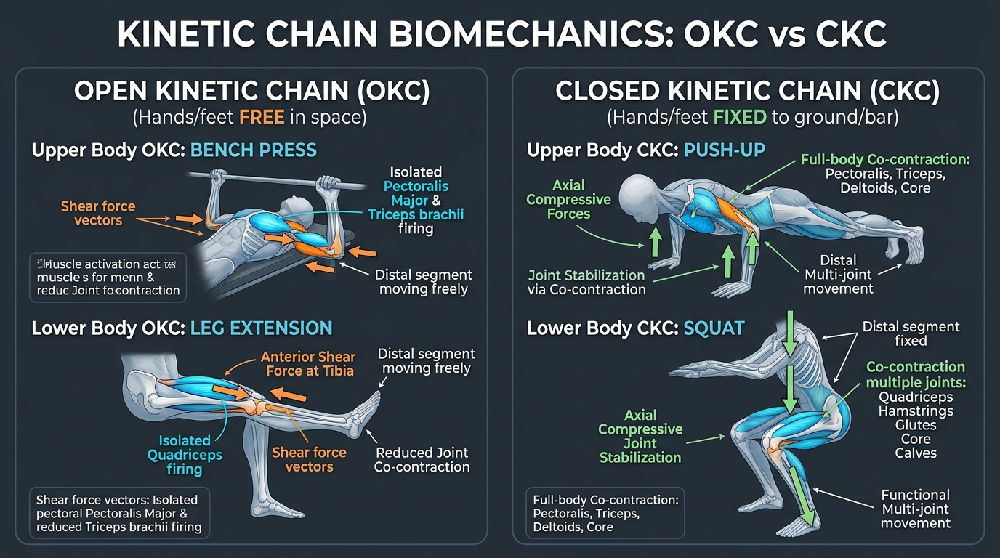

# Day 7: Kinetic Chains (OKC vs. CKC) & Module 1 Comprehensive Exam

- **Estimated Study Time:** 35 minutes
- **Anatomical Focus:** Open Kinetic Chain (OKC) vs. Closed Kinetic Chain (CKC) biomechanics, joint shear vs. axial compression, co-contraction stabilization, and **Module 1 Mastery Assessment**.
- **Key Movement Application:** Why calisthenics and yoga build superior joint stability through CKC loading, and selecting safe rehabilitation progressions.

---

## 🎯 Daily Learning Objectives
*   Define and differentiate between **Open Kinetic Chain (OKC)** and **Closed Kinetic Chain (CKC)** movements.
*   Analyze the mechanical force profile: **Rotational Shear Stress (OKC)** vs. **Axial Joint Compression & Multi-Muscle Co-contraction (CKC)**.
*   Explain why bodyweight calisthenics and yoga asanas are predominantly Closed Kinetic Chain disciplines that optimize proprioceptive feedback.
*   Pass the **Module 1 Comprehensive Board-Style Exam** covering Planes, Directional Terms, Skeletal Anatomy, Muscle Contractions, Force Couples, and Fascia.

---

## 📖 Core Anatomical Concept

### ⛓️ 1. The Kinetic Chain Concept (Franz Reuleaux & Arthur Steindler)

The human body is an interconnected series of rigid kinematic segments (bones) linked by movable joints. When a force is applied to one link, motion predictable transfers across neighboring links:

| Biomechanical Feature | Open Kinetic Chain (OKC) | Closed Kinetic Chain (CKC) |
| :--- | :--- | :--- |
| **Distal Segment Status** | **Free to move in space** *(unfixed / unconstrained)*. | **Fixed to an immovable surface** *(ground, wall, or fixed bar)*. |
| **Movement Independence** | Joint movement can occur in **complete isolation** without forcing movement at adjacent joints. | Movement at one joint **mandates predictable motion** across all other joints in the chain. |
| **Primary Muscle Recruitment** | **Isolated single-muscle belly** concentration (e.g., isolated Pectoralis Major or isolated Quadriceps). | **High-level Co-contraction** of agonists, antagonists, synergists, and deep stabilizers across multiple joints. |
| **Joint Loading Profile** | High **Rotational Shearing Forces** at the distal joint; low compressive congruency. | High **Axial Compressive Forces**; increases joint surface contact area and stability. |
| **Proprioceptive Input** | Moderate; lower mechanoreceptor activation in joint capsules. | **Extremely High**; massive sensory afferent feedback from foot/hand mechanoreceptors. |

---

### ⚖️ 2. Master Comparison Matrix: Real-World OKC vs. CKC

| Body Segment | Open Kinetic Chain (OKC) | Closed Kinetic Chain (CKC) | Biomechanical Advantage of CKC |
| :--- | :--- | :--- | :--- |
| **Upper Body Pushing** | **Dumbbell Chest Fly / Bench Press** *(Hands move freely through space)* | **Push-ups / Parallel Bar Dips** *(Hands fixed to ground/bars; torso moves)* | Push-ups recruit **Serratus Anterior** and core stabilizers, eliminating the anterior shoulder shear common in heavy benching. |
| **Upper Body Pulling** | **Biceps Dumbbell Curl** *(Wrist and weight curl freely)* | **Pull-ups / Chin-ups** *(Hands fixed to bar; body moves)* | Pull-ups co-contract the entire shoulder girdle, latissimus dorsi, and core cylinder into one functional unit. |
| **Lower Body Knee Extension** | **Seated Machine Leg Extension** *(Feet swing freely under pad)* | **Barbell Back Squat / Pistol Squat** *(Feet fixed to floor; hips/knees hinge)* | Leg extensions generate **dangerous anterior tibial shear**, straining the **ACL**. Squats co-contract the **Hamstrings** to pull the tibia backward, completely neutralizing ACL stress! |
| **Lower Body Hip/Glute** | **Side-Lying Clamshell** *(Top leg opens freely in air)* | **Single-Leg Squat / Vrikshasana (Tree Pose)** *(Standing foot anchored into earth)* | Single-leg CKC loading forces the **Gluteus Medius** to stabilize the pelvis against gravity in true functional alignment. |

---

## 🎨 Visual Diagram

Here is a 3D medical biomechanics infographic comparing Open Kinetic Chain (OKC) vs. Closed Kinetic Chain (CKC) force vectors and joint stability mechanics:

---

## 🔄 Movement Application (Calisthenics & Yoga)

### 🤸 1. Calisthenics: The Supreme CKC Discipline
*   Almost all fundamental calisthenics skills—**Push-ups**, **Dips**, **Pull-ups**, **Handstands**, **L-sits**, and **Planches**—are **Closed Kinetic Chain movements**.
*   **Why Gymnasts Have Bulletproof Joint Stability:** In a CKC movement, bodyweight creates axial compressive loads that seat the humeral head tightly into the glenoid cavity. This triggers reflexive co-contraction of the **Rotator Cuff** and **Serratus Anterior**, fortifying the shoulder capsule against injury far more effectively than isolated dumbbell machine work.

---

### 🧘 2. Yoga: Grounding & Distal Anchor Stability

#### Adho Mukha Svanasana & Setu Bandhasana (CKC Grounding)
*   **Adho Mukha Svanasana (Downward Dog):** A four-point CKC hold. Anchoring the hands (Hasta Bandha) and feet into the mat sends sensory signals up the kinetic chain, allowing the scapulae to rotate upward smoothly while decompressing the spine.
*   **Setu Bandhasana (Bridge Pose):** A lower-body CKC bridge. Pressing the feet firmly into the floor activates the **Hamstrings**, **Gluteus Maximus**, and **Adductor Magnus**, creating a closed pelvis-femur-foot loop that stabilizes the sacroiliac (SI) joints.

---

## 🔬 Biomechanics Lab: Desk-side Drill

Feel the difference between OKC and CKC muscle recruitment right now:

### Drill 1: The Biceps Tension Check (OKC vs. CKC)
1.  **OKC Mode:** Curl your right arm freely in the air as hard as you can without holding anything. Notice that while your biceps flexes, your shoulder and core remain completely relaxed.
2.  **CKC Mode:** Place both hands on the underside of your heavy desk. Try to "lift" the desk upward by flexing your elbows.
3.  *Notice:* Immediately, your **Biceps**, **Brachialis**, **Latissimus Dorsi**, **Serratus Anterior**, and entire **Abdominal Core** fire simultaneously in a powerful, whole-body co-contraction!

---

# 🎓 Module 1 Comprehensive Mastery Assessment

*Answer these 10 board-style clinical and movement biomechanics questions covering all of Module 1 (Days 1–7).*

### Questions

1.  **Planes & Axes (Day 1):** In which cardinal plane of motion does **Utthita Trikonasana (Extended Triangle Pose)** primarily occur, and what is its perpendicular axis of rotation?
2.  **Directional Anatomy (Day 2):** When a calisthenics coach instructs an athlete to *"dome the upper back"* at the top of a push-up, what specific anatomical joint action is occurring at the scapulae?
3.  **Anatomical Position (Day 2):** Is the thumb (pollex) *medial* or *lateral* to the pinky finger (digitus minimus) in standard anatomical position?
4.  **Skeletal Classifications (Day 3):** To which synovial joint classification does the **Humeroulnar Joint** (elbow) belong, and how many degrees of freedom (DoF) does it possess?
5.  **Bone Physiology (Day 3):** State **Wolff's Law** and explain why sedentary bed rest accelerates bone mineral demineralization.
6.  **Muscle Physiology (Day 4):** Place the following muscle structures in order from largest (outermost) to smallest (innermost): *Myofibril, Epimysium, Muscle Fiber, Sarcomere, Fascicle*.
7.  **Contraction Mechanics (Day 4):** Why do eccentric muscle actions generate $20–40\%$ greater mechanical force output than concentric actions?
8.  **Neuromuscular Reflexes (Day 5):** When performing a seated forward fold (**Paschimottanasana**), what reflex arc is triggered when you actively flex your quadriceps, and what happens to the hamstrings?
9.  **Connective Tissue (Day 6):** If a tendon is pulled into the **Plastic Region** ($4–8\%$ strain) of the stress-strain curve, what microscopic event occurs within its collagen fibers?
10. **Kinetic Chains (Day 7):** Why does a **Barbell Back Squat (CKC)** place significantly less anterior shearing stress on the Anterior Cruciate Ligament (ACL) than a **Seated Leg Extension Machine (OKC)**?

---

🔑 Click to reveal Module 1 Exam Answer Key & Explanations

### Answer Key & Explanations

1.  **Answer:** **Frontal (Coronal) Plane** rotating around the **Sagittal (Anteroposterior) Axis** (running front-to-back through the body).
2.  **Answer:** **Scapular Protraction** (abduction of the scapulae driven by the **Serratus Anterior**).
3.  **Answer:** The thumb is **Lateral** to the pinky finger (because in anatomical position, the palms are supinated facing forward, placing the thumbs on the outer lateral edge).
4.  **Answer:** It is a **Hinge Joint (Ginglymus)** with **1 Degree of Freedom (Uniaxial)**, permitting pure flexion and extension in the sagittal plane.
5.  **Answer:** **Wolff's Law** states that bone remodels and strengthens along lines of mechanical stress. In sedentary states, the lack of compressive/tensile loads causes mechanosensing osteocytes to down-regulate osteoblastic bone synthesis, allowing osteoclasts to resorb bone matrix, leading to osteopenia.
6.  **Answer:** **Epimysium (whole muscle) $\rightarrow$ Fascicle $\rightarrow$ Muscle Fiber $\rightarrow$ Myofibril $\rightarrow$ Sarcomere**.
7.  **Answer:** During eccentric actions, the passive structural giant protein **Titin** acts as an elastic spring alongside active actomyosin cross-bridges, resisting stretch and dramatically boosting total mechanical force.
8.  **Answer:** **Reciprocal Inhibition** (via spinal Ia inhibitory interneurons). The motor neurons of the hamstrings (antagonists) are suppressed, allowing them to relax and lengthen without resistance.
9.  **Answer:** Collagen intermolecular cross-links yield and individual collagen fibrils slip and suffer microscopic tears, causing **permanent plastic elongation (deformation)** that does not return to baseline resting length.
10. **Answer:** In a squat (CKC), the **Hamstrings co-contract** alongside the Quadriceps. The hamstrings pull the proximal tibia posteriorly, directly counteracting the anterior pull of the patellar tendon and neutralizing shearing forces on the **ACL**.

---

## 🔗 Connected Guides & References
*   **[Master Muscle Directory](../../muscles/README.md)**
*   **[Master Skeletal Directory](../../bones/README.md)**
*   **[Master Skeletomuscular Map](../../muscles/guides/skeletomuscular_map.md)**
*   **[Master Pose Corrections Directory](../../pose_corrections/README.md)**
*   **[Module 2: Day 8 Scapulothoracic Joint & Movements](../day-008-scapula-movements/README.md)**
