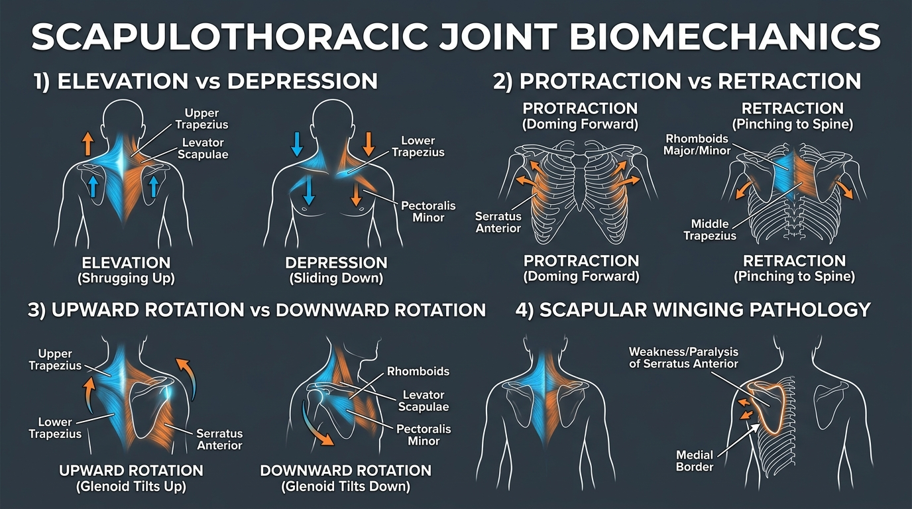

# Day 8: Scapulothoracic Joint & Scapular Movements

- **Estimated Study Time:** 25 minutes
- **Anatomical Focus:** The Scapulothoracic physiological articulation, 6 cardinal scapular movement vectors, muscle contributors, and Scapular Winging pathology.
- **Key Movement Application:** Mastering scapular protraction in planches/push-ups, active depression in dips/L-sits, and upward rotation in **Adho Mukha Svanasana** and handstands.

---

## 🎯 Daily Learning Objectives
*   Understand the unique anatomy of the **Scapulothoracic Articulation** as a physiological (non-bony) gliding joint.
*   Master all 6 cardinal scapular movements: **Elevation**, **Depression**, **Protraction**, **Retraction**, **Upward Rotation**, and **Downward Rotation**.
*   Map the exact muscle force vectors driving each scapular action (**Serratus Anterior**, **Trapezius divisions**, **Rhomboids**, **Levator Scapulae**, and **Pectoralis Minor**).
*   Diagnose **Medial Scapular Winging** (Long Thoracic Nerve / Serratus Anterior deficiency) vs. **Lateral Scapular Winging**.

---

## 📖 Core Anatomical Concept

### 🪶 1. The Scapulothoracic Articulation: A Physiological Joint

The **Scapulothoracic Joint** is not a true synovial joint because it lacks cartilage, a joint capsule, and synovial fluid. Instead, it is a **physiological gliding interface** where the concave anterior surface of the **Scapula** (lined by the **Subscapularis** muscle) glides smoothly over the convex posterolateral **Thoracic Cage** (separated by the **Serratus Anterior** muscle and intermediate bursa-like loose areolar connective tissue planes).

> [!NOTE]
> The scapula serves as the mobile anchor foundation for the entire upper limb. If the scapula cannot stabilize against the rib cage or rotate freely, all shoulder and arm mechanics break down!

---

### 🧭 2. Master Matrix: The 6 Scapular Movements & Prime Movers

| Scapular Movement | Visual Description | Prime Mover (Agonist) | Synergists & Secondary Movers | Biomechanical Purpose |
| :--- | :--- | :--- | :--- | :--- |
| **1. Elevation** | Shrugging the shoulder blades straight upward toward the ears. | **Upper Trapezius** | **Levator Scapulae**, Rhomboids | Overhead lockout in handstands; carrying heavy loads at sides. |
| **2. Depression** | Driving the shoulder blades downward away from the ears. | **Lower Trapezius** | **Pectoralis Minor**, Subclavius, Latissimus Dorsi | Locks shoulder girdle down in **Parallel Bar Dips**, **L-sits**, and active hanging. |
| **3. Protraction** | Spreading the shoulder blades apart; doming the upper back forward around the ribs. | **Serratus Anterior** | **Pectoralis Minor**, Pectoralis Major | Prevents scapular winging; creates rigid horizontal push platform (**Planche**, **Push-up top**, **Kakasana**). |
| **4. Retraction** | Squeezing the shoulder blades medially together toward the spine. | **Middle Trapezius** | **Rhomboid Major**, **Rhomboid Minor**, Upper Trapezius | Stabilizes chest setup in **Barbell Bench Press** and rowing movements; broadens collarbones in **Bhujangasana**. |
| **5. Upward Rotation** | Turning the inferior angle of the scapula outward/upward so the **glenoid cavity points toward the ceiling** ($60^\circ$). | **Serratus Anterior** + **Upper Trapezius** | **Lower Trapezius** *(Force Couple)* | **Essential for overhead reach:** Clears subacromial space to prevent rotator cuff pinching in **Adho Mukha Svanasana** and presses. |
| **6. Downward Rotation** | Returning the scapula so the **glenoid cavity points downward/inward**. | **Rhomboid Major/Minor** | **Levator Scapulae**, **Pectoralis Minor** | Heavy vertical pulling mechanics (concentric phase of a Pull-up/Chin-up). |

---

### ⚠️ 3. Clinical Pathology: Scapular Winging

When the neuromuscular integrity of scapular stabilizers is compromised, the shoulder blade visibly lifts away from the posterior rib cage:

| Pathology Type | Nerve Involved | Damaged Muscle | Clinical Presentation & Movement Deficit |
| :--- | :--- | :--- | :--- |
| **Medial Scapular Winging** *(Most Common)* | **Long Thoracic Nerve** *(C5, C6, C7)* | **Serratus Anterior** | The **medial border** and inferior angle of the scapula pop dramatically backward off the ribs during a wall push-up. The athlete cannot protract the shoulder. |
| **Lateral Scapular Winging** | **Spinal Accessory Nerve** *(CN XI)* | **Trapezius** *(Upper / Middle / Lower)* | The entire scapula drifts lateral and downward; the superior angle lifts away, causing inability to shrug or upwardly rotate the shoulder. |

---

## 🎨 Visual Diagram

Here is a 3D medical visual infographic illustrating all 6 degrees of scapular movement and the clinical presentation of scapular winging:

---

## 🔄 Movement Application (Calisthenics & Yoga)

### 🤸 1. Calisthenics: Active Hanging & The Scapular Pull-up
*   **The Trap (Passive Hanging):** Hanging limp from a pull-up bar with relaxed muscles allows the body's entire weight to pull the scapulae into passive elevation and upward rotation, stretching the glenohumeral capsule and pinching the **supraspinatus tendon**.
*   **The Correction (Scapular Pull-up):** Without bending the elbows, actively pull the shoulder blades down (**scapular depression via Lower Trapezius**) and squeeze them together (**retraction via Rhomboids**). This engages the active muscular sling, centering the shoulder joint safely.

---

### 🧘 2. Yoga: Scapular Doming in Crow Pose & Downward Dog

#### Kakasana (Crow Pose): Serratus Protraction to Relieve Wrist Pressure
*   **The Biomechanics:** Beginners often collapse their chest down between their upper arms in **Kakasana (Crow Pose)**, sinking into retracted shoulder blades. This transfers 100% of body weight into compressive bone-on-bone wrist extension.
*   **The Fix:** Actively **protract the scapulae** (dome the upper back like an angry cat using the **Serratus Anterior**). This suspends the torso inside the muscular sling of the shoulder girdle, dramatically unloading the wrist joints.

---

## 🔬 Biomechanics Lab: Desk-side Drill

Perform these 2 tactile drills to master independent scapular control:

### Drill 1: The Wall Protraction Punch (Serratus Activation)
1.  Stand arm's length from a wall, placing both palms flat on the wall at shoulder height. Keep elbows locked completely straight ($180^\circ$).
2.  Without bending your elbows, let your chest sink forward toward the wall (feel your shoulder blades pinch together in **Retraction**).
3.  Now, push the wall away from you as hard as possible, rounding your upper back (feel your shoulder blades slide forward and spread wide in **Protraction**).
4.  Hold this fully protracted position for 5 seconds. Feel the **Serratus Anterior** wrap around the sides of your ribs!

### Drill 2: The Scapular Depression Reach (Lower Trap Activation)
1.  Sit upright. Extend your arms straight down at your sides with palms facing your thighs.
2.  Without bending your elbows, reach your fingertips toward the floor, driving your shoulder blades down as far as they will go (**Scapular Depression**).
3.  Place your opposite hand on your mid-back just below the shoulder blade. Feel the **Lower Trapezius** fire into a hard muscular knot!

---

## 🧠 Daily Knowledge Check

Test your understanding of scapulothoracic kinematics:

### Questions
1.  **Joint Classification:** Why is the Scapulothoracic articulation termed a "physiological joint" rather than a true anatomical joint?
2.  **Force Vector Analysis:** What two muscles are the primary drivers of **Scapular Depression**, and which one attaches to the anterior chest wall?
3.  **Clinical Pathology:** If a patient's medial scapular border lifts prominently off the ribs during a push-up, which specific nerve and muscle are damaged?
4.  **Movement Application:** In the top locked-out position of a gymnastic **Planche** or standard **Push-up**, what is the required scapular position?
5.  **Yoga Alignment:** When holding **Adho Mukha Svanasana (Downward-Facing Dog)**, why is **Scapular Upward Rotation** vital for shoulder longevity?

---

🔑 Click to reveal answers and explanations

### Answers & Explanations

1.  **Answer:** It lacks standard joint structures: it has **no articular cartilage**, **no fibrous joint capsule**, and **no synovial fluid cavity**. It is a muscular-fascial gliding interface between the subscapularis/scapula and the serratus anterior/rib cage.
2.  **Answer:** The **Lower Trapezius** (posterior pull down toward lower spine) and the **Pectoralis Minor** (anterior pull down toward ribs 3–5).
3.  **Answer:** The **Long Thoracic Nerve** is damaged, resulting in paralysis/weakness of the **Serratus Anterior** muscle (causing **Medial Scapular Winging**).
4.  **Answer:** **Scapular Protraction** (plus depression), locking the scapula tightly against the rib cage via maximal Serratus Anterior contraction.
5.  **Answer:** Upward rotation turns the glenoid cavity upward ($60^\circ$) and swings the acromion process away from the humeral head, **opening the subacromial space** and preventing the supraspinatus tendon and subacromial bursa from being crushed during overhead flexion.

---

## 🔗 Connected Guides & References
*   **[Master Muscle Directory](../../muscles/README.md)**
*   **[Skeletal Reference: Pectoral Girdle & Upper Limb](../../bones/regions/03_pectoral_upper_limb.md)**
*   **[Master Skeletomuscular Map](../../muscles/guides/skeletomuscular_map.md)**
*   **[Master Pose Corrections Directory](../../pose_corrections/README.md)**
*   **[Day 9: Glenohumeral Joint & The Rotator Cuff](../day-009-shoulder-rotator-cuff/README.md)**
