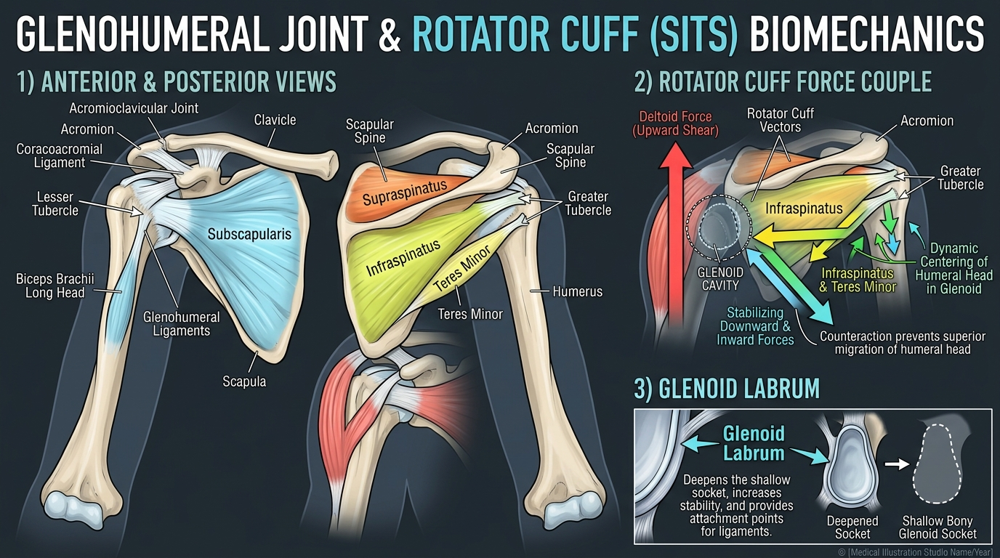

# Day 9: Glenohumeral Joint & The Rotator Cuff

- **Estimated Study Time:** 25 minutes
- **Anatomical Focus:** Glenohumeral joint morphology, Glenoid Labrum, the 4 Rotator Cuff muscles (**SITS**), and the Deltoid–Rotator Cuff Dynamic Force Couple.
- **Key Movement Application:** Centering the humeral head to prevent impingement in overhead pressing, eliminating rotator cuff strain during dips and bench press, and mastering shoulder external rotation in **Adho Mukha Svanasana**.

---

## 🎯 Daily Learning Objectives
*   Describe the structural trade-off of the **Glenohumeral Joint** (maximum triaxial mobility vs. minimal bony stability).
*   Master the origin, insertion, innervation, and action of all 4 **Rotator Cuff Muscles (SITS)**.
*   Analyze the **Deltoid–Rotator Cuff Force Couple** that dynamically centers the humeral head inside the glenoid cavity.
*   Apply the coaching cue *"screw your palms into the floor / break the bar"* to activate the posterior rotator cuff (**Infraspinatus & Teres Minor**) during pushing and pulling.

---

## 📖 Core Anatomical Concept

### 🏌️ 1. Glenohumeral Joint Architecture & The Glenoid Labrum

The **Glenohumeral (GH) Joint** is a multiaxial synovial ball-and-socket joint:
*   **The Golf Ball on a Tee Analogy:** The spherical head of the **Humerus** is large, while the pear-shaped **Glenoid Cavity** of the scapula is exceptionally shallow, covering only $\frac{1}{3}$ to $\frac{1}{4}$ of the humeral head surface area at any moment.
*   **The Glenoid Labrum:** A dense, fibrocartilaginous lip attached to the rim of the glenoid fossa that **deepens the socket by $\sim 50\%$**, providing suction-seal stability and an anchor for the **Long Head of the Biceps Tendon**.

---

### 🛡️ 2. Master Matrix: The 4 Rotator Cuff Muscles (SITS)

The primary function of the rotator cuff is not moving heavy loads, but acting as a **dynamic ligamentous cuff** that holds the humeral head firmly seated in the socket during limb movement:

| Muscle (SITS) | Scapular Origin | Humeral Insertion | Primary Joint Action | Dynamic Stabilizing Vector |
| :--- | :--- | :--- | :--- | :--- |
| **1. Supraspinatus**<br>*(Top / Superior)* | **Supraspinous Fossa** of scapula | **Greater Tubercle** of humerus *(Superior facet)* | Initiates **Shoulder Abduction** (first $0^\circ–15^\circ$); assists Deltoid. | Pulls humeral head **medially into the socket**, preventing inferior slippage when carrying heavy weights. |
| **2. Infraspinatus**<br>*(Posterior / Middle)* | **Infraspinous Fossa** of scapula | **Greater Tubercle** of humerus *(Middle facet)* | **External (Lateral) Rotation** of the humerus. | Pulls humeral head **downward & backward**, counteracting anterior subluxation during pushing. |
| **3. Teres Minor**<br>*(Posterior / Inferior)* | Upper $\frac{2}{3}$ of **Lateral Scapular Border** | **Greater Tubercle** of humerus *(Inferior facet)* | **External (Lateral) Rotation** & weak adduction. | Works synergistically with Infraspinatus to provide **inferior depression** of the humeral head. |
| **4. Subscapularis**<br>*(Anterior / Front)* | **Subscapular Fossa** on anterior ribs | **Lesser Tubercle** of humerus *(Sole anterior cuff muscle)* | **Internal (Medial) Rotation** of the humerus. | **Most powerful cuff muscle:** Pulls humeral head **downward & backward**, preventing anterior dislocation. |

---

### ⚙️ 3. The Deltoid–Rotator Cuff Dynamic Force Couple

When you raise your arm overhead (abduction or flexion), the massive **Deltoid** muscle contracts with a powerful **upward vertical force vector**:

```
           ▲ DELTOID UPWARD SHEAR FORCE
           │ (Would jam humeral head into acromion bone!)
           │
     ┌─────┴─────┐
     │  HUMERAL  │
     │   HEAD    │
     └─────┬─────┘
           │
           ▼ ROTATOR CUFF DEPRESSION VECTORS (Infraspinatus, Teres Minor, Subscapularis)
             (Pulls humeral head downward & inward to maintain 1-2mm central alignment)
```

1.  If the Deltoid fired alone, it would pull the humeral head **superiorly (upward shear)**, smashing the delicate **Supraspinatus tendon** and **Subacromial Bursa** against the hard underside of the acromion roof.
2.  To prevent this, the **Infraspinatus, Teres Minor, and Subscapularis** fire simultaneously with an **inferior/medial force vector**, pulling the humeral head downward into the center of the glenoid fossa.
3.  This dynamic force couple creates a clean rotational pivot with zero superior translation, protecting the subacromial space.

---

## 🎨 Visual Diagram

Here is a 3D medical visual atlas illustrating anterior and posterior rotator cuff anatomy, the glenoid labrum, and the Deltoid–Rotator Cuff force couple:



---

## 🔄 Movement Application (Calisthenics & Yoga)

### 🤸 1. Calisthenics: "Break the Bar" External Rotation Torque
*   **The Problem:** During heavy Push-ups, Barbell Bench Press, or Parallel Bar Dips, the elbows often flare out into **passive internal rotation**.
*   **The Biomechanical Consequence:** Internal rotation rolls the greater tubercle forward and anteriorly shifts the humeral head, placing severe tensile shear on the **Supraspinatus** and **Biceps Long Head tendon**.
*   **The Fix ("Break the Bar"):** Cue the athlete to externally rotate their shoulders (imagine bending the barbell in half or screwing palms into the floor clockwise with the right hand, counter-clockwise with the left). This pre-activates the **Infraspinatus and Teres Minor**, centering the humeral head securely in the socket before load is applied.

---

### 🧘 2. Yoga: External Rotation in Downward Dog & Handstands

#### Adho Mukha Svanasana (Wrapping the Armpits)
*   **The Cue:** *"Roll your outer armpits toward your face / wrap shoulders outward."*
*   **The Biomechanics:** This cue actively contracts the **Infraspinatus and Teres Minor** to externally rotate the humerus. This swings the **greater tubercle posteriorly away from the acromion process**, dramatically widening the subacromial space and allowing the shoulder to flex into full overhead elevation without pinching tendons.

---

## 🔬 Biomechanics Lab: Desk-side Drill

Feel your rotator cuff dynamically center your shoulder joint right now:

### Drill 1: The Supraspinatus $0–15^\circ$ Abduction Isolation
1.  Stand upright with arms at your sides. Place your left fingers in the hollow groove above your right shoulder blade (**Supraspinous Fossa**).
2.  Slowly lift your right arm outward just $10–15^\circ$ from your hip.
3.  *Notice:* You will feel the **Supraspinatus** instantly swell and harden under your fingertips. It initiates the very first $15^\circ$ of abduction before the Deltoid takes over!

### Drill 2: The Doorframe External Rotation Test (Infraspinatus Firing)
1.  Stand in a doorway. Bend your right elbow to $90^\circ$ and tuck it against your ribs.
2.  Press the back of your right wrist outward against the doorframe (**isometric external rotation**).
3.  Place your left hand on the muscle belly below your right shoulder blade spine. Feel the **Infraspinatus** fire rock-hard!

---

## 🧠 Daily Knowledge Check

Test your mastery of glenohumeral stability and rotator cuff mechanics:

### Questions
1.  **Muscle Insertion:** Which single Rotator Cuff muscle inserts into the **Lesser Tubercle** of the humerus, and what is its primary rotational action?
2.  **Abduction Initiator:** An athlete can comfortably raise their arm from $30^\circ$ to $180^\circ$ overhead, but experiences sharp pain and weakness during the very first $0^\circ–15^\circ$ of lifting. Which specific rotator cuff muscle is injured?
3.  **Force Couple Mechanics:** What would happen to the humeral head during overhead pressing if the **Deltoid** contracted without the counterbalancing downward pull of the **Infraspinatus, Teres Minor, and Subscapularis**?
4.  **Anatomical Structure:** What is the **Glenoid Labrum**, and how does it prevent joint dislocation?
5.  **Coaching Translation:** In calisthenics, why does the cue *"screw your palms into the ground"* protect the shoulder joint during push-ups?

---

<details>
<summary>🔑 Click to reveal answers and explanations</summary>

### Answers & Explanations

1.  **Answer:** The **Subscapularis** inserts into the **Lesser Tubercle** on the anterior humerus and acts as the primary **Internal (Medial) Rotator**. (The other three SITS muscles insert onto the Greater Tubercle).
2.  **Answer:** The **Supraspinatus** is injured (the prime initiator of abduction for the first $0^\circ–15^\circ$).
3.  **Answer:** The Deltoid's vertical line of pull would create uncontrolled **superior shear**, driving the humeral head directly upward into the acromion roof and crushing the supraspinatus tendon and subacromial bursa.
4.  **Answer:** The Glenoid Labrum is a **fibrocartilaginous ring** that deepens the shallow glenoid socket by $\sim 50\%$, providing a suction-seal effect that stabilizes the humeral head against translation.
5.  **Answer:** Screwing the palms into the floor creates **humeral external rotation**, pre-activating the posterior rotator cuff (**Infraspinatus & Teres Minor**) to pull the humeral head downward and backward, keeping it centered and preventing anterior capsular pinching.

</details>

---

## 🔗 Connected Guides & References
*   **[Master Muscle Directory](../../muscles/README.md)**
*   **[Skeletal Reference: Pectoral Girdle & Upper Limb](../../bones/regions/03_pectoral_upper_limb.md)**
*   **[Master Skeletomuscular Map](../../muscles/guides/skeletomuscular_map.md)**
*   **[Master Pose Corrections Directory](../../pose_corrections/README.md)**
*   **[Day 10: Scapulohumeral Rhythm & Shoulder Impingement](../day-010-shoulder-impingement/README.md)**
