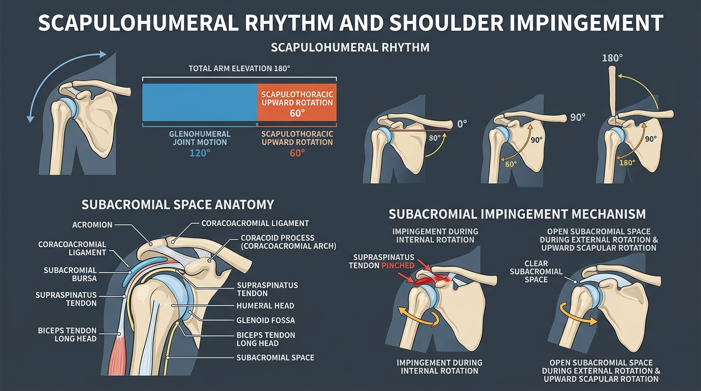

# Day 10: Scapulohumeral Rhythm & Shoulder Impingement

- **Estimated Study Time:** 25 minutes
- **Anatomical Focus:** The 2:1 Scapulohumeral Rhythm, Subacromial Space anatomy, Subacromial Impingement Syndrome (SIS), and Clavicular Kinematics.
- **Key Movement Application:** Safe overhead lockout in handstands and barbell overhead presses, preventing rotator cuff impingement in pull-ups, and optimizing shoulder elevation in **Adho Mukha Svanasana** and **Salamba Shirshasana**.

---

## 🎯 Daily Learning Objectives
*   Master the **2:1 Scapulohumeral Rhythm** and trace the exact breakdown of $180^\circ$ full arm elevation ($120^\circ$ Glenohumeral $+ 60^\circ$ Scapulothoracic).
*   Map the anatomical boundaries and contents of the **Subacromial Space** ($9–10\,\text{mm}$ normal clearance).
*   Understand the clinical etiology of **Subacromial Impingement Syndrome (SIS)** and the classic **Painful Arc ($60^\circ–120^\circ$)**.
*   Apply scapular upward rotation and humeral external rotation to safely bypass the acromion roof during overhead loads.

---

## 📖 Core Anatomical Concept

### 📐 1. The 2:1 Scapulohumeral Rhythm (Inman, Saunders, & Abbott)

Reaching fully overhead ($180^\circ$ abduction or flexion) is not performed by the shoulder joint alone. It requires synchronized, harmonious movement between the **Glenohumeral (GH) Joint** and the **Scapulothoracic (ST) Articulation**:

```
TOTAL OVERHEAD ELEVATION (180°)
  ├── 120° Glenohumeral Joint Motion (Humeral Elevation)
  └── 60° Scapulothoracic Joint Motion (Upward Scapular Rotation)
      └── 2:1 Overall Kinematic Ratio
```

| Phase of Elevation | Range of Motion | Glenohumeral (GH) Contribution | Scapulothoracic (ST) Contribution | Clavicular Kinematics |
| :--- | :---: | :---: | :---: | :--- |
| **1. Setting Phase** | $0^\circ – 30^\circ$ | **$30^\circ$** *(Dominant initial movement)* | Minimal / Inconsistent ($0^\circ–5^\circ$) | Clavicle stable at Sternoclavicular (SC) joint. |
| **2. Intermediate Phase** | $30^\circ – 90^\circ$ | **$40^\circ$** *(2 parts)* | **$20^\circ$** *(1 part)* | Clavicle elevates $\sim 15^\circ$ at the SC joint. |
| **3. Terminal Phase** | $90^\circ – 180^\circ$ | **$50^\circ$** *(2 parts)* | **$35^\circ$** *(1 part)* | **Crucial Event:** Clavicle rotates posteriorly $30^\circ–45^\circ$ along its longitudinal axis via tension in the conoid ligament. |

> [!IMPORTANT]
> **The 3 Primary Purposes of Scapulohumeral Rhythm:**
> 1.  **Distributes Range of Motion:** Prevents excessive strain on a single joint capsule.
> 2.  **Preserves Length-Tension Relationships:** Keeps the middle deltoid at an optimal sarcomere length throughout the lift.
> 3.  **Prevents Subacromial Impingement:** Rotates the acromion roof upward and away from the rising humerus, keeping the subacromial space wide open.

---

### 🏛️ 2. The Subacromial Space & Structures at Risk

The **Subacromial Space** is a narrow physiological corridor ($9–10\,\text{mm}$ in healthy adults) situated underneath the shoulder roof:
*   **Roof:** The **Acromion Process**, the **Coracoid Process**, and the connecting **Coracoacromial Ligament** (forming the rigid **Coracoacromial Arch**).
*   **Floor:** The spherical **Head of the Humerus**.
*   **Vulnerable Contents Packed in Between:**
    1.  **Supraspinatus Tendon**
    2.  **Subacromial-Subdeltoid Bursa** (friction-reducing fluid cushion)
    3.  **Long Head of the Biceps Brachii Tendon**
    4.  **Superior Glenohumeral Joint Capsule**

---

### ⚠️ 3. Subacromial Impingement Syndrome (SIS)

When the subacromial space narrows below **$6\,\text{mm}$**, the soft-tissue contents are mechanically crushed between the greater tubercle and the acromion:

| Classification | Underlying Cause | Biomechanical Deficit | Movement Manifestation |
| :--- | :--- | :--- | :--- |
| **Primary Impingement** *(Structural)* | Anatomical bone abnormalities (Hooked Type III Acromion, subacromial bone spurs, AC joint arthritis). | Fixed reduction in subacromial space height. | Pain occurs consistently during overhead reaching regardless of form. |
| **Secondary Impingement** *(Functional / Preventable)* | **1. Scapular Dyskinesis:** Weak **Serratus Anterior / Lower Trap** $\rightarrow$ failure of upward scapular rotation.<br>**2. Rotator Cuff Fatigue:** Weak **Infraspinatus / Subscapularis** $\rightarrow$ uncontrolled superior humeral head migration. | Humeral head shifts upward into acromion during Deltoid contraction. | **The Classic "Painful Arc":** Severe sharp pinch between **$60^\circ$ and $120^\circ$** of arm abduction (where the greater tubercle is closest to the acromion). |

---

## 🎨 Visual Diagram

Here is a 3D medical visual atlas detailing the 2:1 Scapulohumeral Rhythm across all elevation phases, the subacromial space anatomy, and the impingement pinch mechanism:



---

## 🔄 Movement Application (Calisthenics & Yoga)

### 🤸 1. Calisthenics: The Handstand Overhead Lockout
*   **The Error:** Many athletes try to achieve a $180^\circ$ handstand line with **depressed shoulder blades**, believing "packing the shoulders down" is always good.
*   **The Biomechanical Catastrophe:** Suppressing scapular elevation and upward rotation blocks the 2:1 rhythm. The humerus hits the static acromion roof at $120^\circ$, jamming the **Supraspinatus tendon** and forcing the athlete to dangerously arch their lower back (banana handstand) to compensate.
*   **The Fix:** In overhead handstands, actively **elevate and upwardly rotate the scapulae** (*"push the floor away and shrug up into your ears"*). This fully clears the acromion, locking the shoulder safely in 180° alignment.

---

### 🧘 2. Yoga: Bypassing Impingement via External Rotation

#### Adho Mukha Svanasana & Urdhva Hastasana
*   **Internal Rotation Danger:** Reaching overhead with the palms turned down/inward swings the **Greater Tubercle** directly into the anterior acromion, pinching the subacromial bursa at $90^\circ$.
*   **The External Rotation Solution:** Turning the palms facing inward or supinated (*"wrapping outer armpits forward"*) rotates the greater tubercle **posteriorly**. The humerus glides smoothly under the acromial arch with zero friction!

---

## 🔬 Biomechanics Lab: Desk-side Drill

Experience the Painful Arc and the impingement bypass right now:

### Drill 1: The Neer Impingement Bypass Test
1.  **Internal Rotation Elevation (Pinching Mode):** Turn your right arm so your thumb points straight down toward the floor (maximal internal rotation). Slowly raise your arm out to the side toward the ceiling.
2.  *Notice:* Around $90^\circ–110^\circ$, you will feel an abrupt, uncomfortable bony block or pinching tightness at the top of your shoulder.
3.  **External Rotation Elevation (Clearance Mode):** Lower your arm. Now, turn your thumb to point straight up toward the ceiling (external rotation). Raise your arm out to the side again.
4.  *Notice:* The bony block completely disappears! Your arm effortlessly glides all the way to $180^\circ$ overhead because the greater tubercle swung backward, opening the subacromial space!

---

## 🧠 Daily Knowledge Check

Test your mastery of scapulohumeral kinematics and impingement prevention:

### Questions
1.  **Kinematic Ratio:** When an athlete abducts their arm fully to $180^\circ$ overhead, exactly how many degrees of motion occur at the **Glenohumeral Joint**, and how many degrees occur at the **Scapulothoracic Articulation**?
2.  **Subacromial Anatomy:** Name the three soft-tissue structures located inside the subacromial space that are vulnerable to compression during impingement.
3.  **Clinical Diagnosis:** What is the **Painful Arc**, in what range of degrees does it typically occur, and why does the pain subside after passing $120^\circ$?
4.  **Clavicular Motion:** In the terminal phase of overhead elevation ($90^\circ–180^\circ$), what critical kinematic movement must the **Clavicle** perform to allow full upward rotation of the scapula?
5.  **Calisthenics Form Correction:** Why is actively shrugging/elevating the shoulders at the top of a **Handstand** anatomically safer than trying to keep the shoulder blades depressed?

---

<details>
<summary>🔑 Click to reveal answers and explanations</summary>

### Answers & Explanations

1.  **Answer:** **$120^\circ$** of motion occurs at the **Glenohumeral Joint**, and **$60^\circ$** of motion occurs via **Scapulothoracic Upward Rotation** (the classic 2:1 ratio).
2.  **Answer:** 
    1.  The **Supraspinatus Tendon**
    2.  The **Subacromial-Subdeltoid Bursa**
    3.  The **Long Head of the Biceps Brachii Tendon**
3.  **Answer:** The **Painful Arc** occurs between **$60^\circ$ and $120^\circ$** of abduction, where the greater tubercle is positioned closest beneath the acromial arch, compressing the inflamed supraspinatus tendon. Above $120^\circ$, the greater tubercle clears the acromion and enters the open subacromial fossa, relieving direct compression and pain.
4.  **Answer:** The Clavicle must rotate **posteriorly by $30^\circ–45^\circ$** around its long axis, driven by tension in the conoid ligament of the coracoclavicular complex.
5.  **Answer:** Full overhead handstand alignment ($180^\circ$) requires $60^\circ$ of scapular upward rotation and elevation. Forcing depression mechanically blocks the scapula, causing the humeral head to smash into the stationary acromion at $120^\circ$, resulting in acute subacromial impingement and forcing dangerous lumbar spine compensation.

</details>

---

## 🔗 Connected Guides & References
*   **[Master Muscle Directory](../../muscles/README.md)**
*   **[Skeletal Reference: Pectoral Girdle & Upper Limb](../../bones/regions/03_pectoral_upper_limb.md)**
*   **[Master Skeletomuscular Map](../../muscles/guides/skeletomuscular_map.md)**
*   **[Master Pose Corrections Directory](../../pose_corrections/README.md)**
*   **[Day 9: Glenohumeral Joint & The Rotator Cuff](../day-009-shoulder-rotator-cuff/README.md)**
