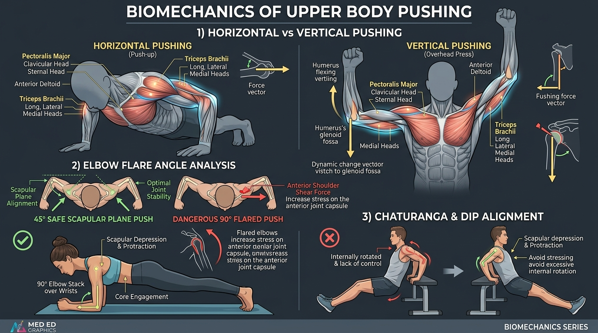

# Day 11: Biomechanics of Upper Body Pushing

- **Estimated Study Time:** 25 minutes
- **Anatomical Focus:** Horizontal vs. Vertical Pushing mechanics, Pectoralis Major (Clavicular vs. Sternocostal heads), Triceps Brachii three-head architecture, Serratus Anterior protraction, and Elbow Flare Angle kinematics ($45^\circ$ Scapular Plane vs. $90^\circ$ Flared).
- **Key Movement Application:** Mastering the Push-up spectrum (Standard, Diamond, Pseudo-Planche), preventing anterior shoulder shear in Parallel Bar Dips, and optimizing alignment in **Chaturanga Dandasana** and **Urdhva Dhanurasana (Wheel Pose)**.

---

## 🎯 Daily Learning Objectives
*   Differentiate between **Horizontal Pushing** (transverse/sagittal plane) and **Vertical Pushing** (frontal/sagittal plane) joint vectors.
*   Map the anatomical origins, insertions, and lines of pull for the **Clavicular** and **Sternocostal heads of Pectoralis Major**.
*   Analyze the functional differences between the **Long**, **Lateral**, and **Medial heads of Triceps Brachii**.
*   Explain why the **$45^\circ–60^\circ$ Scapular Plane elbow angle** protects the anterior glenohumeral capsule while maximizing pectoral recruitment.

---

## 📖 Core Anatomical Concept

### 🏋️ 1. Pushing Vectors: Horizontal vs. Vertical

Upper body pushing involves two synchronized primary joint actions: **Shoulder Flexion / Horizontal Adduction** paired with **Elbow Extension**:

| Kinetic Vector | Primary Joint Actions | Prime Movers (Agonists) | Key Synergists & Stabilizers | Movement Examples |
| :--- | :--- | :--- | :--- | :--- |
| **1. Horizontal Pushing** | • Shoulder Horizontal Adduction • Elbow Extension • Scapular Protraction | • **Pectoralis Major** *(Sternocostal & Clavicular)* • **Anterior Deltoid** | • **Triceps Brachii** *(Medial/Lateral)* • **Serratus Anterior** *(Protraction)* • **Core Cylinder** *(Anti-Extension)* | • Push-ups (Standard / Pseudo-Planche) • Barbell Bench Press • **Chaturanga Dandasana** |
| **2. Vertical Pushing (Overhead)** | • Shoulder Flexion & Abduction • Elbow Extension • Scapular Upward Rotation & Elevation | • **Anterior & Middle Deltoid** • **Pectoralis Major** *(Clavicular head)* | • **Triceps Brachii** *(All 3 heads)* • **Upper / Lower Trapezius** • **Serratus Anterior** | • Overhead Barbell Press • Handstand Push-up • **Urdhva Dhanurasana** *(Wheel)* |
| **3. Vertical Pushing (Downward / Dip)** | • Shoulder Extension (from flexion) • Elbow Extension • Scapular Depression | • **Lower Pectoralis Major** • **Triceps Brachii** *(Long/Lateral)* | • **Lower Trapezius** *(Depression)* • **Pectoralis Minor** • **Rotator Cuff** *(Centering)* | • Parallel Bar Dips • Ring Dips • Straight-Bar Dip |

---

### 🥩 2. Functional Anatomy of Pushing Muscles

#### A. Pectoralis Major: Dual-Head Architecture
*   **Clavicular Head (Upper Pec):** Originates on the medial half of the clavicle $\rightarrow$ Inserts on the lateral lip of the bicipital groove. **Primary Vector:** Shoulder **Flexion** and horizontal adduction (activated maximally in incline pressing and pseudo-planche push-ups).
*   **Sternocostal Head (Lower/Mid Pec):** Originates on the sternum and costal cartilages 1–6 $\rightarrow$ Inserts on the bicipital groove. **Primary Vector:** True **Horizontal Adduction** and extension of the flexed arm (activated maximally in flat push-ups, dips, and decline presses).

#### B. Triceps Brachii: The Three-Headed Extensor
*   **1. Medial Head (The Deep Workhorse):** Originates deep on the posterior humeral shaft; active across **all** elbow extension loads and angles (even low-intensity daily tasks).
*   **2. Lateral Head (Fast-Twitch Power):** Originates on the upper-lateral posterior humerus; recruited during heavy, explosive extension loads (e.g., top lockout of a heavy push-up or dip).
*   **3. Long Head (The Biarticular Stabilizer):** The **only head that crosses the shoulder joint**, originating on the **Infraglenoid Tubercle** of the scapula. It acts as both an elbow extensor and a shoulder extensor/adductor, requiring full shoulder flexion to be placed on maximal stretch.

---

### 📐 3. The Elbow Flare Dilemma: $45^\circ$ Scapular Plane vs. $90^\circ$ Flared

| Kinematic Factor | Flared Elbows ($90^\circ$ Abduction) ❌ | Tucked in Scapular Plane ($45^\circ–60^\circ$) ✅ |
| :--- | :--- | :--- |
| **Joint Alignment** | Arm is perpendicular to the torso in the pure frontal plane. | Arm aligns directly with the **scapular plane ($30^\circ–45^\circ$ forward)**. |
| **Humeral Head Vector** | Deltoid drives the humeral head **anteriorly and superiorly**, shearing against the thin anterior capsule. | Pectorals, Lats, and Rotator Cuff pull the humeral head **firmly into the center of the glenoid socket**. |
| **Subacromial Space** | Internal rotation narrows the subacromial corridor; crushes the **Supraspinatus tendon**. | Rotator cuff clearance remains wide open; zero impingement. |
| **Torque Generation** | Cannot generate active external rotation torque. | Enables the athlete to actively *"screw the hands into the ground"*, locking joint stability. |

---

## 🎨 Visual Diagram

Here is a 3D medical visual atlas detailing pushing mechanics, the $45^\circ$ vs. $90^\circ$ elbow flare analysis, and joint stacking in Chaturanga and Dips:

---

## 🔄 Movement Application (Calisthenics & Yoga)

### 🤸 1. Calisthenics: Push-up Progressions & Dip Biomechanics

#### Pseudo-Planche Push-up (PPU) vs. Diamond Push-up
*   **Diamond Push-up:** Bringing the hands together narrows the base of support, increasing the moment arm on the elbow and shifting the primary load to the **Triceps Brachii** and **Clavicular Pectoralis**.
*   **Pseudo-Planche Push-up:** Shifting the shoulders $4–6$ inches in front of the wrists creates an extreme forward lean. This dramatically increases the moment arm at the shoulder joint, converting the movement into a massive test of **Anterior Deltoid**, **Clavicular Pec**, and **Serratus Anterior** protraction strength.

#### The Parallel Bar Dip: Avoiding the 90° Trap
*   **The Risk:** Dropping below $90^\circ$ of elbow flexion while letting the shoulders roll forward into anterior tilt places the entire body's weight onto the **Anterior Capsule** and **Coracoacromial Ligament**.
*   **The Safe Execution:** Maintain active **scapular depression (Lower Trapezius)**, lean the torso forward $15^\circ–30^\circ$ to recruit the sternocostal pectorals, and descend only until the upper arm is parallel to the bars ($90^\circ$).

---

### 🧘 2. Yoga: Chaturanga Dandasana & Urdhva Dhanurasana

#### Chaturanga Dandasana: The 90° Stack
*   **The Error:** Collapsing the chest forward or letting the elbows flare out to the sides.
*   **The Biomechanics:** Shift forward on the toes so the forearms remain **perpendicular ($90^\circ$) to the floor** throughout the descent. Squeeze the elbows gently against the lateral rib cage to engage the **Serratus Anterior** and **Triceps Medial/Lateral heads**, maintaining an unbroken kinetic plank line.

---

## 🔬 Biomechanics Lab: Desk-side Drill

Feel the difference between flared pushing and scapular plane torque right now:

### Drill 1: The Scapular Plane Wall Push
1.  Stand facing a wall with your palms flat at chest height.
2.  Flare your elbows out to $90^\circ$ (perpendicular to your body) and press into the wall. Notice the uncomfortable anterior pinching tightness in the front of your shoulder capsules.
3.  Now, tuck your elbows down to $45^\circ$ and mentally try to *"screw your palms outward into the wall"* (external rotation torque).
4.  Press again. *Notice:* Your chest and triceps immediately feel twice as strong, and your shoulder joints feel solidly packed and pain-free!

---

## 🧠 Daily Knowledge Check

Test your mastery of pushing biomechanics:

### Questions
1.  **Muscle Architecture:** Which head of the Pectoralis Major is primarily recruited during an incline push-up or overhead shoulder press?
2.  **Biarticular Muscle:** Which head of the Triceps Brachii crosses both the shoulder and elbow joints, and where does it originate on the scapula?
3.  **Kinematic Angle:** Why is a $45^\circ–60^\circ$ elbow tuck mechanically safer for the shoulder joint during a push-up than a $90^\circ$ flared elbow angle?
4.  **Movement Error:** In **Chaturanga Dandasana**, what anatomical failure occurs when an athlete's shoulders dip lower than their elbows?
5.  **Stabilizer Function:** What role does the **Serratus Anterior** perform at the top locked-out position of a standard push-up?

---

🔑 Click to reveal answers and explanations

### Answers & Explanations

1.  **Answer:** The **Clavicular Head (Upper Pectoralis Major)**.
2.  **Answer:** The **Long Head of the Triceps Brachii**, which originates on the **Infraglenoid Tubercle** of the scapula.
3.  **Answer:** A $45^\circ–60^\circ$ angle aligns the humerus within the **Scapular Plane**, allowing the rotator cuff to center the humeral head and opening the subacromial space. A $90^\circ$ flare forces the humeral head into anterior/superior shear, stretching the anterior capsule and compressing the supraspinatus tendon.
4.  **Answer:** Dipping below $90^\circ$ with an untucked torso forces the scapulae into uncontrolled **anterior downward tilt**, dumping shearing loads onto the anterior glenohumeral capsule and biceps long head tendon.
5.  **Answer:** It drives **Scapular Protraction** (abduction of the shoulder blades around the rib cage), doming the upper back and locking the scapulothoracic interface against the thorax.

---

## 🔗 Connected Guides & References
*   **[Master Muscle Directory](../../muscles/README.md)**
*   **[Pose Correction: Chaturanga Dandasana](../../pose_corrections/yoga/chaturanga_dandasana.md)**
*   **[Day 10: Scapulohumeral Rhythm & Shoulder Impingement](../day-010-shoulder-impingement/README.md)**
*   **[Day 12: Biomechanics of Upper Body Pulling](../day-012-biomechanics-pulling/README.md)**
