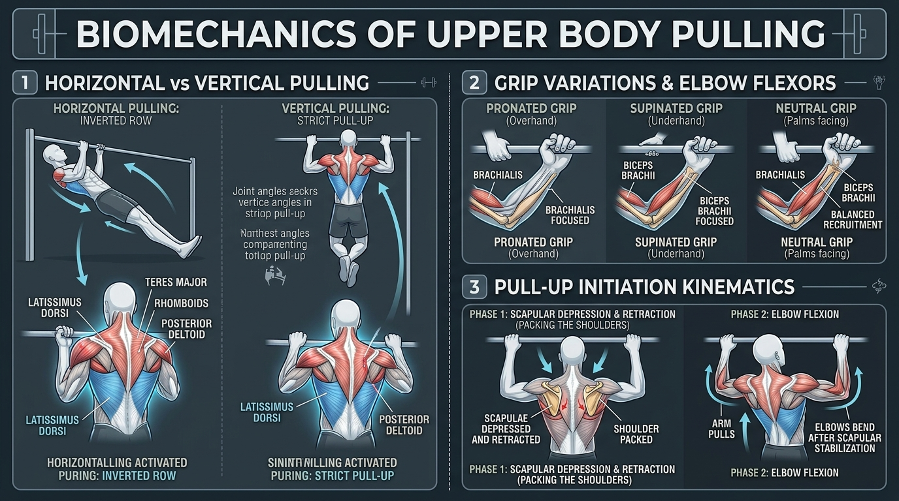

# Day 12: Biomechanics of Upper Body Pulling

- **Estimated Study Time:** 25 minutes
- **Anatomical Focus:** Horizontal vs. Vertical Pulling vectors, Latissimus Dorsi & Teres Major architecture, Scapular Retractor synergies (Rhomboids / Middle Trapezius), and the Forearm Flexor Triad (Biceps Brachii, Brachialis, Brachioradialis) under varying grip orientations.
- **Key Movement Application:** Mastering the strict Pull-up initiation sequence, Front Lever biomechanics, avoiding medial epicondylitis (climber's elbow), and posterior kinetic chain engagement in **Purvottanasana (Upward Plank Pose)**.

---

## 🎯 Daily Learning Objectives
*   Compare the joint kinematics and muscle recruitment profiles of **Horizontal Pulling** (Rows) vs. **Vertical Pulling** (Pull-ups/Chin-ups).
*   Trace the expansive anatomical origins and insertion of the **Latissimus Dorsi** and its mechanical relationship with **Teres Major**.
*   Master the **Forearm Flexor Triad**: understand why a Pronated grip targets the **Brachialis**, a Supinated grip isolates the **Biceps Brachii**, and a Neutral grip maximizes the **Brachioradialis**.
*   Execute the **Two-Phase Pull-up Kinematic Sequence** (Scapular Packing $\rightarrow$ Glenohumeral Adduction/Elbow Flexion) to eliminate shoulder impingement.

---

## 📖 Core Anatomical Concept

### 🧗 1. Pulling Vectors: Horizontal vs. Vertical

Upper body pulling couples **Glenohumeral Extension / Adduction** with **Elbow Flexion** and **Scapular Retraction / Depression**:

| Kinetic Vector | Primary Joint Actions | Prime Movers (Agonists) | Key Synergists & Stabilizers | Movement Examples |
| :--- | :--- | :--- | :--- | :--- |
| **1. Vertical Pulling** | • Shoulder Adduction & Extension<br>• Elbow Flexion<br>• Scapular Depression & Downward Rotation | • **Latissimus Dorsi**<br>• **Teres Major**<br>• **Biceps Brachii / Brachialis** | • **Lower Trapezius** *(Depression)*<br>• **Rhomboid Major/Minor**<br>• **Pectoralis Minor** | • Strict Pull-ups (Pronated)<br>• Chin-ups (Supinated)<br>• Lat Pulldown Machine |
| **2. Horizontal Pulling** | • Shoulder Horizontal Abduction & Extension<br>• Elbow Flexion<br>• Scapular Retraction | • **Rhomboids (Major/Minor)**<br>• **Middle & Lower Trapezius**<br>• **Posterior Deltoid** | • **Latissimus Dorsi**<br>• **Infraspinatus & Teres Minor**<br>• **Brachioradialis** | • Inverted Bodyweight Rows<br>• Barbell Bent-Over Rows<br>• Seated Cable Rows |

---

### 🥩 2. The Master Pullers: Latissimus Dorsi & The Scapular Synergists

#### A. Latissimus Dorsi ("The Broadest Muscle of the Back")
*   **Massive Origin:** Spinous processes of T7–L5, Thoracolumbar Fascia, Posterior Iliac Crest, and lower 3–4 ribs.
*   **Insertion:** Spirals around the humerus to insert into the **Floor of the Intertubercular (Bicipital) Groove**.
*   **Biomechanical Triad of Actions:** Shoulder **Adduction**, **Extension**, and **Internal Rotation**. Because it anchors the pelvis directly to the humerus, it also acts as a powerful spinal stabilizer.

#### B. Teres Major ("Lat's Little Helper")
*   Originates on the inferior angle of the scapula and inserts alongside the Lat on the medial lip of the bicipital groove. It assists in all adduction and internal rotation actions, but only works when the arm is under resistance.

---

### 🦾 3. The Forearm Flexor Triad & Grip Mechanics

The orientation of the forearm (Pronation vs. Supination) dramatically alters the mechanical moment arm of the three elbow flexors:

| Grip Orientation | Primary Muscle Recruited | Biomechanical Explanation | Movement Translation |
| :--- | :--- | :--- | :--- |
| **1. Pronated (Overhand)**<br>*(Palms facing away)* | **Brachialis** *(Deep pure flexor)* | When the forearm is pronated, the **Radius crosses over the Ulna**, mechanically wrapping the Biceps tendon around the radius and disabling its line of pull. The **Brachialis** (which attaches solely to the immovable Ulna) must do $>70\%$ of the elbow flexion work! | **Strict Pull-up:** Builds massive Brachialis thickness and upper arm density. |
| **2. Supinated (Underhand)**<br>*(Palms facing you)* | **Biceps Brachii** *(Long & Short heads)* | In supination, the Radius lies parallel to the Ulna, putting the Biceps Brachii at its **optimal physiological length-tension relationship** and direct line of pull. | **Chin-up:** Highest total force output; allows beginners to achieve their first bodyweight pull. |
| **3. Neutral (Semi-Pronated)**<br>*(Palms facing each other)* | **Brachioradialis** *(Radial forearm muscle)* | In a mid-position, the Brachioradialis has its greatest mechanical moment arm, running from the lateral supracondylar ridge of the humerus to the radial styloid process. | **Neutral Grip Pull-up:** Safest for wrists and elbows; optimal joint longevity. |

---

### ⚙️ 4. Kinematic Sequence of a Strict Pull-up

```
STEP 1: DEAD HANG ────────► STEP 2: SCAPULAR PACKING ────────► STEP 3: CONCENTRIC PULL
(Passive elevation &       (Active depression via Lower       (Lats & Brachialis drive
 upward rotation)           Trapezius + Retraction)            chest to bar)
```

1.  **Phase 1 (Scapular Initiation):** From a dead hang, the athlete **depresses and retracts the shoulder blades** without bending the elbows (*"pack the shoulders down away from the ears"*). This engages the Lower Trapezius and Latissimus Dorsi, securely seating the humeral head before heavy load is placed on the elbow flexors.
2.  **Phase 2 (Ascent):** Drive the elbows down and backward toward the hips, pulling the upper chest directly toward the bar.
3.  **Phase 3 (Eccentric Descent):** Lower down under control ($3–4$ seconds), returning to a fully active hang without crashing into a loose, passive dead hang.

---

## 🎨 Visual Diagram

Here is a 3D medical visual infographic detailing horizontal vs. vertical pulling, the forearm flexor grip triad, and the strict pull-up initiation kinematics:



---

## 🔄 Movement Application (Calisthenics & Yoga)

### 🤸 1. Calisthenics: Front Lever Biomechanics (Straight-Arm Pulling)
*   **The Biomechanics:** The **Front Lever** is a pure test of static horizontal shoulder extension. Holding the body horizontal with straight arms creates an immense gravitational moment arm at the glenohumeral joint.
*   **Muscle Demands:** The **Latissimus Dorsi** and **Teres Major** contract isometrically at peak mechanical leverage, assisted by the **Posterior Deltoid**, **Triceps Long Head**, and **Lower/Middle Trapezius**, while the core maintains rigid posterior pelvic tilt.

---

### 🧘 2. Yoga: Purvottanasana & Active Downward Dog

#### Purvottanasana (Upward Plank Pose): Posterior Chain Retraction
*   **The Action:** Pressing into reverse plank requires maximal contraction of the **Rhomboids**, **Middle Trapezius**, and **Latissimus Dorsi** to retract the scapulae and lift the thoracic spine, opening the anterior chest while the Gluteus Maximus and Hamstrings extend the hips.

---

## 🔬 Biomechanics Lab: Desk-side Drill

Feel the forearm flexor triad shift under your own touch right now:

### Drill 1: The Biceps vs. Brachialis Grip Shift
1.  Bend your right elbow to $90^\circ$ and place your left hand firmly on your right **Biceps muscle belly**.
2.  **Turn palm up (Supination):** Feel the biceps immediately ball up into a hard, high peak!
3.  **Now, turn palm down (Pronation):** Feel the biceps immediately go soft and flatten out, even though your elbow remains at $90^\circ$!
4.  Slide your left fingers 1 inch laterally (to the outer side of your arm between biceps and triceps). Feel that hard, deep muscle knot? That is your **Brachialis**, taking over the entire load because the biceps is mechanically disabled!

---

## 🧠 Daily Knowledge Check

Test your mastery of pulling biomechanics:

### Questions
1.  **Grip Mechanics:** Why does an overhand (pronated) Pull-up recruit significantly more **Brachialis** than a supinated Chin-up?
2.  **Muscle Insertion:** Where does the **Latissimus Dorsi** insert on the humerus, and what three primary shoulder actions does it produce?
3.  **Kinematic Sequence:** Why is it dangerous to pull aggressively with the arms from a completely passive dead hang without initiating with **scapular depression** first?
4.  **Synergist Function:** What is the functional nickname of the **Teres Major**, and where does it originate?
5.  **Movement Translation:** Which upper-back muscles must contract to retract the shoulder blades during an inverted bodyweight row?

---

<details>
<summary>🔑 Click to reveal answers and explanations</summary>

### Answers & Explanations

1.  **Answer:** In pronation, the radius bone rotates and crosses over the ulna, wrapping the Biceps Brachii tendon around the radial tuberosity and mechanically compromising its line of pull. The **Brachialis** inserts directly onto the coronoid process of the immovable ulna, allowing it to generate maximal elbow flexion torque unaffected by forearm rotation.
2.  **Answer:** It inserts onto the **Floor of the Intertubercular (Bicipital) Groove** of the humerus, producing shoulder **Adduction**, **Extension**, and **Internal (Medial) Rotation**.
3.  **Answer:** In a passive dead hang, the humeral head is pulled to the extreme superior edge of the glenoid capsule. Pulling with bent arms without setting the scapulae first slams the humeral head into the acromion, causing acute **Supraspinatus tendon impingement** and placing dangerous traction stress on the labrum.
4.  **Answer:** It is known as **"Lat's Little Helper"** because it mirrors the Lat's actions (adduction, internal rotation, extension), originating on the **inferior angle of the lateral scapular border**.
5.  **Answer:** The **Rhomboid Major**, **Rhomboid Minor**, and the **Middle Trapezius** (assisted by the Posterior Deltoid).

</details>

---

## 🔗 Connected Guides & References
*   **[Master Muscle Directory](../../muscles/README.md)**
*   **[Skeletal Reference: Pectoral Girdle & Upper Limb](../../bones/regions/03_pectoral_upper_limb.md)**
*   **[Day 11: Biomechanics of Upper Body Pushing](../day-011-biomechanics-pushing/README.md)**
*   **[Day 13: Handstand & Overhead Biomechanics](../day-013-handstand-overhead/README.md)**
