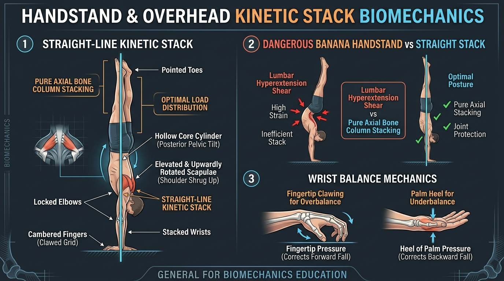

# Day 13: Handstand & Overhead Biomechanics

- **Estimated Study Time:** 25 minutes
- **Anatomical Focus:** The Vertical Kinetic Stacking Principle, Hand/Wrist Base of Support (Hasta Bandha & Cambered Grip), Active Scapular Elevation & Upward Rotation, Hollow-Body Pelvic Mechanics (PPT), and the pathomechanics of the "Banana" Handstand.
- **Key Movement Application:** Achieving a straight-line gymnastic handstand, mastering forearm balance in **Pincha Mayurasana (Feathered Peacock Pose)**, and protecting the cervical spine in **Salamba Shirshasana (Supported Headstand)**.

---

## 🎯 Daily Learning Objectives
*   Master the **Kinetic Stacking Principle**: how vertical alignment of bone columns replaces muscular effort with passive compressive load bearing.
*   Analyze the micro-adjustments of the **Cambered Hand Grip** (Flexor Digitorum Profundus / Superficialis) in controlling the Center of Mass (CoM).
*   Diagnose the anatomical cause of the **"Banana" Handstand** (restricted shoulder flexion forcing destructive lumbar hyperextension).
*   Apply the **80/20 Load Distribution Rule** in forearm balances and headstands to safeguard the cervical spine.

---

## 📖 Core Anatomical Concept

### 🏛️ 1. The Kinetic Stacking Principle

A handstand is fundamentally an inverted structural column. When bones are aligned vertically parallel to the gravitational plumb line, **compressive forces are absorbed directly by the skeleton**, requiring only minimal isometric muscular tension to maintain balance:

```
PLUMB LINE
    │   ┌──────────────────────────────────────────────┐
    │   │  POINTED TOES (Plantarflexion / Calves)      │
    │   ├──────────────────────────────────────────────┤
    │   │  ADDUCTED THIGHS & KNEES (Adductor Magnus)   │
    │   ├──────────────────────────────────────────────┤
    │   │  HOLLOW CORE / POSTERIOR PELVIC TILT (Abds)  │
    │   ├──────────────────────────────────────────────┤
    │   │  ELEVATED & UPWARDLY ROTATED SCAPULAE (Traps)│
    │   ├──────────────────────────────────────────────┤
    │   │  LOCKED ELBOWS (180° Triceps Lockout)        │
    │   ├──────────────────────────────────────────────┤
    │   │  CAMBERED FINGERS & WRISTS (Hasta Bandha)    │
    ▼   └──────────────────────────────────────────────┘
```

---

### ✋ 2. Base of Support: The Cambered Fingertip Grip

Balance in a handstand is maintained entirely through the wrist joint by shifting the Center of Pressure (CoP) along the hand:

| Balance State | Center of Mass Shift | Correction Mechanism | Active Muscle Group |
| :--- | :--- | :--- | :--- |
| **1. Neutral Balance** | Centered directly over the metacarpophalangeal (MCP) knuckle line. | Minimal isometric stability; relaxed breathing. | Balanced co-contraction of wrist flexors and extensors. |
| **2. Overbalance** *(Falling toward your back)* | CoM drifts forward past the knuckles toward the fingertips. | **Claw the floor:** Press fingertips down hard into the ground to drive the torso backward. | **Flexor Digitorum Profundus** & **Flexor Digitorum Superficialis**. |
| **3. Underbalance** *(Falling back down to feet)* | CoM drifts backward behind the knuckles toward the palm heel. | **Drive palm heel:** Press the base of the palms hard into the floor while opening shoulder angle. | **Flexor Carpi Radialis** & **Palmaris Longus**; Upper Trapezius elevation. |

---

### ⚠️ 3. Pathomechanics: The "Banana" Handstand Fault

| Structural Segment | Straight Kinetic Stack ✅ | The "Banana" Handstand Fault ❌ |
| :--- | :--- | :--- |
| **Shoulder Angle** | **Fully open to $180^\circ$** with active elevation (shrug up to ears). | **Closed shoulder angle ($140^\circ–160^\circ$)** due to tight lats, pecs, or weak serratus. |
| **Spine & Pelvis** | **Neutral spine with Posterior Pelvic Tilt (PPT)**; rigid abdominal cylinder. | **Severe Lumbar Hyperextension (Lordosis)** with Anterior Pelvic Tilt (belly dumping forward). |
| **Biomechanical Consequence** | Pure axial compression down the bone columns; joints protected. | **Severe Posterior Shear Stress on L4–L5 facet joints** and intervertebral discs; risk of spondylolysis. |
| **Energy Consumption** | Low muscular fatigue; can be held for minutes. | High muscular tension; shoulders and lower back exhaust in seconds. |

---

## 🎨 Visual Diagram

Here is a 3D medical visual atlas detailing the straight-line kinetic stack, the pathomechanics of the banana handstand fault, and the cambered wrist balance mechanics:



---

## 🔄 Movement Application (Calisthenics & Yoga)

### 🤸 1. Calisthenics: The Chest-to-Wall Handstand Drill
*   **The Problem with Back-to-Wall Handstands:** Kicking up with the back to the wall teaches the brain to rest in a banana curve, resting feet passively against the wall with closed shoulders.
*   **The Biomechanical Solution (Chest-to-Wall):** Place hands $6–12$ inches from the wall, face the wall, and walk feet up.
*   **The Cues:** Only the nose and toes touch the wall. Tuck the tailbone into **Posterior Pelvic Tilt**, squeeze the glutes, and **shrug the shoulders straight up into the ceiling**. This rewires the nervous system for true vertical skeletal stacking.

---

### 🧘 2. Yoga: Inversions & Cervical Spine Safety

#### Pincha Mayurasana (Forearm Stand) vs. Salamba Shirshasana (Headstand)
*   **Pincha Mayurasana (Forearm Stand):** Demands massive **Serratus Anterior** protraction and **Rotator Cuff** external rotation to prevent the elbows from sliding wide and the head from collapsing to the mat.
*   **Salamba Shirshasana (Headstand) Safety Protocol:**
    *   **The 80/20 Rule:** $80\%$ of body weight must be borne by the **Forearm Triangle (Ulna + Olecranon)**, and only $20\%$ light axial contact on the **Bregma (Crown)**.
    *   **Zero Neck Rotation:** Never rotate the head in a headstand; axial compressive load on a rotated cervical spine can cause facet joint subluxation or disc herniation.

---

## 🔬 Biomechanics Lab: Desk-side Drill

Feel the cambered finger grip balance mechanism right now:

### Drill 1: The Desk Finger Claw Balance
1.  Place your right hand flat on your desk in handstand position.
2.  Now, **bend your knuckles slightly (cambered grip)** so your fingertips press firmly into the surface while the palm knuckles lift slightly.
3.  Lean your bodyweight forward over your wrist.
4.  **Press your fingertips into the desk as hard as you can.**
5.  *Notice:* You can feel the powerful backward reactionary force immediately pushing your forearm back! This is the exact micro-brake that stops you from falling over in a handstand.

---

## 🧠 Daily Knowledge Check

Test your mastery of handstand and overhead biomechanics:

### Questions
1.  **Kinetic Stacking:** Why does aligning bones vertically over the center of mass reduce muscular fatigue compared to balancing in a joint angle?
2.  **Hand Mechanics:** When balancing in a handstand, which specific muscles contract to "claw the floor" and correct an **overbalance** (falling toward your back)?
3.  **Pathomechanics:** What is the primary underlying anatomical restriction that forces an athlete into a **"Banana" Handstand**?
4.  **Cervical Safety:** In **Salamba Shirshasana (Supported Headstand)**, what percentage of body weight should be supported by the forearms versus the crown of the head?
5.  **Pelvic Alignment:** What pelvic tilt position (Anterior vs. Posterior) is required to lock the lower body into a rigid, non-bending hollow body line?

---

<details>
<summary>🔑 Click to reveal answers and explanations</summary>

### Answers & Explanations

1.  **Answer:** Vertical alignment transfers the force of gravity as **pure axial compressive loads through the rigid skeletal columns**, requiring only minimal isometric balance adjustments rather than massive sustained concentric/eccentric muscle contractions.
2.  **Answer:** The deep and superficial finger flexors: **Flexor Digitorum Profundus** and **Flexor Digitorum Superficialis**.
3.  **Answer:** **Restricted Shoulder Flexion (tight Latissimus Dorsi, Pectoralis Major, or weak Serratus Anterior)** preventing full $180^\circ$ elevation. To keep the center of mass over the hands, the athlete is forced to hyperextend the lumbar spine.
4.  **Answer:** **$80\%$ of body weight on the forearms** (muscular shoulder girdle sling) and **maximum $20\%$ light contact on the crown of the head**.
5.  **Answer:** **Posterior Pelvic Tilt (PPT)**, driven by the co-contraction of the Rectus Abdominis, Obliques, and Gluteus Maximus.

</details>

---

## 🔗 Connected Guides & References
*   **[Skeletal Reference: Pectoral Girdle & Upper Limb](../../bones/regions/03_pectoral_upper_limb.md)**
*   **[Pose Correction: Salamba Shirshasana](../../pose_corrections/yoga/salamba_shirshasana.md)**
*   **[Day 10: Scapulohumeral Rhythm & Shoulder Impingement](../day-010-shoulder-impingement/README.md)**
*   **[Day 14: Wrist, Hand, and Elbow Stability & Module 2 Assessment](../day-014-wrist-elbow-stability/README.md)**
