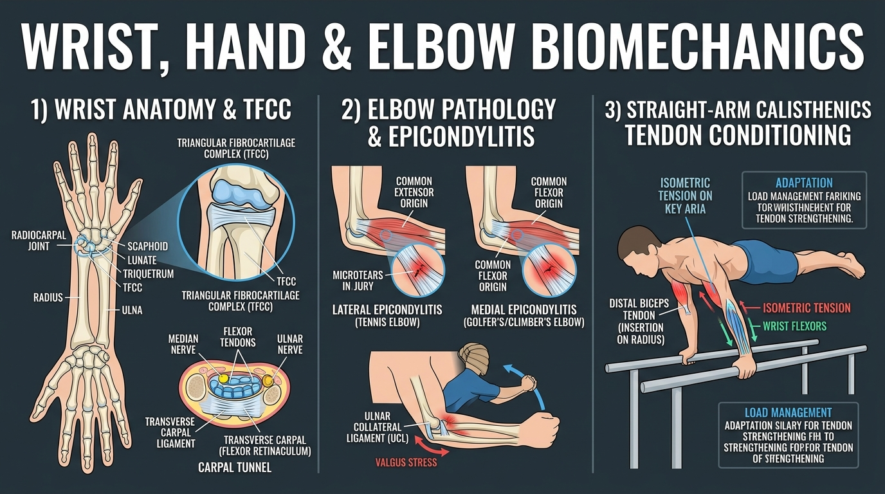

# Day 14: Wrist, Hand, & Elbow Stability & Module 2 Comprehensive Exam

- **Estimated Study Time:** 35 minutes
- **Anatomical Focus:** Radiocarpal articulation, Carpal Tunnel, Triangular Fibrocartilage Complex (TFCC), Elbow Collateral Ligaments (UCL/RCL), Medial vs. Lateral Epicondylitis, Straight-Arm Tendon Conditioning, and **Module 2 Comprehensive Mastery Assessment**.
- **Key Movement Application:** Preventing wrist pain in push-ups and planches, mastering the False Grip on gymnastics rings, avoiding elbow tendinopathy in pull-ups, and protecting the wrists in **Kakasana (Crow Pose)**.

---

## 🎯 Daily Learning Objectives
*   Map the anatomical structure of the **Radiocarpal Joint**, **TFCC**, and the **Carpal Tunnel**.
*   Differentiate between **Medial Epicondylitis (Golfer's/Climber's Elbow)** and **Lateral Epicondylitis (Tennis Elbow)**.
*   Analyze the **Ulnar Collateral Ligament (UCL)** and how valgus torque during straight-arm calisthenics (e.g., Planche, Iron Cross) strains the elbow.
*   Pass the **Module 2 Comprehensive Board-Style Exam** covering Scapular Movements, the Rotator Cuff, Scapulohumeral Rhythm, Pushing, Pulling, Handstands, and Distal Joint Mechanics.

---

## 📖 Core Anatomical Concept

### 🖐️ 1. The Wrist Joint & Carpal Tunnel Anatomy

The wrist complex is composed of multiple articulating joints that balance multi-axial dexterity with high compressive load tolerance:

| Structural Component | Anatomical Architecture | Functional & Clinical Role |
| :--- | :--- | :--- |
| **1. Radiocarpal Joint** | Condyloid (ellipsoid) joint between the distal **Radius** and the proximal carpals (**Scaphoid & Lunate**). | Transmits $>80\%$ of axial compressive ground reaction force from the hand directly to the radius. |
| **2. TFCC** *(Triangular Fibrocartilage Complex)* | Fibrocartilaginous disc and ligamentous complex cushioning the distal **Ulna** and triquetrum. | Stabilizes the distal radioulnar joint; absorbs ulnar-side compressive loads during push-ups and **Kakasana**. |
| **3. Carpal Tunnel** | Rigid osteofibrous corridor bounded by carpal bones and the **Flexor Retinaculum (Transverse Carpal Ligament)**. | Houses **9 Flexor Tendons** (FDS, FDP, FPL) and the **Median Nerve**. Prolonged wrist hyperextension under load increases pressure, causing **Carpal Tunnel Syndrome**. |

---

### 🦾 2. Elbow Ligaments & Epicondylitis Pathomechanics

```
                                  HUMERUS
                                ┌─────────┐
       MEDIAL EPICONDYLE ───────┤         ├─────── LATERAL EPICONDYLE
       (Common Flexor Origin)   │         │       (Common Extensor Origin - ECRB)
               │                └────┬────┘               │
               ▼                     │                    ▼
     MEDIAL EPICONDYLITIS            │          LATERAL EPICONDYLITIS
   (Golfer's / Climber's Elbow)      │             (Tennis Elbow)
               │                     │                    │
   Overuse of wrist flexors          │          Overuse of wrist extensors
   and pronators (Pull-ups/Grip)     │          and stabilizers (Benching)
```

| Clinical Condition | Anatomical Origin Involved | Primary Irritated Muscle/Tendon | Common Athletic Mechanism |
| :--- | :--- | :--- | :--- |
| **Medial Epicondylitis**<br>*(Golfer's / Climber's Elbow)* | **Medial Epicondyle** of humerus | **Common Flexor Tendon** *(Pronator Teres, Flexor Carpi Radialis/Ulnaris)* | High-volume pull-ups, heavy false-grip ring muscle-ups, rock climbing, and excessive wrist flexion. |
| **Lateral Epicondylitis**<br>*(Tennis Elbow)* | **Lateral Epicondyle** of humerus | **Common Extensor Tendon** *(Specifically **Extensor Carpi Radialis Brevis - ECRB**)* | Repetitive wrist extension against resistance; gripping heavy barbells/dumbbells with flexed wrists. |
| **UCL Valgus Strain** | Medial humeroulnar joint | **Ulnar Collateral Ligament (UCL)** | High valgus torque during straight-arm planches, heavy dips, or throwing; shears medial elbow. |

---

### 🛡️ 3. Straight-Arm Tendon Conditioning (Gymnastics & Calisthenics)

In straight-arm calisthenics (**Planches**, **Maltese**, **Iron Cross**, and **Back Levers**), the elbow joint is locked at $180^\circ$.
*   **The Biomechanics:** The massive gravitational moment arm acts directly on the elbow without muscle dampening from bent-arm flexion.
*   **The Vulnerable Structure:** The **Distal Biceps Brachii Tendon** (inserting onto the radial tuberosity) and the anterior joint capsule bear extreme tensile loads.
*   **The Rule of Tendon Adaptation:** Tendon collagen remodeling takes **$6–12$ months of progressive submaximal isometric exposure** (e.g., leaned planks on parallettes) to develop the tensile stiffness required for advanced straight-arm levers without tendon rupture.

---

## 🎨 Visual Diagram

Here is a 3D medical visual infographic detailing wrist/TFCC anatomy, Carpal Tunnel cross-section, medial/lateral epicondylitis, and straight-arm tendon conditioning:



---

## 🔄 Movement Application (Calisthenics & Yoga)

### 🤸 1. Calisthenics: Floor vs. Parallettes & The False Grip
*   **The Wrist Trap (Floor Push-ups/Planches):** Loading body weight on flat ground forces the wrist into **$90^\circ$ of acute hyperextension**, compressing the dorsal carpals and stretching the flexor retinaculum.
*   **The Parallette Solution:** Using **Parallettes (neutral bars)** allows the wrist to remain in a **$180^\circ$ neutral line**, eliminating dorsal impingement and shifting the load into pure axial compression down the radius and ulna.
*   **The False Grip (Ring Muscle-ups):** Resting the ring directly over the **Pisiform and Scaphoid carpals** rather than the fingers reduces the moment arm at the wrist, placing the forearm in mechanical position for an instant transition above the rings.

---

### 🧘 2. Yoga: Hasta Bandha & Crow Pose Wrist Safety

#### Kakasana (Crow Pose): Activating the Hand Arch
*   **The Error:** Collapsing 100% of body weight into the heel of the palm, crushing the **Median Nerve** in the carpal tunnel and overloading the **TFCC**.
*   **The Hasta Bandha Lock:** Spread fingers wide, press down through the **base of the index finger (2nd MCP joint)**, and gently suction the center of the palm upward. This engages the intrinsic lumbricals and wrist flexors, distributing compressive load across the entire palm surface.

---

## 🔬 Biomechanics Lab: Desk-side Drill

Diagnose epicondyle tension under your own touch right now:

### Drill 1: The Lateral vs. Medial Epicondyle Palpation
1.  **Medial Epicondyle Check:** Place your left thumb on the bony bump on the inside of your right elbow. Make a hard fist and flex your wrist inward. Feel the **Common Flexor Tendon** fire instantly!
2.  **Lateral Epicondyle Check:** Move your thumb to the outer bony bump of your elbow. Keep your fist tight and cock your wrist backward into extension. Feel the **Common Extensor Tendon (ECRB)** swell under your thumb!

---

# 🎓 Module 2 Comprehensive Mastery Assessment

*Answer these 10 board-style clinical and movement biomechanics questions covering all of Module 2 (Days 8–14).*

### Questions

1.  **Scapular Kinematics (Day 8):** Which specific muscle acts as the prime mover for **Scapular Protraction**, and which nerve innervates it?
2.  **Rotator Cuff Anatomy (Day 9):** Name all 4 muscles of the Rotator Cuff (**SITS**) and identify the single muscle that inserts onto the **Lesser Tubercle** of the humerus.
3.  **Force Couples (Day 9):** What dynamic role does the Rotator Cuff perform during Deltoid contraction to prevent the humeral head from crushing the supraspinatus tendon against the acromion?
4.  **Kinematic Ratios (Day 10):** In the 2:1 **Scapulohumeral Rhythm**, if an athlete elevates their arm to $180^\circ$, exactly how many degrees of rotation occur at the Glenohumeral joint versus the Scapulothoracic articulation?
5.  **Pathology (Day 10):** What is the **"Painful Arc"** of the shoulder, and in what range of degrees does it typically manifest?
6.  **Pushing Mechanics (Day 11):** Why is an elbow flare angle of $45^\circ–60^\circ$ (Scapular Plane) recommended over a $90^\circ$ flare during push-ups and bench presses?
7.  **Pulling Biomechanics (Day 12):** Why does an overhand (pronated) **Pull-up** recruit significantly more **Brachialis** than an underhand (supinated) **Chin-up**?
8.  **Pulling Initiation (Day 12):** What is the correct two-phase kinematic sequence when initiating a strict pull-up from a dead hang?
9.  **Inversion Alignment (Day 13):** What is the underlying anatomical cause of the **"Banana" Handstand** fault?
10. **Distal Joint Clinical (Day 14):** An athlete experiences sharp pain on the **lateral epicondyle** of the elbow during heavy pulling and gripping. Which specific tendon is inflamed (**Tennis Elbow**)?

---

<details>
<summary>🔑 Click to reveal Module 2 Exam Answer Key & Explanations</summary>

### Answer Key & Explanations

1.  **Answer:** The **Serratus Anterior**, innervated by the **Long Thoracic Nerve** (C5, C6, C7).
2.  **Answer:** **Supraspinatus**, **Infraspinatus**, **Teres Minor**, and **Subscapularis**. The **Subscapularis** is the sole muscle inserting onto the **Lesser Tubercle** (the other three insert onto the Greater Tubercle).
3.  **Answer:** The Rotator Cuff (Infraspinatus, Teres Minor, Subscapularis) produces a **downward and medial depression force vector**, counteracting the Deltoid's superior vertical shear and dynamically centering the humeral head in the glenoid fossa.
4.  **Answer:** **$120^\circ$** at the Glenohumeral Joint and **$60^\circ$** via Scapulothoracic Upward Rotation.
5.  **Answer:** The **Painful Arc** occurs between **$60^\circ$ and $120^\circ$** of arm abduction/flexion, where the greater tubercle is closest to the coracoacromial arch, compressing the inflamed supraspinatus tendon and subacromial bursa.
6.  **Answer:** The $45^\circ–60^\circ$ angle aligns the humerus in the **Scapular Plane**, allowing the rotator cuff to center the humeral head and keeping the subacromial corridor wide open, while avoiding destructive anterior capsular shear.
7.  **Answer:** Pronation rotates the radius over the ulna, wrapping the Biceps Brachii tendon around the bone and mechanically disengaging it. The **Brachialis** attaches solely to the ulna, allowing it to generate maximal elbow flexion force unaffected by forearm rotation.
8.  **Answer:** **Phase 1:** Scapular Depression & Retraction ("pack the shoulders" via Lower Trapezius/Rhomboids) $\rightarrow$ **Phase 2:** Glenohumeral Adduction & Elbow Flexion (Lats + Brachialis drive chest to bar).
9.  **Answer:** **Restricted Shoulder Flexion ($<180^\circ$)** due to tight lats/pecs or weak upward rotators, forcing the athlete to **hyperextend the lumbar spine (L4–L5 lordosis)** to keep the feet over the center of mass.
10. **Answer:** The **Common Extensor Tendon**, specifically the **Extensor Carpi Radialis Brevis (ECRB)** (**Lateral Epicondylitis / Tennis Elbow**).

</details>

---

## 🔗 Connected Guides & References
*   **[Master Muscle Directory](../../muscles/README.md)**
*   **[Skeletal Reference: Pectoral Girdle & Upper Limb](../../bones/regions/03_pectoral_upper_limb.md)**
*   **[Master Skeletomuscular Map](../../muscles/guides/skeletomuscular_map.md)**
*   **[Master Pose Corrections Directory](../../pose_corrections/README.md)**
*   **[Module 3: Day 15 Vertebral Column Anatomy](../day-015-spine-anatomy/README.md)**
