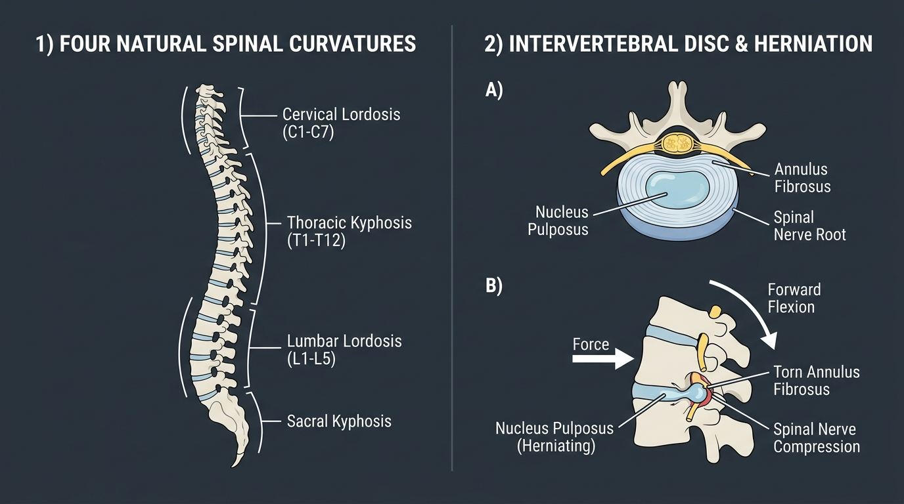

# Day 15: Vertebral Column Anatomy & Disc Mechanics

- **Estimated Study Time:** 25 minutes
- **Anatomical Focus:** The 4 natural spinal curvatures (Lordosis vs. Kyphosis), functional anatomy of a typical vertebra, Intervertebral Disc (IVD) architecture (Annulus Fibrosus vs. Nucleus Pulposus), and the biomechanics of Disc Herniation.
- **Key Movement Application:** Protecting the lumbar spine in heavy deadlifts and squats, mastering the hip hinge to avoid lumbar shear, and safe execution of forward folds (**Paschimottanasana**) and backbends (**Bhujangasana**).

---

## 🎯 Daily Learning Objectives
*   Distinguish between **Primary Curves (Thoracic & Sacral Kyphosis)** and **Secondary Curves (Cervical & Lumbar Lordosis)**.
*   Master the structural anatomy of the **Intervertebral Disc (IVD)**: the concentric cross-ply collagen rings of the **Annulus Fibrosus** vs. the hydraulic gel core of the **Nucleus Pulposus**.
*   Analyze the pathomechanical formula for **Posterolateral Disc Herniation** (Spinal Flexion $+$ Compressive Load $+$ Axial Rotation).
*   Differentiate between a flat-back hip hinge and a controlled segmented **Jefferson Curl** in strength training.

---

## 📖 Core Anatomical Concept

### 🦴 1. The Four Natural Spinal Curvatures

The human adult spine is not a rigid straight pole, but a dynamic **double-S shaped spring** designed to absorb axial shock and multiply compressive load tolerance by $10\times$ compared to a straight rod:

| Spinal Region | Number of Vertebrae | Curvature Type & Direction | Developmental Origin | Functional Role |
| :--- | :---: | :--- | :--- | :--- |
| **1. Cervical** | **7** *(C1–C7)* | **Secondary Curve: Lordosis** *(Convex anteriorly / curves inward)* | Develops at $3–4$ months as an infant learns to **lift the head**. | Supports the weight of the skull ($4.5–5.5\,\text{kg}$) while permitting wide multi-axial eye and head tracking. |
| **2. Thoracic** | **12** *(T1–T12)* | **Primary Curve: Kyphosis** *(Concave anteriorly / curves outward)* | Present at birth (fetal curve); structurally rigid due to rib cage attachment. | Encloses and protects the thoracic viscera (heart and lungs); provides stable anchor for respiration. |
| **3. Lumbar** | **5** *(L1–L5)* | **Secondary Curve: Lordosis** *(Convex anteriorly / curves inward)* | Develops at $12–18$ months as the toddler learns to **stand and walk upright**. | Bears the majority of axial bodyweight; massive vertebral bodies transmit force between torso and pelvis. |
| **4. Sacrococcygeal** | **5 Sacral (Fused)** + **4 Coccygeal** | **Primary Curve: Kyphosis** *(Concave anteriorly)* | Present at birth; fuses into a rigid osseous wedge by early adulthood. | Anchors the spine into the pelvic ring via the Sacroiliac (SI) joints; transmits load down into the femur heads. |

---

### 💧 2. Intervertebral Disc (IVD) Architecture

Each intervertebral disc is a specialized fibrocartilaginous shock absorber consisting of two distinct functional zones:

```
            CROSS-SECTION OF INTERVERTEBRAL DISC
                   ┌───────────────────────┐
                   │   ANNULUS FIBROSUS    │  <-- 15-25 Concentric Layers of Type I Collagen
                   │  ┌─────────────────┐  │      (Alternating 60° ply resists multi-directional torque)
                   │  │ NUCLEUS PULPOSUS│  │
                   │  │  (Hydraulic Gel)│  │  <-- 80-90% Water + Proteoglycan Matrix
                   │  └─────────────────┘  │      (Acts like a fluid-filled hydraulic sphere)
                   └───────────────────────┘
```

| Structural Component | Biochemical Makeup | Mechanical Behavior | Functional Role |
| :--- | :--- | :--- | :--- |
| **1. Annulus Fibrosus** *(Outer Wall)* | $15–25$ concentric lamellar rings of **Type I Collagen** oriented in alternating $60^\circ$ diagonal cross-plies. | Extreme **Tensile Stiffness**; resists hoop stress and torsional shearing. | Encloses the pressurized gel; binds adjacent vertebral bodies together. |
| **2. Nucleus Pulposus** *(Inner Core)* | Highly hydrophilic gel composed of **$80–90\%$ Water**, Type II Collagen, and **Aggrecan Proteoglycans**. | Incompressible **Hydraulic Sphere**; converts vertical compression into radial tensile stress. | Distributes compressive force uniformly across the entire vertebral endplate. |
| **3. Cartilaginous Endplates** | Thin ($1\,\text{mm}$) layer of hyaline cartilage bonded to the porous subchondral bone. | Semipermeable membrane. | Primary route for **nutrient diffusion** (glucose and oxygen) into the avascular disc. |

---

### 💥 3. Pathomechanics of Lumbar Disc Herniation

```
    FORWARD SPINAL FLEXION (Bending forward with straight legs)
             │
             ▼
    Anterior vertebral bodies pinch the disc front
             │
             ▼
    Nucleus Pulposus is squeezed POSTEROLATERALLY like a wet soap bar
             │
             ▼
    Tears through weakened Annulus Fibrosus rings ──► HITS SPINAL NERVE ROOT (Sciatica)
```

1.  **The Herniation Formula:** The disc is exceptionally resilient under pure axial compression, but highly vulnerable when subjected to **Spinal Flexion $+$ Compressive Load $+$ Axial Rotation**.
2.  **Why Posterolateral?** The **Posterior Longitudinal Ligament (PLL)** runs down the midline of the posterior vertebral bodies, reinforcing the direct center. As a result, 95% of lumbar disc herniations occur **posterolaterally (at L4–L5 or L5–S1)**, directly compressing the exiting spinal nerve root (causing radiating leg pain, numbness, and sciatica).

---

## 🎨 Visual Diagram

Here is a 3D medical visual atlas detailing the 4 natural spinal curvatures and the mechanical anatomy of an intervertebral disc and posterolateral herniation:



---

## 🔄 Movement Application (Calisthenics & Yoga)

### 🤸 1. Calisthenics & Lifting: The Hip Hinge vs. The Jefferson Curl
*   **The Neutral Spine Hip Hinge (Deadlifts / Squats):** By maintaining the natural **Lumbar Lordosis**, the extensor muscles (**Erector Spinae**, **Multifidus**) share the load, and compressive forces are distributed across the entire surface of the disc with zero posterior shear.
*   **The Jefferson Curl (Progressive Mobility):** Bending the spine segment by segment under light, controlled weight deliberately stretches the posterior longitudinal ligament and conditions the annulus fibrosus to tolerate non-neutral angles. *Caution:* Never perform heavy explosive lifts with a flexed lumbar spine!

---

### 🧘 2. Yoga: Forward Bends & Backbends

#### Paschimottanasana (Seated Forward Bend): Hinging from the Pelvis
*   **The Error:** Rounding purely through the lumbar spine while the pelvis remains vertically stuck. This concentrates 100% of forward flexion stress at L4–L5/L5–S1.
*   **The Biomechanics:** Rotate the **pelvic bowl forward into Anterior Pelvic Tilt** first. Fold from the hip sockets (femuroacetabular joints) so the lumbar spine stays long and decompressed.

#### Bhujangasana (Cobra Pose): Disc Decompression
*   **The Mechanism:** Gentle spinal extension in **Bhujangasana** creates anterior disc opening, generating a hydraulic suction that gently coaxes the nucleus pulposus forward toward the center of the disc, relieving posterior neural compression.

---

## 🔬 Biomechanics Lab: Desk-side Drill

Feel the hydraulic shift of your lumbar discs right now:

### Drill 1: The Slouch vs. Neutral Disc Pressure Test
1.  Sit on your chair and completely slump forward into a rounded, slouched C-curve posture.
2.  Place your thumb on your lower lumbar spine (L4–L5 level). Feel how the spinous processes spread wide apart and the posterior tissues stretch taut. In this position, **internal disc pressure skyrockets to $200–250\%$ of standing baseline**!
3.  Now, rotate your pelvis forward, lift your sternum, and restore your natural **Lumbar Lordosis**.
4.  *Notice:* The lumbar muscles relax into a natural mechanical balance, and disc pressure drops immediately.

---

## 🧠 Daily Knowledge Check

Test your mastery of spinal kinematics and disc anatomy:

### Questions
1.  **Developmental Anatomy:** Which two spinal curvatures are classified as **Primary Curves**, and why are they called primary?
2.  **Disc Composition:** What type of collagen predominantly composes the **Annulus Fibrosus**, and what architectural pattern gives it resistance to rotational torque?
3.  **Pathomechanics:** What combination of three simultaneous spinal movements creates the highest risk for acute posterolateral disc herniation?
4.  **Neural Compression:** Why do herniations at the L4–L5 or L5–S1 level cause radiating pain down the back of the leg rather than in the arm?
5.  **Movement Translation:** When performing a heavy barbell deadlift, why is maintaining a neutral lumbar curve mechanically superior to pulling with a rounded lower back?

---

<details>
<summary>🔑 Click to reveal answers and explanations</summary>

### Answers & Explanations

1.  **Answer:** The **Thoracic Kyphosis** and **Sacral Kyphosis**. They are called primary because they are present from birth in the original fetal C-shaped curve.
2.  **Answer:** **Type I Collagen**, arranged in $15–25$ concentric lamellar rings with alternating $60^\circ$ diagonal cross-ply fiber orientations to resist multi-directional tensile and torsional shearing forces.
3.  **Answer:** **Spinal Flexion** (bending forward) $+$ **Heavy Axial Compressive Load** $+$ **Axial Rotation** (twisting).
4.  **Answer:** L4, L5, and S1 spinal nerve roots join together to form the **Sciatic Nerve**, which travels down the posterior thigh and calf all the way to the foot.
5.  **Answer:** A neutral curve keeps the **intervertebral discs in uniform hydrostatic compression**, minimizes dangerous posterior hydraulic shear, and places the powerful **Erector Spinae** and **Gluteus Maximus** at their optimal biomechanical moment arms.

</details>

---

## 🔗 Connected Guides & References
*   **[Skeletal Reference: Vertebrae & Thoracic Cage](../../bones/regions/02_vertebrae_thorax.md)**
*   **[Master Muscle Directory](../../muscles/README.md)**
*   **[Pose Correction: Bhujangasana](../../pose_corrections/yoga/bhujangasana.md)**
*   **[Day 16: Pelvic Tilts & Postural Adaptations](../day-016-pelvic-tilts/README.md)**
