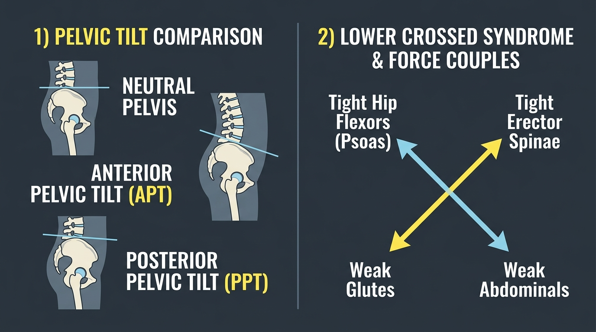

# Day 16: Pelvic Tilts & Postural Adaptations

- **Estimated Study Time:** 25 minutes
- **Anatomical Focus:** Bony landmarks of the Pelvis (ASIS, PSIS, Pubic Symphysis), Anterior vs. Posterior vs. Lateral Pelvic Tilts, Vladimir Janda's Lower Crossed Syndrome (LCS), and Pelvic Force Couples.
- **Key Movement Application:** Mastering the gymnastic Hollow-Body hold (PPT), eliminating lower back pain in squats/deadlifts, releasing chronically tight hip flexors in **Anjaneyasana**, and stabilizing the standing pelvis in **Vrikshasana (Tree Pose)**.

---

## 🎯 Daily Learning Objectives
*   Identify the key anatomical landmarks used to assess pelvic alignment: **Anterior Superior Iliac Spine (ASIS)**, **Posterior Superior Iliac Spine (PSIS)**, and **Pubic Symphysis**.
*   Master the three primary pelvic tilt vectors: **Anterior Pelvic Tilt (APT)**, **Posterior Pelvic Tilt (PPT)**, and **Lateral Pelvic Tilt**.
*   Analyze the muscular cross-pattern of **Lower Crossed Syndrome (LCS)** (hypertonic hip flexors & erectors vs. inhibited glutes & abdominals).
*   Execute the **Posterior Pelvic Tilt (PPT)** to lock the core into an unbroken kinetic chain during calisthenics handstands, planches, and planks.

---

## 📖 Core Anatomical Concept

### 🥣 1. The Pelvic Bowl & Anatomical Neutral

The pelvis acts as the central mechanical crossroad of the human skeleton, connecting the spine to the lower limbs:

| Alignment State | Sagittal Landmark Position | Coronal / Transverse Alignment | Spinal & Hip Adaptation |
| :--- | :--- | :--- | :--- |
| **1. Neutral Pelvis** | **ASIS and PSIS are horizontal** (within $0^\circ–5^\circ$). | **ASIS and Pubic Symphysis align vertically** in the coronal plane. | Preserves natural Lumbar Lordosis; evenly distributes bodyweight across hip sockets. |
| **2. Anterior Pelvic Tilt (APT)**<br>*(Spilling the bowl forward)* | **ASIS drops anteriorly/inferiorly** relative to the PSIS ($>10^\circ–15^\circ$). | Pelvic inlet rotates downward and forward. | **Exaggerates Lumbar Lordosis** (hyperlordosis); pinches posterior lumbar facet joints; shortens hip flexors. |
| **3. Posterior Pelvic Tilt (PPT)**<br>*(Tucking the tailbone)* | **PSIS drops posteriorly/inferiorly**; ASIS rotates upward/backward. | Pelvic inlet rotates upward and backward. | **Flattens Lumbar Spine**; places passive strain on posterior discs; shortens hamstrings. |
| **4. Lateral Pelvic Tilt**<br>*(Trendelenburg sign)* | One Iliac Crest sits higher than the opposite side in the frontal plane. | Pelvis tilts laterally toward the unsupported swing leg. | Indicates **contralateral Gluteus Medius weakness**; causes functional scoliosis compensation. |

---

### ❌ 2. Vladimir Janda's Lower Crossed Syndrome (LCS)

Prolonged seated desk postures create a predictable neurological pattern where tonic postural muscles become chronically tight and phasic dynamic muscles become neurologically inhibited:

```
                  TIGHT / FACILITATED                    TIGHT / FACILITATED
                 Lumbar Erector Spinae                     Iliopsoas & Rectus Femoris
                           \                                     /
                            \                                   /
                             \                                 /
                              \                               /
                               ▼                             ▼
                          WEAK / INHIBITED              WEAK / INHIBITED
                         Abdominal Wall (TVA)           Gluteus Maximus & Medius
```

| Muscle Group | Neurological State | Biomechanical Consequence | Corrective Action |
| :--- | :--- | :--- | :--- |
| **Hip Flexors** *(Iliopsoas, Rectus Femoris, TFL)* | **Hypertonic / Shortened** | Pulls anterior pelvis downward into severe APT. | Dynamic stretching (**Anjaneyasana** with active glute contraction). |
| **Lumbar Extensors** *(Erector Spinae, QL)* | **Hypertonic / Facilitated** | Pulls posterior pelvis upward, jamming lumbar facet joints. | Myofascial release; core anti-extension bracing. |
| **Gluteals** *(Gluteus Maximus & Medius)* | **Inhibited / Dormant** | Fails to extend hips or control pelvic drop (**Gluteal Amnesia**). | Targeted neuromuscular activation (Glute bridges, Single-leg RDLs). |
| **Abdominals** *(Transversus Abdominis, Rectus)* | **Inhibited / Lengthened** | Cannot resist anterior pelvic rotation or brace the lumbar spine. | Isometric hollow body holds; deadbugs; pelvic tuck drills. |

---

### 🔄 3. Pelvic Muscular Force Couples

| Force Couple | Participating Muscles | Direction of Pull | Joint Motion Produced |
| :--- | :--- | :--- | :--- |
| **Anterior Tilt Force Couple (APT)** | • **Iliopsoas & Rectus Femoris** (anterior)<br>• **Erector Spinae** (posterior) | • Hip flexors pull anterior pelvis **DOWN**.<br>• Lower back erectors pull posterior pelvis **UP**. | Rotates pelvis forward into lordotic arch (e.g., arch in **Bhujangasana**). |
| **Posterior Tilt Force Couple (PPT)** | • **Rectus Abdominis & Obliques** (anterior)<br>• **Gluteus Maximus & Hamstrings** (posterior) | • Abdominals pull anterior pelvis **UP**.<br>• Glutes/Hamstrings pull posterior pelvis **DOWN**. | Tucks tailbone, locks rigid gymnastic hollow body (e.g., Planche, L-sit, Plank). |

---

## 🎨 Visual Diagram

Here is a 3D medical visual atlas illustrating the three pelvic tilt alignments and the crossed muscular imbalance of Janda's Lower Crossed Syndrome:



---

## 🔄 Movement Application (Calisthenics & Yoga)

### 🤸 1. Calisthenics: The Gymnastic Hollow Body (Mastering PPT)
*   **The Error:** Beginners doing push-ups, planches, or handstands often sag into **Anterior Pelvic Tilt**, letting their belly drop toward the floor. This breaks the kinetic chain and concentrates shearing stress on the lumbar spine.
*   **The Hollow Body Lock (PPT):** Squeeze the glutes hard and pull the belly button inward toward the spine. This fires the **Posterior Pelvic Tilt Force Couple**, transforming the spine and pelvis into a rigid, non-bending structural cylinder.

---

### 🧘 2. Yoga: Psoas Release & Pelvic Leveling

#### Anjaneyasana (Crescent Lunge): Reciprocal Psoas Release
*   **The Trap:** Hyperextending the lower back into APT to fake depth in a lunge.
*   **The Biomechanics:** Tuck the pelvis into a slight **PPT** and actively **squeeze the back-leg Gluteus Maximus**. This fires reciprocal inhibition through the lumbar cord, forcing the tight **Psoas Major** to release without pinching the lumbar spine.

#### Vrikshasana (Tree Pose): The Trendelenburg Test
*   **The Biomechanics:** When standing on one leg in **Tree Pose**, gravity tries to pull the unsupported hip downward. The standing leg's **Gluteus Medius** must contract isometrically to keep the pelvis perfectly level in the frontal plane.

---

## 🔬 Biomechanics Lab: Desk-side Drill

Feel the pelvic force couples under your own control right now:

### Drill 1: The Standing Pelvic Clock Test
1.  Stand upright with feet hip-width apart. Place your index fingers on your **ASIS (front hip points)** and thumbs on your **PSIS (back dimples)**.
2.  **Anterior Tilt (12 o'clock):** Arch your lower back and stick your tailbone out behind you. Feel your front fingers drop and back thumbs lift. Feel your lower back erectors tighten.
3.  **Posterior Tilt (6 o'clock):** Squeeze your glutes hard and tuck your tailbone underneath you, pulling your belt buckle toward your chin. Feel your front fingers lift and lower back flatten!
4.  **Find Neutral:** Rock between the two extremes until your fingers and thumbs sit on a level horizontal plane. This is your **Pelvic Neutral**!

---

## 🧠 Daily Knowledge Check

Test your mastery of pelvic mechanics:

### Questions
1.  **Landmark Alignment:** In standard anatomical neutral, what is the horizontal relationship between the **ASIS** and the **PSIS**?
2.  **Pathology:** In **Lower Crossed Syndrome**, which two muscle groups are chronically **tight/hypertonic**, and which two muscle groups are **weak/inhibited**?
3.  **Kinematic Adaptation:** What spinal curvature adaptation directly accompanies an exaggerated **Anterior Pelvic Tilt (APT)**?
4.  **Force Couple Mechanics:** What two muscle groups work as a force couple to drive **Posterior Pelvic Tilt (PPT)**?
5.  **Single-Leg Balance:** If an athlete's left hip visibly drops when standing on the right leg (**Trendelenburg Sign**), which specific muscle on which leg is weak?

---

<details>
<summary>🔑 Click to reveal answers and explanations</summary>

### Answers & Explanations

1.  **Answer:** The **ASIS and PSIS are level horizontally** in the transverse plane (within $0^\circ–5^\circ$ of each other).
2.  **Answer:**
    *   **Tight / Hypertonic:** **Hip Flexors** (Iliopsoas, Rectus Femoris) and **Lumbar Extensors** (Erector Spinae).
    *   **Weak / Inhibited:** **Gluteals** (Gluteus Maximus & Medius) and **Abdominals** (Transversus Abdominis, Rectus Abdominis).
3.  **Answer:** **Exaggerated Lumbar Lordosis (Hyperlordosis)**, which compresses the posterior lumbar facet joints.
4.  **Answer:** The **Abdominals** (Rectus Abdominis & External Obliques pulling anterior pelvis UP) and the **Gluteus Maximus / Hamstrings** (pulling posterior pelvis DOWN).
5.  **Answer:** The **Right Gluteus Medius** (the standing/stance leg's hip abductor) is weak or inhibited, failing to stabilize the pelvis in the frontal plane.

</details>

---

## 🔗 Connected Guides & References
*   **[Skeletal Reference: Pelvis & Perineum](../../bones/regions/04_pelvis_lower_limb.md)**
*   **[Master Muscle Directory](../../muscles/README.md)**
*   **[Pose Correction: Anjaneyasana](../../pose_corrections/yoga/anjaneyasana.md)**
*   **[Day 17: The Core: Deep Stabilizers vs. Superficial Movers](../day-017-core-stabilizers/README.md)**
