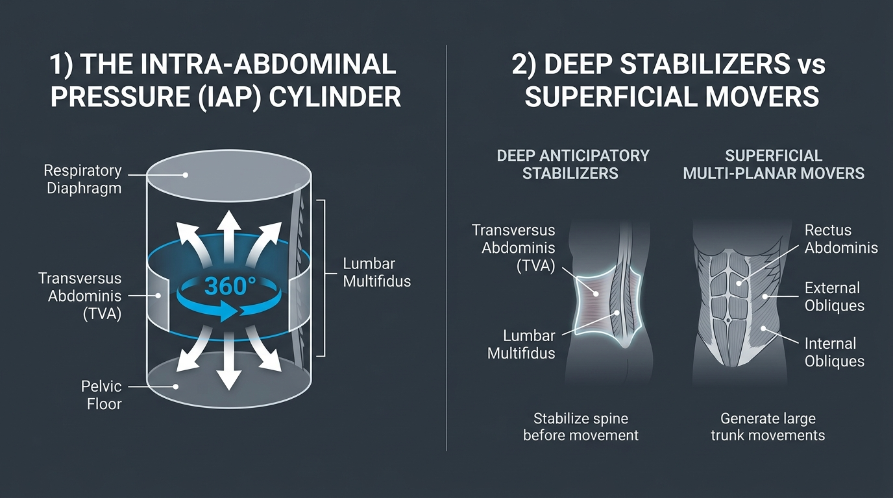

# Day 17: The Core: Deep Stabilizers vs. Superficial Movers

- **Estimated Study Time:** 25 minutes
- **Anatomical Focus:** The 3D Intra-Abdominal Pressure (IAP) Canister (Diaphragm, Pelvic Floor, Transversus Abdominis, Multifidus), Local Stabilizers vs. Global Movers, and Feedforward Neuromuscular Control.
- **Key Movement Application:** Generating unyielding core tension in L-sits and gymnastics Planches, applying **Mula Bandha** and **Uddiyana Bandha** in arm balances (**Kakasana**), and eliminating spinal flexion shear in heavy lifting.

---

## 🎯 Daily Learning Objectives
*   Define the **Core** as a 3D hydraulic pressure cylinder rather than just a 2D abdominal wall ("6-pack").
*   Map the 4 boundary walls of the **Intra-Abdominal Pressure (IAP) Canister** (**Diaphragm**, **Pelvic Floor**, **Transversus Abdominis**, and **Lumbar Multifidus**).
*   Distinguish between **Deep Local Stabilizers (Anticipatory / Feedforward)** and **Superficial Global Movers (Directional Force)**.
*   Master the physiological execution of the yogic core locks (**Mula Bandha** & **Uddiyana Bandha**) to compress the abdominal cavity and suspend bodyweight.

---

## 📖 Core Anatomical Concept

### 🛢️ 1. The 3D Intra-Abdominal Pressure (IAP) Canister

The core functions like a pressurized soda can. When all four walls contract synchronously, they generate **Intra-Abdominal Pressure (IAP)**, creating a rigid hydraulic beam in front of the spine that reduces lumbar compressive loads by up to **$40\%$**:

```
                          ROOF: Respiratory Diaphragm
                          (Pushes downward upon inhalation)
                                      ▼
             ┌─────────────────────────────────────────────────┐
  ANTERIOR / │                                                 │ POSTERIOR:
  LATERAL:   │        360° HYDRAULIC IAP EXPANSION             │ Lumbar Multifidus
  Transversus│                                                 │ (Segmental vertebral
  Abdominis  │                                                 │  anchors)
  (Corset)   └─────────────────────────────────────────────────┘
                                      ▲
                         FLOOR: Pelvic Floor (Levator Ani)
                         (Lifts upward to contain pressure)
```

| Canister Boundary | Anatomical Muscle | Fiber Orientation & Action | Biomechanical Role |
| :--- | :--- | :--- | :--- |
| **1. Roof** | **Respiratory Diaphragm** | Dome-shaped muscle separating thorax and abdomen; flattens downward upon contraction. | Drives inhalation; pressurizes the upper abdominal cavity downward against the viscera. |
| **2. Floor** | **Pelvic Floor** *(Levator Ani & Coccygeus)* | Funnel-shaped muscular sling bridging the pubic bone to the coccyx; lifts upward. | Prevents visceral prolapse; meets the descending diaphragm to create a closed hydraulic seal. |
| **3. Corset Wall** | **Transversus Abdominis (TVA)** | Deepest abdominal layer; horizontal fibers running from thoracolumbar fascia to linea alba. | Constricts the waist like a weightlifting belt, pulling the abdominal contents inward and tightening the thoracolumbar fascia. |
| **4. Posterior Anchor** | **Lumbar Multifidus** | Deep paraspinal fascicles spanning 2–4 vertebral segments from sacrum/transverse processes to spinous processes. | Provides inter-segmental stiffness, controlling micro-rotations and shear between individual lumbar vertebrae. |

---

### 🛡️ 2. Master Comparison Matrix: Local Stabilizers vs. Global Movers

The neuromuscular system organizes trunk musculature into two functional sub-systems:

| Feature | Local Stabilizer System (Deep Core) | Global Mover System (Superficial Core) |
| :--- | :--- | :--- |
| **Primary Muscles** | **Transversus Abdominis (TVA)**, **Multifidus**, **Pelvic Floor**, **Diaphragm**, Internal Oblique (deep fibers). | **Rectus Abdominis**, **External Obliques**, **Erector Spinae** (Longissimus/Iliocostalis), **Quadratus Lumborum**. |
| **Anatomical Depth** | Deepest muscular layer; directly attaches to vertebral segments and thoracolumbar fascia. | Superficial; bridges the rib cage directly to the pelvic ring across multiple joints. |
| **Motor Control Mode** | **Anticipatory / Feedforward:** Fires automatically **$30–100\,\text{ms}$ before** any arm or leg movement. | **Reactive / Direction-Specific:** Contracts to generate large multi-planar torque or resist gross external loads. |
| **Primary Movement Vector** | **Zero gross joint movement;** generates pure isometric $360^\circ$ hoop tension and inter-segmental stiffness. | Produces **Trunk Flexion** (Rectus), **Lateral Flexion** (QL/Obliques), and **Rotation** (Obliques). |
| **Pathology When Dysfunctional** | Delayed firing leads to chronic micro-instability, disc shear, and non-specific lower back pain. | Global muscle spasms and bracing to compensate for inactive deep stabilizers (**bracing overload**). |

---

## 🎨 Visual Diagram

Here is a 3D medical visual atlas detailing the 3D Intra-Abdominal Pressure (IAP) Canister and the anatomical layers of deep stabilizers versus superficial movers:



---

## 🔄 Movement Application (Calisthenics & Yoga)

### 🤸 1. Calisthenics: The L-Sit & Planche Compression
*   **The Problem:** Many athletes can hold a plank but collapse immediately in an **L-Sit** or **Planche**, experiencing cramping in their hip flexors.
*   **The Biomechanical Solution:** An L-sit is not an isolated hip flexor exercise. It requires maximal **Transversus Abdominis and Rectus Abdominis compression** (bringing the ribs close to the pelvis in a hollow body) while the **Diaphragm and Pelvic Floor** generate IAP, creating a rigid cantilevered torso that allows the legs to float effortlessly.

---

### 🧘 2. Yoga: The Yogic Core Locks (Mula & Uddiyana Bandha)

#### Mula Bandha (Root Lock) & Uddiyana Bandha (Upward Abdominal Lock)
*   **Mula Bandha:** Gentle isometric co-contraction of the **Pelvic Floor (Levator Ani)** and lower **Transversus Abdominis**. It seals the base of the IAP cylinder, providing a solid foundation for the spine.
*   **Uddiyana Bandha:** Drawing the abdominal wall up and in beneath the rib cage on an exhale. This expands the thoracic cavity, engages the **Transversus Abdominis corset**, and creates an internal vacuum effect that makes the torso feel weightless during arm balances (**Kakasana**) and jump-throughs.

---

## 🔬 Biomechanics Lab: Desk-side Drill

Isolate your deep Transversus Abdominis from your superficial Rectus Abdominis right now:

### Drill 1: The Transversus Abdominis Palpation Test
1.  Sit upright. Place your index and middle fingers $1$ inch medial and $1$ inch inferior to your **ASIS (front hip bones)**.
2.  **Superficial Mover Check (Crunch):** Flex your spine slightly forward like doing a mini-crunch. Feel your **Rectus Abdominis** bulge outward against your skin.
3.  **Deep Stabilizer Check (TVA):** Return to neutral spine. Without moving your spine or holding your breath, gently **draw your lower belly button inward toward your spine as if zipping up tight jeans**, and emit a gentle *"shhhhh"* hiss.
4.  *Notice:* Underneath your fingers, deep beneath the fat and fascia, you will feel a firm, flat wall tension tighten up without the muscle bulging forward. That is your **Transversus Abdominis** firing in isolation!

---

## 🧠 Daily Knowledge Check

Test your mastery of core stabilizer biomechanics:

### Questions
1.  **Cylinder Architecture:** Name the four muscle groups that form the roof, floor, anterior/lateral walls, and posterior wall of the **Intra-Abdominal Pressure (IAP) Canister**.
2.  **Motor Control:** What is meant by **"Feedforward / Anticipatory Control"** in relation to the deep local stabilizers?
3.  **Muscle Layering:** Place the three flat abdominal wall muscles in order from **deepest (innermost)** to **most superficial (outermost)**.
4.  **Spinal Protection:** How does contracting the Transversus Abdominis and Diaphragm mechanically reduce compressive stress on the lumbar intervertebral discs?
5.  **Yogic Anatomy:** Which specific anatomical structure is actively engaged and lifted during the execution of **Mula Bandha (Root Lock)**?

---

<details>
<summary>🔑 Click to reveal answers and explanations</summary>

### Answers & Explanations

1.  **Answer:** 
    *   **Roof:** Respiratory Diaphragm
    *   **Floor:** Pelvic Floor (Levator Ani & Coccygeus)
    *   **Anterior/Lateral:** Transversus Abdominis (TVA)
    *   **Posterior:** Lumbar Multifidus
2.  **Answer:** Feedforward control means the nervous system automatically fires the deep stabilizers (**TVA and Multifidus**) **$30–100\,\text{ms}$ BEFORE** an extremity moves, pre-stiffening the spine so the limbs have a solid anchor to push or pull from.
3.  **Answer:** **Transversus Abdominis (deepest)** $\rightarrow$ **Internal Oblique (middle)** $\rightarrow$ **External Oblique (superficial)**.
4.  **Answer:** Generating $360^\circ$ intra-abdominal pressure converts the abdominal cavity into a rigid **hydraulic cylinder** in front of the spine, bearing part of the axial load and taking up to **$40\%$ of the compressive weight off the lumbar vertebral bodies and discs**.
5.  **Answer:** The **Pelvic Floor musculature (Levator Ani & Coccygeus)**, which contracts isometrically upward toward the pelvic cavity.

</details>

---

## 🔗 Connected Guides & References
*   **[Master Muscle Directory](../../muscles/README.md)**
*   **[Pose Correction: Kakasana](../../pose_corrections/yoga/kakasana.md)**
*   **[Day 16: Pelvic Tilts & Postural Adaptations](../day-016-pelvic-tilts/README.md)**
*   **[Day 18: Biomechanics of Core Bracing & Posterior Chain](../day-018-core-bracing-posterior-chain/README.md)**
