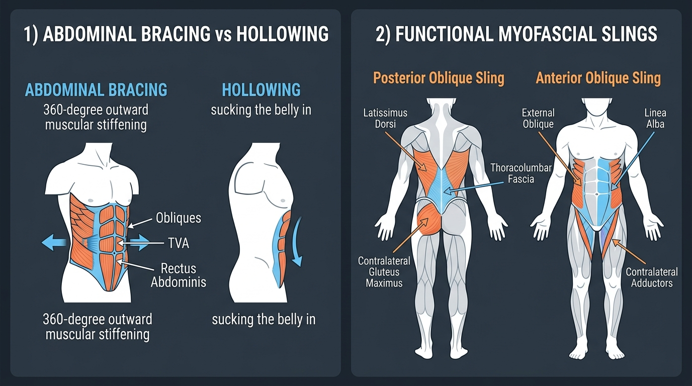

# Day 18: Biomechanics of Core Bracing & Posterior Chain Slings

- **Estimated Study Time:** 25 minutes
- **Anatomical Focus:** Dr. Stuart McGill's Abdominal Bracing vs. Hollowing models, the Valsalva Maneuver, and Functional Myofascial Slings (Posterior Oblique Sling, Anterior Oblique Sling, Deep Longitudinal Sling).
- **Key Movement Application:** Generating maximum spinal stiffness for heavy deadlifts and squats, locking full-body tension in gymnastics Dragon Flags, and stabilizing the sacroiliac (SI) joints in **Setu Bandhasana (Bridge Pose)**.

---

## 🎯 Daily Learning Objectives
*   Master the biomechanical difference between **Abdominal Bracing ($360^\circ$ outward co-contraction)** and **Abdominal Hollowing (sucking the navel inward)**.
*   Understand how **Intra-Abdominal Pressure (IAP)** and the **Valsalva Maneuver** raise the spinal buckling threshold during maximal strength efforts.
*   Map the cross-body architecture of the **Posterior Oblique Sling (POS)** (Latissimus Dorsi $\leftrightarrow$ Thoracolumbar Fascia $\leftrightarrow$ Contralateral Gluteus Maximus).
*   Map the **Anterior Oblique Sling (AOS)** and understand how it stabilizes the pelvis during rotational sports and calisthenics.

---

## 📖 Core Anatomical Concept

### 🛡️ 1. Abdominal Bracing vs. Abdominal Hollowing (Dr. Stuart McGill)

When stabilizing the lumbar spine under heavy external loads, the technique used to engage the abdominal wall fundamentally changes spinal stiffness:

| Feature | Abdominal Bracing ✅ *(Optimal for Load)* | Abdominal Hollowing ❌ *(Sub-optimal for Load)* |
| :--- | :--- | :--- |
| **Physical Action** | **$360^\circ$ outward co-contraction** of all abdominal layers as if preparing to take a punch to the stomach. | Sucking the navel inward toward the spine, narrowing the abdominal diameter. |
| **Muscular Recruitment** | **Simultaneous activation of ALL layers:** Transversus Abdominis, Internal Obliques, External Obliques, and Rectus Abdominis. | Isolates the Transversus Abdominis while relatively relaxing the obliques and rectus. |
| **Spinal Buckling Load** | **Multiplies spinal stability and stiffness by $>300\%$**; creates a wide, unyielding structural base. | Narrows the base of support; **decreases resistance to rotational and lateral bending shear**. |
| **Ideal Movement Context** | Heavy Barbell Squats, Deadlifts, Gymnastics Planches, Dragon Flags, and contact sports. | Low-load clinical rehabilitation, motor retraining for deep TVA activation, and specific yogic pranayama (**Uddiyana Bandha**). |

---

### 💨 2. The Valsalva Maneuver: Physics & Hemodynamics

The **Valsalva Maneuver** is the forced exhalation against a closed airway (closed **Glottis**):
1.  **Mechanical Mechanism:** Taking a deep diaphragmatic breath ($\sim 75–80\%$ capacity) and holding it while forcefully contracting the abdominal wall spikes Intra-Abdominal Pressure (IAP) to $>150–200\,\text{mmHg}$.
2.  **Spine Protection:** This pneumatic pressure expands outward in all directions, turning the abdominal cavity into a rigid hydraulic beam that splints the anterior lumbar spine.
3.  **Cardiovascular Safety Note:** The extreme internal pressure temporarily elevates arterial blood pressure and restricts venous return to the heart. *Guideline:* Use only during heavy, short-duration maximum effort lifts ($1–5$ reps); avoid in individuals with uncontrolled hypertension.

---

### 🕸️ 3. Master Matrix: The 4 Functional Myofascial Kinetic Slings

Muscles do not work as isolated levers; they are linked through dense fascial sheets into functional anatomical slings that transfer force across the torso:

| Myofascial Sling | Anatomical Component Linkages | Primary Force Transmission Vector | Athletic & Movement Translation |
| :--- | :--- | :--- | :--- |
| **1. Posterior Oblique Sling (POS)** | • **Latissimus Dorsi** • **Thoracolumbar Fascia (TLF)** • **Contralateral Gluteus Maximus** | Forms an expansive **"X" across the posterior back**; crosses the Sacroiliac (SI) joint diagonally. | Compresses and locks the SI joint during single-leg stance, walking, sprinting, and the lockout of a deadlift or kettlebell swing. |
| **2. Anterior Oblique Sling (AOS)** | • **External Oblique** • **Abdominal Fascia / Linea Alba** • **Contralateral Internal Oblique & Adductor Longus/Magnus** | Forms an **"X" across the anterior torso**, linking the ribs to the opposite inner thigh. | Drives rotational power in throwing, punching, swinging a bat, and holding a **Human Flag**. |
| **3. Deep Longitudinal Sling (DLS)** | • **Erector Spinae** • **Sacrotuberous Ligament** • **Biceps Femoris** (Hamstring) • **Fibularis (Peroneus) Longus** | Runs vertically from the suboccipital skull down the posterior leg to the sole of the foot. | Transmits ground reaction forces from the foot up into the pelvis; stabilizes the knee and hip in sprinting. |
| **4. Lateral Sling** | • **Gluteus Medius & Minimus** • **Tensor Fasciae Latae (TFL) / IT Band** • **Contralateral Quadratus Lumborum (QL)** | Forms a lateral coronal stabilizer loop across the pelvis. | Prevents frontal-plane hip drop (**Trendelenburg gait**); stabilizes single-leg yoga poses (**Virabhadrasana III**). |

---

## 🎨 Visual Diagram

Here is a 3D medical visual atlas detailing Abdominal Bracing vs. Hollowing and the crossed anatomy of the Posterior and Anterior Oblique Slings:

---

## 🔄 Movement Application (Calisthenics & Yoga)

### 🤸 1. Calisthenics: The Bruce Lee Dragon Flag
*   **The Biomechanics:** The **Dragon Flag** is an extreme test of anterior core anti-extension. The athlete pivots on the upper back while keeping the entire body suspended in a straight line.
*   **The Sling Connection:** Requires maximal **Posterior Oblique Sling** engagement (Lats pulling down on the bench while Glutes extend the hips) combined with maximal **Anterior Oblique Sling** bracing to prevent the lumbar spine from collapsing into extension.

---

### 🧘 2. Yoga: Sacroiliac Joint Locking in Bridge Pose

#### Setu Bandhasana (Bridge Pose): Firing the Posterior Oblique Sling
*   **The Error:** Squeezing only the hamstrings, which drags the pelvis forward and shears the sacroiliac (SI) joints.
*   **The Biomechanics:** Press the feet down and actively **squeeze the Gluteus Maximus** while isometrically drawing the upper arms/shoulders down into the mat (**Latissimus Dorsi**). This recruits the **Posterior Oblique Sling**, pulling the dense Thoracolumbar Fascia taut and securely compressing the SI joint for pain-free pelvic elevation.

---

## 🔬 Biomechanics Lab: Desk-side Drill

Feel the difference between hollowing and bracing right now:

### Drill 1: The $360^\circ$ Abdominal Bracing Finger Test
1.  Place your thumbs on your lower back muscles (**Quadratus Lumborum / Erector Spinae**) and your index fingers on the sides of your waist (**Internal/External Obliques**).
2.  **Hollowing Test:** Suck your stomach inward as far as you can. Notice how your fingers sink in and your sides go soft and narrow.
3.  **Bracing Test:** Now, pretend someone is about to punch you hard in the stomach. **Stiffen your entire torso outward in all directions ($360^\circ$) without sucking in or pushing your gut out**.
4.  *Notice:* Your fingers on your sides and your thumbs on your lower back are forcefully pushed outward by a rock-hard muscular wall! This is **True Abdominal Bracing**.

---

## 🧠 Daily Knowledge Check

Test your mastery of core bracing and myofascial slings:

### Questions
1.  **Biomechanics Theory:** Why does Dr. Stuart McGill recommend **Abdominal Bracing** over Abdominal Hollowing for heavy spinal load-bearing?
2.  **Anatomical Sling:** Which three primary structures form the **Posterior Oblique Sling (POS)** across the lower back?
3.  **Physiology:** What occurs inside the abdominal cavity during the **Valsalva Maneuver**, and what is its primary biomechanical benefit?
4.  **Force Transmission:** In athletic throwing or punching, which myofascial sling transmits rotational kinetic energy from the trail hip to the opposite shoulder?
5.  **Yoga Translation:** During **Setu Bandhasana (Bridge Pose)**, how does co-contracting the Gluteus Maximus and Latissimus Dorsi protect the sacroiliac joints?

---

🔑 Click to reveal answers and explanations

### Answers & Explanations

1.  **Answer:** Abdominal Bracing activates **all three abdominal muscle layers (TVA, Obliques, Rectus)** simultaneously in a $360^\circ$ co-contraction, creating a wide structural base that **maximizes spinal stiffness and raises the buckling load threshold by $>300\%$**. Hollowing narrows the base of support and leaves the spine vulnerable to rotational and shearing forces.
2.  **Answer:** The **Latissimus Dorsi**, the **Thoracolumbar Fascia (TLF)**, and the **Contralateral Gluteus Maximus**.
3.  **Answer:** Forcible exhalation against a closed glottis spikes **Intra-Abdominal Pressure (IAP)**, turning the abdominal cavity into a pressurized hydraulic beam that directly supports the anterior lumbar spine and reduces disc compressive strain.
4.  **Answer:** The **Anterior Oblique Sling (AOS)** (connecting the Adductor Longus/Magnus of one hip across the abdominal obliques and linea alba to the opposite pectoral/shoulder girdle).
5.  **Answer:** Squeezing the Gluteus Maximus and pulling with the Latissimus Dorsi tensions the **Thoracolumbar Fascia**, generating a force-closure mechanism that firmly **compresses and locks the Sacroiliac (SI) Joint**, preventing painful micro-shearing.

---

## 🔗 Connected Guides & References
*   **[Master Muscle Directory](../../muscles/README.md)**
*   **[Pose Correction: Setu Bandhasana](../../pose_corrections/yoga/setu_bandhasana.md)**
*   **[Day 17: The Core: Deep Stabilizers vs. Superficial Movers](../day-017-core-stabilizers/README.md)**
*   **[Day 19: Spinal Extension and Backbends](../day-019-spine-extension-backbends/README.md)**
