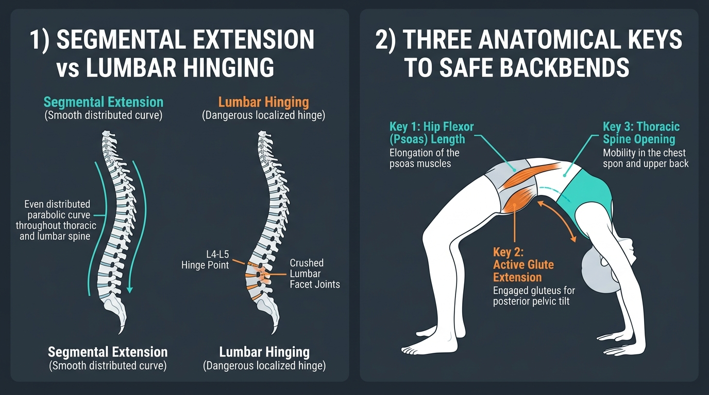

# Day 19: Spinal Extension and Backbends

- **Estimated Study Time:** 25 minutes
- **Anatomical Focus:** Segmental vs. Hinge-point Spinal Extension, the Anterior Longitudinal Ligament (ALL), Facet Joint Kinematics, and Spondylolysis Prevention.
- **Key Movement Application:** Safe execution of advanced backbends (**Bhujangasana**, **Urdhva Dhanurasana**, **Ustrasana**), distributing extension across the thoracic spine, and eliminating lumbar pinching.

---

## 🎯 Daily Learning Objectives
*   Master the functional anatomy of the spinal extensor engines (**Erector Spinae**, **Multifidus**, **Semispinalis**).
*   Understand the protective role of the **Anterior Longitudinal Ligament (ALL)** in resisting excessive spinal hyperextension.
*   Diagnose the **"Lumbar Hinge Point"** pathology and how it leads to **Facet Joint Impingement** and **Spondylolysis** (pars interarticularis fractures).
*   Apply the **Three Anatomical Keys** (Thoracic Mobility, Hip Extension, and Glute Stabilization) to achieve a pain-free, parabolic backbend.

---

## 📖 Core Anatomical Concept

### 🏹 1. Segmental Extension vs. The Lumbar Hinge Point

The human spine is designed to distribute backward bending into a **smooth parabolic arch** across all 24 articulating vertebrae:

```
PARABOLIC SEGMENTAL EXTENSION ✅        THE LUMBAR HINGE POINT TRAP ❌
      (Smooth, even curve)             (Acute pivot crushing L4-L5)

           (  Cervical )                      |  Stiff Neck
          (   Thoracic  )                     |  Stiff Thoracic Spine (0° extension)
         (     Lumbar    )                    >  L4-L5 CRUSH POINT (Facet Impingement!)
        (      Sacral     )                   |  Locked Hips (0° extension)
```

| Structural Segment | Normal Anatomical Extension ROM | Biomechanical Role in Backbends | Consequence When Restricted |
| :--- | :---: | :--- | :--- |
| **1. Cervical Spine** *(C1–C7)* | **$35^\circ – 40^\circ$** | Extends the neck to track upward; supported by **Longus Colli** to prevent neck pinching. | Hyperextending only at C1–C2 crushes the suboccipital nerves, causing dizziness and cervical spasm. |
| **2. Thoracic Spine** *(T1–T12)* | **$20^\circ – 25^\circ$** | **The Most Critical Zone:** Opens the heart/chest; facet joints slide inferiorly to create an expansive curve. | Chronic desk stiffness ($0^\circ$ extension) dumps **$100\%$ of backbend load into the fragile lumbar spine**. |
| **3. Lumbar Spine** *(L1–L5)* | **$25^\circ – 30^\circ$** | Contributes moderate lordotic extension; vertebral bodies compress posterior disc edges. | Excessive localized hinge causes **Posterior Facet Joint Arthrosis** and **Kissing Spines (Baastrup disease)**. |
| **4. Hip Joints** *(Acetabulofemoral)* | **$15^\circ – 20^\circ$** | **The True Powerhouse:** True hip extension allows the pelvis to shift forward without spinal arching. | Tight **Iliopsoas** blocks hip extension, forcing the athlete to hyperextend the lower back instead. |

---

### 🛡️ 2. The Anterior Longitudinal Ligament (ALL) & Facet Mechanics

*   **The Anterior Longitudinal Ligament (ALL):** A broad, exceptionally thick fibrous band running along the entire anterior surface of all vertebral bodies from the occiput to the sacrum. It is the **only ligament in the human spine that actively resists hyperextension**.
*   **Posterior Facet Joint Contact:** As the spine extends backward, the **Inferior Articular Facets** of the upper vertebra slide downward onto the **Superior Articular Facets** of the lower vertebra.
*   **The Pathology (Spondylolysis):** Repetitive, forceful hyperextension with tight hips causes violent bone-on-bone impact between facet bones, creating fatigue micro-fractures in the thin bony bridge called the **Pars Interarticularis** (most commonly at **L5–S1**).

---

### 🔑 3. The Three Anatomical Keys to Safe Backbends

| Anatomical Key | Muscle Groups Involved | Biomechanical Action | Why It Saves Your Lower Back |
| :--- | :--- | :--- | :--- |
| **Key 1: Hip Flexor Length** | **Iliopsoas**, **Rectus Femoris**, **TFL** | Allows the anterior pelvis to open into $20^\circ$ of pure hip extension. | Eliminates the need to compensate by over-arching the lumbar spine. |
| **Key 2: Active Glute Extension** | **Gluteus Maximus** + **Adductor Magnus** | Drives the hips forward while keeping knees parallel (preventing duck-foot splay). | Locks the pelvis in stable alignment; protects sacroiliac (SI) joints. |
| **Key 3: Thoracic & Shoulder Opening** | **Erector Spinae (Thoracic)**, **Serratus Anterior**, **Lower Traps** | Extends the rib cage and achieves full $180^\circ$ overhead arm reach. | Lifts the chest upward, decompressing the lower lumbar discs. |

---

## 🎨 Visual Diagram

Here is a 3D medical visual atlas detailing segmental spinal extension vs. the lumbar hinge trap, and the three anatomical keys to safe backbends:



---

## 🔄 Movement Application (Yoga & Calisthenics)

### 🧘 1. Yoga: Mastering Wheel, Camel, and Cobra

#### Urdhva Dhanurasana (Wheel Pose / Upward Bow)
*   **The Error:** Knees flaring wide out to the sides ($45^\circ$ external rotation). This pinches the sacrum and shuts down the primary hip extension vector of the Gluteus Maximus.
*   **The Fix:** Keep feet parallel and track knees over the second toe. Internally rotate thighs slightly using the **Adductor Magnus**, press the floor away with hands and feet, and **push the chest toward the wall behind you** to drive thoracic extension.

#### Ustrasana (Camel Pose): The Hip Wall Rule
*   **The Cue:** *"Keep your hips glued to an imaginary vertical wall."*
*   **The Biomechanics:** Never lean backward from the knees with sagging hips. Press the pubic bone forward with the **Gluteus Maximus** to maintain vertical femur alignment ($90^\circ$ to the floor), lifting the sternum straight up to the ceiling before reaching back for the heels.

---

## 🔬 Biomechanics Lab: Desk-side Drill

Experience thoracic extension vs. lumbar hinging right now:

### Drill 1: The Thoracic Extension Chair Test
1.  Sit upright in a chair with a mid-height backrest. Interlace your fingers behind your neck to support your cervical spine (elbows forward).
2.  **Lumbar Hinge (Incorrect):** Arch your lower back away from the backrest. Notice the sharp, compressive pressure in your lower lumbar spine.
3.  **Thoracic Extension (Correct):** Now, keep your lower back flat against the chair. Inhale deeply, lift your chest upward, and **lean only your upper back over the top of the backrest**.
4.  *Notice:* You feel a wonderful, expansive stretch across your chest and mid-back (T1–T12) with **zero pinching in your lower back**!

---

## 🧠 Daily Knowledge Check

Test your mastery of spinal extension biomechanics:

### Questions
1.  **Ligament Anatomy:** What is the name of the thick, broad ligament running along the front of the vertebral bodies that serves as the primary restraint against spinal hyperextension?
2.  **Pathomechanics:** What is a **Lumbar Hinge Point**, and which two lumbar vertebrae most frequently suffer facet impingement as a result?
3.  **Clinical Pathology:** What is **Spondylolysis**, and which specific anatomical bone region of the vertebra suffers stress fractures from repetitive hyperextension?
4.  **Hip Biomechanics:** Why does having chronically tight **Iliopsoas** muscles increase lower back pain during backbends like **Urdhva Dhanurasana**?
5.  **Alignment Cue:** In **Urdhva Dhanurasana (Wheel Pose)**, why is it critical to keep the feet parallel and avoid letting the knees splay outward?

---

<details>
<summary>🔑 Click to reveal answers and explanations</summary>

### Answers & Explanations

1.  **Answer:** The **Anterior Longitudinal Ligament (ALL)**.
2.  **Answer:** A Lumbar Hinge Point occurs when a stiff thoracic spine and tight hips force all backward bending into an acute, isolated pivot point in the lower back, most commonly crushing the facet joints at **L4–L5 and L5–S1**.
3.  **Answer:** **Spondylolysis** is a mechanical stress fracture of the **Pars Interarticularis** (the narrow bony bridge between the superior and inferior articular facet processes of a vertebra).
4.  **Answer:** Tight Iliopsoas muscles block the hip from extending past neutral ($0^\circ$). To achieve a backbend, the athlete is forced to **excessively hyperlordose the lumbar spine** to compensate for the missing hip range of motion.
5.  **Answer:** Splaying the knees outward places the hips into extreme **external rotation**, which crowds the posterior sacroiliac (SI) joints and disables the deep hip extension line of the **Adductor Magnus**, increasing compressive torque on the lumbar spine.

</details>

---

## 🔗 Connected Guides & References
*   **[Skeletal Reference: Vertebrae & Thoracic Cage](../../bones/regions/02_vertebrae_thorax.md)**
*   **[Pose Correction: Urdhva Dhanurasana](../../pose_corrections/yoga/urdhva_dhanurasana.md)**
*   **[Pose Correction: Ustrasana](../../pose_corrections/yoga/ustrasana.md)**
*   **[Day 18: Biomechanics of Core Bracing & Slings](../day-018-core-bracing-posterior-chain/README.md)**
*   **[Day 20: Spinal Rotation and Lateral Flexion](../day-020-spine-rotation-flexion/README.md)**
