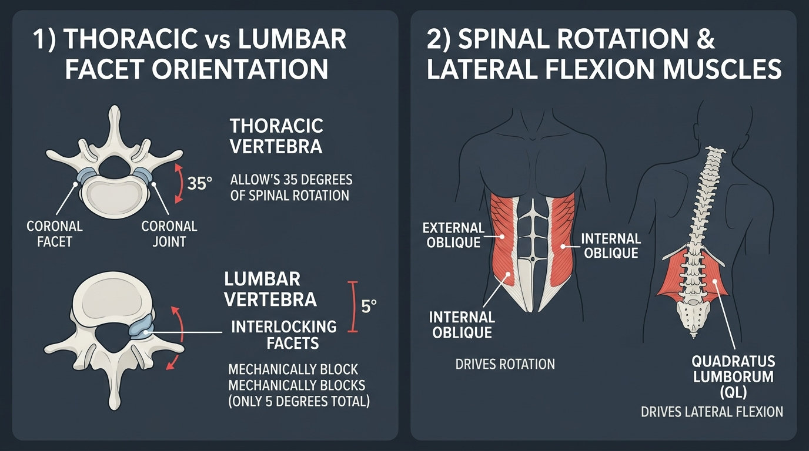

# Day 20: Spinal Rotation and Lateral Flexion

- **Estimated Study Time:** 25 minutes
- **Anatomical Focus:** Facet Joint Orientation (Thoracic Coronal $60^\circ$ vs. Lumbar Sagittal $90^\circ$), Torsional Disc Shearing Mechanics, the Oblique Rotational Force Couple, and Quadratus Lumborum (QL) Lateral Flexion.
- **Key Movement Application:** Safe execution of deep spinal twists in yoga (**Ardha Matsyendrasana**), lateral chain stability in the **Human Flag** and Side Planks, and preventing rotational disc herniations.

---

## 🎯 Daily Learning Objectives
*   Analyze how **Zygapophyseal (Facet) Joint Plane Orientations** dictate regional spinal mobility: Cervical ($45^\circ$), Thoracic ($60^\circ$ Coronal), and Lumbar ($90^\circ$ Sagittal).
*   Understand why the **Lumbar Spine has only $\sim 5^\circ$ of total axial rotation**, making it vulnerable to rotational disc tears.
*   Master the **Oblique Rotational Force Couple** (**Contralateral External Oblique** $+$ **Ipsilateral Internal Oblique**).
*   Map the functional anatomy of the **Quadratus Lumborum (QL)** in lateral flexion and pelvis elevation.

---

## 📖 Core Anatomical Concept

### 🧭 1. Facet Joint Orientations: Where Spinal Rotation Truly Occurs

The direction and degree of movement permitted at any spinal level is determined primarily by the spatial orientation of its **articular facet surfaces**:

| Spinal Region | Facet Plane Orientation | Permitted Movements | Rotational Capacity | Biomechanical Purpose |
| :--- | :--- | :--- | :---: | :--- |
| **1. Cervical** *(C1–C7)* | **$45^\circ$ between transverse & coronal planes** | Triaxial: Flexion, Extension, Lateral Flexion, and Rotation. | High ($45^\circ–50^\circ$) | Maximizes head tracking and 3D visual field navigation. |
| **2. Thoracic** *(T1–T12)* | **$60^\circ$ in the Coronal (Frontal) Plane** *(Surfaces face anterior-posterior like roof shingles)* | **Axial Rotation** and Lateral Flexion. *(Flexion/extension blocked by rib cage)*. | **Highest in Trunk ($30^\circ–35^\circ$)** | **The True Rotational Engine of the Torso:** Rotates freely without compressing discs. |
| **3. Lumbar** *(L1–L5)* | **$90^\circ$ in the Sagittal Plane** *(Vertical interlocking walls facing medial-lateral)* | **Flexion and Extension ONLY**. *(Bony facets physically crash into each other during rotation)*. | **Extremely Low ($<1^\circ$ per level / $\sim 5^\circ$ total)** | Built for massive axial load bearing; **bony locks prevent torsional twisting**. |

> [!CAUTION]
> **The Rotational Disc Injury Trap:** Because the lumbar facets physically block rotation after just $1^\circ$ of motion, forcing a heavy rotational twist through the lower back (e.g., throwing a heavy object while twisting) focuses **extreme torsional shear onto the Annulus Fibrosus**, peeling its collagen layers apart!

---

### 🔄 2. The Oblique Rotational Force Couple

Axial trunk rotation is driven by the coordinated cross-body synergy of the internal and external abdominal obliques:

```
            RIGHT AXIAL TRUNK ROTATION (Turning chest to the Right)
                              │
             ┌────────────────┴────────────────┐
             ▼                                 ▼
   LEFT EXTERNAL OBLIQUE              RIGHT INTERNAL OBLIQUE
(Pulls left ribcage toward right hip) (Pulls right hip toward right ribcage)
```

*   **Rule of Oblique Synergy:** To rotate the torso to the **RIGHT**, you must fire the **LEFT External Oblique** (contralateral rotator) paired with the **RIGHT Internal Oblique** (ipsilateral rotator).
*   **Deep Segmental Rotators:** Beneath the obliques, the tiny **Rotatores** and **Multifidus** muscles fire to guide micro-rotation across individual thoracic vertebrae.

---

### 🧱 3. The Quadratus Lumborum (QL) & Lateral Flexion

The **Quadratus Lumborum (QL)** is an expansive quadrangular muscle in the deep posterior abdominal wall:
*   **Origin:** Posterior Iliac Crest and Iliolumbar Ligament.
*   **Insertion:** 12th Rib and Transverse Processes of L1–L4.
*   **Actions:**
    1.  **Unilateral Contraction:** Lateral Flexion of the lumbar spine and **"Hip Hiking"** (elevating the pelvis on one side).
    2.  **Bilateral Contraction:** Fixes the 12th rib during forced exhalation; assists lumbar extension.
    3.  **Frontal Plane Stability:** In side planks and the **Human Flag**, the lower-side QL contracts isometrically with the Gluteus Medius to prevent the pelvis from sagging.

---

## 🎨 Visual Diagram

Here is a 3D medical visual atlas detailing thoracic vs. lumbar facet orientations and the muscle mechanics of spinal rotation and lateral flexion:



---

## 🔄 Movement Application (Yoga & Calisthenics)

### 🧘 1. Yoga: Ardha Matsyendrasana (Half Lord of the Fishes)
*   **The Error:** Forcing the twist by wrenching the lumbar spine with the arms while keeping the chest locked.
*   **The Biomechanics:** Initiate the twist by **lengthening the spine axially (axial decompression)**. Drive the rotation through the **Thoracic Spine (T1–T12)** where the coronal facets are designed to glide, keeping the pelvis grounded and the lumbar spine stable.

---

### 🤸 2. Calisthenics: The Human Flag Lateral Kinetic Chain
*   **The Demand:** The **Human Flag** is the ultimate test of lateral trunk anti-flexion. Gravity exerts a massive downward bending moment on the suspended horizontal body.
*   **The Muscular Sling:** The bottom-side **Quadratus Lumborum**, **Internal/External Obliques**, **Transversus Abdominis**, and **Gluteus Medius** contract at peak isometric intensity to hold the spine perfectly straight.

---

## 🔬 Biomechanics Lab: Desk-side Drill

Feel the difference between thoracic rotation and lumbar locking right now:

### Drill 1: The Seated Thoracic Twist Isolation
1.  Sit firmly at the edge of a hard chair with your knees squeezed together (this locks your pelvis and lumbar spine completely in place).
2.  Cross your arms over your chest, placing hands on opposite shoulders.
3.  **Rotate your torso to the right as far as you can without moving your hips or knees.**
4.  *Notice:* You can comfortably rotate $\sim 35^\circ$. All of that motion is happening in your **Thoracic Spine (T1–T12)** and neck, while your lumbar spine remains securely locked!

---

## 🧠 Daily Knowledge Check

Test your mastery of spinal rotation and lateral mechanics:

### Questions
1.  **Facet Joint Anatomy:** Why does the **Thoracic Spine** allow significant axial rotation ($35^\circ$), whereas the **Lumbar Spine** permits almost none ($5^\circ$)?
2.  **Muscular Synergy:** If you are rotating your torso to the **LEFT**, which External Oblique and which Internal Oblique are contracting?
3.  **Muscle Function:** What is the primary lateral flexor muscle of the lower back that connects the iliac crest to the 12th rib and L1–L4 transverse processes?
4.  **Injury Prevention:** Why is lifting a heavy load while simultaneously twisting the lumbar spine one of the leading causes of acute disc herniations?
5.  **Yoga Translation:** In **Ardha Matsyendrasana (Seated Spinal Twist)**, why should the practitioner focus on rotating from the upper/mid back rather than wrenching the lower back?

---

<details>
<summary>🔑 Click to reveal answers and explanations</summary>

### Answers & Explanations

1.  **Answer:** Thoracic facet joints are oriented in the **Coronal Plane ($60^\circ$)**, allowing flat articular sliding during rotation. Lumbar facet joints are oriented in the **Sagittal Plane ($90^\circ$)**, forming interlocking vertical bony barriers that mechanically block axial rotation after just $1^\circ$ per segment.
2.  **Answer:** The **RIGHT External Oblique** (contralateral rotator) and the **LEFT Internal Oblique** (ipsilateral rotator).
3.  **Answer:** The **Quadratus Lumborum (QL)**.
4.  **Answer:** In axial rotation, only half of the cross-ply collagen fibers in the **Annulus Fibrosus** are positioned to resist tension, reducing disc strength by $50\%$. Adding heavy compressive flexion creates extreme torsional shear that tears the annular lamellae, pushing the nucleus pulposus outward.
5.  **Answer:** The **Thoracic Spine** has the structural anatomical capacity ($35^\circ$) for safe rotation. The lumbar spine has only $5^\circ$ of rotational freedom; wrenching the lower back overstretches facet capsules and strains the annular fibers of the discs.

</details>

---

## 🔗 Connected Guides & References
*   **[Skeletal Reference: Vertebrae & Thoracic Cage](../../bones/regions/02_vertebrae_thorax.md)**
*   **[Master Muscle Directory](../../muscles/README.md)**
*   **[Day 19: Spinal Extension and Backbends](../day-019-spine-extension-backbends/README.md)**
*   **[Day 21: Structural Postural Assessment & Module 3 Exam](../day-021-postural-assessment/README.md)**
