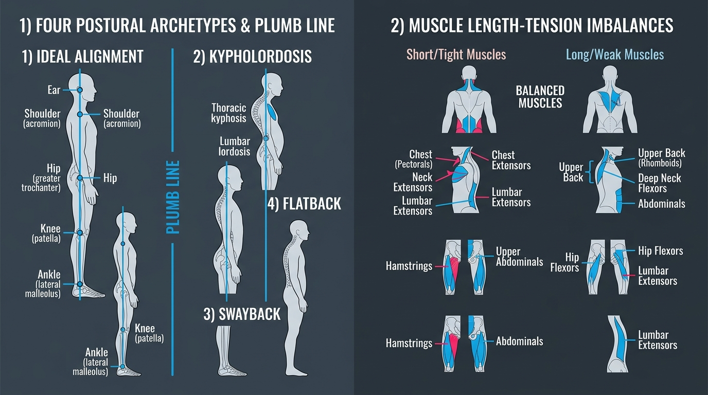

# Day 21: Structural Postural Assessment & Module 3 Comprehensive Exam

- **Estimated Study Time:** 35 minutes
- **Anatomical Focus:** Kendall's Plumb Line Postural Screening, the 4 Classic Postural Archetypes (Ideal, Kypholordosis, Swayback, Flatback), Muscle Length-Tension Imbalances, and **Module 3 Comprehensive Mastery Assessment**.
- **Key Movement Application:** Performing full-body postural audits, identifying kinetic compensations in calisthenics static holds (Planches, Levers), and restoring neutral alignment in **Tadasana (Mountain Pose)**.

---

## 🎯 Daily Learning Objectives
*   Master the 5 anatomical landmarks of the **Ideal Static Plumb Line**.
*   Diagnose and differentiate the **4 Classic Postural Archetypes** (Ideal, Kypholordosis, Swayback, Flatback).
*   Map the specific **Short/Overactive** vs. **Lengthened/Underactive** muscle imbalances for each archetype.
*   Pass the **Module 3 Comprehensive Board-Style Exam** covering Vertebral Curvatures, Disc Mechanics, Pelvic Tilts, Deep Core Canister (IAP), Oblique Slings, Spinal Extension, and Rotation.

---

## 📖 Core Anatomical Concept

### 📐 1. The Ideal Static Plumb Line Reference

When viewed from the sagittal side profile, a vertical gravitational plumb line should pass directly through five key anatomical landmarks:

```
PLUMB LINE
    │
    ├──── 1. External Auditory Meatus (Ear Canal)
    │
    ├──── 2. Acromion Process (Tip of Shoulder)
    │
    ├──── 3. Greater Trochanter of the Femur (Hip Joint)
    │
    ├──── 4. Just Anterior to the Midline of the Knee (Patella / Joint Axis)
    │
    ├──── 5. Just Anterior to the Lateral Malleolus (Ankle Bone)
    ▼
```

---

### 🏛️ 2. Master Matrix: The 4 Classic Postural Archetypes (Kendall)

| Postural Archetype | Pelvic & Spinal Alignment | Head & Knee Position | Short / Overactive Muscles (Tight) | Lengthened / Inhibited Muscles (Weak) |
| :--- | :--- | :--- | :--- | :--- |
| **1. Ideal Alignment** | • Neutral Pelvis<br>• Balanced natural lordosis/kyphosis | • Head neutral over shoulders<br>• Knees straight (not locked) | Balanced length-tension across all muscle groups. | Balanced neurological recruitment. |
| **2. Kypholordosis** | • **Anterior Pelvic Tilt (APT)**<br>• Exaggerated **Lumbar Lordosis**<br>• Exaggerated **Thoracic Kyphosis** | • Forward Head Posture<br>• Shoulders internally rotated | • **Hip Flexors** (Iliopsoas, Rectus Femoris)<br>• **Lumbar Erectors**<br>• **Pectorals / Suboccipitals** | • **Gluteus Maximus & Medius**<br>• **Transversus Abdominis (TVA)**<br>• **Rhomboids / Lower Traps**<br>• **Deep Cervical Flexors** |
| **3. Swayback** *(Desk Sloucher)* | • **Pelvis shifted ANTERIOR** to plumb line<br>• Posterior trunk lean<br>• Flattened lower lumbar spine | • Severe Forward Head<br>• **Hyperextended Knees** *(Genu Recurvatum)* | • **Hamstrings**<br>• **Upper Abdominals (Rectus)**<br>• **Internal Obliques** | • **Iliopsoas** *(Lengthened/Weak)*<br>• **Gluteus Maximus**<br>• **External Obliques**<br>• **Lower Trapezius** |
| **4. Flatback** | • **Posterior Pelvic Tilt (PPT)**<br>• Flattened Lumbar Lordosis<br>• Flattened Thoracic Spine | • Forward Head<br>• Knees slightly extended or flexed | • **Hamstrings**<br>• **Rectus Abdominis** | • **Hip Flexors (Iliopsoas)**<br>• **Lumbar Erector Spinae**<br>• **Multifidus** |

---

### ⚠️ 3. Clinical Implications of Postural Deviation

1.  **Kypholordosis:** Concentrates heavy compressive facet joint loading at **L4–L5/L5–S1**, increases risk of spondylolysis, and narrows the subacromial space.
2.  **Swayback:** The athlete rests passively on the **Iliofemoral Ligaments (Ligament of Bigelow)** and anterior hip capsule rather than using active muscular support, causing chronic hip labral impingement and upper thoracic fatigue.
3.  **Flatback:** The loss of natural lordotic shock absorption means ground reaction forces from walking or running are transmitted as **direct axial shockwaves into the intervertebral discs**, accelerating degenerative disc disease (DDD).

---

## 🎨 Visual Diagram

Here is a 3D medical visual atlas detailing the 4 Postural Archetypes, the plumb line landmarks, and their associated muscle length-tension imbalances:



---

## 🔄 Movement Application (Yoga & Calisthenics)

### 🧘 1. Yoga: Restoring Anatomical Neutral in Tadasana

#### Tadasana (Mountain Pose): The Full-Body Alignment Audit
*   **The Cueing Protocol:**
    1.  **Feet:** Ground evenly through the tripod of the foot (1st MT, 5th MT, Heel).
    2.  **Pelvis:** Align the ASIS and PSIS horizontally into **Pelvic Neutral**; activate **Mula Bandha**.
    3.  **Rib Cage:** Draw the lower ribs gently in toward the spine (engaging the **Transversus Abdominis** corset) without flattening the thoracic spine.
    4.  **Crown:** Lengthen the occiput upward, tucking the chin slightly to activate the **Deep Cervical Flexors (Longus Colli)**.

---

# 🎓 Module 3 Comprehensive Mastery Assessment

*Answer these 10 board-style clinical and movement biomechanics questions covering all of Module 3 (Days 15–21).*

### Questions

1.  **Spinal Curvatures (Day 15):** Name the two **Secondary Curves** of the human spine and explain what milestone triggers their development in infants.
2.  **Disc Pathology (Day 15):** Why does 95% of lumbar disc herniation occur in a **posterolateral direction** at the L4–L5 or L5–S1 level?
3.  **Pelvic Tilts (Day 16):** In **Lower Crossed Syndrome**, what occurs to the resting length and tone of the **Iliopsoas** versus the **Gluteus Maximus**?
4.  **Single-Leg Stability (Day 16):** An athlete exhibits a positive **Trendelenburg Sign** (left hip drops when standing on the right leg). Which muscle is deficient?
5.  **Core Canister (Day 17):** Name the four anatomical muscular boundaries forming the roof, floor, front/sides, and back of the **Intra-Abdominal Pressure (IAP) Canister**.
6.  **Motor Control (Day 17):** What is the functional difference between the **Local Core Stabilizer System** and the **Global Core Mover System**?
7.  **Core Bracing (Day 18):** Why does Dr. Stuart McGill recommend **$360^\circ$ Abdominal Bracing** over Abdominal Hollowing for heavy spinal loading?
8.  **Myofascial Slings (Day 18):** Which muscles and fascial structures form the **Posterior Oblique Sling (POS)** across the lower back and sacroiliac joint?
9.  **Spinal Extension (Day 19):** What is a **Lumbar Hinge Point**, and what bony fracture (**Spondylolysis**) can result from repetitive hyperextension?
10. **Spinal Rotation (Day 20):** Why does the **Thoracic Spine permit $35^\circ$ of axial rotation**, whereas the **Lumbar Spine permits only $5^\circ$**?

---

<details>
<summary>🔑 Click to reveal Module 3 Exam Answer Key & Explanations</summary>

### Answer Key & Explanations

1.  **Answer:** The **Cervical Lordosis** (develops when the infant learns to hold up the head at $3–4$ months) and the **Lumbar Lordosis** (develops when standing and walking upright at $12–18$ months).
2.  **Answer:** The thick **Posterior Longitudinal Ligament (PLL)** reinforces the direct midline of the posterior disc, deflecting herniating nucleus pulposus material laterally into the weaker posterolateral corridor where it directly compresses the exiting **Sciatic / Spinal Nerve Roots**.
3.  **Answer:** The **Iliopsoas becomes chronically short, hypertonic, and facilitated**, while the **Gluteus Maximus becomes reciprocal inhibited, lengthened, and dormant ("Gluteal Amnesia")**.
4.  **Answer:** The **Right Gluteus Medius** (the stance-leg hip abductor) is weak or inhibited, failing to stabilize the pelvis in the frontal plane.
5.  **Answer:**
    *   **Roof:** Respiratory Diaphragm
    *   **Floor:** Pelvic Floor (Levator Ani & Coccygeus)
    *   **Front/Sides:** Transversus Abdominis (TVA)
    *   **Back:** Lumbar Multifidus
6.  **Answer:** The **Local Stabilizers** (TVA, Multifidus) act in an **anticipatory / feedforward mode ($30–100\,\text{ms}$ before movement)** to provide non-directional inter-segmental stiffness. The **Global Movers** (Rectus Abdominis, Obliques) generate gross multi-planar torque (flexion, rotation).
7.  **Answer:** Abdominal Bracing activates **all 3 abdominal layers simultaneously in a $360^\circ$ ring**, creating a wide base of support that **multiplies spinal stiffness and raises the buckling load threshold by $>300\%$**, whereas hollowing narrows the base of support.
8.  **Answer:** The **Latissimus Dorsi**, the **Thoracolumbar Fascia (TLF)**, and the **Contralateral Gluteus Maximus**.
9.  **Answer:** A Lumbar Hinge Point occurs when restricted thoracic and hip extension concentrates all backward bending into an acute angle at L4–L5/L5–S1, causing facet joint crushing and fatigue stress fractures of the **Pars Interarticularis (Spondylolysis)**.
10. **Answer:** Thoracic facet joints are oriented in the **Coronal Plane ($60^\circ$)**, allowing smooth rotational sliding. Lumbar facet joints are oriented in the **Sagittal Plane ($90^\circ$)**, forming interlocking vertical bony barriers that physically block rotation after just $1^\circ$ per segment.

</details>

---

## 🔗 Connected Guides & References
*   **[Skeletal Reference: Vertebrae & Thoracic Cage](../../bones/regions/02_vertebrae_thorax.md)**
*   **[Master Muscle Directory](../../muscles/README.md)**
*   **[Master Pose Corrections Directory](../../pose_corrections/README.md)**
*   **[Module 4: Day 22 Pelvic Girdle & Hip Joint Mechanics](../day-022-hip-joint-mechanics/README.md)**
