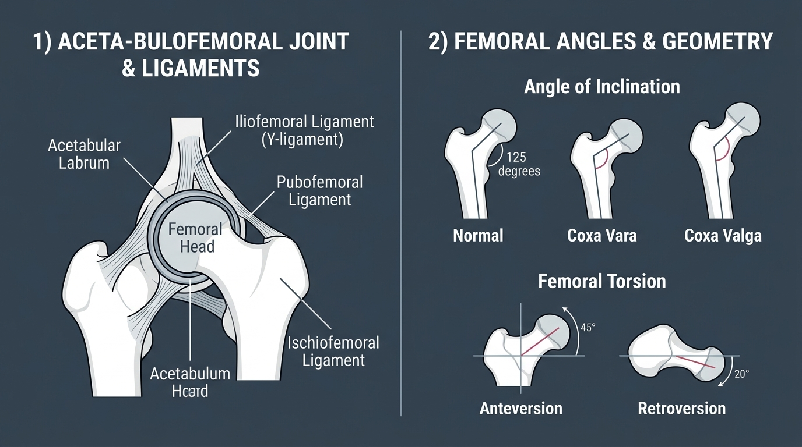

# Day 22: Hip Joint Anatomy & Bony Geometry

- **Estimated Study Time:** 25 minutes
- **Anatomical Focus:** Acetabulofemoral Ball-and-Socket Joint, Acetabular Labrum, Capsular Ligaments (Iliofemoral/Y-ligament, Pubofemoral, Ischiofemoral), Angle of Inclination (Coxa Vara vs. Coxa Valga), and Femoral Torsion (Anteversion vs. Retroversion).
- **Key Movement Application:** Customizing squat stance width based on individual bony hip morphology, preventing femoroacetabular impingement (FAI), and understanding hip mobility limits in **Baddha Konasana (Bound Angle Pose)** and **Prasarita Padottanasana**.

---

## 🎯 Daily Learning Objectives
*   Compare the high intrinsic bony stability of the **Acetabulofemoral (Hip) Joint** against the high mobility of the **Glenohumeral (Shoulder) Joint**.
*   Map the three primary spiraling capsular ligaments and explain why hip extension tightens the capsule (**Screw-Home of the Hip**).
*   Analyze the mechanical trade-offs of the **Angle of Inclination** (**Normal $125^\circ$**, **Coxa Vara $<120^\circ$**, **Coxa Valga $>135^\circ$**).
*   Differentiate between **Femoral Anteversion (in-toeing)** and **Femoral Retroversion (out-toeing)** and their impact on squat and yoga stance geometry.

---

## 📖 Core Anatomical Concept

### 🏺 1. The Acetabulofemoral Articulation & Labrum

The hip joint is a true multiaxial synovial ball-and-socket joint built for **heavy weight-bearing, locomotion, and multi-planar torque**:

| Structural Component | Anatomical Feature | Biomechanical Role |
| :--- | :--- | :--- |
| **1. Femoral Head** | Spherical convex bone forming $\sim \frac{2}{3}$ of a sphere; covered in thick ($2–3\,\text{mm}$) hyaline cartilage. | Articulates with the acetabulum; transmits ground reaction forces to the pelvis. |
| **2. Acetabulum** | Deep, cup-shaped socket formed by the confluence of the **Ilium, Ischium, and Pubis**. | Grips over $50\%$ of the femoral head at all times, providing massive passive bony stability. |
| **3. Acetabular Labrum** | Dense fibrocartilaginous horseshoe ring lining the acetabular rim. | **Deepens the socket by $21\%$**; creates a fluid-tight negative pressure seal that keeps the joint lubricated. |
| **4. Ligamentum Teres** | Triangular ligament running from the acetabular notch to the fovea capitis. | Contains the **acetabular branch of the obturator artery**, providing essential blood supply to the femoral head. |

---

### 🛡️ 2. The Capsular Ligament Complex

The hip joint is enclosed by a massive fibrous capsule reinforced by three spiraling ligaments that **wind tighter during Hip Extension** (the "Screw-Home" mechanism of the hip):

```
                                  ILIUM / PELVIS
                                  ┌────────────┐
                                  │            │
       ILIOFEMORAL (Y-LIGAMENT) ──┼────────────┼── PUBOFEMORAL LIGAMENT
       (Resists Hyperextension)   │  FEMORAL   │   (Resists Abduction & Extension)
                                  │    HEAD    │
       ISCHIOFEMORAL LIGAMENT ────┼────────────┼──
       (Posterior - Resists IR)   │            │
                                  └────────────┘
```

*   **Iliofemoral Ligament (Y-Ligament of Bigelow):** The **strongest ligament in the human body** (tensile strength $>350\,\text{kg}$). Spans from the AIIS to the intertrochanteric line. It prevents the pelvis from tilting backward over the femur during upright standing, allowing relaxed standing with zero muscular effort!
*   **Pubofemoral Ligament:** Runs from pubic ramus to capsule; checks excessive hip abduction and extension.
*   **Ischiofemoral Ligament:** Posterior spiral from ischium to neck; checks internal rotation and adduction.

---

### 📐 3. Master Matrix: Femoral Angles & Bony Geometry

Individual hip mobility is heavily dictated by congenital bony architecture:

| Geometric Parameter | Normal Alignment | Varus / Retroverted Variant | Valgus / Anteverted Variant | Movement Translation |
| :--- | :---: | :--- | :--- | :--- |
| **1. Angle of Inclination**<br>*(Frontal Plane angle between femoral neck & shaft)* | **$125^\circ$** *(Adult)* | **Coxa Vara ($<120^\circ$):** Neck is more horizontal.<br>• *Benefit:* Longer abductor moment arm.<br>• *Risk:* High shearing stress on femoral neck (fracture risk). | **Coxa Valga ($>135^\circ$):** Neck is more vertical.<br>• *Benefit:* Decreased femoral neck shear.<br>• *Risk:* Short abductor moment arm; predisposes to hip subluxation. | Dictates single-leg pelvic stabilization efficiency and joint loading profiles. |
| **2. Femoral Torsion**<br>*(Transverse Plane angle of neck relative to condyles)* | **$\sim 15^\circ$ Anteversion** | **Femoral Retroversion ($<10^\circ$):** Neck rotated backward.<br>• *Movement:* High **External Rotation**; low Internal Rotation. | **Excessive Anteversion ($>25^\circ–35^\circ$):** Neck rotated forward.<br>• *Movement:* High **Internal Rotation**; low External Rotation (In-toeing gait). | • **Retroversion:** Natural wide stance squatter; thrives in **Baddha Konasana**.<br>• **Anteversion:** Pigeon-toed; thrives in **Virasana (Hero Pose)**. |

---

## 🎨 Visual Diagram

Here is a 3D medical visual atlas detailing the acetabulofemoral joint, capsular ligaments, and the geometric variations in the angle of inclination and femoral torsion:



---

## 🔄 Movement Application (Calisthenics & Yoga)

### 🤸 1. Calisthenics: Customizing Squat Stance Width
*   **The Error:** Forcing every athlete to squat with narrow feet pointed dead-straight forward.
*   **The Biomechanics:** An athlete with **Femoral Retroversion** or deep acetabular rims will suffer bone-on-bone impingement (Femoroacetabular Impingement - FAI) if forced into a narrow stance. Allowing them to take a wider stance with $20^\circ–30^\circ$ of toe flare aligns the femoral neck directly with the acetabular notch, achieving a pain-free, deep rock-bottom squat.

---

### 🧘 2. Yoga: Baddha Konasana & Structural Limitations

#### Baddha Konasana (Bound Angle Pose / Butterfly)
*   **The Trap:** Forcing the knees down to the floor when bony retroversion or acetabular depth blocks external rotation.
*   **The Biomechanics:** External hip rotation in **Baddha Konasana** is limited by the collision of the **Greater Trochanter** against the ilium and the tension of the **Iliofemoral Ligament**. Never force the knees down with external pressure—respect the individual's bony femoral architecture!

---

## 🔬 Biomechanics Lab: Desk-side Drill

Diagnose your natural femoral torsion right now:

### Drill 1: The Craig's Test (Self-Check for Hip Version)
1.  Lie on your stomach or sit at the edge of a chair with knees bent at $90^\circ$.
2.  Let your feet swing outward away from each other (**Internal Hip Rotation**).
3.  Now, let your feet swing inward crossing past each other (**External Hip Rotation**).
4.  *Compare:* 
    *   If your feet swing effortlessly outward ($>45^\circ$) but barely inward, you have **Femoral Anteversion**.
    *   If your feet swing easily inward ($>45^\circ$) but lock up when going outward, you have **Femoral Retroversion** (you are a natural wide-stance squatter!).

---

## 🧠 Daily Knowledge Check

Test your mastery of hip joint geometry and capsular anatomy:

### Questions
1.  **Ligament Anatomy:** What is the strongest ligament in the human body, and what hip movement does it restrict to allow relaxed upright standing?
2.  **Socket Comparison:** Why is the Acetabulofemoral joint significantly more stable and resistant to dislocation than the Glenohumeral joint?
3.  **Bony Geometry:** How does **Coxa Vara ($<120^\circ$)** alter the mechanical advantage of the hip abductors (**Gluteus Medius**) compared to Coxa Valga?
4.  **Torsion Kinematics:** An athlete naturally stands with their toes pointed outward ("duck-footed") and has exceptional external hip rotation. What femoral torsion variant do they possess?
5.  **Movement Translation:** Why can forcing a narrow, parallel-foot squat cause hip pinching in an athlete with femoral retroversion?

---

<details>
<summary>🔑 Click to reveal answers and explanations</summary>

### Answers & Explanations

1.  **Answer:** The **Iliofemoral Ligament (Y-Ligament of Bigelow)**, which resists **Hip Hyperextension**, allowing humans to stand upright with minimal active muscular energy by resting on the taut anterior capsule.
2.  **Answer:** The **Acetabulum is a deep bony cup** enclosing $>50\%$ of the femoral head, reinforced by a complete fibrous labrum and massive capsular ligaments. (The shoulder's glenoid covers only $\sim 25\%$ of the humeral head).
3.  **Answer:** Coxa Vara places the femoral neck more horizontally, **increasing the moment arm of the Gluteus Medius**, making it mechanically easier to generate hip abduction torque (though it increases bone bending shear across the femoral neck).
4.  **Answer:** **Femoral Retroversion** (the femoral neck is rotated posteriorly relative to the femoral condyles).
5.  **Answer:** In retroversion, a narrow parallel stance causes the femoral neck to collide prematurely with the anterior acetabular rim (**Femoroacetabular Impingement - FAI**). A wider flared stance swings the neck clear of the rim, restoring full deep range of motion.

</details>

---

## 🔗 Connected Guides & References
*   **[Skeletal Reference: Pelvis & Lower Limb](../../bones/regions/04_pelvis_lower_limb.md)**
*   **[Master Muscle Directory](../../muscles/README.md)**
*   **[Day 21: Postural Assessment & Module 3 Exam](../day-021-postural-assessment/README.md)**
*   **[Day 23: Hip Flexor Tightness & Reciprocal Inhibition](../day-023-hip-flexor-tightness/README.md)**
