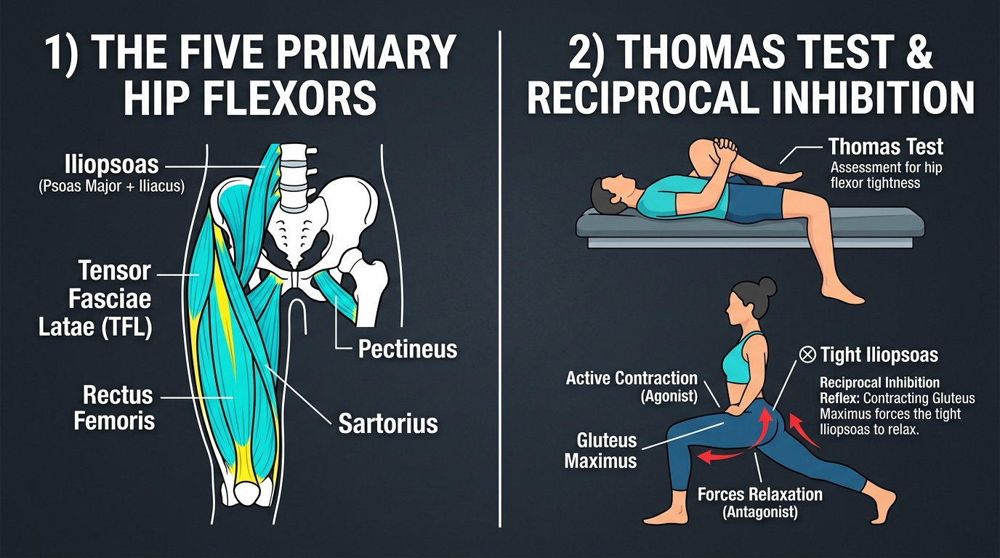

# Day 23: Hip Flexor Tightness & Reciprocal Inhibition

- **Estimated Study Time:** 25 minutes
- **Anatomical Focus:** The 5 Primary Hip Flexors (Iliopsoas, Rectus Femoris, TFL, Sartorius, Pectineus), the Clinical Thomas Test, and Reciprocal Inhibition of the Hip Flexor Complex.
- **Key Movement Application:** Eliminating anterior hip pinch in squats, maximizing hip extension in sprinting, and deepening **Anjaneyasana (Crescent Lunge)** and **Virabhadrasana I (Warrior 1)** without lumbar hyperextension.

---

## 🎯 Daily Learning Objectives
*   Map the origins, insertions, and lines of pull for the **5 Primary Hip Flexors**.
*   Understand why the **Iliopsoas** is the sole hip flexor capable of driving hip flexion above **$90^\circ$**.
*   Perform and interpret the clinical **Thomas Test** to distinguish between tight Iliopsoas, tight Rectus Femoris, and tight Tensor Fasciae Latae (TFL).
*   Apply the **Reciprocal Inhibition Reflex Arc** (activating the Gluteus Maximus agonist to shut off hypertonic hip flexor antagonists).

---

## 📖 Core Anatomical Concept

### 🦵 1. Master Matrix: The 5 Primary Hip Flexors

The anterior hip musculature is composed of five distinct flexors with unique secondary action vectors:

| Muscle | Anatomical Origin | Insertion Point | Primary & Secondary Actions | Biomechanical Significance |
| :--- | :--- | :--- | :--- | :--- |
| **1. Psoas Major** | Transverse processes & bodies of **T12–L5** vertebrae | **Lesser Trochanter** of the femur *(with Iliacus)* | **Primary Hip Flexor** (especially $>90^\circ$); Lumbar stabilizer. | **The Only Muscle Connecting Spine to Leg:** Chronic tightness pulls lumbar spine into painful hyperlordosis. |
| **2. Iliacus** | **Iliac Fossa** of the pelvic bone | **Lesser Trochanter** of the femur | Powerful **Hip Flexion**; anterior pelvic rotation. | Merges with Psoas major to form the massive conjoined **Iliopsoas tendon**. |
| **3. Rectus Femoris** | **Anterior Inferior Iliac Spine (AIIS)** | **Tibial Tuberosity** *(via Patellar Tendon)* | **Hip Flexion** AND **Knee Extension** *(Biarticular)*. | Strongest hip flexor when knee is bent; subject to active/passive insufficiency. |
| **4. Tensor Fasciae Latae (TFL)** | **Anterior Superior Iliac Spine (ASIS)** & iliac crest | **Iliotibial (IT) Band** $\rightarrow$ Gerdy's Tubercle | Hip Flexion, **Abduction**, and **Internal Rotation**. | Prone to **Synergistic Dominance** when Gluteus Medius is weak, causing lateral knee pain (ITBS). |
| **5. Sartorius**<br>*(Longest muscle in body)* | **Anterior Superior Iliac Spine (ASIS)** | **Pes Anserinus** on anteromedial proximal tibia | Flexion, **Abduction**, and **External Rotation** of hip; Knee flexion. | The *"Tailor's Muscle"*: cross-legged sitting posture; crosses both hip and knee joints. |

---

### 🩺 2. The Clinical Thomas Test Assessment

The **Thomas Test** is the gold standard orthopedic assessment to isolate which specific hip flexor is chronically shortened:

```
               PATIENT SUPINE AT EDGE OF TABLE (Hugging opposite knee to chest)
                                         │
       ┌─────────────────────────────────┼─────────────────────────────────┐
       ▼                                 ▼                                 ▼
THIGH LIFTS OFF TABLE           KNEE EXTENDS PAST 90°             THIGH ABDUCTS LATERALLY
 (Thigh >0° above table)         (Lower leg kicks outward)         (J-Sign / External rotation)
       │                                 │                                 │
       ▼                                 ▼                                 ▼
 TIGHT ILIOPSOAS                TIGHT RECTUS FEMORIS                  TIGHT TFL / IT BAND
```

| Thomas Test Sign | Observed Limb Position | Structural Diagnosis | Targeted Release Strategy |
| :--- | :--- | :--- | :--- |
| **Positive Psoas Sign** | Posterior thigh fails to lie flat against the table ($>0^\circ$ hip angle). | **Tight / Shortened Iliopsoas** | Half-kneeling lunge (**Anjaneyasana**) with neutral/posterior pelvic tilt. |
| **Positive Kendall Sign** | Knee extends into $<90^\circ$ flexion when thigh is pressed down to table. | **Tight Biarticular Rectus Femoris** | Standing quad stretch with hip fully extended and knee bent $>110^\circ$. |
| **Positive J-Sign** | Thigh drifts outward into abduction or internal rotation off the table edge. | **Tight Tensor Fasciae Latae (TFL)** | Foam roll lateral TFL; pigeon pose variations. |

---

### ⚡ 3. Reciprocal Inhibition: The Neuromuscular Solution

Passively pulling on a tight, hypertonic Psoas often triggers a protective myotatic stretch reflex (muscle spindle contraction). 
*   **The Neuro-Hack:** By actively and forcefully contracting the **Gluteus Maximus (the Agonist)**, the nervous system sends an automatic inhibitory signal through spinal **Ia Inhibitory Interneurons** to the **Iliopsoas (the Antagonist)**.
*   **The Result:** The psoas instantly releases active motor tone, allowing the hip capsule to open deeply with zero joint impingement!

---

## 🎨 Visual Diagram

Here is a 3D medical visual atlas detailing the 5 primary hip flexors, the clinical Thomas Test, and the reciprocal inhibition reflex arc:



---

## 🔄 Movement Application (Yoga & Calisthenics)

### 🧘 1. Yoga: Anjaneyasana & Virabhadrasana I

#### Anjaneyasana (Crescent Low Lunge): Unlocking the Psoas
*   **The Common Mistake:** Dumping into a deep forward sag while hyperextending the lower back. This pinches the posterior lumbar facet joints while leaving the deep psoas un-stretched!
*   **The Biomechanical Fix:**
    1.  Back out of the maximum lunge depth slightly.
    2.  Tuck the tailbone into a **Posterior Pelvic Tilt (PPT)**.
    3.  **Squeeze the back-leg Gluteus Maximus as hard as possible.**
    4.  *Feel:* A deep, intense, targeted lengthening right through the front of the hip socket, completely decompressing the lower back!

---

### 🤸 2. Calisthenics: Hanging Leg Raises vs. Psoas Pull
*   **The Error:** Performing hanging leg raises purely with the **Iliopsoas and Rectus Femoris** without rounding the pelvis, creating severe anterior pelvic shearing.
*   **The Correction:** Initiate the leg raise by flexing the pelvis upward (**Posterior Pelvic Tilt via Rectus Abdominis**), bringing the knees toward the chest rather than just swinging the legs at the hip joints.

---

## 🔬 Biomechanics Lab: Desk-side Drill

Experience instant psoas release through reciprocal inhibition right now:

### Drill 1: The Chair Glute-Squeeze Psoas Test
1.  Stand up and step your left leg back into a shallow split stance (standing lunge).
2.  Tuck your tailbone under (Posterior Pelvic Tilt). Notice the baseline tension in your left front hip.
3.  Now, **actively squeeze your left Gluteus Maximus as hard as you can for 10 continuous seconds**.
4.  While maintaining that hard glute squeeze, sink $1$ inch deeper into the lunge.
5.  *Notice:* The front of your left hip instantly yields and opens smoothly without any lower back arching!

---

## 🧠 Daily Knowledge Check

Test your mastery of hip flexor kinematics:

### Questions
1.  **Muscle Anatomy:** Which single muscle connects the lumbar spine (T12–L5) directly to the femur, and what is its specific insertion point?
2.  **Biarticular Muscle:** Why does the **Rectus Femoris** lose hip flexion power when the knee is fully flexed (**Active Insufficiency**)?
3.  **Clinical Assessment:** During a **Thomas Test**, if a patient's thigh lies flat on the table but their knee remains extended at $60^\circ$ instead of dropping to $90^\circ$, which muscle is tight?
4.  **Neuromuscular Reflex:** Explain how contracting the **Gluteus Maximus** forces the **Iliopsoas** to relax during **Anjaneyasana**.
5.  **Movement Translation:** Why does sitting at a desk for 8 hours a day lead to "Gluteal Amnesia" (dormant glutes)?

---

<details>
<summary>🔑 Click to reveal answers and explanations</summary>

### Answers & Explanations

1.  **Answer:** The **Psoas Major**, which originates on the transverse processes and bodies of T12–L5 and inserts onto the **Lesser Trochanter** of the femur.
2.  **Answer:** The Rectus Femoris crosses both the hip and knee joints. Flexing the knee places the muscle on high stretch at the knee, excessively shortening its available sarcomere overlap for hip flexion (**Active Insufficiency**).
3.  **Answer:** The **Rectus Femoris** (positive Kendall's sign).
4.  **Answer:** Contracting the Gluteus Maximus (Agonist) activates spinal cord **Ia Inhibitory Interneurons**, which suppress the motor neurons supplying the opposing Iliopsoas (Antagonist), eliminating resting muscle tone via **Reciprocal Inhibition**.
5.  **Answer:** Prolonged sitting keeps the hip flexors in a chronically shortened, hypertonic state. Through constant reciprocal inhibition, the nervous system down-regulates neural drive to the opposing Gluteus Maximus, leading to dormant glute activation patterns.

</details>

---

## 🔗 Connected Guides & References
*   **[Master Muscle Directory](../../muscles/README.md)**
*   **[Pose Correction: Anjaneyasana](../../pose_corrections/yoga/anjaneyasana.md)**
*   **[Day 22: Hip Joint Anatomy & Bony Geometry](../day-022-hip-anatomy/README.md)**
*   **[Day 24: Hip Abduction, Adduction & Balance](../day-024-hip-stability-balance/README.md)**
