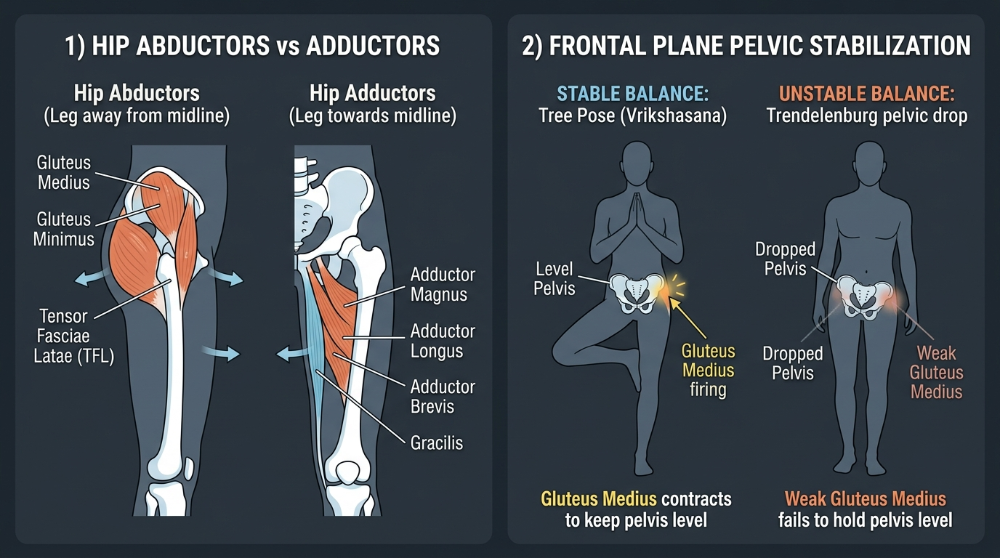

# Day 24: Hip Abduction, Adduction & Single-Leg Balance

- **Estimated Study Time:** 25 minutes
- **Anatomical Focus:** The Hip Abductor Complex (Gluteus Medius, Gluteus Minimus, TFL), the Adductor Complex (Adductor Magnus, Longus, Brevis, Gracilis), Frontal-Plane Pelvic Stabilization, and the Trendelenburg Mechanism.
- **Key Movement Application:** Mastering single-leg Pistol Squats and skater squats, preventing dynamic knee valgus collapse, and achieving steady, level pelvis balance in **Vrikshasana (Tree Pose)** and **Ardha Chandrasana (Half Moon Pose)**.

---

## 🎯 Daily Learning Objectives
*   Map the anatomical origins, insertions, and fiber angles of the **Gluteus Medius** (anterior vs. posterior fibers) and **Gluteus Minimus**.
*   Master the **Adductor Complex** and understand why the **Adductor Magnus** acts as a powerful primary hip extensor in deep squats.
*   Analyze the **Trendelenburg Mechanism** and explain why weak abductors cause the contralateral hip to drop during walking, running, and single-leg balance.
*   Apply active adductor-abductor co-contraction to stabilize the knee and pelvis during bodyweight squats and standing yoga asanas.

---

## 📖 Core Anatomical Concept

### ⚖️ 1. Master Matrix: Abductors vs. Adductors

The medial and lateral hip muscle groups form an antagonistic balance system that controls the femur and pelvis in the **Frontal Plane**:

| Muscle Group | Primary Muscles | Origin & Insertion Points | Primary Joint Actions | Functional & Athletic Role |
| :--- | :--- | :--- | :--- | :--- |
| **1. Hip Abductors** *(Lateral Hip)* | • **Gluteus Medius**<br>• **Gluteus Minimus**<br>• **Tensor Fasciae Latae (TFL)** | Outer surface of **Ilium** $\rightarrow$ **Greater Trochanter** of femur (TFL inserts into IT Band $\rightarrow$ Gerdy's tubercle). | **Hip Abduction**; Anterior fibers = Internal Rotation; Posterior fibers = External Rotation. | **The King of Single-Leg Stability:** Prevents contralateral pelvic drop during gait, running, and pistol squats. |
| **2. Hip Adductors** *(Inner Thigh)* | • **Adductor Magnus**<br>• **Adductor Longus**<br>• **Adductor Brevis**<br>• **Gracilis**<br>• **Pectineus** | Pubic body & Ischial tuberosity $\rightarrow$ **Linea Aspera** & Adductor Tubercle of femur (Gracilis $\rightarrow$ Pes Anserinus). | **Hip Adduction**; Hip Flexion (Longus/Brevis); **Powerful Hip Extension (Adductor Magnus)**. | **Deep Squat Powerhouse:** Adductor Magnus produces more hip extension torque than the hamstrings when the hip is flexed $>90^\circ$! |

---

### 🚶 2. The Trendelenburg Mechanism: Frontal Plane Stability

During single-leg stance (e.g., walking, sprinting, or standing on one foot in yoga), the stance leg becomes a **Class 1 Lever system**:

```
                       CENTER OF GRAVITY (Bodyweight)
                                    ▼
       ┌────────────────────────────┬────────────────────────────┐
       │     CONTRALATERAL PELVIS   │    STANCE-LEG PELVIS       │
       │    (Wants to drop DOWN)    │     (Pivot at Femoral Head)│
       └────────────────────────────┴─────────────┬──────────────┘
                                                  │
                                                  ▲ GLUTEUS MEDIUS CONTRACTION
                                                    (Pulls ilium DOWN to keep pelvis level)
```

*   **Normal Function:** As bodyweight acts on the unsupported side, the **Stance-Leg Gluteus Medius** contracts forcefully, pulling the ilium downward toward the greater trochanter, keeping the **pelvis horizontal in the frontal plane**.
*   **Positive Trendelenburg Sign:** When the stance-leg Gluteus Medius is weak or denervated (Superior Gluteal Nerve), it cannot resist gravity. The **pelvis drops down on the OPPOSITE (unsupported) side**, forcing the athlete to laterally lean their torso over the stance leg to avoid falling.

---

### 🏋️ 3. The Adductor Magnus: The "Fourth Hamstring"

The **Adductor Magnus** is the second largest muscle in the human lower extremity, divided into two distinct functional compartments:
1.  **Adductor Part (Pubofemoral fibers):** Innervated by the **Obturator Nerve**; assists in hip adduction and flexion.
2.  **Ischiocondylar Part ("Hamstring Portion"):** Originates on the **Ischial Tuberosity** and inserts on the **Adductor Tubercle**; innervated by the **Tibial Nerve**.
    *   *Biomechanical Superpower:* At the bottom of a deep squat or lunge ($>90^\circ$ hip flexion), the moment arm of the Gluteus Maximus decreases, and the **Adductor Magnus becomes the primary engine driving hip extension** out of the hole!

---

## 🎨 Visual Diagram

Here is a 3D medical visual atlas detailing the hip abductor vs. adductor complexes, single-leg frontal plane stabilization, and the Trendelenburg sign:



---

## 🔄 Movement Application (Calisthenics & Yoga)

### 🤸 1. Calisthenics: The Pistol Squat (Single-Leg Mastery)
*   **The Valgus Collapse Fault:** During a single-leg pistol squat, the knee often caves inward toward the midline (**Dynamic Knee Valgus**).
*   **The Cause:** Weakness of the **Gluteus Medius and Minimus**, allowing the femur to adduct and internally rotate under load.
*   **The Fix:** Cue the athlete to *"spread the floor with the foot"* and engage the **Gluteus Medius posterior fibers**, keeping the knee tracking perfectly over the second toe throughout the descent and ascent.

---

### 🧘 2. Yoga: Vrikshasana & Ardha Chandrasana

#### Vrikshasana (Tree Pose): Grounding the Standing Hip
*   **The Error:** "Hanging" into the standing hip joint, allowing the pelvis to kick out laterally.
*   **The Biomechanics:** Fire the standing leg's **Gluteus Medius** to pull the hip in toward the midline, while simultaneously pressing the foot and inner thigh together (isometrically activating the **Adductor Longus/Magnus**) to create an unyielding central lock.

#### Ardha Chandrasana (Half Moon Pose): Lateral Line Activation
*   **The Biomechanics:** Balancing on one leg with the torso tilted sideways demands maximal contraction of the lifted leg's **Gluteus Medius and TFL** to keep the leg elevated parallel to the floor in pure abduction ($90^\circ$).

---

## 🔬 Biomechanics Lab: Desk-side Drill

Diagnose your Gluteus Medius activation right now:

### Drill 1: The Single-Leg Trendelenburg Check
1.  Stand in front of a mirror with hands on your **ASIS (front hip points)**.
2.  Lift your left foot off the floor, balancing solely on your right leg.
3.  **Check 1 (Trendelenburg):** Does your left hip point immediately drop lower than your right hip? If yes, your **Right Gluteus Medius** is underactive!
4.  **Check 2 (Active Correction):** Squeeze your right outer glute and pull your right hip inward. Watch your left hip immediately level out parallel to the floor!

---

## 🧠 Daily Knowledge Check

Test your mastery of frontal plane hip mechanics:

### Questions
1.  **Muscle Innervation:** Which nerve innervates the **Gluteus Medius**, **Gluteus Minimus**, and **Tensor Fasciae Latae (TFL)**?
2.  **Clinical Pathology:** If a patient's pelvis visibly drops on the **left side** when standing on the right leg, which specific muscle is weak?
3.  **Deep Squat Biomechanics:** Why is the **Adductor Magnus** considered a primary hip extensor during the bottom "out-of-the-hole" phase of a deep squat?
4.  **Dynamic Alignment:** What anatomical weakness causes **Dynamic Knee Valgus** (inward knee collapse) during a heavy squat or landing from a jump?
5.  **Yoga Alignment:** In **Vrikshasana (Tree Pose)**, why is pressing the sole of the foot and the inner thigh against each other mechanically stabilizing?

---

<details>
<summary>🔑 Click to reveal answers and explanations</summary>

### Answers & Explanations

1.  **Answer:** The **Superior Gluteal Nerve** (L4, L5, S1).
2.  **Answer:** The **Right Gluteus Medius** (the stance-leg abductor is failing to stabilize the pelvis in the frontal plane, causing a positive **Trendelenburg Sign** on the left).
3.  **Answer:** The **ischiocondylar (hamstring) portion of the Adductor Magnus** has a massive physiological cross-sectional area and a direct sagittal line of pull that places it at peak mechanical moment arm for hip extension when the hip is flexed $>90^\circ$.
4.  **Answer:** Weakness or inhibition of the **Gluteus Medius and Gluteus Maximus (posterior fibers)**, which allows the hip adductors and internal rotators to dominate, collapsing the femur medially.
5.  **Answer:** Co-contracting the foot against the inner thigh creates an isometric loop between the **Adductor complex** and the **Abductor complex (Gluteus Medius)**, locking the pelvis into rigid frontal-plane equilibrium.

</details>

---

## 🔗 Connected Guides & References
*   **[Master Muscle Directory](../../muscles/README.md)**
*   **[Pose Correction: Vrikshasana](../../pose_corrections/yoga/vrikshasana.md)**
*   **[Day 23: Hip Flexor Tightness & Reciprocal Inhibition](../day-023-hip-flexor-tightness/README.md)**
*   **[Day 25: Hamstring Mechanics & Forward Bends](../day-025-hamstrings-forward-bends/README.md)**
