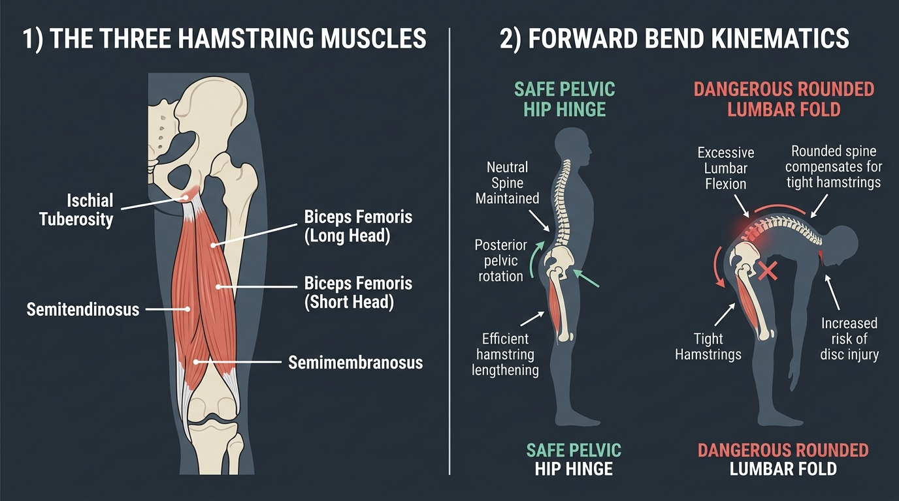

# Day 25: Hamstring Complex Mechanics, Bi-Articular Tension & Forward Bending Kinematics

---

## 🎯 Learning Objectives
* **Dissect the Posterior Thigh Triad:** Differentiate the functional anatomy, distinct insertions, and neural innervations of the Biceps Femoris (Long & Short Heads), Semitendinosus, and Semimembranosus.
* **Master Bi-Articular Muscle Mechanics:** Define **Active Insufficiency** (cramping in simultaneous hip extension and knee flexion) and **Passive Insufficiency** (limitation in simultaneous hip flexion and knee extension).
* **Deconstruct Pelvo-Ocular-Spinal Rhythm in Forward Bends:** Analyze anterior pelvic tilting versus lumbar spinal flexion in **Uttanasana (उत्तानासन)** and **Paschimottanasana (पश्चिमोत्तानासन)**.
* **Distinguish Muscular Tightness from Neural Tension:** Differentiate hamstring muscle-tendon stretch from sciatic nerve entrapment using neurodynamic assessments.

---

## 🔬 1. The Hamstring Muscular Complex: Anatomy & Biomechanics

The hamstrings constitute the powerful posterior compartment of the thigh. With the exception of the short head of the biceps femoris, all hamstring components are **bi-articular** (crossing both the acetabulofemoral and tibiofemoral joints) and originate from a common tendon on the **ischial tuberosity**.



### Anatomical & Functional Classification Table

| Muscle | Origin Point | Insertion Point | Innervation | Primary Joint Actions |
| :--- | :--- | :--- | :--- | :--- |
| **Semitendinosus** | Ischial tuberosity (medial facet) | Proximal anteromedial tibia (Pes Anserinus) | Tibial division of Sciatic nerve ($L_5, S_1, S_2$) | Hip extension, Knee flexion, Medial rotation of flexed knee |
| **Semimembranosus** | Ischial tuberosity (lateral facet) | Posterior aspect of medial tibial condyle | Tibial division of Sciatic nerve ($L_5, S_1, S_2$) | Hip extension, Knee flexion, Medial rotation of flexed knee |
| **Biceps Femoris (Long Head)** | Ischial tuberosity (shared conjoint tendon) | Head of fibula & lateral tibial condyle | Tibial division of Sciatic nerve ($L_5, S_1, S_2$) | Hip extension, Knee flexion, Lateral rotation of flexed knee |
| **Biceps Femoris (Short Head)** | Linea aspera & lateral supracondylar line of femur | Head of fibula (lateral side) | **Common Fibular (Peroneal) division** of Sciatic nerve ($L_5, S_1, S_2$) | **Knee flexion only**, Lateral rotation of flexed knee |

> [!NOTE]
> **Dual Innervation of Biceps Femoris:** The short head is the only part of the posterior compartment innervated by the **common fibular nerve**. A high sciatic nerve compression or piriformis syndrome can selectively affect or spare branches depending on anatomical branching variations.

---

## ⚡ 2. Active vs. Passive Insufficiency

Because three of the four muscle heads cross two joints, their force generation and range of motion are subject to multi-joint length-tension constraints.

### Comparison Matrix: Muscle Insufficiency States

| Parameter | Active Insufficiency (Shortening Limit) | Passive Insufficiency (Lengthening Limit) |
| :--- | :--- | :--- |
| **Mechanical Definition** | The muscle cannot shorten sufficiently to produce full active tension across both joints simultaneously. | The multi-joint muscle cannot elongate sufficiently to permit full, maximal ROM across both joints simultaneously. |
| **Hamstring Configuration** | **Hip Hyperextension + Full Knee Flexion** | **Full Hip Flexion + Full Knee Extension** |
| **Physiological Cause** | Sarcomeres are excessively shortened; actin filaments overlap past optimal cross-bridge binding sites. | Sarcomeres and passive titin/fascial structures reach maximum passive physiological strain. |
| **Sensation / Symptom** | Acute cramping sensation in posterior thigh; marked loss of peak torque. | Intense stretch tension across ischial tuberosity and posterior popliteal fossa. |
| **Clinical / Athletic Example** | Prone hamstring curls with hips hyperextended; Glute-ham raise cramping. | Inability to touch toes with straight knees (*Uttanasana*) or perform a straight-leg kick (*Purna Salabhasana*). |

---

## 🧘 3. Biomechanics of Forward Bends in Yoga & Calisthenics

Forward bending is governed by the **Lumbopelvic Rhythm** during flexion. For safe, high-leverage movement, the movement should initiate at the hip joint before progressing into the lumbar spine.

### Forward Fold Kinetic Breakdown

| Posture & Phase | Hip Joint Kinematics | Pelvic Action | Spinal Alignment | Common Faults & Mechanical Hazards |
| :--- | :--- | :--- | :--- | :--- |
| **Uttanasana** *(उत्तानासन - Standing Forward Bend)* | Bilateral closed-chain hip flexion ($90^\circ\text{–}120^\circ$) | **Anterior Pelvic Tilt** initiated by Psoas & Pectineus | Neutral elongation followed by gentle uniform thoracic/lumbar curve | **Posterior pelvic tilt with excessive lumbar kyphosis**; creates massive posterior disc shear at $L_4\text{–}L_5/L_5\text{–}S_1$. |
| **Paschimottanasana** *(पश्चिमोत्तानासन - Seated Forward Bend)* | Bilateral seated hip flexion with knee extension | Anterior rotation of ilia over femoral heads | Progressive anterior spinal elongation | Flexing from T12-L1 while pelvis remains pinned vertically ($90^\circ$ to floor); causes high hamstring tendon avulsion strain. |
| **Pike Press to Handstand** *(Calisthenics)* | Extreme active hip flexion ($>130^\circ$) against gravity | Forward anterior pelvic shift over wrist line | Loaded protraction and hollow body bracing | Lack of hamstring flexibility forces compensatory lumbar rounding, shifting center of mass behind the hands. |

```
CORRECT LUMBO-PELVIC FORWARD BEND:
Pelvis Rotates Anteriorly (ASIS dips forward, Ischial Tuberosities point UP)
  └── Lumbar Spine remains elongated with natural axial decompression
        └── Hamstrings lengthen safely across both joints

FAULTY FORWARD BEND (TIGHT HAMSTRINGS):
Pelvis Locked in Neutral / Posterior Tilt (Ischial Tuberosities pulled down)
  └── Lumbar Spine forced into hyper-flexion under compressive shear load
        └── Extreme risk of disc herniation + Proximal Hamstring Tendinopathy
```

---

## 🩺 4. Proximal Hamstring Tendinopathy vs. Sciatic Nerve Tension

A common clinical dilemma in yoga and athletic training is distinguishing between a true hamstring muscle stretch, **Proximal Hamstring Tendinopathy (PHT)**, and **Sciatic Neural Tension**.

### Differential Diagnosis Matrix

| Diagnostic Feature | True Hamstring Muscular Tightness | Proximal Hamstring Tendinopathy (PHT) | Sciatic Nerve Neurodynamic Tension |
| :--- | :--- | :--- | :--- |
| **Pain / Sensation Quality** | Broad, diffuse pulling sensation across the middle muscle belly. | Deep, localized ache or stabbing pain directly at the **ischial tuberosity** ("sit-bone pain"). | Burning, electric, tingling, or radiating numbness down the posterior calf/foot. |
| **Aggravating Factors** | Deep passive stretching at end-range. | Prolonged sitting on hard surfaces, lunges, deadlifts, deep forward folds. | Straight leg raise with ankle **dorsiflexion** and cervical spine flexion (Slump position). |
| **Relieving Strategy** | Warm-up, low-load eccentric lengthening, PNF stretching. | Load management, isometric glute/hamstring bridges at low hip flexion angles. | **Neurodynamic Gliding / Flossing** (moving head and foot in synchrony to slide nerve without tensioning). |
| **Sensitizing Maneuver** | Ankle movement does NOT alter thigh tension. | Palpation directly on the ischial tuberosity produces focal tenderness. | **Ankle dorsiflexion significantly worsens posterior thigh pain** (Structural Differentiation). |

---

## 🧪 5. Desk-Side Tactile Biomechanics Lab

### Experiment 1: The Slump Test vs. Hamstring Stretch (Neurodynamics)
1. Sit tall on the edge of a chair with thighs supported.
2. Extend your right knee until you feel moderate tension in the back of your thigh.
3. Keep the knee straight and slowly **dorsiflex your right ankle** (pull toes toward your shin).
4. *Observation:* Does the tension in the back of your thigh dramatically increase?
5. Next, tuck your chin to your chest (cervical flexion).
6. *Biomechanics Explanation:* The hamstring muscles attach to the tibia/fibula and do not cross the ankle or neck. If dorsiflexion or neck flexion increases posterior thigh tension, you are tensioning the **Sciatic Nerve / Dural Tract**, not just the hamstring muscle belly!

### Experiment 2: Active Insufficiency Cramp Induction
1. Stand on your left leg.
2. Hyperextend your right hip behind your torso by $15^\circ\text{–}20^\circ$.
3. Now, rapidly and maximally flex your right knee to pull your heel into your right buttock.
4. *Observation:* Notice the immediate weakness and intense cramping sensation in the posterior thigh.
5. *Biomechanics Explanation:* By placing the hamstrings in a position of extreme shortening (hip extended + knee flexed), the actin and myosin filaments overlap excessively, destroying cross-bridge tension capacity (Active Insufficiency).

---

## 📚 6. Anatomical Cross-References
* **Bones:** [Femur (Lineal Features & Condyles)](../../bones/lower_limb/README.md#femur), [Pelvic Girdle & Ischial Tuberosity](../../bones/pelvis_perineum/README.md).
* **Muscles:** [Posterior Thigh Muscles (Hamstrings)](../../muscles/lower_limb/README.md#posterior-compartment), [Gluteus Maximus](../../muscles/lower_limb/README.md#gluteal-region).
* **Foundations:** [Day 4: Muscle Contraction Physiology & Sarcomere Mechanics](../day-004-muscle-contractions/README.md), [Day 16: Pelvic Tilts & Force Couples](../day-016-pelvic-tilts/README.md).

---

## 📝 7. Daily Knowledge Retrieval Quiz

<details>
<summary><b>1. Which head of the hamstring complex does NOT cross the hip joint and has a distinct neural innervation?</b></summary>
<b>Answer:</b> The <b>Biceps Femoris Short Head</b>. It originates on the linea aspera of the femur (crossing only the knee) and is innervated by the <b>Common Fibular (Peroneal) nerve</b>, whereas all other hamstring components originate on the ischial tuberosity and are innervated by the Tibial division of the sciatic nerve.
</details>

<details>
<summary><b>2. Why does bending the knees slightly in a standing forward bend (Uttanasana) protect the lumbar spine?</b></summary>
<b>Answer:</b> Flexing the knees relieves <b>passive insufficiency</b> of the bi-articular hamstrings. This slackens the hamstring attachment at the ischial tuberosity, allowing the pelvis to rotate freely into an <b>anterior pelvic tilt</b> over the femoral heads, preserving the natural neutral lordosis of the lumbar spine and preventing disc herniation.
</details>

<details>
<summary><b>3. Explain the mechanical difference between Active Insufficiency and Passive Insufficiency in the hamstrings.</b></summary>
<b>Answer:</b> Active insufficiency occurs when the hamstrings are over-shortened across both joints (hip extension + knee flexion), losing the ability to generate active contractile force (cramping). Passive insufficiency occurs when the hamstrings are over-lengthened across both joints (hip flexion + knee extension), physically limiting joint range of motion due to structural and fascial stretch limits.
</details>

<details>
<summary><b>4. If a practitioner experiences intense burning at the sit-bone during forward folds that worsens whenever they flex their neck or dorsiflex the ankle, what is the primary structural issue?</b></summary>
<b>Answer:</b> <b>Neural tension / Sciatic nerve entrapment or irritation</b> (dural tract tensioning), rather than isolated muscular hamstring tightness, as the hamstrings do not cross the ankle or cervical spine.
</details>

<details>
<summary><b>5. Which hamstring muscles produce internal (medial) rotation of the tibia when the knee is flexed?</b></summary>
<b>Answer:</b> The <b>Semitendinosus</b> and <b>Semimembranosus</b> (medial hamstrings). The lateral hamstring (Biceps Femoris) produces external (lateral) rotation of the flexed knee.
</details>
