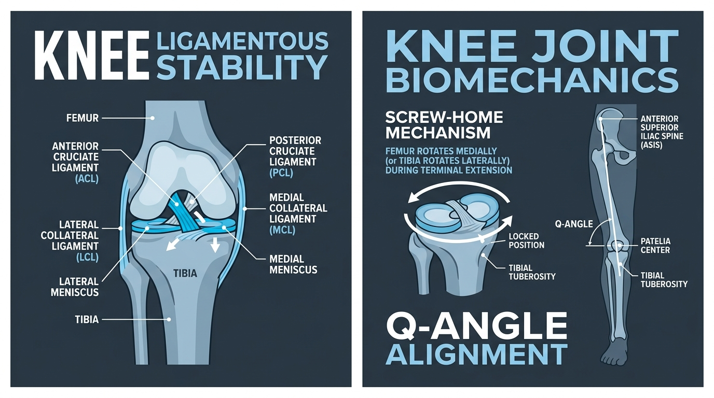

# Day 26: Knee Joint Complex: Ligamentous Restraints, Meniscal Biomechanics & Rotational Kinematics

---

## 🎯 Learning Objectives
* **Deconstruct the Dual Knee Articulations:** Master the functional biomechanics of the **Tibiofemoral** (modified hinge) and **Patellofemoral** (plane/glide) joints.
* **Analyze the Ligamentous Stabilizers:** Compare the mechanical vectors, stress restraints, and injury profiles of the ACL, PCL, MCL, and LCL.
* **Differentiate Meniscal Anatomy & Function:** Compare the medial (C-shaped, fixed) and lateral (O-shaped, mobile) fibrocartilaginous discs in shock distribution and rotational shear.
* **Explain the Screw-Home Mechanism:** Detail the bony asymmetry and the role of the **Popliteus muscle** ("the key to unlocking the knee") during terminal extension.
* **Examine High-Leverage Movement Mechanics:** Evaluate knees-over-toes calisthenics loading (Pistol squats, Sissy squats) and torque protection in yoga postures like **Padmasana (पद्मासन - Lotus Pose)**.

---

## 🔬 1. The Knee Complex: Bony Geometry & Ligamentous Restraints

The knee is the largest and most complex joint in the human body. As a **modified bicondylar synovial hinge joint**, it prioritizes weight transmission during locomotion while permitting slight axial rotation when flexed.



### Ligamentous Restraint Matrix

| Ligament | Proximal Attachment | Distal Attachment | Primary Restraint Function | Classic Mechanism of Failure / Injury |
| :--- | :--- | :--- | :--- | :--- |
| **Anterior Cruciate Ligament (ACL)** | Medial surface of lateral femoral condyle (posterior) | Anterior intercondylar area of tibia | Prevents **anterior translation of tibia** on femur; resists hyperextension and internal tibial rotation | Dynamic knee valgus + internal tibial rotation during deceleration/landing ("non-contact pop") |
| **Posterior Cruciate Ligament (PCL)** | Lateral surface of medial femoral condyle (anterior) | Posterior intercondylar area of tibia | Prevents **posterior translation of tibia** on femur (primary restraint in flexion) | Direct anterior blow to flexed proximal tibia ("Dashboard injury" or hard fall onto flexed knee) |
| **Medial Collateral Ligament (MCL)** | Medial epicondyle of femur | Medial surface of proximal tibia (deep fibers fuse with medial meniscus) | Restrains **Valgus stress** (medial joint opening) and lateral tibial rotation | Direct lateral impact pushing knee inward; severe dynamic valgus collapse |
| **Lateral Collateral Ligament (LCL)** | Lateral epicondyle of femur | Head of fibula (extracapsular; separated from lateral meniscus by popliteus) | Restrains **Varus stress** (lateral joint opening) and medial tibial rotation | Direct medial impact to knee pushing outward (rare in isolation) |

---

## 🛡️ 2. Meniscal Biomechanics: Medial vs. Lateral Meniscus

The menisci are two crescent-shaped wedges of fibrocartilage seated on the tibial plateau that increase joint contact area from $\sim 30\%$ to over $\sim 70\%$, reducing compressive stress on articular cartilage.

### Comparison Matrix: Meniscal Morphology & Mobility

| Parameter | Medial Meniscus | Lateral Meniscus |
| :--- | :--- | :--- |
| **Shape & Geometry** | Semi-lunar / Broad **C-shaped** with wider posterior horn | Nearly circular / **O-shaped** with uniform thickness |
| **Capsular Attachment** | **Firmly anchored** to joint capsule and deep fibers of the MCL | **Loosely attached** to capsule; separated from LCL by the popliteus tendon |
| **Mobility During Flexion** | Low mobility ($\sim 5\text{ mm}$ posterior excursion) | High mobility ($\sim 11\text{ mm}$ posterior excursion) |
| **Vascular Zones** | Red Zone (outer $10\text{–}30\%$ vascularized), White Zone (inner $70\%$ avascular) | Red Zone (outer third vascular), White Zone (inner two-thirds avascular) |
| **Clinical Vulnerability** | **High injury rate** ($3\times$ to $5\times$ more common); susceptible to torsional shear under loaded axial rotation | Lower injury rate due to high compliance and translational gliding |

> [!IMPORTANT]
> **O'Donoghue's "Unhappy Triad":** Severe dynamic valgus and external rotation of the flexed knee can tear three structures simultaneously:
> 1. Anterior Cruciate Ligament (ACL)
> 2. Medial Collateral Ligament (MCL)
> 3. Medial Meniscus (historically) / Lateral Meniscus (frequently in acute trauma).

---

## ⚙️ 3. The Screw-Home Mechanism & The Popliteus Unlock

Because the **medial femoral condyle is longer and more curved** than the lateral condyle, the tibia and femur undergo an involuntary rotational coupling during the final $20^\circ\text{–}30^\circ$ of knee extension.

```
TERMINAL EXTENSION (Locking):
• Open Kinetic Chain (e.g., Kicking): Tibia EXT-ROTATES (~10°-15°) on fixed femur.
• Closed Kinetic Chain (e.g., Standing up from squat): Femur INT-ROTATES on fixed tibia.
  └── Result: Cruciate and collateral ligaments wind tight; knee locks mechanically in closed-pack position.

INITIATION OF FLEXION (Unlocking):
• POPLITEUS MUSCLE CONTRACTS:
  ├── Open Chain: Medially rotates tibia to unlock.
  └── Closed Chain: Laterally rotates femur to unlock.
```

### The Popliteus Muscle: "The Key to the Knee"
* **Origin:** Lateral condyle of femur and posterior horn of lateral meniscus (intracapsular).
* **Insertion:** Posterior surface of proximal tibia above soleal line.
* **Action:** Unlocks the knee joint by externally rotating the femur on the tibia (in closed chain) or internally rotating the tibia (in open chain); retracts the lateral meniscus during flexion to prevent impingement.
* **Innervation:** Tibial nerve ($L_4, L_5, S_1$).

---

## 📐 4. The Q-Angle & Patellofemoral Mechanics

The **Q-Angle (Quadriceps Angle)** is formed by the intersection of two anatomical vectors:
1. Line from the **ASIS** to the center of the **Patella**.
2. Line from the center of the **Patella** to the **Tibial Tuberosity**.

### Clinical Q-Angle Matrix

| Metric / Parameter | Male Normal | Female Normal | Pathological Range | Biomechanical Implication |
| :--- | :--- | :--- | :--- | :--- |
| **Normal Angle Range** | $10^\circ\text{–}14^\circ$ | $15^\circ\text{–}17^\circ$ | $>20^\circ$ (Elevated Q-Angle) | Increased lateral pulling vector on patella during quadriceps contraction. |
| **Pelvic Influence** | Narrower bi-iliac width decreases Q-angle. | Wider bi-trochanteric/bi-iliac distance increases angle. | Excessive femoral anteversion or Coxa Vara amplifies angle. | Exacerbates **Patellofemoral Pain Syndrome (PFPS)** and lateral patellar subluxation. |
| **Kinetic Chain Drivers** | Strong hip abductors resist dynamic valgus collapse. | Weak Gluteus Medius permits femoral adduction and internal rotation. | Over-pronation of subtalar foot complex forces internal tibial rotation. | Increases lateral patellar retinaculum tension and chondromalacia patellae. |

---

## 🧘 5. Movement Applications: Calisthenics & Yoga

### Calisthenics: Knees-Over-Toes Biomechanics (Pistol & Sissy Squats)
* **The Myth:** *"Never let the knees pass the toes."*
* **The Biomechanical Reality:** Allowing the knee to translate anteriorly beyond the toes increases dorsiflexion demand and transfers torque from the hip/lumbar spine to the **patellar tendon and quadriceps tendon**.
* **Tissue Adaptation:** When loaded progressively, closed-chain deep flexion stimulates collagen synthesis in the patellar tendon and enhances articular cartilage nutrient diffusion without increasing ACL strain.

### Yoga: The Lotus Posture (Padmasana / पद्मासन) Knee Trap
* **Anatomical Requirement:** Padmasana requires **$90^\circ\text{–}100^\circ$ of pure Hip External Rotation** from the acetabulofemoral ball-and-socket joint.
* **The Fatal Compensation:** If hip external rotation is restricted by tight deep rotators/capsule, the practitioner forces the foot onto the opposite thigh by **twisting the flexed knee joint**.
* **Mechanism of Meniscal Tear:** The knee cannot tolerate high rotational torque when flexed. Forcing the lower leg across creates severe **varus/valgus bending and rotational shear**, pinching the posterior horn of the **Medial Meniscus** against the femoral condyle, leading to acute tears.

---

## 🧪 6. Desk-Side Tactile Biomechanics Lab

### Experiment 1: Palpating the Screw-Home Mechanism
1. Sit on a sturdy table or chair with your legs dangling freely at $90^\circ$ flexion.
2. Place your fingers on your right **tibial tuberosity** (the bony bump below the kneecap).
3. Slowly kick your right lower leg out into full, terminal extension ($0^\circ$).
4. *Observation:* Notice that during the final $15^\circ$ of extension, the tibial tuberosity visibly and palpably rotates outward (laterally) by about $10^\circ$.
5. Now, relax and begin bending the knee: feel the initial slight inward (medial) rotation driven by the popliteus as the joint unlocks.

### Experiment 2: Dynamic Valgus & Patellar Vector Assessment
1. Stand on one leg in front of a mirror.
2. Perform a single-leg quarter squat.
3. *Observation:* Does your patella track in line with your 2nd toe, or does the knee dive inward toward the midline (Dynamic Valgus)?
4. *Correction:* Intentionally activate your lateral gluteal muscles (Gluteus Medius) to drive the knee laterally over the 3rd toe, instantly eliminating the excessive lateral vector on the patellofemoral joint.

---

## 📚 7. Anatomical Cross-References
* **Bones:** [Femur (Condyles, Epicondyles & Patellar Groove)](../../bones/lower_limb/README.md#femur), [Tibia & Fibula](../../bones/lower_limb/README.md#tibia-and-fibula), [Patella](../../bones/lower_limb/README.md#patella).
* **Muscles:** [Quadriceps Femoris & Popliteus](../../muscles/lower_limb/README.md#anterior-compartment), [Hamstrings](../../muscles/lower_limb/README.md#posterior-compartment).
* **Foundations:** [Day 3: Synovial Joints & Articular Mechanics](../day-003-joints-articulations/README.md), [Day 22: Hip Joint Anatomy](../day-022-hip-anatomy/README.md).

---

## 📝 8. Daily Knowledge Retrieval Quiz

<details>
<summary><b>1. Which muscle is known as the "key to unlock the knee" and what action does it perform during closed-chain flexion?</b></summary>
<b>Answer:</b> The <b>Popliteus muscle</b>. In a closed kinetic chain (weight-bearing stance), it unlocks the knee by <b>laterally (externally) rotating the femur</b> on the fixed tibia.
</details>

<details>
<summary><b>2. Why is the Medial Meniscus injured significantly more often than the Lateral Meniscus?</b></summary>
<b>Answer:</b> The medial meniscus is <b>firmly attached</b> to both the joint capsule and the deep fibers of the Medial Collateral Ligament (MCL), making it relatively immobile ($\sim 5\text{ mm}$ translation). The lateral meniscus is loosely attached and not fused to the LCL, allowing it to glide freely ($\sim 11\text{ mm}$) and dissipate shear forces without tearing.
</details>

<details>
<summary><b>3. What primary mechanical restraint does the Anterior Cruciate Ligament (ACL) provide?</b></summary>
<b>Answer:</b> It prevents <b>anterior translation of the tibia relative to the femur</b> and resists excessive internal tibial rotation and knee hyperextension.
</details>

<details>
<summary><b>4. How does insufficient hip external rotation cause medial knee pain in Padmasana (Lotus Pose)?</b></summary>
<b>Answer:</b> When hip external rotation is inadequate, rotational torque is transferred downstream into the flexed knee joint. As a modified hinge joint, the knee cannot accommodate high torsion; the resulting rotary and varus torque crushes and pinches the posterior horn of the <b>medial meniscus</b> between the femoral condyle and tibial plateau.
</details>

<details>
<summary><b>5. What does an elevated Q-Angle (>20 degrees) indicate for patellar tracking?</b></summary>
<b>Answer:</b> An increased Q-angle increases the lateral vector component of the quadriceps muscle pull, pulling the patella laterally against the lateral femoral condyle, predisposing the individual to <b>Patellofemoral Pain Syndrome (PFPS)</b> and lateral patellar subluxation.
</details>
