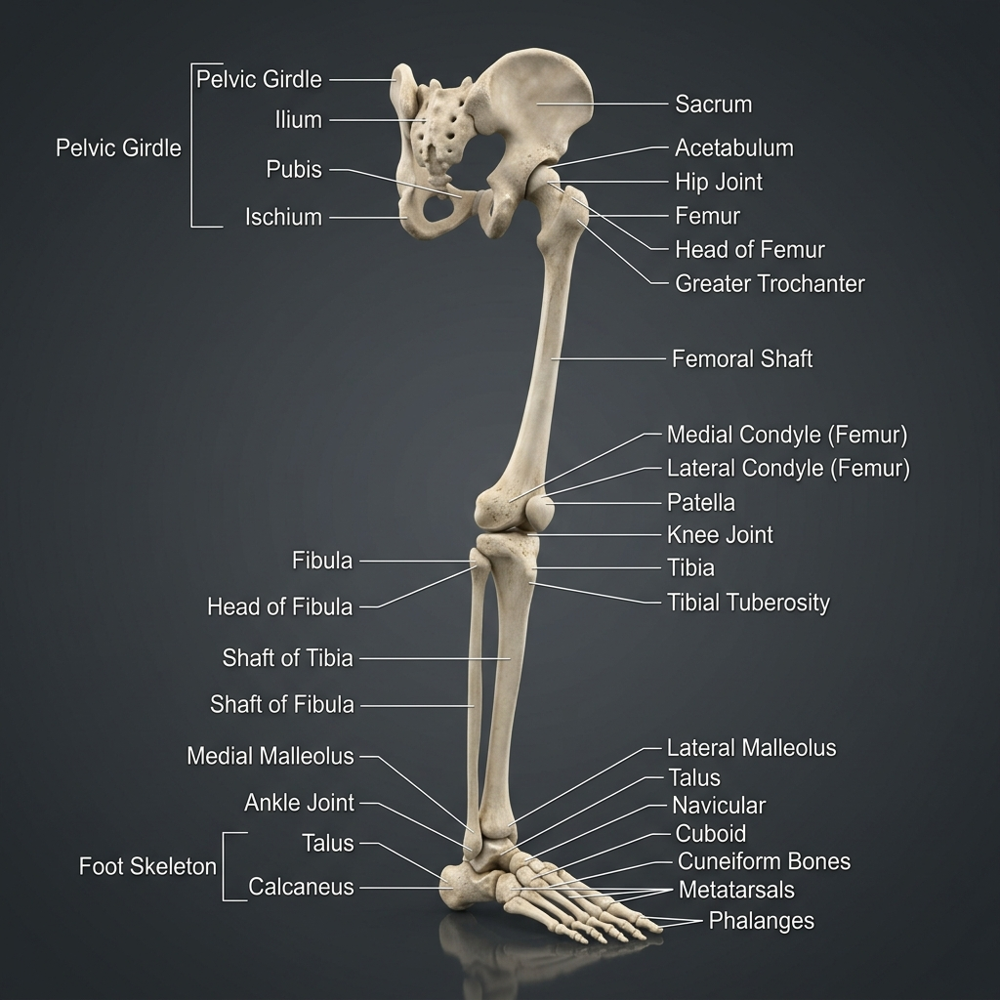

# Day 27: The Ankle & Foot Complex: Arches, Windlass Mechanism & Kinetic Stability

---

## 🎯 Learning Objectives
* **Differentiate the Primary Foot & Ankle Articulations:** Master the kinematics of the **Talocrural Joint** (sagittal hinge: dorsiflexion/plantarflexion) versus the **Subtalar Joint** (frontal/transverse: inversion/eversion, pronation/supination).
* **Deconstruct the Three Plantar Arches:** Analyze the bony keystones, static ligamentous suspensors (Spring ligament, Plantar fascia), and dynamic muscular slings of the Medial Longitudinal, Lateral Longitudinal, and Transverse Arches.
* **Master the Windlass Mechanism:** Explain how great toe ($1^{\text{st}}\text{ MTP}$) dorsiflexion tensions the plantar aponeurosis to convert the foot into a rigid propulsion lever.
* **Compare the Triceps Surae Components:** Differentiate the functional biomechanics of the bi-articular **Gastrocnemius** from the postural, mono-articular **Soleus**.
* **Integrate Kinetic Foot Stability into Movement:** Apply **Pada Bandha (पाद बन्ध)** in yoga balance postures and optimize barefoot kinetic grounding in calisthenics.

---

## 🔬 1. The Ankle Joint Articulations: Talocrural vs. Subtalar

The human ankle is not a single hinge, but a coordinated functional complex that translates vertical body mass into multi-directional terrain compliance and forward propulsion.



### Joint Classification & Kinematic Table

| Articulation | Bony Partners | Joint Type & Axis | Primary Motions & Degrees of Freedom | Primary Stabilizing Ligaments |
| :--- | :--- | :--- | :--- | :--- |
| **Talocrural Joint** *(True Ankle)* | Distal Tibial Plafond & Medial Malleolus + Distal Fibular Lateral Malleolus with **Trochlea of Talus** | Synovial **Uniaxial Hinge** (Oblique sagittal axis) | **Dorsiflexion** ($15^\circ\text{–}20^\circ$)<br>**Plantarflexion** ($45^\circ\text{–}50^\circ$) | **Medial (Deltoid) Ligament** (Tibiotalar, Tibionavicular, Tibiocalcaneal)<br>**Lateral Ligament Complex** (ATFL, CFL, PTFL) |
| **Subtalar Joint** *(Talocalcaneal)* | Inferior body of Talus with Superior articular surface of **Calcaneus** | Synovial **Multi-planar Gliding / Condylar** (Oblique axis of Henke) | **Inversion** ($20^\circ\text{–}30^\circ$)<br>**Eversion** ($5^\circ\text{–}10^\circ$)<br>*Triplanar Pronation & Supination* | Cervical ligament, Interosseous talocalcaneal ligament, Calcaneofibular ligament |
| **Transverse Tarsal** *(Chopart's Joint)* | Talonavicular & Calcaneocuboid joints | Modified compound synovial | Forefoot-on-hindfoot rotation; locks during supination | Bifurcate ligament, Long & Short plantar ligaments |

> [!IMPORTANT]
> **Inversion Sprain Vulnerability (ATFL):** The **Anterior Talofibular Ligament (ATFL)** is the weakest of the lateral ankle ligaments. In combined plantarflexion and inversion, the ATFL becomes vertically oriented and takes maximal strain, making it the most commonly torn ligament in athletics ($>80\%$ of all ankle injuries).

---

## 🏗️ 2. The Three Plantar Arches & Structural Suspension

The foot absorbs impact through a three-dimensional vaulted tripod structure that transforms between a compliant shock absorber (upon initial ground contact) and a rigid propulsion beam (during push-off).

### Plantar Arch Architectural Matrix

| Plantar Arch | Bony Constituents | Structural Keystone | Static Ligamentous Restraints | Dynamic Muscular Stabilizers |
| :--- | :--- | :--- | :--- | :--- |
| **Medial Longitudinal Arch (MLA)** | Calcaneus, Talus, Navicular, 3 Cuneiforms, $1^{\text{st}}\text{–}3^{\text{rd}}$ Metatarsals | **Head of Talus** & **Navicular** | **Plantar Calcaneonavicular ("Spring") Ligament**, Plantar Aponeurosis, Long Plantar Ligament | **Tibialis Posterior**, Tibialis Anterior, Flexor Hallucis Longus, Abductor Hallucis |
| **Lateral Longitudinal Arch (LLA)** | Calcaneus, Cuboid, $4^{\text{th}}\text{–}5^{\text{th}}$ Metatarsals | **Cuboid Bone** | Long Plantar Ligament, Short Plantar (Calcaneocuboid) Ligament | **Fibularis (Peroneus) Longus & Brevis**, Flexor Digitorum Longus |
| **Transverse Arch** | Bases of the 5 Metatarsals, 3 Cuneiforms, Cuboid | **Intermediate Cuneiform** & Base of $2^{\text{nd}}$ Metatarsal | Deep transverse metatarsal ligaments, Plantar intercuneiform ligaments | **Fibularis Longus Tendon** (creates a transverse under-foot stirrup with Tibialis Anterior), Adductor Hallucis |

---

## ⚙️ 3. The Windlass Mechanism (Hicks Kinematics)

Described by J.H. Hicks in 1954, the **Windlass Mechanism** is a mechanical cable-and-pulley system that automatically stabilizes the medial longitudinal arch during gait propulsion and single-leg balance.

```
PHASE 1: HEEL STRIKE TO MID-STANCE (Mobile Adaptor)
Subtalar joint pronates ──► Transverse tarsal joints unlock (axes parallel)
  └── Foot flattens compliantly to absorb impact forces and mold to terrain.

PHASE 2: TERMINAL STANCE TO TOE-OFF (Rigid Propulsion Lever)
Body weight moves over forefoot ──► Great Toe (1st MTP) DORSIFLEXES (extends >30°)
  ├── Plantar Fascia (cable) winds tightly around 1st Metatarsal Head (pulley)
  ├── Shortens distance between Calcaneus and Metatarsal Heads
  ├── Elevates Medial Longitudinal Arch (MLA) and inverts Subtalar Joint
  └── Axes of Chopart's joint cross perpendicularly ──► FOOT BECOMES A SOLID RIGID LEVER!
```

---

## 🦵 4. Triceps Surae: Gastrocnemius vs. Soleus

The posterior superficial compartment forms the primary plantarflexor engine of the lower limb, inserting onto the calcaneus via the robust **Achilles Tendon (Tendo Calcaneus)**.

### Muscle Comparison: Bi-Articular vs. Mono-Articular Drivers

| Feature / Metric | Gastrocnemius (Medial & Lateral Heads) | Soleus |
| :--- | :--- | :--- |
| **Joint Crossings** | **Bi-articular:** Crosses both Knee and Ankle joints | **Mono-articular:** Crosses only the Talocrural joint |
| **Origin Sites** | Medial & Lateral condyles of Femur | Soleal line of Tibia & posterior proximal Fibula |
| **Fiber Composition** | $\approx 50\%\text{–}60\%$ **Type II Fast-Twitch** (explosive power) | $\approx 70\%\text{–}85\%$ **Type I Slow-Twitch** (endurance / posture) |
| **Optimal Activation Angle** | Max force when **knee is fully extended** ($0^\circ$) | Fully active regardless of knee angle; **isolated when knee is flexed** ($90^\circ$) |
| **Functional Role** | Sprinting, jumping, high-velocity propulsion, knee flexion assist | Standing postural sway control, continuous running, deep squats |

---

## 🧘 5. Movement Applications: Yoga & Calisthenics

### Pada Bandha (पाद बन्ध - The Foot Lock) in Yoga
* **The Concept:** *Pada Bandha* is the activation of the foot's structural tripod to ground ascending kinetic energy (*Prana*) through the lower body.
* **The 4-Point Base of Support:**
  1. Base of the big toe ($1^{\text{st}}$ Metatarsal head).
  2. Base of the pinky toe ($5^{\text{th}}$ Metatarsal head).
  3. Inner heel (Medial calcaneal tuberosity).
  4. Outer heel (Lateral calcaneal tuberosity).
* **Kinetic Stacking in Tadasana & Vrikshasana:** Actively pressing the $1^{\text{st}}$ and $5^{\text{th}}$ metatarsal heads down while lifting the central arch activates the **Tibialis Posterior and intrinsic foot muscles**, preventing inward foot rolling (pronation) and stabilizing the knee against dynamic valgus.

### Barefoot Calisthenics & Kinetic Foot Grounding
* **Sensory Neuromuscular Feedback:** The plantar skin contains over 200,000 mechanoreceptors. Thick, cushioned shoes dampen proprioceptive input, leading to sluggish reflexive gluteal and core engagement.
* **Toe Spreading (Abduction):** Actively abducting the toes in pistol squats or balance drills broadens the base of support and mechanically engages the **Abductor Hallucis** to support the medial arch under bodyweight loads.

---

## 🧪 6. Desk-Side Tactile Biomechanics Lab

### Experiment 1: The Tactical Windlass Engagement Test
1. Stand barefoot on a firm, flat surface with equal weight distribution.
2. Note the baseline height of your inner arch (Medial Longitudinal Arch).
3. Without shifting your weight backward, **maximally lift and dorsiflex your big toe (hallux) off the floor** while keeping the ball of the foot pressed down.
4. *Observation:* Notice how your medial arch immediately rises, your calcaneus slightly inverts, and the thick band of your plantar fascia becomes rock-hard to the touch.
5. *Biomechanics Explanation:* You have just manually engaged the **Windlass Cable Mechanism**, demonstrating how toe extension locks the midfoot into a rigid arch.

### Experiment 2: Gastrocnemius vs. Soleus Mechanical Isolation
1. Perform 10 straight-leg calf raises on one foot on the edge of a step. Notice the high muscular burn in the upper, prominent muscle bellies of the **Gastrocnemius**.
2. Now, sit down on a chair with your knees bent at $90^\circ$, place a weight on your knee, and perform 15 seated calf raises.
3. *Observation:* The burn shifts entirely to the broad, deep **Soleus** lower on the calf.
4. *Biomechanics Explanation:* Knee flexion places the gastrocnemius into **active insufficiency** (excessive shortening across the knee), leaving the mono-articular soleus to generate $100\%$ of the plantarflexion torque.

---

## 📚 7. Anatomical Cross-References
* **Bones:** [Tibia, Fibula, Tarsal Bones & Metatarsals](../../bones/lower_limb/README.md#tarsals-metatarsals-and-phalanges), [Calcaneus & Talus](../../bones/lower_limb/README.md#tibia-and-fibula).
* **Muscles:** [Superficial & Deep Posterior Compartment of Leg](../../muscles/lower_limb/README.md#posterior-compartment), [Lateral & Anterior Compartments](../../muscles/lower_limb/README.md#anterior-compartment).
* **Foundations:** [Day 1: Planes of Motion & Axes](../day-001-planes-of-motion/README.md), [Day 7: Kinetic Chains (OKC vs CKC)](../day-007-kinetic-chains-assessment/README.md).

---

## 📝 8. Daily Knowledge Retrieval Quiz

<details>
<summary><b>1. Which joint of the ankle-foot complex is primarily responsible for Inversion and Eversion?</b></summary>
<b>Answer:</b> The <b>Subtalar (Talocalcaneal) Joint</b>. The Talocrural joint is a uniaxial hinge restricted to sagittal dorsiflexion and plantarflexion.
</details>

<details>
<summary><b>2. Describe the mechanical events of the Windlass Mechanism during the push-off phase of gait.</b></summary>
<b>Answer:</b> As the heel rises and the $1^{\text{st}}$ Metatarsophalangeal (MTP) joint dorsiflexes, the <b>Plantar Aponeurosis is pulled taut around the metatarsal head</b>. This draws the calcaneus toward the forefoot, elevates the medial longitudinal arch, inverts the subtalar joint, and locks the midtarsal joints, turning the foot into a <b>rigid propulsion lever</b>.
</details>

<details>
<summary><b>3. Why is seated calf raise training ineffective for building peak explosive jumping power in the Gastrocnemius?</b></summary>
<b>Answer:</b> When the knee is bent at $90^\circ$, the bi-articular gastrocnemius is placed in <b>active insufficiency</b> and cannot produce peak contractile tension. Seated calf raises almost exclusively isolate the mono-articular <b>Soleus</b>.
</details>

<details>
<summary><b>4. Which ligament is known as the "Spring Ligament" and what is its primary role in foot architecture?</b></summary>
<b>Answer:</b> The <b>Plantar Calcaneonavicular Ligament</b>. It spans from the sustentaculum tali of the calcaneus to the navicular bone, providing crucial elastic static support directly under the <b>head of the talus</b> (the keystone of the medial longitudinal arch).
</details>

<details>
<summary><b>5. How does activating "Pada Bandha" in standing yoga postures stabilize the entire lower limb kinetic chain?</b></summary>
<b>Answer:</b> Actively pressing the 4 contact points (1st/5th metatarsal heads, medial/lateral calcaneus) and lifting the arch activates the <b>Tibialis Posterior and foot intrinsics</b>. This prevents subtalar hyper-pronation, which in turn eliminates compensatory internal tibial rotation and dynamic knee valgus.
</details>
