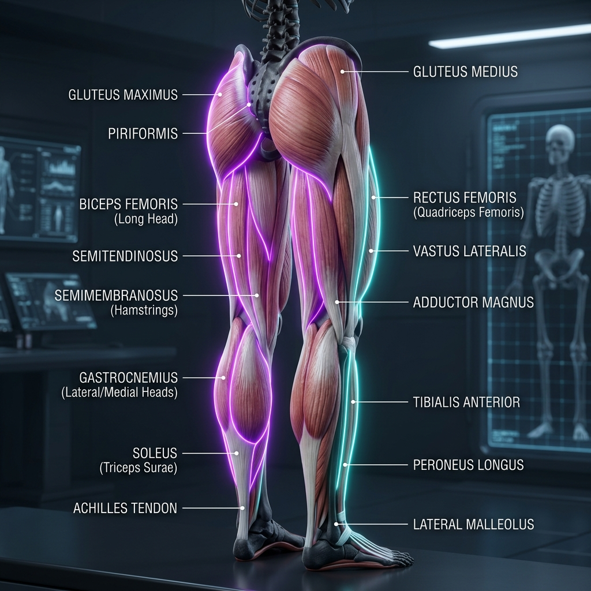

# Day 28: Lower Body Kinetic Chain Integration: Squat Biomechanics, Anthropometrics & Module 4 Assessment

---

## 🎯 Learning Objectives
* **Synthesize Lower Limb Closed Kinetic Chain (CKC) Biomechanics:** Analyze multi-joint torque distribution between the hip, knee, and ankle joints across varying squat depths and loading vectors.
* **Evaluate Individual Anthropometric Variations:** Explain how femur-to-torso length ratios, acetabular depth, and femoral neck version determine individual squat stance width and foot flare.
* **Deconstruct the Etiology of "Butt Wink":** Differentiate anatomical femoroacetabular impingement from functional ankle dorsiflexion restrictions during deep hip flexion.
* **Master High-Level Movement Patterns:** Compare joint kinematics in Calisthenics (Pistol Squat, Sissy Squat) and Yoga (**Utkatasana / उत्कटासन** and **Malasana / मालासन**).
* **Complete Module 4 Board-Style Assessment:** Validate mastery across Days 22–28 with a 10-question comprehensive practical examination.

---

## 🔬 1. Closed Kinetic Chain Squat Biomechanics

The squat is the fundamental closed kinetic chain movement of the lower extremity. During a squat, triple flexion (hip, knee, ankle) occurs simultaneously during the eccentric phase, followed by triple extension (concentric phase).



### Torque Distribution & Lever Arms

The relative demand placed on the hip extensors versus the knee extensors is determined by the horizontal distance (**moment arm**) from the line of gravity (Center of Mass) to each joint center.

```
MOMENT ARM CALCULATION:
Torque (τ) = Force (F) × Perpendicular Moment Arm Distance (d)

• HIP DOMINANT SQUAT (Low Bar / Hinged Torso):
  ├── Line of gravity shifts forward relative to hips ──► Long Hip Moment Arm (High Glute/Hamstring torque)
  └── Shins remain relatively vertical ──► Short Knee Moment Arm (Low Patellofemoral shear)

• KNEE DOMINANT SQUAT (High Bar / Front Squat / Pistol Squat):
  ├── Torso remains upright ──► Short Hip Moment Arm
  └── Knees translate far forward past toes ──► Long Knee Moment Arm (High Quadriceps torque)
```

### Squat Variation Comparison Matrix

| Squat Variation | Torso Angle relative to Vertical | Hip Moment Arm | Knee Moment Arm | Ankle Dorsiflexion Requirement | Primary Muscle Demand |
| :--- | :--- | :--- | :--- | :--- | :--- |
| **Front Squat / Goblet** | $75^\circ\text{–}85^\circ$ (Very upright) | Short | Long | High ($>25^\circ$) | **Quadriceps** & Thoracic Erectors |
| **Back Squat (Low-Bar)** | $45^\circ\text{–}60^\circ$ (Forward incline) | Very Long | Moderate | Moderate ($15^\circ$) | **Gluteus Maximus**, Adductor Magnus, Hamstrings |
| **Pistol Squat (Single-Leg)** | Variable ($50^\circ\text{–}70^\circ$) | Long | Very Long | **Extreme** ($>30^\circ$) | Unilateral Glute Medius/Maximus, Quads, Soleus |
| **Utkatasana (Chair Pose)** | $60^\circ\text{–}70^\circ$ (Active extension) | Moderate | Moderate/Long | High ($20^\circ$) | Isometric Quads, Gluteals, Spinal Erectors |
| **Malasana (Deep Squat)** | $80^\circ\text{–}90^\circ$ (Passive/Active) | Minimal | Minimal | **Maximal physiological** | Hip deep rotators, Adductor stretch, Tibialis Anterior |

---

## 🧬 2. Anthropometric Variations: Why No Two Squats Look the Same

Squat mechanics are profoundly governed by individual skeletal anatomy. Forcing a standardized stance onto all bodies violates structural joint geometry.

### Anthropometric Determinants of Stance & Depth

| Anatomical Parameter | Structural Variation | Biomechanical Consequence on Squat Form | Optimal Individualized Stance |
| :--- | :--- | :--- | :--- |
| **Femur-to-Torso Ratio** | **Long Femur + Short Torso** | Creates a massive horizontal hip displacement; forces significant forward torso incline to keep center of mass over midfoot. | Wider stance, greater foot flare ($25^\circ\text{–}35^\circ$), or heel elevation. |
| **Femur-to-Torso Ratio** | **Short Femur + Long Torso** | Minimal hip displacement; natural ability to squat deep with an almost perfectly vertical torso. | Narrow to shoulder-width stance, minimal foot flare ($10^\circ\text{–}15^\circ$). |
| **Acetabular Orientation** | **Anteverted Acetabulum** (Forward facing socket) | Hips flex freely in narrow sagittal plane without bony abutment. | Narrower stance parallel feet. |
| **Acetabular Orientation** | **Retroverted / Lateral Acetabulum** (Side facing socket) | Femoral neck pinches against the anterior acetabular rim early in sagittal flexion. | **Wider stance with substantial external rotation / foot flare** to clear anterior labrum. |
| **Femoral Version** | **Femoral Retroversion** (Decreased neck angle) | Natural bony external rotation bias; internal rotation severely restricted. | Wide stance with outward toe flare. |

---

## ⚠️ 3. Deconstructing "Butt Wink" (Posterior Pelvic Tilt in Deep Flexion)

"Butt wink" refers to the sudden **posterior rotation of the pelvis and reversal of lumbar lordosis into flexion** at the bottom of a deep squat.

```
THE PATHOPHYSIOLOGY OF "BUTT WINK":

1. CAUSE A: Femoroacetabular Bony Abutment (Anatomical Constraint)
   Femoral neck contacts anterior acetabular labrum ──► Pelvis must tuck posteriorly to allow further depth.

2. CAUSE B: Ankle Dorsiflexion Restriction (Functional Constraint)
   Limited talocrural glide (tight soleus / stiff capsule) ──► Center of mass falls backward
     └── Pelvis tucks under to shift center of mass forward over base of support.

3. CAUSE C: Adductor Magnus / Hamstring Passive Tension
   Posterior fibers of Adductor Magnus reach maximal stretch at bottom ──► Tugs ischium forward.

MECHANICAL HAZARD:
Compressive loads placed on the lumbar spine in flexion shift shear stress onto posterior annulus fibrosus,
dramatically elevating disc herniation risk under heavy loads.
```

---

## 🧘 4. Calisthenics & Yoga Movement Synthesis

### Calisthenics: The Pistol Squat Kinetic Stack
* **Stance Leg:** Requires tremendous unilateral **Gluteus Medius** stabilization to prevent dynamic valgus collapse, coupled with $>30^\circ$ of active ankle dorsiflexion.
* **Free Leg:** The non-weight-bearing leg must be held in full active hip flexion and knee extension, requiring massive concentric activation of the **Iliopsoas, Rectus Femoris**, and active hamstring lengthening (avoiding passive insufficiency).

### Yoga: Malasana (मालासन) vs. Utkatasana (उत्कटासन)
* **Malasana (Deep Garland Squat):** Represents maximal passive-active lower limb joint excursion. Hip joints undergo deep external rotation and abduction ($>45^\circ$), allowing the pelvic floor (*Mula Bandha*) to decompress while the spine elongates.
* **Utkatasana (Chair Pose):** A high-torque isometric hold. The hips and knees are held at $90^\circ$ of flexion against gravity with the arms extended overhead in full shoulder flexion, producing intense co-contraction between the **Quadriceps, Gluteus Maximus, Transverse Abdominis**, and **Thoracolumbar Erector Spinae**.

---

## 🧪 5. Desk-Side Tactile Biomechanics Lab

### Experiment 1: The Hip Impingement Clearance Test (Finding Your Squat Stance)
1. Get down on all fours (quadruped position).
2. Start with your knees hip-width apart and feet pointed straight back.
3. Slowly push your hips straight back toward your heels while keeping your spine neutral.
4. Note the exact point where your pelvis begins to tuck under (lumbar flexion).
5. Now, widen your knees by 4–6 inches and flare your feet outward at $30^\circ$.
6. Push your hips back again.
7. *Observation:* Notice how much deeper your hips can travel toward your heels before your pelvis tucks!
8. *Biomechanics Explanation:* Widening the hip angle and externally rotating the femurs moves the femoral neck away from the anterior acetabular rim, eliminating bony impingement.

### Experiment 2: Ankle Dorsiflexion Heel-Wedge Test
1. Attempt a bodyweight deep squat with flat heels on the floor and your feet narrow. Note if your torso rounds forward or your heels want to lift off the ground.
2. Now, place a 1-inch book or wedge under your heels and repeat the exact same narrow squat.
3. *Observation:* You can immediately squat significantly deeper with an upright torso and zero lumbar rounding!
4. *Biomechanics Explanation:* Elevating the heels artificially decreases the required talocrural dorsiflexion angle, allowing the knees to translate forward freely and maintaining the center of mass directly over the midfoot.

---

## 📚 6. Anatomical Cross-References
* **Bones:** [Pelvis & Acetabulum](../../bones/pelvis_perineum/README.md), [Femur](../../bones/lower_limb/README.md#femur), [Tibia & Fibula](../../bones/lower_limb/README.md#tibia-and-fibula), [Tarsals & Foot](../../bones/lower_limb/README.md#tarsals-metatarsals-and-phalanges).
* **Muscles:** [Gluteal Region](../../muscles/lower_limb/README.md#gluteal-region), [Anterior/Posterior Thigh](../../muscles/lower_limb/README.md#anterior-compartment), [Leg & Calf](../../muscles/lower_limb/README.md#posterior-compartment).
* **Module 4 Foundations:** [Day 22 (Hip Bony Anatomy)](../day-022-hip-anatomy/README.md), [Day 23 (Hip Flexors & Inhibition)](../day-023-hip-flexor-tightness/README.md), [Day 24 (Hip Abductors & Balance)](../day-024-hip-stability-balance/README.md), [Day 25 (Hamstrings & Folds)](../day-025-hamstrings-forward-bends/README.md), [Day 26 (Knee Ligaments & Menisci)](../day-026-knee-joint/README.md), [Day 27 (Ankle & Foot Complex)](../day-027-ankle-foot-complex/README.md).

---

## 🏆 7. Module 4 Board-Style Synthesis Examination

Validate your complete mastery of lower body anatomy and biomechanics across Module 4.

---

### Question 1 (Hip Geometry & Pathomechanics)
An athlete with an Angle of Inclination of $110^\circ$ (Coxa Vara) experiences increased hip abductor leverage but complains of chronic deep groin discomfort during lateral lunges. Explain the mechanical advantages and structural risks associated with Coxa Vara.

<details>
<summary><b>View Board Answer & Rationale</b></summary>
<b>Answer:</b> 
<br>
1. <b>Mechanical Advantage:</b> Coxa Vara ($<120^\circ$) decreases the angle between the femoral neck and shaft, which increases the perpendicular moment arm of the <b>Gluteus Medius and Minimus</b>. This reduces the muscle force required to stabilize the pelvis during single-leg stance.
<br>
2. <b>Structural Risks:</b> The more horizontal femoral neck dramatically increases bending shear forces across the femoral neck (increasing risk of femoral neck stress fractures) and causes earlier bony impingement of the greater trochanter against the ilium during extreme abduction.
</details>

---

### Question 2 (Neural Innervation & Lumbar Roots)
A practitioner presents with inability to actively extend the right knee and absent patellar tendon reflex ($L_4$), but preserves full hip adduction and normal sensation over the lateral leg. Which specific peripheral nerve is damaged, and which nerve root segments does it originate from?

<details>
<summary><b>View Board Answer & Rationale</b></summary>
<b>Answer:</b> 
<br>
<b>Femoral Nerve ($L_2, L_3, L_4$)</b>. 
<br>
<b>Rationale:</b> The femoral nerve innervates the Quadriceps Femoris (knee extension) and mediates the patellar reflex ($L_3\text{–}L_4$). Hip adduction is preserved because the adductors are innervated by the <b>Obturator Nerve</b> ($L_2\text{–}L_4$), and lateral leg sensation is preserved because it is supplied by the <b>Common Fibular (Peroneal) nerve</b> ($L_4\text{–}S_2$).
</details>

---

### Question 3 (Reciprocal Inhibition & Hip Extension)
Explain how prolonged sitting can cause "Gluteal Amnesia" (altered reciprocal inhibition), and describe the precise neuro-muscular cascade that leads to hamstring dominance and lower back pain during hip extension.

<details>
<summary><b>View Board Answer & Rationale</b></summary>
<b>Answer:</b> 
<br>
1. <b>Adaptive Shortening:</b> Constant hip flexion causes adaptive shortening and hypertonicity of the <b>Iliopsoas</b>.
<br>
2. <b>Altered Reciprocal Inhibition:</b> Hyperactive afferent signals from the tight psoas send inhibitory neural signals via interneurons in the spinal cord to the antagonist <b>Gluteus Maximus</b>, elevating its activation threshold.
<br>
3. <b>Synergist Dominance:</b> When hip extension is attempted (e.g., standing, sprinting, bridging), the nervous system recruits synergists—the <b>Hamstrings</b> and <b>Erector Spinae</b>—to compensate. This leads to high hamstring tendon strain (PHT) and excessive lumbar hyperextension shear.
</details>

---

### Question 4 (Frontal Plane Pelvic Stability)
During a single-leg stance on the left foot, a patient's right pelvis immediately drops downward below the horizontal plane. Name this clinical sign, identify the specific denervated or weak muscle, and state its nerve supply.

<details>
<summary><b>View Board Answer & Rationale</b></summary>
<b>Answer:</b> 
<br>
• <b>Clinical Sign:</b> Positive <b>Trendelenburg Sign</b> (on the left stance limb).
<br>
• <b>Weak Muscle:</b> <b>Left Gluteus Medius and Minimus</b> (the weight-bearing abductors fail to counter the gravitational adduction torque of the unsupported pelvis).
<br>
• <b>Nerve Supply:</b> <b>Superior Gluteal Nerve</b> ($L_4, L_5, S_1$).
</details>

---

### Question 5 (Bi-Articular Muscle Insufficiency)
Differentiate the muscle states occurring during a maximal seated hamstring stretch (Paschimottanasana) versus a prone hamstring curl with hip hyperextended. Define both concepts in terms of sarcomere length-tension relationships.

<details>
<summary><b>View Board Answer & Rationale</b></summary>
<b>Answer:</b> 
<br>
1. <b>Paschimottanasana (Passive Insufficiency):</b> The bi-articular hamstrings are simultaneously lengthened across the hip (flexion) and knee (extension). Sarcomeres and titin filaments reach their structural physical elongation limits, mechanically preventing further joint excursion.
<br>
2. <b>Prone Hamstring Curl with Hip Extended (Active Insufficiency):</b> The hamstrings are simultaneously shortened across the hip (extension) and knee (flexion). Sarcomeres are excessively shortened, causing actin filaments to collide past optimal cross-bridge binding sites, resulting in marked loss of contractile tension and acute cramping.
</details>

---

### Question 6 (Knee Ligaments & Trauma)
An athlete undergoes a direct blow to the lateral aspect of the flexed right knee while the foot is firmly planted, forcing the knee into acute valgus and external rotation. Identify the three anatomical structures classically damaged in this mechanism (Unhappy Triad).

<details>
<summary><b>View Board Answer & Rationale</b></summary>
<b>Answer:</b> 
<br>
1. <b>Anterior Cruciate Ligament (ACL)</b>
<br>
2. <b>Medial Collateral Ligament (MCL)</b>
<br>
3. <b>Medial Meniscus</b> (attached directly to deep MCL fibers; lateral meniscus tears also frequently occur acutely).
</details>

---

### Question 7 (Terminal Knee Extension Kinematics)
What is the Screw-Home Mechanism, which specific anatomical asymmetry causes it, and which muscle is responsible for unlocking the knee during the initiation of closed-chain flexion?

<details>
<summary><b>View Board Answer & Rationale</b></summary>
<b>Answer:</b> 
<br>
• <b>Definition:</b> Involuntary axial rotation during the final $20^\circ\text{–}30^\circ$ of knee extension (tibia rotates laterally in open chain, or femur rotates medially in closed chain) that locks the knee in its most stable, closed-pack position.
<br>
• <b>Anatomical Cause:</b> The <b>medial femoral condyle is significantly longer and more curved</b> than the lateral condyle.
<br>
• <b>Unlocking Muscle:</b> The <b>Popliteus muscle</b> ("the key to the knee"), which laterally rotates the femur on the fixed tibia in closed-chain mechanics.
</details>

---

### Question 8 (Foot Arches & Biomechanical Propulsion)
Explain how the Windlass Mechanism converts the human foot from a shock-absorbing compliant structure at heel strike into a rigid propulsion lever during terminal toe-off.

<details>
<summary><b>View Board Answer & Rationale</b></summary>
<b>Answer:</b> 
<br>
At heel strike, the subtalar joint pronates, allowing the transverse tarsal joints to unlock so the foot can compliantly deform and dissipate ground reaction force. During terminal stance and push-off, <b>dorsiflexion of the $1^{\text{st}}$ Metatarsophalangeal (MTP) joint</b> pulls the <b>Plantar Aponeurosis</b> tightly around the metatarsal head. This shortens the distance between the calcaneus and metatarsals, elevates the Medial Longitudinal Arch, inverts the subtalar joint, and locks the midtarsal joints, transforming the foot into a <b>rigid, stiff lever for propulsion</b>.
</details>

---

### Question 9 (Squat Biomechanics & Femur Ratios)
Why does an individual with long femurs relative to their torso require a significantly greater forward torso lean during a barbell back squat compared to an individual with short femurs?

<details>
<summary><b>View Board Answer & Rationale</b></summary>
<b>Answer:</b> 
<br>
During hip flexion, long femurs shift the hip joint and pelvis substantially further backward horizontally away from the center of mass. To keep the combined center of mass (barbell + body) positioned directly over the midfoot (base of support), the individual must <b>incline the torso forward</b> to bring upper body mass anteriorly. This increases the hip moment arm and places significantly higher demand on the <b>Gluteus Maximus, Adductor Magnus, and Lumbar Erector Spinae</b>.
</details>

---

### Question 10 (Yoga Asana Structural Protection)
A student practicing Padmasana (Lotus Pose) feels sharp pulling and pinching along the medial joint line of the knee. Identify the underlying joint restriction causing this pain and explain the exact mechanical error being committed.

<details>
<summary><b>View Board Answer & Rationale</b></summary>
<b>Answer:</b> 
<br>
• <b>Underlying Restriction:</b> Inadequate <b>Hip External Rotation ($<90^\circ$)</b> at the acetabulofemoral ball-and-socket joint (tight deep external rotators, adductors, or iliofemoral ligament).
<br>
• <b>Mechanical Error:</b> Instead of rotating purely from the hip, the practitioner forces the foot across the opposite thigh by applying rotary and varus torque to the flexed knee. Because the knee is a modified hinge joint with minimal rotational tolerance, this torque compresses and tears the posterior horn of the <b>Medial Meniscus</b> against the medial femoral condyle.
</details>
