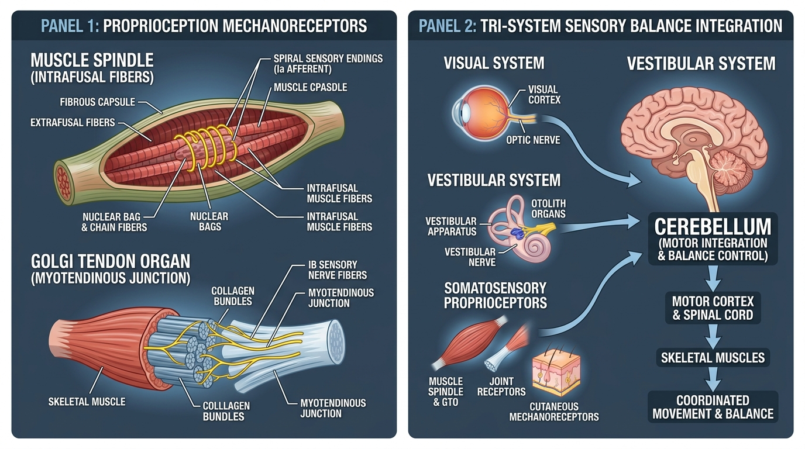

# Day 29: Proprioception, Sensory Receptors & Somatosensory Feedback

---

## 🎯 Learning Objectives
* **Dissect Primary Mechanoreceptors:** Compare the neuroanatomy, orientation (parallel vs. series), sensory afferents, and functional thresholds of **Muscle Spindles** versus **Golgi Tendon Organs (GTOs)**.
* **Explain Alpha-Gamma Co-activation:** Understand how gamma motor neurons maintain muscle spindle sensitivity during active muscle shortening.
* **Map the Tri-System Balance Hierarchy:** Analyze how the Central Nervous System (Cerebellum) integrates **Visual**, **Vestibular**, and **Somatosensory/Proprioceptive** inputs to control equilibrium.
* **Evaluate Unstable Kinetic Chain Demands:** Differentiate neuromuscular motor unit recruitment in calisthenics on **gymnastic rings versus fixed bars**.
* **Harness Visual Fixation (*Drishti*) in Asana:** Explain how gaze stabilization (*Drishti / दृष्टि*) interfaces with the Vestibulo-Ocular Reflex (VOR) during complex single-leg yoga balances like **Garudasana (गरुडासन)** and **Ardha Chandrasana (अर्धचन्द्रासन)**.

---

## 🔬 1. The Peripheral Mechanoreceptor Network

**Proprioception** is the subconscious perception of joint position, motion (kinesthesia), and force generated by specialized mechanoreceptors embedded within muscles, tendons, joint capsules, and skin.



### Mechanoreceptor Comparative Classification Table

| Receptor Type | Anatomical Location | Structural Orientation | Sensory Afferent Fiber | Primary Stimulus Detected | Physiological Function |
| :--- | :--- | :--- | :--- | :--- | :--- |
| **Muscle Spindle** | Deep within muscle bellies (intrafusal fibers) | **In Parallel** with extrafusal skeletal muscle fibers | **Group Ia** (primary/phasic) & **Group II** (secondary/tonic) | **Muscle length** and **Rate of change of length** (stretch velocity) | Triggers the monosynaptic **Myotatic (Stretch) Reflex** to prevent over-stretching; regulates muscle tone. |
| **Golgi Tendon Organ (GTO)** | Myotendinous junction (collagen-tendon weave) | **In Series** with extrafusal muscle fibers | **Group Ib** myelinated afferents | **Active muscle tension** and contractile force magnitude | Triggers the disynaptic **Inverse Myotatic (Autogenic Inhibition) Reflex** to protect tendons from avulsion. |
| **Ruffini Endings (Type I)** | Superficial joint capsule, ligaments | Embedded in fibrous tissue | Group II / A-beta | **Static joint angle**, capsular stretch, intra-articular pressure | Slow-adapting postural encoders; signals limit of physiological joint range. |
| **Pacinian Corpuscles (Type II)** | Deep joint capsule, periosteum, deep dermis | Concentric lamellar layers | Group II / A-beta | **High-frequency vibration**, rapid joint acceleration/deceleration | Fast-adapting dynamic velocity sensors; detects onset/termination of joint movement. |
| **Free Nerve Endings (Type IV)** | Articular fat pads, periosteum, capsule | Unmyelinated arborizations | Group III ($A\delta$) & Group IV ($C$ fibers) | Mechanical deformation, inflammatory chemicals, tissue stress | **Nociception** (pain transmission) and protective arthrogenic muscle inhibition. |

---

## ⚡ 2. Muscle Spindle Micro-Architecture & Alpha-Gamma Co-Activation

If a muscle contracts and shortens, an ordinary stretch receptor wired in parallel would go completely slack and stop transmitting sensory data. The nervous system solves this via **Alpha-Gamma Co-activation**.

```
THE ALPHA-GAMMA MOTOR LOOP:

1. MOTOR COMMAND INITIATION:
   Motor Cortex fires descending command to voluntarily flex a joint.
   ├── ALPHA (α) MOTOR NEURONS stimulate EXTRAFUSAL muscle fibers (generate active force).
   └── GAMMA (γ) MOTOR NEURONS stimulate INTRAFUSAL muscle fibers (polar contractile ends of the spindle).

2. FUNCTIONAL RESULT:
   As the main muscle shortens, the intrafusal fiber ends contract simultaneously,
   keeping the central equatorial sensory region taut and sensitive to sudden stretch at all muscle lengths!
```

> [!IMPORTANT]
> **Clinical Significance:** Without gamma motor neuron drive, a muscle in a shortened state would lose its protective stretch reflex, leaving it vulnerable to acute ballistic tears upon unexpected load changes.

---

## ⚖️ 3. The Tri-System Hierarchy of Postural Equilibrium

Postural balance is maintained by continuous multimodal sensory fusion within the **Vestibular Nuclei and Cerebellum**, which outputs motor corrections via descending vestibulospinal, reticulospinal, and corticospinal tracts.

### Sensory Triad Breakdown

| Sensory Modality | Anatomical Structures Involved | What It Encodes | Compensatory Strategy if Impaired |
| :--- | :--- | :--- | :--- |
| **Visual System** | Retina, Optic Tract, Visual Cortex ($V_1$), Superior Colliculus | Environmental verticality, visual horizon, relative optic flow | Relies entirely on proprioceptive ankle sway strategy and vestibular input. |
| **Vestibular System** | **Semicircular Canals** (angular acceleration: pitch, roll, yaw) & **Otolith Organs** (Utricle & Saccule: linear acceleration and gravity) | Head orientation relative to gravity; inertial motion vectors | Visual fixation on a stationary object becomes mandatory; high fall risk with eyes closed. |
| **Somatosensory / Proprioceptive** | Foot plantar mechanoreceptors, ankle joint capsules, spinal cord **Dorsal Columns (Gracile/Cuneate fasciculi)** & **Spinocerebellar tracts** | Ground reaction force, joint angles, center-of-pressure shifts | Relies heavily on visual scanning (staring at feet during ambulation). |

---

## 🤸 4. Movement Applications: Calisthenics & Yoga

### Calisthenics: Gymnastic Rings vs. Fixed Parallel Bars
* **Fixed Bar Support:** The parallel bars provide a fixed, closed-chain mechanical restraint. Lateral and rotational perturbations are zero; motor output is primarily feedforward and predictable.
* **Gymnastic Ring Support:** Because each ring possesses **6 degrees of freedom (3 translational, 3 rotational)**, the glenohumeral joint and scapulothoracic articulation experience continuous chaotic micro-deviations.
* **Proprioceptive Surge:** Joint mechanoreceptors and muscle spindles fire continuously, driving massive reflexive co-contraction of the **Rotator Cuff (SITS)**, **Serratus Anterior**, and **Biceps brachii tendon**.

### Yoga: Drishti (दृष्टि) & Sensory Gaze in Single-Leg Balance
* **The Neurobiology of Drishti:** In postures like *Vrikshasana (वृक्षासन - Tree Pose)*, *Garudasana (गरुडासन - Eagle Pose)*, and *Ardha Chandrasana (अर्धचन्द्रासन - Half Moon Pose)*, fixing the gaze on an unmoving external point (*Drishti*) stabilizes the **Vestibulo-Ocular Reflex (VOR)**.
* **Eliminating Optic Noise:** Rapid saccadic eye movements create "optic jitter," disorienting the cerebellar postural integration. A steady focal point minimizes retinal slip, freeing neurological processing bandwidth for rapid ankle-foot proprioceptive micro-adjustments (*Pada Bandha*).

---

## 🧪 5. Desk-Side Tactile Biomechanics Lab

### Experiment 1: The Modified Romberg Test (Visual Occlusion Balance)
1. Stand barefoot on a firm floor on your left leg only.
2. Hold your arms across your chest and find steady balance for 20 seconds. Note how stable your ankle feels.
3. Now, **close both eyes** while maintaining single-leg balance.
4. *Observation:* Notice the immediate, violent firing of your ankle stabilizer muscles (Tibialis Anterior, Fibularis Longus, Soleus) and the rapid postural sway.
5. *Biomechanics Explanation:* Closing your eyes eliminates the visual input from the sensory triad ($>30\%\text{–}40\%$ of balance control). Your nervous system is forced to rely $100\%$ on foot/ankle somatosensory mechanoreceptors and inner ear vestibular otoliths to prevent falling.

### Experiment 2: Joint Position Reproduction (JPR) Test
1. Sit comfortably with your eyes closed.
2. Slowly extend your right knee to what you estimate is exactly $45^\circ$ of flexion.
3. Hold it for 3 seconds, memorize the feeling of tension, and return to the resting position.
4. Open your eyes, re-create the exact same angle, and visually inspect or measure your accuracy with a mirror.
5. *Biomechanics Explanation:* This tests the integrity of your **Type I & II articular mechanoreceptors and muscle spindles**, reflecting your conscious kinesthetic position sense without visual feedback.

---

## 📚 6. Anatomical Cross-References
* **Nervous System & Pathways:** Dorsal Column-Medial Lemniscal System, Posterior Spinocerebellar Tract, Alpha/Gamma Motor Neurons.
* **Muscles:** [Rotator Cuff SITS Complex](../../muscles/upper_limb/README.md#scapular-region), [Intrinsic Foot Muscles & Triceps Surae](../../muscles/lower_limb/README.md#posterior-compartment).
* **Foundations:** [Day 4: Muscle Contractions](../day-004-muscle-anatomy-contractions/README.md), [Day 27: Ankle & Foot Complex](../day-027-ankle-foot-complex/README.md).

---

## 📝 7. Daily Knowledge Retrieval Quiz

<details>
<summary><b>1. What is the fundamental functional difference in stimulus detection between Muscle Spindles and Golgi Tendon Organs (GTOs)?</b></summary>
<b>Answer:</b> <b>Muscle Spindles</b> are wired <i>in parallel</i> with extrafusal fibers and detect changes in <b>muscle length and the rate (velocity) of stretch</b>. <b>Golgi Tendon Organs</b> are wired <i>in series</i> at the myotendinous junction and detect <b>active muscle tension / contractile force</b>.
</details>

<details>
<summary><b>2. Why is Alpha-Gamma Co-activation essential for continuous proprioceptive motor control during voluntary movement?</b></summary>
<b>Answer:</b> When alpha motor neurons cause the main extrafusal muscle fibers to contract and shorten, gamma motor neurons simultaneously contract the poles of the intrafusal fibers inside the spindle. This prevents the muscle spindle from going slack, maintaining its sensitivity to sudden length changes throughout the entire range of motion.
</details>

<details>
<summary><b>3. Name the three sensory modalities that the Central Nervous System fuses to maintain postural balance.</b></summary>
<b>Answer:</b> 
1. <b>Visual System</b> (retinal input and optic flow).
2. <b>Vestibular System</b> (semicircular canals and otolith organs of the inner ear).
3. <b>Somatosensory / Proprioceptive System</b> (muscle spindles, GTOs, joint capsule receptors, and plantar cutaneous mechanoreceptors).
</details>

<details>
<summary><b>4. Why does training a support hold on gymnastic rings stimulate significantly higher neuromuscular rotator cuff activation than on fixed parallel bars?</b></summary>
<b>Answer:</b> Gymnastic rings are an unstable suspension system with 6 degrees of freedom. Any minute displacement requires immediate multidirectional corrective torque, triggering rapid proprioceptive feedback loops that demand continuous, high-threshold co-contraction of the rotator cuff (SITS) and scapular stabilizers to centrate the humeral head.
</details>

<details>
<summary><b>5. In yoga balances, how does practicing a steady gaze (Drishti) physiologically assist in maintaining equilibrium?</b></summary>
<b>Answer:</b> Fixing the gaze on an unmoving external point prevents erratic retinal slip and ocular saccades, stabilizing the <b>Vestibulo-Ocular Reflex (VOR)</b>. This eliminates visual processing noise, allowing the cerebellum to prioritize high-speed somatosensory corrections from the feet and ankles.
</details>
