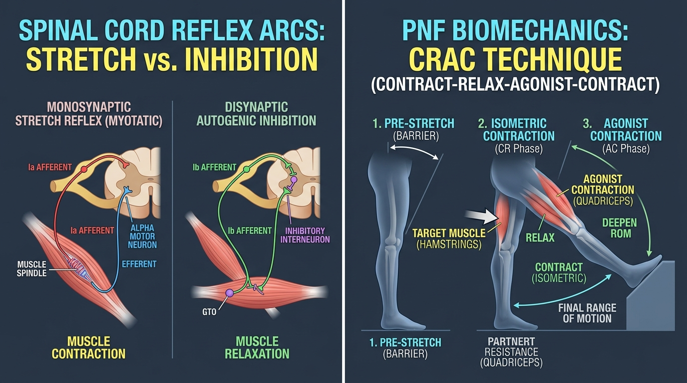

# Day 30: The Stretch Reflex, Flexibility Science & PNF Biomechanics

---

## 🎯 Learning Objectives
* **Map Spinal Cord Reflex Arcs:** Compare the neural circuitry, synaptic delays, and sensory afferents of the **Monosynaptic Myotatic (Stretch) Reflex** versus the **Disynaptic Inverse Myotatic (Autogenic Inhibition) Reflex**.
* **Contrast Inhibitory Pathways:** Differentiate **Autogenic Inhibition** (GTO Ib afferents inhibiting the same muscle) from **Reciprocal Inhibition** (Spindle Ia afferents inhibiting the antagonist muscle).
* **Deconstruct PNF Protocols:** Analyze the physiological mechanisms and chronological execution of **Contract-Relax (CR)**, **Hold-Relax (HR)**, and **Contract-Relax-Agonist-Contract (CRAC)**.
* **Understand Stretch Tolerance vs. Mechanical Remodeling:** Distinguish short-term sensory accommodation (neural tolerance) from long-term sarcomerogenesis and fascial remodeling.
* **Apply PNF in Calisthenics & Yoga:** Apply CRAC protocols to achieve end-range compression in calisthenics (Stalder Press, Pike Handstand) and extreme yoga flexibility in **Hanumanasana (हनुमानासन - Front Splits)**.

---

## 🔬 1. Spinal Reflex Circuitry: Stretch Reflex vs. Autogenic Inhibition

Flexibility is not merely a mechanical property of muscle-tendon units; it is tightly regulated by the spinal cord and central nervous system to protect joints from acute disruption.



### Neurophysiological Reflex Matrix

| Parameter | Monosynaptic Stretch Reflex (Myotatic) | Disynaptic Inverse Myotatic Reflex (Autogenic) | Reciprocal Inhibition |
| :--- | :--- | :--- | :--- |
| **Sensory Receptor** | **Muscle Spindle** (Intrafusal fibers) | **Golgi Tendon Organ (GTO)** | **Muscle Spindle** of opposing muscle |
| **Afferent Pathway** | **Group Ia** & **Group II** primary afferents | **Group Ib** myelinated sensory afferent | **Group Ia** afferent from agonist |
| **Synaptic Circuit** | **Monosynaptic** (Direct synapse onto Alpha Motor Neuron) | **Disynaptic** (Synapses onto an **Inhibitory Interneuron**) | **Disynaptic** (Synapses onto an **Ia Inhibitory Interneuron**) |
| **Effector Response** | **Rapid Contraction** of the stretched muscle; prevents dangerous over-lengthening | **Active Relaxation / Inhibition** of the contracting muscle; prevents tendon avulsion | **Active Relaxation** of the antagonist muscle; permits fluid unresisted joint motion |
| **Latent Period** | $\sim 20\text{–}30\text{ ms}$ (Extremely rapid) | $\sim 40\text{–}50\text{ ms}$ (Slightly slower) | $\sim 30\text{–}40\text{ ms}$ |
| **Movement Example** | Knee jerk test (Patellar tendon tap); catching a falling heavy weight | Muscle "giving way" under a maximal 1RM overload; PNF isometric contraction | Contracting Quadriceps causes immediate relaxation of Hamstrings |

---

## ⚡ 2. The Science of Proprioceptive Neuromuscular Facilitation (PNF)

PNF stretching combines passive elongation with isometric contractions to manipulate spinal reflex arcs, overriding the stretch reflex and temporarily expanding active and passive range of motion.

### PNF Techniques Comparison Table

| PNF Protocol | Step-by-Step Execution Sequence | Primary Neurophysiological Driver | Effectiveness & Best Use Case |
| :--- | :--- | :--- | :--- |
| **Hold-Relax (HR)** | 1. Passive pre-stretch to mild tension ($10\text{ s}$).<br>2. Maximal **isometric contraction** against fixed resistance ($6\text{–}8\text{ s}$).<br>3. Complete relaxation ($2\text{–}3\text{ s}$).<br>4. Passive advance into new ROM ($15\text{–}30\text{ s}$). | **Autogenic Inhibition:** High GTO firing stimulates Ib inhibitory interneurons to hyperpolarize alpha motor neurons, reducing baseline muscle tone. | Ideal when passive range is restricted by intense protective muscular guarding or acute spasm. |
| **Contract-Relax (CR)** | 1. Passive pre-stretch ($10\text{ s}$).<br>2. **Concentric / Rotational contraction** through range against moving resistance ($6\text{–}8\text{ s}$).<br>3. Relaxation and passive advance into new ROM ($15\text{–}30\text{ s}$). | Autogenic inhibition combined with dynamic muscle spindle resetting and viscoelastic stress relaxation. | Excellent for multi-planar joints (e.g., hip internal/external rotation, shoulder abduction). |
| **Contract-Relax-Agonist-Contract (CRAC)** | 1. Passive pre-stretch ($10\text{ s}$).<br>2. Isometric contraction of target muscle ($6\text{–}8\text{ s}$).<br>3. **Immediate active maximal contraction of opposing agonist** to pull limb deeper ($6\text{–}8\text{ s}$).<br>4. Passive hold in new end-range ($15\text{–}30\text{ s}$). | **Dual Inhibition:** Combines **Autogenic Inhibition** (from target muscle contraction) with **Reciprocal Inhibition** (from opposing agonist contraction). | **Gold Standard:** Produces the greatest immediate and long-term gains in active flexibility and motor control. |

---

## 🧬 3. Neurological Stretch Tolerance vs. Structural Tissue Remodeling

When an individual gains range of motion from stretching, two distinct physiological adaptations occur along different timelines:

```
ACUTE FLEXIBILITY GAINS (Minutes to Weeks):
• Primary Driver: NEUROLOGICAL SENSORY ACCOMMODATION (Increased Stretch Tolerance).
• Mechanism: The Central Nervous System (dorsal horn & thalamus) tolerates higher afferent nociceptive
  firing from free nerve endings and muscle spindles without triggering panic/guarding contractions.
• Tissue length remains largely unchanged; the brain simply allows the joint to go further.

CHRONIC FLEXIBILITY GAINS (Months of Loaded Stretching):
• Primary Driver: STRUCTURAL MORPHOLOGICAL REMODELING.
• Sarcomerogenesis: Addition of sarcomeres in series along the length of muscle myofibrils.
• Extracellular Matrix (ECM) Turnover: Collagen fiber realignment, increased proteoglycan hydration,
  and remodeling of perimysial/epimysial fascial sheets.
```

---

## 🧘 4. Movement Applications: Calisthenics & Yoga

### Calisthenics: Active Compression for Press Handstands (Pike & Pancake)
* **The Mechanical Dilemma:** A passive forward fold is useless for a Stalder Press or Pike Press to Handstand if the athlete cannot generate active compressive torque at the end-range.
* **CRAC Implementation for Pancake:**
  1. Fold into a straddle pancake stretch on the floor.
  2. Press heels into the ground hard for 6 seconds (isometric hamstrings contraction $\rightarrow$ Autogenic Inhibition).
  3. Immediately flex the hip flexors, rectus abdominis, and quadriceps to actively pull the chest to the floor without using hands (Reciprocal Inhibition $\rightarrow$ Active Compression Strength).

### Yoga: Hanumanasana (हनुमानासन - Monkey Pose / Front Splits)
* **Bi-Articular Dual Challenge:**
  * **Front Leg:** Hamstrings in extreme passive insufficiency (hip flexion + knee extension).
  * **Back Leg:** Iliopsoas and Rectus Femoris in extreme passive insufficiency (hip extension + knee extension).
* **PNF Integration:** In a split, actively pushing the front heel down and the back knee into the mat (engaging hamstrings and glutes) triggers massive GTO autogenic inhibition, allowing safe descent into the full floor split without tearing the ischial hamstring tendon.

---

## 🧪 5. Desk-Side Tactile Biomechanics Lab

### Experiment 1: The Jendrassik Maneuver (Reflex Facilitation)
1. Sit with your legs dangling freely over the edge of a desk/table.
2. Tap your patellar tendon (just below the kneecap) to elicit a baseline knee-jerk reflex.
3. Now, interlock the fingers of both hands across your chest and **pull them apart as hard as you can** (maximal isometric upper body effort).
4. While pulling, have someone tap your patellar tendon (or tap it firmly yourself).
5. *Observation:* The knee-jerk kick is noticeably larger and more exaggerated!
6. *Biomechanics Explanation:* The Jendrassik maneuver sends generalized descending excitatory volleys through the spinal cord, reducing presynaptic inhibition on lower motor neurons and supercharging the **monosynaptic stretch reflex**.

### Experiment 2: Immediate CRAC Hamstring Expansion Test
1. Lie on your back in a doorway with one leg extended up against the doorframe.
2. Note your maximum passive hamstring stretch angle (e.g., $75^\circ$).
3. **Phase 1 (Contract):** Press your heel forcefully into the doorframe for 8 seconds (isometric hamstrings).
4. **Phase 2 (Agonist Contract):** Instantly contract your quadriceps and hip flexors to pull your leg 1–2 inches *away* from the doorframe into the open room, holding actively for 6 seconds.
5. Relax your leg back onto the doorframe and slide your hips closer.
6. *Observation:* You will immediately gain $10^\circ\text{–}15^\circ$ of additional passive and active range of motion!

---

## 📚 6. Anatomical Cross-References
* **Nervous System & Pathways:** Monosynaptic Reflex Arc, Alpha & Gamma Motor Neurons, Ia/Ib Sensory Afferents, Inhibitory Interneurons.
* **Muscles:** [Hamstrings & Quadriceps](../../muscles/lower_limb/README.md#anterior-compartment), [Iliopsoas](../../muscles/lower_limb/README.md#iliopsoas).
* **Foundations:** [Day 4: Muscle Contraction Physiology](../day-004-muscle-anatomy-contractions/README.md), [Day 25: Hamstring Mechanics](../day-025-hamstrings-forward-bends/README.md), [Day 29: Proprioception](../day-029-proprioception/README.md).

---

## 📝 7. Daily Knowledge Retrieval Quiz

<details>
<summary><b>1. What is the fundamental difference between the Monosynaptic Stretch Reflex and the Inverse Myotatic Reflex?</b></summary>
<b>Answer:</b> The <b>Monosynaptic Stretch Reflex</b> is initiated by Muscle Spindles (Ia afferents) and causes rapid <b>contraction</b> of the stretched muscle. The <b>Inverse Myotatic Reflex</b> is disynaptic, initiated by Golgi Tendon Organs (Ib afferents) via an inhibitory interneuron, and causes <b>relaxation/inhibition</b> of the contracting muscle under excessive tension.
</details>

<details>
<summary><b>2. Why is the CRAC (Contract-Relax-Agonist-Contract) technique considered the most potent PNF stretching method?</b></summary>
<b>Answer:</b> Because it leverages <b>two synergistic inhibitory mechanisms simultaneously</b>: <b>Autogenic Inhibition</b> (from the isometric contraction of the target muscle stimulating GTOs) followed immediately by <b>Reciprocal Inhibition</b> (from the active contraction of the opposing agonist muscle stimulating Ia inhibitory interneurons).
</details>

<details>
<summary><b>3. During the first 2–4 weeks of a flexibility routine, what is the primary biological reason for increased joint range of motion?</b></summary>
<b>Answer:</b> <b>Increased Neurological Stretch Tolerance</b> (sensory accommodation). The Central Nervous System adapts to tolerate greater afferent nociceptive input before triggering protective guarding contractions; true structural sarcomerogenesis (adding sarcomeres in series) requires months of consistent loaded stretching.
</details>

<details>
<summary><b>4. How does the Jendrassik Maneuver amplify the patellar stretch reflex?</b></summary>
<b>Answer:</b> High-effort isometric contraction of distant muscles (e.g., clenching hands) sends descending excitatory volleys down the spinal cord, which decreases presynaptic inhibition on alpha motor neurons, increasing overall spinal motor neuron excitability.
</details>

<details>
<summary><b>5. In performing a front split (Hanumanasana), how does pushing the front heel into the floor facilitate greater depth?</b></summary>
<b>Answer:</b> Generating an active isometric contraction of the hamstrings activates the <b>Golgi Tendon Organs (GTOs)</b> at the ischial myotendinous junction. When the contraction stops, the resulting <b>autogenic inhibition</b> relaxes the hamstring muscle fibers, allowing the practitioner to sink safely into a deeper split.
</details>
