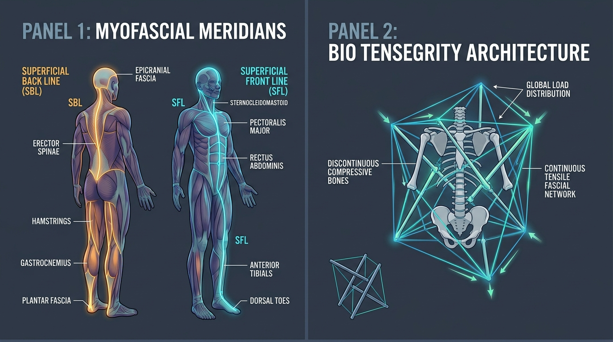

# Day 31: Myofascial Meridians, Anatomy Trains & Biotensegrity Architecture

---

## 🎯 Learning Objectives
* **Transcend Isolated Muscle Reductions:** Understand the biomechanical reality of **Myofascial Continuity** (force transmission through continuous fascial sheets rather than isolated origin-to-insertion levers).
* **Map the Primary Myofascial Meridians:** Master the anatomical tracks, bony stations, and postural functions of the **Superficial Back Line (SBL)**, **Superficial Front Line (SFL)**, **Lateral Line (LL)**, **Spiral Line (SPL)**, and the **Deep Front Line (DFL)**.
* **Apply Biotensegrity Engineering:** Explain how discontinuous compressive struts (bones) floating in a continuous pre-stressed tension web (fascia) distribute mechanical load globally.
* **Analyze Fascial Tension in Calisthenics:** Deconstruct total-body isometric fascial recruitment in the **Front Lever** (SBL/Functional Lines) and **Planche** (SFL/DFL).
* **Synthesize Rotational Asana Mechanics:** Trace spiral line torque transmission in yoga postures such as **Parivrtta Trikonasana (परिवृत्त त्रिकोणासन - Revolved Triangle Pose)**.

---

## 🔬 1. The Paradigm of Myofascial Meridians

Traditional anatomy models treat muscles as isolated actuators attaching from Bone A to Bone B. In living human biotensegrity, over **$30\%\text{–}40\%$ of muscular contractile force is transmitted laterally and longitudinally through the extracellular fascial matrix** (epimysium, perimysium, and deep fascia) across multiple joint complexes.



### The Primary Myofascial Meridians Classification Table

| Fascial Line / Meridian | Continuous Anatomical Track (Track & Bony Stations) | Primary Postural & Biomechanical Function | Athletic & Clinical Manifestation |
| :--- | :--- | :--- | :--- |
| **Superficial Back Line (SBL)** | Plantar fascia $\rightarrow$ Calcaneus $\rightarrow$ Achilles tendon $\rightarrow$ Gastrocnemius $\rightarrow$ Femoral Condyles $\rightarrow$ Hamstrings $\rightarrow$ Ischial Tuberosity $\rightarrow$ Sacrotuberous Ligament $\rightarrow$ Sacrum $\rightarrow$ Thoracolumbar Fascia / Erector Spinae $\rightarrow$ Occipital Ridge $\rightarrow$ Galea Aponeurotica (Epicranial Fascia) | Maintains upright standing posture; resists forward collapse into gravity; drives global extension. | Tightness in plantar fascia restricts cervical spine flexion and forward folds (*Uttanasana*). |
| **Superficial Front Line (SFL)** | Dorsal toe extensors $\rightarrow$ Tibialis Anterior $\rightarrow$ Tibial Tuberosity $\rightarrow$ Patellar Tendon / Rectus Femoris $\rightarrow$ AIIS $\rightarrow$ Pubic Tubercle $\rightarrow$ Rectus Abdominis $\rightarrow$ $5^{\text{th}}\text{–}7^{\text{th}}$ Ribs / Sternum $\rightarrow$ Sternalis Fascia $\rightarrow$ Sternocleidomastoid (SCM) $\rightarrow$ Mastoid Process | Balances the SBL; provides tensile support to lift pubis, rib cage, and head; limits hyperextension. | Chronic sitting causes adaptive shortening, pulling the rib cage down and head forward (slump posture). |
| **Lateral Line (LL)** | $1^{\text{st}}\text{–}5^{\text{th}}$ Metatarsal bases $\rightarrow$ Fibularis (Peroneus) Longus & Brevis $\rightarrow$ Fibular Head $\rightarrow$ Anterior Ligament of Fibular Head $\rightarrow$ Iliotibial (IT) Band / TFL / Gluteus Maximus $\rightarrow$ Iliac Crest $\rightarrow$ Lateral Obliques $\rightarrow$ External/Internal Intercostals $\rightarrow$ Splenius Capitis / SCM | Stabilizes the body in the frontal plane; prevents lateral pelvic sway and trunk shearing during gait. | Weakness causes lateral hip dropping (Trendelenburg) and excessive spinal side-bending. |
| **Spiral Line (SPL)** | Occiput $\rightarrow$ Rhomboids $\rightarrow$ Medial Scapular Border $\rightarrow$ Serratus Anterior $\rightarrow$ External Oblique $\rightarrow$ Abdominal Aponeurosis $\rightarrow$ Opposite Internal Oblique $\rightarrow$ ASIS $\rightarrow$ TFL / ITB $\rightarrow$ Tibialis Anterior $\rightarrow$ Medial Cuneiform $\rightarrow$ Fibularis Longus $\rightarrow$ Biceps Femoris $\rightarrow$ Sacrotuberous Ligament $\rightarrow$ Erector Spinae $\rightarrow$ Occiput | Wraps the body in a double helix; regulates multi-planar rotational torque and knee/arch tracking. | Asymmetry creates rotational scoliosis, pelvic torsions, and pronation compensations. |
| **Deep Front Line (DFL)** | Deep posterior compartment of leg (Tibialis Posterior, FHL, FDL) $\rightarrow$ Popliteus / Knee Capsule $\rightarrow$ Adductor Magnus / Brevis / Longus $\rightarrow$ Pelvic Floor (Levator Ani) $\rightarrow$ Obturator Internus Fascia $\rightarrow$ Iliopsoas $\rightarrow$ Anterior Longitudinal Ligament / Diaphragm $\rightarrow$ Pericardium / Mediastinum $\rightarrow$ Deep Cervical Fascia / Scalenes $\rightarrow$ Longus Colli & Capitis $\rightarrow$ Mandible & Basilar Occiput | **The Myofascial Core:** Lifts the inner arches, stabilizes the hip joints, anchors the pelvis, supports the lumbar spine, and houses the autonomic and respiratory diaphragms. | The foundational meridian for all core stability, diaphragmatic breathing, and axial spinal elongation. |

---

## 🏗️ 2. Biotensegrity Architecture: Global Load Sharing

Coined by Dr. Stephen Levin from Buckminster Fuller’s architectural tensegrity concepts, **Biotensegrity** describes human structural mechanics:

```
TRADITIONAL CONTINUOUS COMPRESSION MODEL (Stone Arch / Brick Wall):
Mass rests directly upon mass ──► Load stacks progressively downward onto joints
  └── Vulnerability: High localized friction, joint compression, and shear failure at base.

BIOTENSEGRITY MODEL (Human Movement Architecture):
Compressive struts (Bones) DO NOT touch directly; they FLOAT inside a
continuous, pre-stressed tension envelope (Fascial Network).
  ├── Dynamic Equilibrium: Tension is distributed instantly across ALL lines.
  ├── Omni-Directional Resilience: Local strain is absorbed globally across the entire matrix.
  └── Catapult Recoil: Elastic energy is stored in collagen sheets and discharged explosively.
```

> [!IMPORTANT]
> **Fascial Energy Recoil (The Catapult Effect):** During running, hopping, or plyometric calisthenics, muscles often contract **quasi-isometrically**, while the surrounding elastic fascia (e.g., Achilles tendon, plantar fascia, thoracolumbar fascia) lengthens and snaps back like a rubber band, delivering up to $50\%$ of kinetic propulsion with minimal metabolic ATP cost.

---

## 🤸 3. Movement Applications: Calisthenics & Yoga

### Calisthenics: The Front Lever as a Pure SBL / Functional Line Lock
* **The Movement:** In a horizontal Front Lever, the athlete suspends horizontal to the ground against gravity supported only by the hands on the bar.
* **Fascial Meridian Recruitment:**
  * **Superficial Back Line (SBL):** Plantarflexed ankles, locked knees, and active gluteal/hamstring contraction link directly into the thoracolumbar fascia.
  * **Posterior Functional Line (PFL):** The Latissimus Dorsi contracts, pulling tension across the contralateral Gluteus Maximus via the thoracolumbar fascia, creating an unyielding posterior tensile truss that prevents the hips from sagging.

### Yoga: Rotational Helix in Parivrtta Trikonasana (परिवृत्त त्रिकोणासन)
* **The Asana:** Revolved Triangle Pose requires deep multi-planar rotation of the thorax while maintaining rigid grounding through both feet.
* **Spiral Line (SPL) Engagement:**
  * Ground reaction force travels up through the front foot's **Fibularis Longus** and **Tibialis Anterior** sling.
  * Tension travels across the **Iliotibial Band**, across the pelvis via the **Internal Oblique**, criss-crossing the linea alba into the opposite **External Oblique**, and driving through the **Serratus Anterior** and **Rhomboids** to project the top hand toward the ceiling in pure biotensegrity balance.

---

## 🧪 4. Desk-Side Tactile Biomechanics Lab

### Experiment 1: The Remote Fascial Transmission Test (Plantar Fascia to SBL)
1. Stand with straight legs and perform a baseline forward fold (*Uttanasana*). Note the exact distance between your fingertips and the floor and the tension in your hamstrings/lower back.
2. Return to standing. Take a firm massage ball or lacrosse ball and place it under your right foot.
3. Apply deep, vigorous pressure along the **entire plantar fascia** (from heel to toe knuckles) for 90 seconds.
4. Repeat on the left foot for 90 seconds.
5. Re-test your forward fold (*Uttanasana*).
6. *Observation:* You will immediately reach 1–3 inches deeper with significantly reduced hamstring tension!
7. *Biomechanics Explanation:* You did not touch your hamstrings or spine. Releasing the distal anchor of the **Superficial Back Line (SBL)** reduced resting tensile tone along the entire continuous myofascial meridian all the way to the occiput.

### Experiment 2: Biotensegrity Arm Spring (Fascial Pre-Stress)
1. Extend your right arm straight out in front of you. Keep your arm muscles completely loose and floppy.
2. Have someone push down on your wrist (or push down with your left hand). Notice how the arm bends easily at the elbow and shoulder.
3. Now, instead of tensing hard, **spread your fingers wide, reach forward through the fingertips, and gently screw your palm outward** (activating the deep arm fascial spiral).
4. Re-apply the downward force on the wrist.
5. *Observation:* The arm behaves like a rigid, resilient spring without high muscular exertion!
6. *Biomechanics Explanation:* Pre-stressing the fascial lines establishes omni-directional biotensegrity stiffness throughout the limb.

---

## 📚 5. Anatomical Cross-References
* **Fascial Structures:** [Thoracolumbar Fascia & Galea Aponeurotica](../../muscles/back_spine/README.md), [Iliotibial Tract & Plantar Aponeurosis](../../muscles/lower_limb/README.md#posterior-compartment).
* **Deep Core & Diaphragm:** [Psoas Major & Pelvic Floor](../../muscles/pelvis_perineum/README.md), [Transverse Abdominis](../../muscles/thorax_abdomen/README.md).
* **Foundations:** [Day 6: Connective Tissue & Fascia](../day-006-connective-tissue-fascia/README.md), [Day 18: Core Bracing & Posterior Chain](../day-018-core-bracing-posterior-chain/README.md).

---

## 📝 6. Daily Knowledge Retrieval Quiz

<details>
<summary><b>1. What anatomical structures constitute the continuous track of the Superficial Back Line (SBL) from foot to skull?</b></summary>
<b>Answer:</b> Plantar fascia $\rightarrow$ Calcaneus $\rightarrow$ Achilles tendon $\rightarrow$ Gastrocnemius $\rightarrow$ Femoral condyles $\rightarrow$ Hamstring complex $\rightarrow$ Ischial tuberosity $\rightarrow$ Sacrotuberous ligament $\rightarrow$ Sacrum $\rightarrow$ Thoracolumbar fascia & Erector Spinae $\rightarrow$ Occipital ridge $\rightarrow$ Galea Aponeurotica (Epicranial fascia).
</details>

<details>
<summary><b>2. How does the concept of Biotensegrity challenge the classical "compression stack" model of the human skeleton?</b></summary>
<b>Answer:</b> In a compression stack model, bones rest directly on bones like stones in a pillar, concentrating compressive forces. In <b>Biotensegrity</b>, bones act as discontinuous compressive struts that "float" within a continuous, pre-stressed tensile fascial web, distributing mechanical loads omni-directionally across the entire body matrix.
</details>

<details>
<summary><b>3. Why can self-myofascial release of the plantar fascia immediately increase hamstring flexibility in a forward bend?</b></summary>
<b>Answer:</b> Because the plantar fascia and hamstrings are not isolated tissues; they are continuous anatomical links within the <b>Superficial Back Line (SBL)</b>. Relieving fascial adhesions and hypertonicity at the plantar anchor reduces resting tensile strain along the entire posterior meridian.
</details>

<details>
<summary><b>4. Which myofascial meridian represents the "true anatomical core" and connects the deep foot intrinsics to the diaphragm and skull base?</b></summary>
<b>Answer:</b> The <b>Deep Front Line (DFL)</b>. It originates in the deep posterior compartment of the lower leg, passes through the adductor group, traverses the pelvic floor, integrates with the psoas and respiratory diaphragm, and ascends through the mediastinum and deep cervical fascia to the cranial base.
</details>

<details>
<summary><b>5. In the context of fascial biomechanics, what is the "Catapult Effect"?</b></summary>
<b>Answer:</b> The physiological phenomenon where skeletal muscles contract quasi-isometrically to hold joint angles while surrounding elastic fascial networks (such as the Achilles tendon and thoracolumbar fascia) stretch and recoil elastically, returning kinetic energy with high efficiency and minimal metabolic expenditure.
</details>
