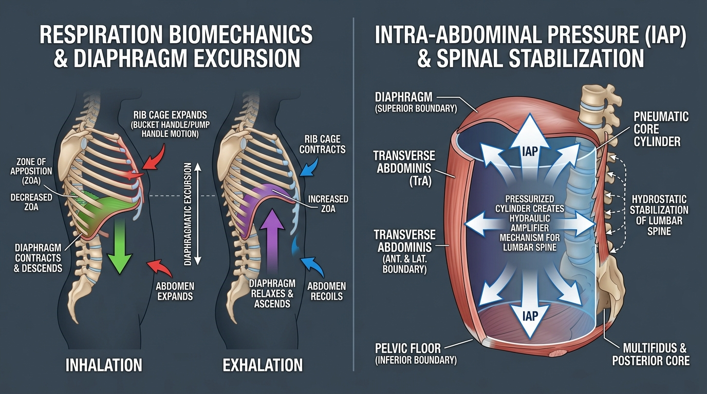

# Day 32: Respiration Biomechanics, Zone of Apposition & Intra-Abdominal Pressure (IAP)

---

## 🎯 Learning Objectives
* **Dissect Diaphragmatic 3D Kinematics:** Analyze the dual action of the respiratory diaphragm as both the primary engine of ventilation and the central ceiling of core stabilization.
* **Master the Zone of Apposition (ZOA):** Explain the cylindrical relationship between the diaphragm and the lower rib cage and how loss of ZOA degrades spinal alignment.
* **Differentiate Thoracic Rib Excursions:** Compare **Pump-Handle** (sagittal expansion of upper ribs) versus **Bucket-Handle** (transverse expansion of lower ribs) kinematics.
* **Engineer 360-Degree Intra-Abdominal Pressure (IAP):** Detail the pneumatic cylinder coupling between the Diaphragm, Transverse Abdominis, Multifidus, and the Pelvic Floor.
* **Synthesize High-Tension Movement & Breath Control:** Differentiate the **Valsalva Maneuver** from "breathing behind the brace" in calisthenics levers, and deconstruct yogic breathwork (**Pranayama** and **Bandhas**).

---

## 🔬 1. Functional Anatomy of the Respiratory Engine

The respiratory diaphragm is a dome-shaped musculotendinous sheet separating the thoracic and abdominal cavities. It is innervated exclusively by the **Phrenic Nerve ($C_3, C_4, C_5$ - *"C3, 4, 5 keeps the diaphragm alive"*).**



### Anatomical Attachments & Openings Table

| Region / Aperture | Anatomical Attachments / Vertebral Level | Structures Transmitted | Biomechanical Action |
| :--- | :--- | :--- | :--- |
| **Sternal Part** | Posterior surface of the xiphoid process | Internal thoracic artery branches | Pulls central tendon anteriorly/inferiorly |
| **Costal Part** | Inner surfaces of lower 6 ribs ($7^{\text{th}}\text{–}12^{\text{th}}$) and costal cartilages | Intercostal neurovascular bundles | Generates lateral **Bucket-Handle** rib expansion |
| **Crural / Lumbar Part** | **Right Crus:** Bodies of $L_1\text{–}L_3$<br>**Left Crus:** Bodies of $L_1\text{–}L_2$<br>Medial/Lateral Arcuate Ligaments | Sympathetic trunks, splanchnic nerves | Anchors diaphragm to spine; provides direct lumbar stabilization |
| **Caval Opening ($T_8$)** | Central tendon (aponeurotic center) | **Inferior Vena Cava (IVC)**, right phrenic nerve | Widens during inhalation, accelerating venous return to heart |
| **Esophageal Hiatus ($T_{10}$)** | Muscular fibers of the Right Crus | **Esophagus**, Vagus nerves ($CN\text{ X}$) | Acts as a functional sphincter preventing acid reflux |
| **Aortic Hiatus ($T_{12}$)** | Behind Median Arcuate Ligament (anterior to vertebral body) | **Abdominal Aorta**, Thoracic Duct, Azygos vein | Unaffected by contraction (does not compress aorta) |

---

## ⚙️ 2. The Zone of Apposition (ZOA) & Rib Kinematics

The **Zone of Apposition (ZOA)** is the cylindrical area where the peripheral muscular fibers of the diaphragm run vertically, directly apposed to the inner aspect of the lower rib cage.

```
THE ZOA EQUILIBRIUM:

OPTIMAL ZOA (Neutral Rib Cage & Pelvis):
• Diaphragm dome is high and convex at rest (dome height ~7-10 cm).
• Contraction drives central tendon downward against abdominal viscera.
• Visceral resistance forces lower ribs OUTWARD laterally (Bucket-Handle excursion).

LOSS OF ZOA ("Open Scissors" / Flared Rib Posture):
• Rib cage flares anteriorly (over-extended thoracolumbar junction).
• Diaphragm fibers become horizontal rather than vertical; dome flattens permanently.
• Contraction simply tugs lower ribs inward (inefficient) ──► Forces reliance on
  accessory neck muscles (Scalenes, SCM, Upper Traps) ──► Chronic neck pain & anxiety tone.
```

### Rib Cage Kinematic Matrix

| Motion Pattern | Primary Ribs Involved | Axis of Rotation | Dimension Expanded | Primary Driving Musculature |
| :--- | :--- | :--- | :--- | :--- |
| **Pump-Handle Motion** | Upper Ribs ($1^{\text{st}}\text{–}6^{\text{th}}$) | Transverse coronal axis through costovertebral & costotransverse joints | **Anteroposterior (AP) Diameter** (sternum lifts up & forward) | External Intercostals, Scalenes, Pectoralis Minor |
| **Bucket-Handle Motion** | Lower Ribs ($7^{\text{th}}\text{–}10^{\text{th}}$) | Anteroposterior sagittal axis | **Transverse (Lateral) Diameter** (ribs swing outward and upward) | Diaphragm (via healthy ZOA), External/Internal Intercostals |
| **Caliper Motion** | Floating Ribs ($11^{\text{th}}\text{–}12^{\text{th}}$) | Vertical axis | **Posterolateral Diameter** (ribs splay outward laterally) | Quadratus Lumborum, Serratus Posterior Inferior |

---

## 🛡️ 3. The 360-Degree Intra-Abdominal Pressure (IAP) Cylinder

Intra-Abdominal Pressure functions as a **hydraulic amplifier** for the lumbar spine, transferring compressive loads off the intervertebral discs and onto a fluid-filled pressurized abdominal cavity.

### The 4 Cylindrical Boundaries of Core Pressure

1. **Superior Boundary (Ceiling):** The **Respiratory Diaphragm** descends, compressing the abdominal viscera.
2. **Anterolateral Boundary (Walls):** The **Transverse Abdominis (TrA)** and **Internal/External Obliques** contract isometrically, resisting visceral outward displacement.
3. **Inferior Boundary (Floor):** The **Pelvic Floor (Levator Ani & Coccygeus)** lifts isometrically, preventing pelvic organ descent and maintaining lower pressure integrity.
4. **Posterior Boundary (Back Wall):** The **Lumbar Multifidus**, **Quadratus Lumborum**, and **Thoracolumbar Fascia** anchor the posterior column.

---

## 🧘 4. Movement Applications: Calisthenics & Yoga

### Calisthenics: "Breathing Behind the Brace" vs. The Valsalva Maneuver
* **The Valsalva Maneuver (Closed Glottis):** Involves forced expiration against a closed glottis. It generates massive IAP ($>200\text{ mmHg}$), essential for maximal 1RM deadlifts or heavy squats, but causes acute systolic blood pressure spikes and cannot be sustained during long isometric holds.
* **Breathing Behind the Brace (Calisthenics Levers):** In a **Planche** or **Front Lever**, the athlete must maintain $100\%$ isometric abdominal wall tension (*Transverse Abdominis & Obliques*) while executing shallow, rhythmic, high-frequency diaphragmatic breaths without losing rib depression or core stiffness.

### Yoga: Bandhas & Pranayama Mechanics
* **Uddiyana Bandha (उड्डीयान बन्ध - The Upward Abdominal Fly):**
  * **Biomechanics:** Performed on full exhalation retention (*Bahya Kumbhaka*). The glottis is closed, and the practitioner attempts a false inhalation (expanding the rib cage without allowing air in).
  * **Result:** Generates strong negative intrathoracic pressure, pulling the relaxed abdominal wall and viscera up and deep under the rib cage, stretching the crura and central tendon of the diaphragm.
* **Mula Bandha (मूल बन्ध - Root Lock):** Selective tonic co-contraction of the perineal body and levator ani, providing the essential rigid base for the IAP cylinder.
* **Kapalabhati (कपालभाति):** Rapid, active, explosive concentric contractions of the **Rectus Abdominis and TrA** during exhalation, followed by passive recoil inhalation.

---

## 🧪 5. Desk-Side Tactile Biomechanics Lab

### Experiment 1: The 360-Degree Belt Expansion Test
1. Sit tall on the edge of a chair with your spine neutral.
2. Wrap both hands around your lower waist: thumbs hooked into your lower back muscles (Multifidus/QL), fingers wrapping around the side obliques, and fingertips resting on your lower abdomen.
3. Take a deep, slow nasal breath.
4. *Observation:* Did your hands expand outward evenly in all $360^\circ$ directions (front, sides, and into your thumbs in the back), or did your shoulders simply shrug upward toward your ears?
5. *Correction:* Intentionally push your breath into your thumbs in your lower back without lifting your clavicles, restoring full 360-degree diaphragmatic IAP.

### Experiment 2: Uddiyana Bandha Vacuum Simulation
1. Stand with feet hip-width apart, knees slightly bent, hands resting on thighs.
2. Exhale $100\%$ of the air from your lungs through your mouth until you are completely empty.
3. Close your throat (do not inhale) and expand your rib cage outward as if taking a huge chest breath.
4. *Observation:* Feel your abdominal wall get forcefully sucked inward and upward under your rib cage like an empty vacuum pouch.
5. *Biomechanics Explanation:* You have just mechanically isolated the **Zone of Apposition** and mobilized the central dome of the diaphragm.

---

## 📚 6. Anatomical Cross-References
* **Muscles:** [Respiratory Diaphragm & Intercostals](../../muscles/thorax_abdomen/README.md), [Transverse Abdominis & Obliques](../../muscles/thorax_abdomen/README.md), [Pelvic Floor](../../muscles/pelvis_perineum/README.md).
* **Spine & Ribs:** [Thoracic Cage & Costal Cartilage](../../bones/vertebrae_thorax/README.md), [Lumbar Spine](../../bones/vertebrae_thorax/README.md).
* **Foundations:** [Day 17: Deep Core Stabilizers](../day-017-core-stabilizers/README.md), [Day 18: Core Bracing & Posterior Chain](../day-018-core-bracing-posterior-chain/README.md).

---

## 📝 7. Daily Knowledge Retrieval Quiz

<details>
<summary><b>1. What is the Zone of Apposition (ZOA) and why does an "open scissors" posture impair respiration?</b></summary>
<b>Answer:</b> The <b>Zone of Apposition (ZOA)</b> is the cylindrical region where the peripheral muscular fibers of the diaphragm run vertically against the inner lower rib cage. In an "open scissors" posture (anterior pelvic tilt with flared lower ribs), the lower ribs flare forward, flattening the diaphragm dome and shortening its fibers horizontally. This destroys its mechanical leverage, forcing reliance on accessory neck muscles (Scalenes/SCM) for breathing.
</details>

<details>
<summary><b>2. Differentiate "Pump-Handle" from "Bucket-Handle" rib cage kinematics.</b></summary>
<b>Answer:</b> 
• <b>Pump-Handle Motion:</b> Occurs primarily in the upper ribs ($1^{\text{st}}\text{–}6^{\text{th}}$), rotating around a coronal axis to increase the <b>Anteroposterior (AP) diameter</b> of the chest (sternum lifts forward).
<br>
• <b>Bucket-Handle Motion:</b> Occurs in the lower ribs ($7^{\text{th}}\text{–}10^{\text{th}}$), rotating around a sagittal axis to increase the <b>Transverse (Lateral) diameter</b> of the rib cage (ribs swing outward).
</details>

<details>
<summary><b>3. Name the four primary muscular boundaries of the 360-degree Intra-Abdominal Pressure (IAP) cylinder.</b></summary>
<b>Answer:</b> 
1. <b>Ceiling (Superior):</b> Respiratory Diaphragm.
2. <b>Walls (Anterolateral):</b> Transverse Abdominis (TrA) and Abdominal Obliques.
3. <b>Floor (Inferior):</b> Pelvic Floor (Levator Ani, Coccygeus).
4. <b>Posterior Wall:</b> Lumbar Multifidus, Quadratus Lumborum, and Thoracolumbar Fascia.
</details>

<details>
<summary><b>4. What is the neuro-mechanical difference between the Valsalva maneuver and "breathing behind the brace"?</b></summary>
<b>Answer:</b> The <b>Valsalva Maneuver</b> involves forced expiration against a <i>closed glottis</i>, producing maximal acute IAP but causing acute blood pressure spikes and oxygen deprivation. <b>Breathing Behind the Brace</b> involves maintaining constant isometric tension in the abdominal wall and pelvic floor while keeping the <i>glottis open</i> to permit continuous diaphragmatic ventilation during sustained athletic holds (e.g., Planche, Front Lever).
</details>

<details>
<summary><b>5. Which nerve supplies motor innervation to the diaphragm, and what spinal roots does it arise from?</b></summary>
<b>Answer:</b> The <b>Phrenic Nerve</b>, originating from the anterior rami of cervical spinal nerves <b>$C_3, C_4,$ and $C_5$</b>.
</details>
