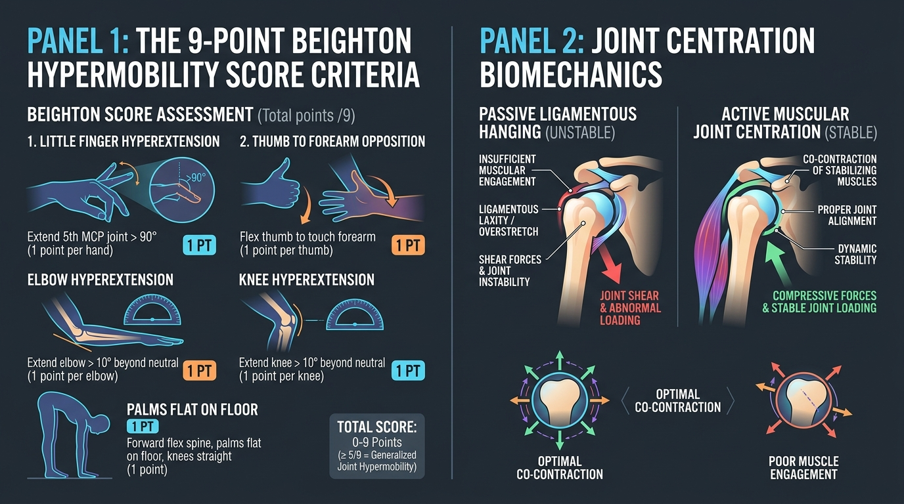

# Day 33: Joint Laxity, Connective Tissue Stiffness & Hypermobility Biomechanics

---

## 🎯 Learning Objectives
* **Differentiate Laxity, Flexibility, and Stiffness:** Master the clinical definitions of passive **Ligamentous Laxity** (capsular compliance), **Muscular Flexibility** (myofibrillar extensibility), and **Joint Stiffness** (resistance to displacement: $k = \Delta F / \Delta x$).
* **Administer the 9-Point Beighton Scoring System:** Evaluate the diagnostic criteria and thresholds for **Generalized Joint Hypermobility (GJH)** and Hypermobility Spectrum Disorders (HSD).
* **Deconstruct the Pathomechanics of "Ligamentous Hanging":** Explain how resting on passive end-range constraints induces **viscoelastic creep**, micro-instability, and compensatory muscle spasms.
* **Master Active Joint Centration:** Learn how balanced dynamic **co-contraction** of surrounding agonist-antagonist pairs preserves the instantaneous axis of rotation (IAR).
* **Program Safe Joint Loading in Calisthenics & Yoga:** Protect hyperextending elbows and knees during handstands, support holds, and asanas like **Adho Mukha Svanasana (अधोमुखश्वानासन - Downward-Facing Dog)**.

---

## 🔬 1. The Spectrum of Joint Laxity vs. Muscle Stiffness

Joint stability relies on two cooperative subsystems: **Passive Static Restraints** (ligaments, labrum, joint capsule) and **Active Dynamic Restraints** (musculotendinous units and neuromuscular reflexes).



### Mechanical & Clinical Terminology Matrix

| Clinical Term | Structural Source | Biophysical Definition | Clinical / Athletic Presentation |
| :--- | :--- | :--- | :--- |
| **Joint Laxity** | Joint Capsule & Ligamentous complex | The magnitude of passive translational or rotational displacement permitted within a joint's physiological envelope. | Non-pathological baseline feature; high capsular compliance. |
| **Joint Hypermobility** | Genetic collagen matrix variation (elevated Type III vs. Type I collagen) | Range of motion exceeding standard physiological norms across multiple articulations. | Easily performs splits, contortions, or deep backbends with zero warmup. |
| **Muscular Flexibility** | Sarcomeres in series, perimysial/epimysial fascial sheath compliance | The maximal passive or active physiological excursion of a muscle-tendon unit across a joint. | High hamstring length without loose joint capsules. |
| **Joint Stiffness ($k$)** | Passive ECM + Active muscular co-contraction | The ratio of applied force to resulting displacement ($k = \Delta F / \Delta x$). High stiffness = High stability. | Olympic weightlifter or gymnast resisting external collapse under load. |

---

## 📋 2. The 9-Point Beighton Hypermobility Assessment

The **Beighton Score** is the internationally recognized gold standard for quantifying Generalized Joint Hypermobility (GJH).

### The Beighton Diagnostic Criteria Table

| Maneuver / Test Site | Anatomical Joint Tested | Diagnostic Standard for 1 Point | Max Score |
| :--- | :--- | :--- | :--- |
| **1. Right 5th Finger** | Metacarpophalangeal ($5^{\text{th}}\text{ MCP}$) | Passive hyperextension beyond **$90^\circ$** with forearm flat on table | 1 pt |
| **2. Left 5th Finger** | Metacarpophalangeal ($5^{\text{th}}\text{ MCP}$) | Passive hyperextension beyond **$90^\circ$** with forearm flat on table | 1 pt |
| **3. Right Thumb** | $1^{\text{st}}$ Carpometacarpal / Radiocarpal | Passive apposition of thumb to touch the **flexor aspect of the ipsilateral forearm** | 1 pt |
| **4. Left Thumb** | $1^{\text{st}}$ Carpometacarpal / Radiocarpal | Passive apposition of thumb to touch the **flexor aspect of the ipsilateral forearm** | 1 pt |
| **5. Right Elbow** | Humeroulnar / Humeroradial | Passive hyperextension (cubitus recurvatus) **$>10^\circ$** | 1 pt |
| **6. Left Elbow** | Humeroulnar / Humeroradial | Passive hyperextension (cubitus recurvatus) **$>10^\circ$** | 1 pt |
| **7. Right Knee** | Tibiofemoral | Passive hyperextension (genu recurvatus) **$>10^\circ$** in standing | 1 pt |
| **8. Left Knee** | Tibiofemoral | Passive hyperextension (genu recurvatus) **$>10^\circ$** in standing | 1 pt |
| **9. Trunk & Hamstrings** | Lumbar Spine & Acetabulofemoral | Forward flexion of trunk with **knees locked straight and palms resting flat on the floor** | 1 pt |
| **TOTAL SCORE** | **Full Body Assessment** | **$\ge 5/9$ in adults** (or $\ge 6/9$ in children) indicates **Generalized Joint Hypermobility** | **/9 pts** |

---

## ⚠️ 3. The Pathomechanics of "Hanging on Ligaments" & Viscoelastic Creep

In hypermobile individuals, muscles frequently shut off during static postures because the skeletal frame can "hang" passively on bony abutments and ligamentous end-ranges.

```
THE PATHOLOGICAL CASCADE OF PASSIVE HANGING:

1. PASSIVE END-RANGE "LOCKOUT":
   Hyperextending elbows/knees jams bones together (e.g., Olecranon into Olecranon Fossa).
   └── Muscular electrical activity drops to near zero (energy saving, but dangerous!).

2. LIGAMENTOUS CREEP & ELONGATION:
   Constant tensile load causes time-dependent permanent elongation (viscoelastic creep) of capsules.
   └── Joint loses its passive mechanical barrier forever.

3. PROPRIOCEPTIVE LOSS & COMPENSATORY MUSCLE TENSION:
   Stretched capsules have desensitized mechanoreceptors (poor position sense).
   └── Brain senses micro-instability and fires emergency guarding spasms:
         ├── Chronic "tight" Upper Trapezius (guarding loose shoulder capsule).
         └── Chronic "tight" Hamstrings (guarding loose sacroiliac/hip capsule).
```

> [!CAUTION]
> **The Hypermobility Paradox:** Hypermobile individuals often complain of feeling "constantly tight and stiff." Stretching these muscles simply stretches the loose joint capsule further, triggering an even stronger protective muscular spasm. **Treatment is STRENGTH & STABILITY, not more stretching!**

---

## 🎯 4. The Principle of Active Joint Centration

**Joint Centration** is the state in which the joint articular surfaces maintain maximal congruent contact throughout motion, keeping the **Instantaneous Axis of Rotation (IAR)** centered and minimizing focal cartilage shear.

### Centration Strategy Matrix

| Movement & Joint | Pathological "Passive Hang" Pattern | Active Centration Correction | Key Stabilizing Muscles Recruited |
| :--- | :--- | :--- | :--- |
| **Handstand / Support Hold (Elbow)** | Elbows bowed backward ($>10^\circ$), carrying full bodyweight on the olecranon process. | **"Micro-bend and Clamp":** Unlock the elbow by $2^\circ\text{–}3^\circ$ and violently co-contract biceps and triceps. | **Biceps Brachii** + **Triceps Brachii** co-contraction |
| **Downward Dog / Triangle (Knee)** | Knees pushed backward into Genu Recurvatum; anterior joint compressed, posterior capsule strained. | Engage quadriceps to lift patella; actively press big toe down and contract calves/hamstrings slightly. | **Vastus Medialis (VMO)** + **Popliteus** + **Gastrocnemius** |
| **Plank / Push-Up (Shoulder)** | Humeral head subluxates anteriorly and superiorly; shoulder "dumps" forward. | Actively externally rotate shoulders ("corkscrew hands") and protract serratus anterior. | **Infraspinatus**, **Teres Minor**, **Serratus Anterior** |

---

## 🧪 5. Desk-Side Tactile Biomechanics Lab

### Experiment 1: The Self-Administered Beighton Test
1. Test your right and left fifth fingers by placing your palm flat on a desk and lifting the pinky back. Is it $>90^\circ$?
2. Test your right and left thumbs: can you bend your wrist forward and touch your thumb to your inner forearm?
3. Stand in front of a mirror and extend your elbows: do they form a straight line ($180^\circ$) or do they bend backward into a "C" curve ($>190^\circ$)?
4. Calculate your personal Beighton score out of 9.

### Experiment 2: Passive Lockout vs. Active Joint Centration
1. Assume a standard high plank on the floor with your hands under your shoulders.
2. Intentionally "lock out" and hyperextend your elbows so your inner elbow creases face forward and your bones jam together. Feel how little muscle effort is needed in your arms.
3. Now, **unlock the elbows by just 2 millimeters**, screw your hands outward into the floor (external rotation torque), and squeeze your biceps and triceps simultaneously.
4. *Observation:* Feel the tremendous muscular burn that immediately erupts across your arms, shoulders, and chest!
5. *Biomechanics Explanation:* You have shifted load bearing from **passive articular cartilage and ligaments** to **active muscular co-contraction**, achieving perfect joint centration.

---

## 📚 6. Anatomical Cross-References
* **Bones & Joints:** [Upper Limb Joints (Elbow & Wrist)](../../bones/upper_limb/README.md), [Lower Limb Joints (Knee & Ankle)](../../bones/lower_limb/README.md#tibia-and-fibula).
* **Muscles:** [Rotator Cuff & Scapular Stabilizers](../../muscles/upper_limb/README.md#scapular-region), [Quadriceps & Popliteus](../../muscles/lower_limb/README.md#anterior-compartment).
* **Foundations:** [Day 3: Synovial Joint Mechanics](../day-003-skeletal-system-joints/README.md), [Day 6: Connective Tissue Viscoelasticity](../day-006-connective-tissue-fascia/README.md).

---

## 📝 7. Daily Knowledge Retrieval Quiz

<details>
<summary><b>1. What score on the 9-point Beighton Scale clinically defines Generalized Joint Hypermobility in an adult?</b></summary>
<b>Answer:</b> A score of <b>$\ge 5\text{ out of }9$ points</b> (or $\ge 6/9$ in children and adolescents).
</details>

<details>
<summary><b>2. Why do hypermobile practitioners frequently present with chronic "tight" muscles (e.g., tight hamstrings or neck)?</b></summary>
<b>Answer:</b> Because their joint capsules and ligaments are excessively loose, the nervous system senses micro-instability at the joint. To prevent joint subluxation or dislocation, the brain triggers <b>compensatory protective muscle spasms</b> (acting as emergency muscular brakes).
</details>

<details>
<summary><b>3. Explain the mechanical danger of "hanging on ligaments" during static support holds or yoga postures.</b></summary>
<b>Answer:</b> Resting on passive end-range constraints shuts off protective muscular co-contraction and subjects ligaments and joint capsules to <b>viscoelastic creep</b> (permanent plastic deformation). This causes focal bone-on-bone cartilage compression, labral/meniscal impingement, and chronic joint instability.
</details>

<details>
<summary><b>4. What is "Joint Centration" and how is it achieved during movement?</b></summary>
<b>Answer:</b> Joint centration is maintaining maximal congruent contact between opposing articular surfaces across a joint's range of motion, keeping the instantaneous axis of rotation stable. It is achieved through <b>active, balanced co-contraction</b> of agonist and antagonist muscle groups.
</details>

<details>
<summary><b>5. How should a calisthenics athlete with hyperextending elbows safely perform a handstand or straight-arm support?</b></summary>
<b>Answer:</b> The athlete should avoid full bone-on-bone hyperextension lockout by maintaining a <b>micro-bend ($2^\circ\text{–}3^\circ$)</b> and actively <b>co-contracting the Biceps Brachii and Triceps Brachii</b> while applying external rotation torque through the hands to centrate the humeroulnar joint.
</details>
