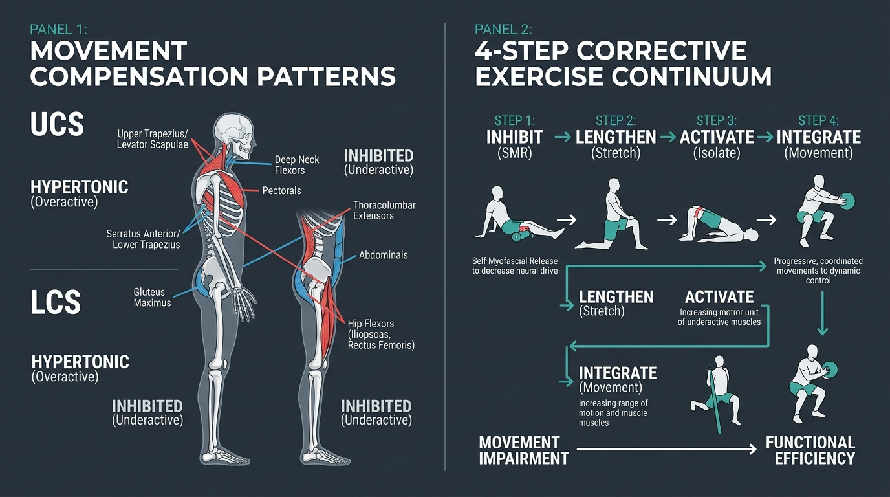

# Day 34: Movement Compensation Patterns & Corrective Biomechanics

---

## 🎯 Learning Objectives
* **Master Vladimir Janda’s Muscle Imbalance Syndromes:** Analyze the neuro-structural crosses of **Upper Crossed Syndrome (UCS)** and **Lower Crossed Syndrome (LCS)**.
* **Differentiate Tonic vs. Phasic Muscle Predispositions:** Understand why postural (tonic) muscles adaptively shorten while phasic dynamic muscles undergo reciprocal neural inhibition.
* **Execute the 4-Step Corrective Exercise Continuum:** Master the chronological system: **Inhibit (SMR) $\rightarrow$ Lengthen (Stretch) $\rightarrow$ Activate (Isolate) $\rightarrow$ Integrate (Compound Movement)**.
* **Diagnose & Correct Common Calisthenics Faults:** Fix the "Banana Back" handstand, scapular elevation in pull-ups, and dynamic valgus in squats.
* **Optimize Structural Alignment in Yoga Postures:** Eliminate anterior pelvic tilt and rib flare in **Tadasana (ताड़ासन)** and **Virabhadrasana I (वीरभद्रासन १ - Warrior I)**.

---

## 🔬 1. Janda's Reciprocal Cross Syndromes

Pioneered by Czech neurologist Dr. Vladimir Janda, muscle imbalances are predictable systemic patterns driven by the Central Nervous System's motor control adaptations to chronic postural stress.



### Tonic vs. Phasic Functional Classification Table

| Muscle Classification | Neuromuscular Nature | Predisposition under Chronic Stress | Primary Muscle Groups |
| :--- | :--- | :--- | :--- |
| **Tonic (Postural) Muscles** | High percentage of Type I slow-twitch fibers; low activation threshold. | Prone to **hyperactivity, hypertonicity, and adaptive shortening**. | Upper Trapezius, Levator Scapulae, Pectoralis Major/Minor, Iliopsoas, Rectus Femoris, Tensor Fasciae Latae (TFL), Erector Spinae, Gastrocnemius/Soleus. |
| **Phasic (Dynamic) Muscles** | High percentage of Type II fast-twitch fibers; higher activation threshold. | Prone to **neural inhibition, delayed firing, and functional weakness**. | Deep Neck Flexors (Longus Colli/Capitis), Lower/Middle Trapezius, Serratus Anterior, Transverse Abdominis, Gluteus Maximus, Gluteus Medius, Vastus Medialis (VMO). |

---

## ⚔️ 2. Detailed Cross Syndrome Breakdown

### Upper Crossed Syndrome (UCS) & Lower Crossed Syndrome (LCS) Matrix

| Syndrome | Hypertonic / Shortened Muscles (The Overactive Line) | Inhibited / Weakened Muscles (The Underactive Line) | Resulting Skeletal & Articular Distortions |
| :--- | :--- | :--- | :--- |
| **Upper Crossed Syndrome (UCS)** | **Line A:** Upper Trapezius & Levator Scapulae<br>**Line B:** Pectoralis Major & Pectoralis Minor, Suboccipitals | **Line A:** Deep Cervical Neck Flexors (*Longus Colli, Longus Capitis*)<br>**Line B:** Lower & Middle Trapezius, Serratus Anterior, Rhomboids | • **Forward Head Carriage** (Atlas-Axis hyperextension)<br>• **Thoracic Hyper-Kyphosis**<br>• **Scapular Anterior Tilt & Protraction** (Subacromial impingement) |
| **Lower Crossed Syndrome (LCS)** | **Line A:** Thoracolumbar Extensors (*Erector Spinae, Quadratus Lumborum*)<br>**Line B:** Hip Flexor Complex (*Iliopsoas, Rectus Femoris, TFL*) | **Line A:** Anterior Abdominals (*Rectus Abdominis, TrA, Obliques*)<br>**Line B:** Posterior Hip Extensors (*Gluteus Maximus, Gluteus Medius*) | • **Anterior Pelvic Tilt (APT)**<br>• **Hyperlordotic Lumbar Shear** ($L_5\text{–}S_1$ facet compression)<br>• **Femoral Internal Rotation** and Genu Recurvatum |

---

## 🛠️ 3. The 4-Step Corrective Exercise Continuum

Simply strengthening a "weak" muscle without first releasing its hyperactive antagonist will fail due to **Altered Reciprocal Inhibition**. The neuromuscular system must be addressed in strict chronological order.

```
THE 4-STEP CORRECTIVE PROTOCOL:

STEP 1: INHIBIT (Down-regulate Neural Drive)
• Tool: Self-Myofascial Release (SMR) / Lacrosse Ball / Foam Roller.
• Mechanism: Sustained static pressure (30-60 s) stimulates GTOs and interstitial mechanoreceptors,
  reducing hyperactive motor unit firing in overactive tonic tissues (e.g., Pec Minor, Psoas, TFL).

STEP 2: LENGTHEN (Expand Mechanical & Neural Range)
• Tool: Static Stretching / PNF Stretching (Contract-Relax).
• Mechanism: Increases structural compliance and raises CNS stretch tolerance (30-60 s holds).

STEP 3: ACTIVATE (Isolate & Awaken Underactive Motor Units)
• Tool: Isolated Single-Joint Resisted Exercises (High Repetition: 12-20 reps, 2s isometric holds).
• Mechanism: Re-establishes intramuscular motor unit recruitment in inhibited phasic muscles
  (e.g., Chin Tucks for Deep Neck Flexors, Side-Lying Clamshells for Glute Medius).

STEP 4: INTEGRATE (Re-train Multi-Joint Dynamic Kinetic Chains)
• Tool: Multi-planar compound movement patterns under high neuromuscular control.
• Mechanism: Intermuscular coordination and motor cortex pattern re-mapping
  (e.g., Squat to Overhead Press with perfect core-pelvis centration).
```

---

## 🤸 4. Movement Applications: Calisthenics & Yoga Faults

### Calisthenics: The "Banana Back" Handstand Correction
* **The Fault:** The athlete cannot hold a straight vertical line; the rib cage flares forward, the lower back arches into extreme hyperextension, and the shoulders close.
* **Underlying Pathomechanics:**
  * **Overactive / Shortened:** Latissimus Dorsi (limits full glenohumeral flexion), Psoas, and Lumbar Erectors.
  * **Inhibited / Weak:** Serratus Anterior (inadequate upward rotation/elevation), Lower Trapezius, Transverse Abdominis, and Gluteus Maximus.
* **Correction:** SMR release lats $\rightarrow$ lengthen hip flexors $\rightarrow$ activate Serratus wall slides $\rightarrow$ integrate hollow body chest-to-wall handstands with posterior pelvic tilt.

### Yoga: Warrior I (Virabhadrasana I) Pelvic-Rib Flare Trap
* **The Fault:** In a high lunge or Warrior I, tight hip flexors of the rear trailing leg prevent true hip extension, forcing the pelvis into anterior pelvic tilt and creating sharp compression in the lower back.
* **Correction:** Squeeze the trailing leg's **Gluteus Maximus** hard to trigger reciprocal inhibition of the Iliopsoas; draw the lower front ribs down toward the ASIS (*Transverse Abdominis bracing*) to decompress $L_5\text{–}S_1$.

---

## 🧪 5. Desk-Side Tactile Biomechanics Lab

### Experiment 1: The Deep Neck Flexor Isolation Nod (Chin-Tuck Test)
1. Lie flat on your back on the floor without a pillow.
2. Place two fingers lightly on the front sides of your neck over your large **Sternocleidomastoid (SCM)** muscles.
3. Without letting the back of your head leave the floor, gently nod your chin toward your throat as if making a subtle double chin.
4. *Observation:* Did your superficial SCM muscles stay soft and relaxed while you felt a deep contraction deep behind your throat? Or did your SCMs pop out like rigid cables?
5. *Biomechanics Explanation:* If the SCMs pop out, you have **Upper Crossed Syndrome cervical dominance**; this drill isolates the inhibited **Longus Colli and Longus Capitis**.

### Experiment 2: Glute Bridge Activation vs. Hamstring Cramp Test
1. Lie on your back with knees bent at $90^\circ$ and feet flat on the floor.
2. Perform a standard double-leg hip bridge.
3. Place your hands on your buttocks: are your glutes rock-hard, or are your hamstrings and lower back doing $90\%$ of the work?
4. *Correction:* Press your heels firmly into the floor, push your knees outward against an imaginary band, and tilt your belt buckle toward your chin (posterior pelvic tilt). Notice how the glutes instantly take over the entire load!

---

## 📚 6. Anatomical Cross-References
* **Muscles of Neck & Scapula:** [Deep Neck Flexors & Trapezius](../../muscles/head_neck/README.md), [Serratus Anterior & Pectorals](../../muscles/thorax_abdomen/README.md).
* **Lumbopelvic Muscles:** [Gluteal Complex & Hamstrings](../../muscles/lower_limb/README.md#gluteal-region), [Iliopsoas & Rectus Femoris](../../muscles/lower_limb/README.md#anterior-compartment).
* **Foundations:** [Day 5: Muscle Roles & Stabilization](../day-005-muscle-roles-stabilization/README.md), [Day 16: Pelvic Tilts](../day-016-pelvic-tilts/README.md), [Day 21: Postural Assessment](../day-021-postural-assessment/README.md).

---

## 📝 7. Daily Knowledge Retrieval Quiz

<details>
<summary><b>1. In Upper Crossed Syndrome (UCS), which two muscle groups are typically hypertonic/overactive, and which two are reciprocally inhibited?</b></summary>
<b>Answer:</b> 
• <b>Hypertonic / Overactive:</b> Upper Trapezius & Levator Scapulae (posteriorly), and Pectoralis Major & Minor (anteriorly).
<br>
• <b>Inhibited / Underactive:</b> Deep Cervical Neck Flexors (<i>Longus Colli, Longus Capitis</i>) anteriorly, and Lower/Middle Trapezius & Serratus Anterior posteriorly.
</details>

<details>
<summary><b>2. Why is performing isolated strengthening exercises on a weak muscle ineffective if the overactive antagonist is not released first?</b></summary>
<b>Answer:</b> Due to <b>Altered Reciprocal Inhibition</b>. A hyperactive, hypertonic muscle constantly sends inhibitory neural signals through spinal interneurons to its antagonist, preventing the nervous system from fully activating and recruiting the weak muscle's motor units.
</details>

<details>
<summary><b>3. List the 4 sequential steps of the Corrective Exercise Continuum in correct chronological order.</b></summary>
<b>Answer:</b> 
1. <b>Inhibit</b> (Self-Myofascial Release to reduce hyperactive neural tone).
2. <b>Lengthen</b> (Static or Neuromuscular Stretching to restore tissue extensibility).
3. <b>Activate</b> (Isolated single-joint strengthening of underactive muscles).
4. <b>Integrate</b> (Multi-joint dynamic compound movement retraining).
</details>

<details>
<summary><b>4. What muscular imbalances cause the common "Banana Back" compensation in a handstand?</b></summary>
<b>Answer:</b> Overactivity and shortness in the <b>Latissimus Dorsi</b> (restricting shoulder flexion) and <b>Lumbar Erector Spinae / Psoas</b>, combined with weakness/inhibition in the <b>Serratus Anterior, Transverse Abdominis, and Gluteus Maximus</b>.
</details>

<details>
<summary><b>5. What are the key skeletal postural characteristics of Lower Crossed Syndrome (LCS)?</b></summary>
<b>Answer:</b> An <b>Anterior Pelvic Tilt (APT)</b>, excessive <b>Lumbar Hyperlordosis</b> ($L_5\text{–}S_1$ facet compression), slight hip flexion contracture, and compensatory knee hyperextension.
</details>
