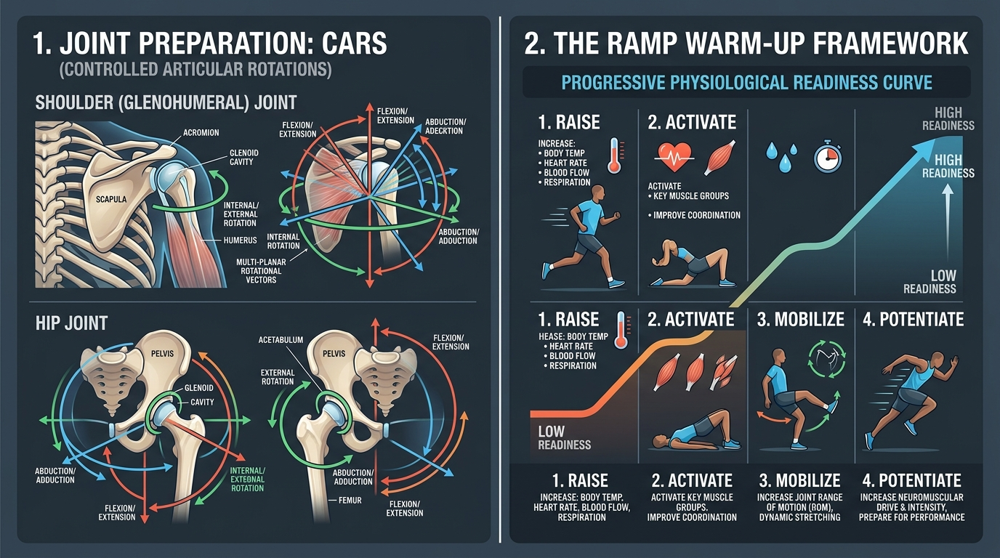

# Day 35: Joint Preparation Protocols, Warm-up Architecture & Module 5 Assessment

---

## 🎯 Learning Objectives
* **Master the Biophysics of Joint Preparation:** Explain synovial fluid **thixotropy** (viscosity reduction under shear), articular cartilage nutrient **imbibition**, and temperature-dependent nerve conduction acceleration ($Q_{10}$ effect).
* **Execute Controlled Articular Rotations (CARs):** Master the principles of active rotational joint workspace exploration and **Irradiation** (overflow of neural drive).
* **Apply the RAMP Framework:** Structure periodized warm-up protocols across the 4 chronological phases: **Raise $\rightarrow$ Activate $\rightarrow$ Mobilize $\rightarrow$ Potentiate**.
* **Design Specialized Prep for High-Load Modalities:** Construct tailored joint preparation sequences for calisthenics straight-arm loading (planche, levers, handstands) and advanced yoga mobility.
* **Complete Module 5 Board-Style Synthesis Examination:** Validate comprehensive mastery across Days 29–35 with a rigorous 10-question board-style practical examination.

---

## 🔬 1. Biophysical Foundations of Joint Preparation

Warm-ups are frequently misunderstood as simple calorie-burning cardiorespiratory elevation. In human movement science, joint preparation fundamentally alters tissue physics and neuromuscular communication before high-threshold loading.



### Biophysical Mechanisms Table

| Biophysical Process | Physiological Mechanism | Biomechanical Benefit |
| :--- | :--- | :--- |
| **Synovial Thixotropy** | Synovial fluid is non-Newtonian; temperature rise and mechanical shear stress decrease fluid viscosity. | Dramatic reduction in articular friction coefficient; smooth gliding of hyaline cartilage. |
| **Cartilage Imbibition** | Avascular articular cartilage relies on alternating cyclic compression and decompression to pump nutrients into chondrocytes. | Increases cartilage shock absorption capacity and interstitial fluid load support. |
| **$Q_{10}$ Thermal Effect** | Every $1^\circ\text{C}$ rise in intramuscular temperature increases nerve conduction velocity by $\approx 4\text{–}5\%$ and speeds actin-myosin cross-bridge cycling. | Faster **Rate of Force Development (RFD)** and reduced reaction time to sudden perturbations. |
| **Viscoelastic Stress Relaxation** | Collagen and elastin fibers undergo molecular realignment under low-velocity cyclic loading. | Expands safe elastic range of motion without triggering protective myotatic stretch reflexes. |

---

## 🔄 2. Controlled Articular Rotations (CARs) & Irradiation

Pioneered in Functional Range Conditioning (FRC), **CARs** are active, rotational movements at the outer physiological boundaries of an articulation’s multi-planar workspace.

### The Law of Irradiation (Sherrington's Overflow)
* **Definition:** A muscle working at high voluntary effort transfers neural excitation (overflow) to neighboring synergistic and stabilizing muscles.
* **CARs Application:** By actively tensing the entire body ($50\%\text{–}80\%$ whole-body tension), the athlete isolates the moving joint completely, eliminating compensatory kinetic cheating and sending high-threshold afferent signals to articular mechanoreceptors.

### Joint CARs Execution Matrix

| Joint Complex | Degrees of Freedom | Multi-Planar Rotational Sequence | Key Technical Rule |
| :--- | :--- | :--- | :--- |
| **Glenohumeral (Shoulder)** | 3 DoF (Ball & Socket) | Pure Flexion $\rightarrow$ Maximal Internal Rotation + Abduction $\rightarrow$ Extension $\rightarrow$ Reverse | **Zero torso rotation or spinal extension**; isolate movement purely to the humerus. |
| **Acetabulofemoral (Hip)** | 3 DoF (Ball & Socket) | Hip Flexion + External Rotation $\rightarrow$ Abduction $\rightarrow$ Max Internal Rotation + Extension | Keep pelvis locked perpendicular to the floor; do not tilt iliac crest. |
| **Scapulothoracic** | 3 DoF (Physiological) | Elevation $\rightarrow$ Retraction $\rightarrow$ Depression $\rightarrow$ Protraction (Smooth continuous circle) | Keep arms locked at sides; move scapulae over the rib cage without bending elbows. |
| **Spine (Segmental)** | Multi-segmental | Controlled segmental flexion $\rightarrow$ lateral flexion $\rightarrow$ rotation $\rightarrow$ extension | Move one vertebra at a time (cat-cow spinal wave) without hinging solely at $L_5\text{–}S_1$. |
| **Radiocarpal (Wrist)** | 2 DoF (Condyloid) | Full Flexion $\rightarrow$ Ulnar Deviation $\rightarrow$ Extension $\rightarrow$ Radial Deviation | Forearm remains completely still on a flat surface; isolate carpal bones. |

---

## 📈 3. The RAMP Warm-Up Architecture

Developed by Dr. Ian Jeffreys, the **RAMP System** structures warm-ups into a progressive, periodized continuum that prepares the athlete mentally, structurally, and metabolically.

```
THE RAMP SYSTEM CONTINUUM:

PHASE 1: RAISE (5-7 Minutes)
• Goal: Elevate core body temperature, heart rate, blood flow, muscle compliance, and synovial fluid thixotropy.
• Method: Low-intensity multi-planar locomotion, skipping, rowing, crawling, arm circles.

PHASE 2: ACTIVATE (3-4 Minutes)
• Goal: "Awaken" and prime key intrinsic stabilizing muscle groups (especially phasic underactive muscles).
• Method: Mini-band glute bridges, rotator cuff Y-T-W-Ls, Serratus wall slides, Transverse Abdominis bracing.

PHASE 3: MOBILIZE (3-4 Minutes)
• Goal: Actively explore and expand joint workspaces through dynamic ranges of motion.
• Method: Full-body CARs (Hips, Shoulders, Wrists), deep Cossack squats, dynamic lunges with thoracic twists.

PHASE 4: POTENTIATE (2-3 Minutes)
• Goal: CNS high-threshold motor unit recruitment and Post-Activation Potentiation (PAP).
• Method: Movement-specific explosive priming (e.g., clapping push-ups before planche work; vertical jumps before squats).
```

---

## 🛠️ 4. 15-Minute Calisthenics & Yoga Joint Prep Blueprint

### The Complete Pre-Session Architecture

```
[00:00 - 05:00] RAISE:
  ├── 2 min: Light jumping jacks / jump rope
  └── 3 min: Beast Crawl & Crab Walk (primal ground-flow)

[05:00 - 08:00] ACTIVATE (The Phasic Core & Scapular Network):
  ├── 15 reps: Serratus Anterior Wall Slides with foam roller
  ├── 15 reps: Prone Trap-3 / Lower Trapezius Y-Raises
  └── 10 reps: Glute Bridges with 3s isometric peak hold

[08:00 - 12:00] MOBILIZE (Articular CARs & End-Range Tension):
  ├── 3 slow reps / side: Glenohumeral CARs (80% body irradiation)
  ├── 3 slow reps / side: Quadruped Hip CARs
  ├── 10 reps: Segmental Cat-Cow waves
  └── 15 reps: First Knuckle Wrist Raises & Finger Push-ups (distal wrist prep)

[12:00 - 15:00] POTENTIATE (CNS Neural Priming):
  ├── Calisthenics Focus: 3 × 5s Overcoming Isometric Planche Lean + 3 Explosive Hollow Hops
  └── Yoga / Mobility Focus: 3 Dynamic Sun Salutations (Surya Namaskar A) with breath synchronization
```

---

## 🧪 5. Desk-Side Tactile Biomechanics Lab

### Experiment 1: The CARs Irradiation Torque Test
1. Stand completely loose and perform a standard arm circle. Notice how easily your torso twists, your ribs flare, and your neck tenses.
2. Now, make a tight fist with your non-moving hand. Squeeze your glutes, brace your abs $100\%$, lock your knees, and pack your neck.
3. Slowly perform a **Glenohumeral CAR** with your moving arm, pretending the air is as thick as wet concrete.
4. *Observation:* Feel the massive focal burn deep inside your shoulder capsule and the complete elimination of torso cheating.
5. *Biomechanics Explanation:* **Sherrington’s Law of Irradiation** channels systemic neurological stability to isolate and safely stress the deep joint capsule.

### Experiment 2: Wrist First-Knuckle Conditioning (Distal Joint Armor)
1. Place both palms flat on your desk or floor in a quadruped position.
2. Keeping your palms flat, fingers straight, and elbows locked, **push through your knuckles to lift the palms and heels of your hands 2 inches off the desk** (hinging purely at the Metacarpophalangeal / MCP joints).
3. Slowly lower back down with a 3-second eccentric control.
4. *Observation:* Feel the intense activation of your deep forearm flexors (*Flexor Digitorum Profundus/Superficialis*) and intrinsic hand muscles.
5. *Biomechanics Explanation:* This strengthens the distal fascial cuff and prepares the carpal tunnel for heavy extension loads in handstands and push-ups.

---

## 📚 6. Anatomical Cross-References
* **Module 5 Review:** [Day 29 (Proprioception)](../day-029-proprioception/README.md), [Day 30 (Stretch Reflex & PNF)](../day-030-stretch-reflex-flexibility/README.md), [Day 31 (Myofascial Meridians)](../day-031-fascial-lines/README.md), [Day 32 (Respiration & IAP)](../day-032-respiration-iap/README.md), [Day 33 (Joint Laxity & Stiffness)](../day-033-joint-laxity-stiffness/README.md), [Day 34 (Movement Compensations)](../day-034-movement-compensations/README.md).
* **Bones & Muscles:** [Vertebral Column & Thorax](../../bones/vertebrae_thorax/README.md), [Upper Limb Muscles](../../muscles/upper_limb/README.md), [Lower Limb Muscles](../../muscles/lower_limb/README.md).

---

## 🏆 7. Module 5 Board-Style Synthesis Examination

Validate your complete mastery of neuromuscular mechanics, sensory physiology, fascial lines, and injury prevention across Module 5.

---

### Question 1 (Sensory Neurophysiology & Motor Spindles)
Compare the orientation, primary sensory afferents, and mechanical stimuli detected by Muscle Spindles versus Golgi Tendon Organs (GTOs). Explain why alpha-gamma co-activation is mandatory for uninterrupted proprioception during voluntary muscle shortening.

<details>
<summary><b>View Board Answer & Rationale</b></summary>
<b>Answer:</b> 
<br>
• <b>Muscle Spindles:</b> Arranged <i>in parallel</i> with extrafusal fibers; innervated by <b>Group Ia and Group II</b> afferents; detect changes in <b>muscle length and stretch velocity</b>.
<br>
• <b>Golgi Tendon Organs (GTOs):</b> Arranged <i>in series</i> at the myotendinous junction; innervated by <b>Group Ib</b> afferents; detect <b>active muscle tension / contractile force</b>.
<br>
• <b>Alpha-Gamma Co-Activation:</b> When alpha motor neurons contract extrafusal fibers, the muscle shortens. Gamma motor neurons simultaneously stimulate the intrafusal fiber poles, keeping the central sensory spindle taut so it does not go slack and retains sensitivity to unexpected stretch throughout the entire range of motion.
</details>

---

### Question 2 (Spinal Reflex Arcs & Inhibition)
Differentiate the synaptic circuitry of the Monosynaptic Myotatic Reflex from the Disynaptic Inverse Myotatic Reflex. How does Reciprocal Inhibition differ from Autogenic Inhibition in terms of target muscle outcome?

<details>
<summary><b>View Board Answer & Rationale</b></summary>
<b>Answer:</b> 
<br>
• <b>Myotatic Reflex:</b> Monosynaptic arc (Ia afferent directly synapses on the alpha motor neuron in the anterior horn), resulting in rapid protective <b>contraction of the stretched agonist</b>.
<br>
• <b>Inverse Myotatic Reflex:</b> Disynaptic arc (Ib afferent from GTO synapses on an inhibitory interneuron), which hyperpolarizes the alpha motor neuron to produce <b>relaxation / autogenic inhibition of the contracting muscle</b>.
<br>
• <b>Outcome Distinction:</b> Autogenic inhibition relaxes the <i>same muscle</i> generating high tension; reciprocal inhibition relaxes the <i>opposing antagonist muscle</i> when the agonist is actively firing.
</details>

---

### Question 3 (PNF Stretching Mechanics)
Explain the physiological mechanisms operating in the Contract-Relax-Agonist-Contract (CRAC) PNF technique that make it superior to simple static passive stretching for active flexibility gains.

<details>
<summary><b>View Board Answer & Rationale</b></summary>
<b>Answer:</b> 
<br>
The CRAC technique combines <b>two distinct neurological inhibitory mechanisms</b> in chronological synergy:
<br>
1. <b>Autogenic Inhibition:</b> The initial 6–8 second isometric contraction of the target muscle excites GTO Ib afferents, inducing autogenic relaxation of the muscle once the contraction ceases.
<br>
2. <b>Reciprocal Inhibition:</b> Immediately contracting the opposing agonist muscle fires Ia inhibitory interneurons, further shutting off baseline tone in the target muscle while actively driving the joint into new end-range through newly recruited motor units.
</details>

---

### Question 4 (Myofascial Meridians & Force Transmission)
Trace the continuous anatomical pathway of the Superficial Back Line (SBL) from the sole of the foot to the cranial base. Explain how plantar fasciitis or tight plantar fascia can clinically restrict cervical spine flexion.

<details>
<summary><b>View Board Answer & Rationale</b></summary>
<b>Answer:</b> 
<br>
• <b>SBL Pathway:</b> Plantar fascia $\rightarrow$ Calcaneus $\rightarrow$ Achilles tendon $\rightarrow$ Gastrocnemius $\rightarrow$ Femoral condyles $\rightarrow$ Hamstrings $\rightarrow$ Ischial tuberosity $\rightarrow$ Sacrotuberous ligament $\rightarrow$ Sacrum $\rightarrow$ Thoracolumbar fascia / Erector Spinae $\rightarrow$ Occipital ridge $\rightarrow$ Galea Aponeurotica (Epicranial fascia).
<br>
• <b>Clinical Link:</b> Because the SBL functions as a single continuous tensile meridian, resting tension or fascial adhesions at the plantar anchor transmit longitudinal tensile strain through the Achilles, hamstrings, and erector spinae, restricting global sagittal flexion all the way up to the suboccipitals and galea.
</details>

---

### Question 5 (Biotensegrity Architecture)
Define Biotensegrity in human musculoskeletal mechanics. How does this model explain the ability of the human body to absorb massive impact forces without localized joint crushing?

<details>
<summary><b>View Board Answer & Rationale</b></summary>
<b>Answer:</b> 
<br>
Biotensegrity describes a structural system of discontinuous compressive struts (bones) that do not directly bear stacked weight, but instead float within a continuous, pre-stressed, omni-directional tension envelope (fascia, muscles, ligaments). When an impact or mechanical load is applied locally, the force is not concentrated solely at that point; rather, the entire 3D tensegrity web deforms elastically, distributing the strain energy throughout the global matrix.
</details>

---

### Question 6 (Respiration & Zone of Apposition)
What is the Zone of Apposition (ZOA) of the respiratory diaphragm? Describe the mechanical and postural consequences of an "Open Scissors" posture (anterior pelvic tilt + flared lower ribs).

<details>
<summary><b>View Board Answer & Rationale</b></summary>
<b>Answer:</b> 
<br>
• <b>Definition:</b> The cylindrical portion of the diaphragm that lies apposed to the inner aspect of the lower rib cage ($7^{\text{th}}\text{–}12^{\text{th}}$ ribs).
<br>
• <b>Consequences of Open Scissors Posture:</b> Flaring the lower ribs anteriorly flattens the dome of the diaphragm, shortening its vertical fibers and destroying the ZOA. The diaphragm loses its mechanical leverage to expand the lower rib cage laterally (bucket-handle motion), forcing the body to rely on accessory neck muscles (Scalenes, SCM) for apical breathing, which promotes chronic neck tension and sympathetic nervous dominance.
</details>

---

### Question 7 (Intra-Abdominal Pressure Pneumatics)
Identify the four muscular boundaries of the 360-degree Intra-Abdominal Pressure (IAP) cylinder and explain how IAP reduces compressive shear stress on the lumbar intervertebral discs.

<details>
<summary><b>View Board Answer & Rationale</b></summary>
<b>Answer:</b> 
<br>
1. <b>Superior:</b> Respiratory Diaphragm.
<br>
2. <b>Anterolateral:</b> Transverse Abdominis (TrA) and Abdominal Obliques.
<br>
3. <b>Inferior:</b> Pelvic Floor (Levator Ani, Coccygeus).
<br>
4. <b>Posterior:</b> Lumbar Multifidus, Quadratus Lumborum, and Thoracolumbar Fascia.
<br>
• <b>Mechanism:</b> Pressurizing the abdominal cavity converts the abdomen into a rigid hydraulic cylinder that bears a significant portion of vertical and bending moments, offloading direct axial compressive loads from the lumbar vertebral bodies and discs.
</details>

---

### Question 8 (Joint Hypermobility & Centration)
A yoga practitioner with a Beighton Score of $8/9$ presents with chronic bilateral hamstring pain and shoulder instability. Explain why stretching these painful areas is contraindicated and detail the correct corrective strategy.

<details>
<summary><b>View Board Answer & Rationale</b></summary>
<b>Answer:</b> 
<br>
• <b>Contraindication:</b> The patient has Generalized Joint Hypermobility. The sensation of "tightness" is a <b>compensatory protective muscle spasm</b> triggered by the CNS to stabilize loose joint capsules. Stretching increases capsular laxity and viscoelastic creep, destabilizing the joints further and intensifying the protective spasms.
<br>
• <b>Correct Strategy:</b> Cessation of aggressive passive stretching. Implement <b>Active Joint Centration</b> training through closed-chain isometric co-contractions (e.g., biceps-triceps, quads-hamstrings), end-range strength conditioning, and neuromuscular stabilization drills to restore dynamic joint stiffness.
</details>

---

### Question 9 (Janda's Movement Compensation Syndromes)
Outline the 4-step Corrective Exercise Continuum used to remediate Lower Crossed Syndrome (LCS). Name specific muscles targeted at each step.

<details>
<summary><b>View Board Answer & Rationale</b></summary>
<b>Answer:</b> 
<br>
1. <b>Inhibit (SMR):</b> Self-Myofascial Release on hyperactive tonic muscles (e.g., <b>Iliopsoas, Tensor Fasciae Latae, Erector Spinae</b>) to reduce neural drive.
<br>
2. <b>Lengthen (Stretch):</b> Static or PNF stretching of the <b>Iliopsoas and Rectus Femoris</b> to restore resting sarcomere length.
<br>
3. <b>Activate (Isolate):</b> Isolated motor unit activation of inhibited phasic muscles (e.g., <b>Gluteus Maximus</b> via glute bridges with posterior pelvic tilt; <b>Transverse Abdominis</b> via dead bugs).
<br>
4. <b>Integrate (Dynamic Movement):</b> Multi-joint functional integration (e.g., Goblet squat or split squat with neutral spine and core bracing).
</details>

---

### Question 10 (RAMP Protocol & Joint CARs)
Explain the physiological purpose of each phase of the RAMP framework (Raise, Activate, Mobilize, Potentiate) and describe how Controlled Articular Rotations (CARs) utilize Sherrington's Law of Irradiation.

<details>
<summary><b>View Board Answer & Rationale</b></summary>
<b>Answer:</b> 
<br>
• <b>Raise:</b> Increases body temperature, heart rate, blood flow, and decreases synovial fluid viscosity (thixotropy).
<br>
• <b>Activate:</b> Primes underactive intrinsic stabilizers (rotator cuff, gluteals, deep neck flexors).
<br>
• <b>Mobilize:</b> Actively explores and expands articular joint workspaces through dynamic ranges.
<br>
• <b>Potentiate:</b> Elicits Post-Activation Potentiation (PAP) and high-threshold motor unit recruitment for session-specific power.
<br>
• <b>CARs & Irradiation:</b> By tensing the rest of the body ($50\%\text{–}80\%$ whole-body tension), neural drive "overflows" to stabilize surrounding structures. This prevents compensatory kinetic cheating, sending maximal high-threshold afferent feedback to the isolated joint capsule being rotated.
</details>
