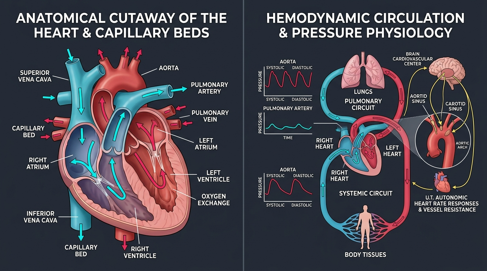

# Day 36: Cardiovascular System: Cardiac Anatomy, Hemodynamics & Inversion Physiology

---

## 🎯 Learning Objectives
* **Dissect Functional Cardiac Topography & Conduction:** Detail the 4 cardiac chambers, atrioventricular/semilunar valve apparatus, coronary vascular tree, and the intrinsic nodal pacing network ($SA \rightarrow AV \rightarrow \text{Purkinje}$).
* **Master Systemic & Pulmonary Hemodynamics:** Formulate the mechanical determinants of Cardiac Output ($CO = HR \times SV$), Mean Arterial Pressure ($MAP$), Total Peripheral Resistance ($TPR$), and the **Frank-Starling Law of the Heart**.
* **Deconstruct the Arterial Baroreceptor Reflex Arc:** Trace the sensory afferent signaling from the carotid sinus ($CN\text{ IX}$) and aortic arch ($CN\text{ X}$) to the medullary vasomotor center, governing acute blood pressure regulation.
* **Analyze Inversion Biomechanics & The Pressor Response:** Contrast the cardiovascular loading of high-tension isometric calisthenics (*Planche, Front Lever, Closed-Glottis Pressor Response*) with sustained yogic inversions (*Salamba Shirshasana, Sarvangasana, Viparita Karani*).
* **Quantify Vascular Resistance Physics:** Apply **Poiseuille’s Law** ($R \propto \frac{1}{r^4}$) to arterial vasoconstriction, active muscle hyperemia, and blood shunting during movement.

---

## 🔬 1. Functional Cardiac Anatomy & Electrophysiology

The human heart is a four-chambered muscular organ functioning as two synchronized, in-series biological pumps situated within the middle mediastinum of the thoracic cavity, protected by the pericardium.



### Internal Chamber Architecture & Valvular Mechanics

```
HEMODYNAMIC BLOOD FLOW PATHWAY:

[Deoxygenated Systemic Return]
Superior & Inferior Vena Cava ──► Right Atrium ──► [Tricuspid Valve] ──► Right Ventricle
                                                                           │
                                                                           ▼
[Pulmonary Circuit]                                              [Pulmonary Valve]
Left Atrium ◄── 4 Pulmonary Veins ◄── Pulmonary Capillaries ◄── Pulmonary Trunk/Arteries
     │
     ▼ [Bicuspid / Mitral Valve]
Left Ventricle ──► [Aortic Valve] ──► Ascending Aorta ──► [Oxygenated Systemic Circulation]
```

### Cardiac Structural & Valvular Reference Matrix

| Anatomical Structure | Morphological Characteristics | Mechanical / Functional Role | Clinical & Movement Relevance |
| :--- | :--- | :--- | :--- |
| **Right Atrium (RA)** | Thin-walled, contains *fossa ovalis*, *crista terminalis*, and pectinate muscles | Receives low-pressure ($0\text{–}4\text{ mmHg}$) venous return from SVC, IVC, and coronary sinus | Pacemaker site (**SA Node** located at SVC-RA junction) |
| **Tricuspid Valve** | Atrioventricular valve with 3 cusps anchored by *chordae tendineae* to papillary muscles | Prevents retrograde systolic regurgitation into the right atrium | Papillary muscle contraction tensions chordae, preventing cusp eversion during systole |
| **Right Ventricle (RV)** | Crescent-shaped cross-section, thinner myocardium ($4\text{–}5\text{ mm}$), *trabeculae carneae* | Pumps blood into the low-resistance pulmonary circuit ($PAP \approx 25/10\text{ mmHg}$) | Low-pressure pump; highly compliant to volume overload |
| **Left Atrium (LA)** | Smooth posterior wall, receives 4 pulmonary veins | Receives oxygenated blood ($PaO_2 \approx 100\text{ mmHg}$) from pulmonary capillaries | Forms anatomical base of heart; passive conduit and atrial kick |
| **Mitral (Bicuspid) Valve** | Dual-cusp heavy atrioventricular valve anchored by dual anterolateral/posteromedial papillary heads | Resists high left ventricular systolic pressures ($120\text{ mmHg}$) | Subject to highest mechanical shear stress in the cardiovascular system |
| **Left Ventricle (LV)** | Thick cylindrical myocardium ($10\text{–}15\text{ mm}$, $3\times$ thicker than RV) | Generates high-pressure systemic ejection across the aortic valve into the systemic tree | Undergoes concentric (strength) vs. eccentric (endurance) athletic hypertrophy |
| **Semilunar Valves** | Aortic and Pulmonary valves; tri-leaflet pocket architecture without chordae | Snap closed passively when ventricular pressure falls below arterial pressure in diastole | Creates diastolic backpressure that perfuses the **Coronary Arteries** via sinus of Valsalva |

---

## ⚡ 2. The Intrinsic Cardiac Conduction Network

Cardiac myocytes exhibit automaticity and rhythmicity, synchronized by specialized neuromuscular conduction pathways:

```
ELECTRICAL PACING HIERARCHY:

1. SINOATRIAL (SA) NODE (The Master Pacemaker)
   • Location: Crista terminalis / junction of SVC and Right Atrium.
   • Intrinsic Firing Rate: 60–100 bpm (under tonic vagal brake at rest: ~60–75 bpm).
   ▼ (Internodal Tracts: Anterior/Bachmann, Middle/Wenckebach, Posterior/Thorel)
2. ATRIOVENTRICULAR (AV) NODE (The Critical Delay Gate)
   • Location: Triangle of Koch in interatrial septum.
   • Intrinsic Firing Rate: 40–60 bpm.
   • Action: Delays impulse by ~0.10s to allow complete ventricular filling (Atrial Kick).
   ▼
3. ATRIOVENTRICULAR BUNDLE (Bundle of His)
   • Transits fibrous skeleton / membranous interventricular septum.
   ▼
4. RIGHT & LEFT BUNDLE BRANCHES (LBB & RBB)
   • Left branch subdivides into Anterior and Posterior Fascicles.
   ▼
5. PURKINJE FIBER NETWORK
   • High-speed subendocardial arborization ($4\text{ m/s}$) ensuring apex-to-base ventricular contraction.
```

---

## 📊 3. Hemodynamic Equations & Biophysical Laws

Understanding cardiovascular function during exercise requires quantifying blood flow, pressure gradients, and vascular resistance.

### Primary Hemodynamic Formula Matrix

| Metric / Law | Mathematical Formula | Physical & Physiological Definition | Athletic Movement Significance |
| :--- | :--- | :--- | :--- |
| **Cardiac Output ($CO$)** | $CO = HR \times SV$ | Total volume of blood ejected by the left ventricle per minute (Rest: $\approx 5\text{ L/min}$; Max Exercise: $25\text{–}35\text{ L/min}$). | Primary determinant of systemic oxygen delivery to working skeletal muscle. |
| **Stroke Volume ($SV$)** | $SV = EDV - ESV$ | Volume ejected per beat (typically $70\text{ mL}$ at rest, up to $150\text{+ mL}$ in trained athletes). | Modulated by **Preload**, **Afterload**, and **Myocardial Contractility**. |
| **Mean Arterial Pressure ($MAP$)** | $MAP = DBP + \frac{1}{3}(SBP - DBP) \approx CO \times TPR$ | Average driving perfusion pressure across the systemic capillary beds throughout one cardiac cycle. | Must be maintained $>65\text{ mmHg}$ to sustain vital cerebral and renal perfusion. |
| **Poiseuille’s Law of Resistance ($R$)** | $R = \frac{8\eta L}{\pi r^4} \implies R \propto \frac{1}{r^4}$ | Vascular resistance is inversely proportional to the **fourth power of vessel radius ($r$)**. | A $16\%$ reduction in arterial radius doubles vascular resistance; small changes in arteriolar diameter govern massive muscle blood flow redirection. |
| **Frank-Starling Mechanism** | $\uparrow \text{Venous Return} \rightarrow \uparrow EDV \rightarrow \uparrow \text{Sarcomere Stretch} \rightarrow \uparrow \text{Force of Contraction} \rightarrow \uparrow SV$ | Intrinsic ability of the heart to increase contractile force in response to increased end-diastolic volume. | Elevates Stroke Volume immediately during leg elevation, inversions, and high-cadence muscular pumping. |

---

## 🔄 4. The Baroreceptor Reflex Arc & Autonomic Tone

The **Arterial Baroreceptor Reflex** is the body's rapid-response negative feedback mechanism maintaining arterial blood pressure equilibrium against postural changes and isometric straining.

```
BARORECEPTOR REFLEX NEGATIVE FEEDBACK LOOP:

       [Acute Rise in Blood Pressure / Hydrostatic Cranial Load]
                                  │
                                  ▼
      Stretches Carotid Sinus ($CN\text{ IX}$) & Aortic Arch ($CN\text{ X}$)
                                  │
                                  ▼
       Afferent signals to Nucleus Tractus Solitarius (NTS) in Medulla
                                  │
                 ┌────────────────┴────────────────┐
                 ▼                                 ▼
      [Stimulates Parasympathetic]       [Inhibits Sympathetic]
      • ↑ Vagus Nerve ($CN\text{ X}$)    • ↓ Sympathetic Outflow ($T_1\text{–}L_2$)
      • Acetylcholine release on SA node  • Vasodilation of systemic arterioles
      • Negative chronotropy (↓ HR)      • ↓ Total Peripheral Resistance ($TPR$)
                 │                                 │
                 └────────────────┬────────────────┘
                                  ▼
                 [Restoration of Normal Systemic Blood Pressure]
```

---

## 🧘 5. Movement Applications: Calisthenics vs. Yoga Hemodynamics

### Calisthenics: High-Tension Isometrics & The Pressor Reflex
* **The Muscle-Pump Occlusion Effect:** In static holds like the **Full Planche**, **Front Lever**, or **Iron Cross**, sustained intramuscular tension exceeding $20\text{–}30\%$ of Maximum Voluntary Contraction (MVC) mechanically compresses intramuscular arterioles and capillary beds, occluding local blood flow.
* **The Exercise Pressor Reflex:** Accumulation of metabolic byproducts (lactate, $H^+$, adenosine, $K^+$) stimulates **Group III/IV muscle afferents (metaboreceptors)**, triggering a powerful surge in sympathetic outflow.
* **Hemodynamic Consequence:** **Total Peripheral Resistance ($TPR$)** spikes dramatically alongside acute Systolic ($>220\text{ mmHg}$) and Diastolic ($>140\text{ mmHg}$) blood pressure elevations. The Left Ventricle works against massive afterload, driving concentric ventricular wall thickening over long-term training adaptations.

### Yoga: Inversions & Hydrostatic Column Reversal
* **Hydrostatic Pressure Shift:** In upright posture, gravity produces a $+80\text{ to }+100\text{ mmHg}$ hydrostatic pressure gradient in the lower extremities and a $-30\text{ mmHg}$ gradient at the cranium.
* **Inverted Postures (*Salamba Shirshasana*, *Sarvangasana*, *Viparita Karani*):**
  * Reverses the $1.5\text{-meter}$ hydrostatic column: blood in the expansive, highly compliant venous beds of the lower limbs drains rapidly back toward the heart.
  * **Surge in Central Venous Pressure (CVP) & Preload:** Increases Right Atrial filling, stretching myocardial fibers and activating the **Frank-Starling Mechanism**.
  * **Baroreceptor Activation:** Elevated hydrostatic pressure in the carotid sinus and aortic arch triggers acute vagal firing, reducing resting heart rate (bradycardia) and lowering systemic peripheral vascular resistance.
  * **Cerebral Autoregulation:** Healthy cerebral vascular smooth muscle undergoes reactive myogenic vasoconstriction (*Bayliss effect*) to protect delicate cerebral capillary networks from capillary hyperperfusion.

---

## 🧪 6. Desk-Side Tactile Biomechanics Lab

### Experiment 1: The Orthostatic Baroreceptor & Postural Heart Rate Test
1. Lie supine on the floor with your legs elevated against a wall (**Viparita Karani** / Legs-Up-The-Wall) for 3 minutes. Breathe slowly and passively.
2. Palpate your radial pulse at the wrist and count your baseline resting beats per minute (BPM).
3. Rapidly transition to a tall standing posture. Immediately count your pulse for 15 seconds (multiply by 4).
4. *Observation:* Your heart rate acutely increases by $10\text{–}25\text{ bpm}$ within the first 10–15 seconds, followed by a stabilizing deceleration.
5. *Biomechanics Explanation:* Standing causes $500\text{–}1000\text{ mL}$ of blood to pool in the lower venous capacitative vessels due to gravity. This drops venous return, stroke volume, and carotid sinus stretch. The **Baroreceptor Reflex** disinhibits sympathetic outflow, producing immediate tachycardia and peripheral vasoconstriction to prevent cerebral hypoperfusion (orthostatic syncope).

### Experiment 2: The Isometric Pressor Occlusion Test
1. Relax one arm completely and identify your baseline radial pulse strength.
2. Form a maximal-effort white-knuckle fist with the opposite hand and flex the bicep, tricep, and pectoral muscles at $100\%$ voluntary isometric contraction for 45 continuous seconds while breathing shallowly.
3. Observe the sensation of arterial fullness, carotid pulsation, and peripheral heart rate acceleration.
4. *Biomechanics Explanation:* Sustained maximal isometric contraction mechanically occludes muscular blood vessels, activating Group III/IV metaboreceptors and eliciting the **Exercise Pressor Reflex**, driving acute sympathetic arterial vasoconstriction and systemic blood pressure elevation.

---

## 📚 7. Anatomical Cross-References
* **Respiratory Mechanics:** [Day 32: Respiration & IAP](../day-032-respiration-iap/README.md), [Day 37: Respiratory System](../day-037-respiratory-system/README.md).
* **Thoracic Cavity & Pericardial Attachments:** [Thorax & Ribs](../../bones/vertebrae_thorax/README.md), [Chest & Abdominal Musculature](../../muscles/thorax_abdomen/README.md).
* **Autonomic Nervous Integration:** [Day 40: Endocrine & Nervous Integration](../day-040-endocrine-nervous-integration/README.md).

---

## 📝 8. Daily Knowledge Retrieval Quiz

<details>
<summary><b>1. Trace the complete electrical pathway of cardiac pacing from the master pacemaker to the ventricular myocardium.</b></summary>
<b>Answer:</b> 
1. <b>Sinoatrial (SA) Node:</b> Generates spontaneous action potentials ($60\text{–}100\text{ bpm}$) at the SVC-RA junction.
2. <b>Internodal Pathways:</b> Anterior (Bachmann), Middle (Wenckebach), and Posterior (Thorel) tracts propagate depolarisation through both atria.
3. <b>Atrioventricular (AV) Node:</b> Delays impulse conduction ($\approx 0.10\text{ s}$) to allow complete atrial mechanical emptying.
4. <b>Bundle of His (AV Bundle):</b> Traverses the fibrous cardiac skeleton into the interventricular septum.
5. <b>Right and Left Bundle Branches (RBB/LBB):</b> Distribute electrical vectors through the ventricular septum.
6. <b>Purkinje Fibers:</b> High-velocity ($4\text{ m/s}$) subendocardial network initiating rapid apex-to-base ventricular contraction.
</details>

<details>
<summary><b>2. State the mathematical relationship of Poiseuille’s Law of Resistance and explain its relevance to arterial vasoconstriction.</b></summary>
<b>Answer:</b> 
$$R = \frac{8\eta L}{\pi r^4} \implies R \propto \frac{1}{r^4}$$
Vascular resistance ($R$) is inversely proportional to the <b>fourth power of vessel radius ($r$)</b>. If an arteriolar lumen radius decreases by just $50\%$ (vasoconstriction), resistance to blood flow increases by a factor of $2^4 = 16\times$. This profound non-linear relationship allows the sympathetic nervous system and local metabolites to precisely modulate and shunt systemic blood flow.
</details>

<details>
<summary><b>3. How does the Frank-Starling mechanism increase Stroke Volume during yogic inverted postures?</b></summary>
<b>Answer:</b> In inverted postures (e.g., <i>Salamba Shirshasana</i>, <i>Viparita Karani</i>), gravity assists venous drainage from the lower extremities, increasing Central Venous Pressure (CVP) and <b>Venous Return</b>. This elevates End-Diastolic Volume (EDV), mechanically stretching ventricular cardiac myocytes toward their optimal actin-myosin sarcomere length. In accordance with the <b>Frank-Starling Law</b>, increased myocardial stretch yields a greater force of contraction, automatically elevating <b>Stroke Volume ($SV$)</b>.
</details>

<details>
<summary><b>4. Differentiate the hemodynamic loading profile of high-load isometric calisthenics (e.g., Planche) from continuous dynamic aerobic flow.</b></summary>
<b>Answer:</b> 
• <b>Isometric Calisthenics (Planche/Levers):</b> Sustained high intramuscular pressure occludes blood vessels, eliciting the <b>Exercise Pressor Reflex</b>. This produces marked increases in <b>Total Peripheral Resistance ($TPR$)</b> and sharp spikes in both Systolic and Diastolic Blood Pressure (pressure-overload afterload on the LV).
<br>
• <b>Dynamic Aerobic Flow:</b> Rhythmic muscle pump action and widespread metabolic vasodilation in working muscles <b>decrease $TPR$</b>. Systolic blood pressure rises moderately with increased Cardiac Output, while Diastolic blood pressure remains stable or slightly drops (volume-overload preload on the LV).
</details>

<details>
<summary><b>5. Which cranial nerves carry the afferent sensory limbs of the Carotid Sinus and Aortic Arch baroreceptors?</b></summary>
<b>Answer:</b> 
• <b>Carotid Sinus:</b> Innervated by the Hering nerve, a branch of the <b>Glossopharyngeal Nerve ($CN\text{ IX}$)</b>.
• <b>Aortic Arch:</b> Innervated by the <b>Vagus Nerve ($CN\text{ X}$)</b>. Both project sensory inputs to the Nucleus Tractus Solitarius (NTS) in the medulla oblongata.
</details>
