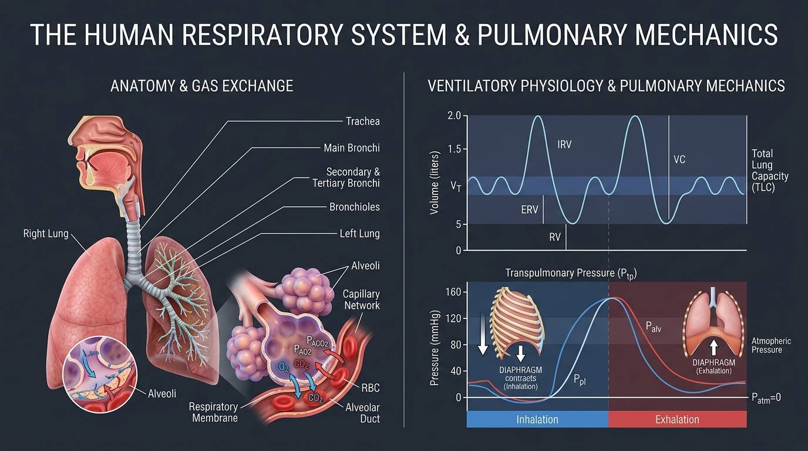

# Day 37: Respiratory System: Pulmonary Anatomy, Alveolar Gas Exchange & Pranayama Physiology

---

## 🎯 Learning Objectives
* **Map the Tracheobronchial Tree & Alveolar Microarchitecture:** Detail the 23 generations of airway branching from the trachea down to the respiratory zone, including the ultra-thin ($0.2\text{–}0.5\,\mu\text{m}$) **Blood-Air Barrier** and **Type II Pneumocyte Surfactant** mechanics.
* **Master the Biophysics of Ventilation:** Formulate **Boyle’s Law** ($P_1V_1 = P_2V_2$), **Fick’s Law of Diffusion**, and analyze the pressure dynamics of **Intrapleural ($P_{pl}$)**, **Alveolar ($P_{alv}$)**, and **Transpulmonary Pressure ($P_{tp}$)**.
* **Quantify Pulmonary Volumes & Capacities:** Differentiate **Tidal Volume ($V_T$)**, **Inspiratory/Expiratory Reserve Volumes ($IRV/ERV$)**, **Residual Volume ($RV$)**, and **Vital Capacity ($VC$)**.
* **Deconstruct Neurochemical Ventilatory Drive & The Bohr Effect:** Explain central ($PCO_2/H^+$ in medulla) and peripheral ($PO_2$ in carotid bodies) chemoreceptor regulation, alongside the **Oxyhemoglobin Dissociation Curve**.
* **Integrate Athletic VO2 Max & Yogic Breathwork:** Dissect the physiological mechanisms of **$VO_2$ Max limitation**, exercise-induced arterial hypoxemia, **Ujjayi glottic resistance**, and **Kumbhaka (breath retention)**.

---

## 🔬 1. Functional Anatomy of the Respiratory Tract

The respiratory system is architecturally partitioned into a **Conducting Zone** (generations 0–16; anatomical dead space that warms, humidifies, and filters air) and a **Respiratory Zone** (generations 17–23; sites of active gas exchange).



### Airway Branching Hierarchy & Structural Matrix

| Airway Generation | Anatomical Segment | Histological Architecture & Cartilage | Functional / Biomechanical Role |
| :--- | :--- | :--- | :--- |
| **Generation 0** | **Trachea** | C-shaped hyaline cartilage rings, *trachealis* smooth muscle posteriorly | Rigid conduit preventing collapse under negative intrapleural pressure |
| **Generations 1–3** | **Primary, Lobar & Segmental Bronchi** | Irregular cartilage plates, smooth muscle layer, pseudostratified ciliated columnar epithelium | Distributes airflow to specific pulmonary lobes (3 right, 2 left) |
| **Generations 4–16** | **Bronchioles & Terminal Bronchioles** | **No cartilage**; complete circular smooth muscle coat; Cuboidal epithelium | Primary site of physiological airway resistance; regulated by autonomic tone ($\beta_2$-adrenergic dilation) |
| **Generations 17–19** | **Respiratory Bronchioles** | Scattered outpocketing alveoli along walls | Transition to gas exchange; marks beginning of respiratory zone |
| **Generations 20–22** | **Alveolar Ducts** | Completely lined with alveoli; rings of smooth muscle at alveolar entrances | Distributes gas to terminal clusters |
| **Generation 23** | **Alveolar Sacs & Alveoli** | Single layer of epithelial cells; interconnected by Pores of Kohn; dense capillary net | Primary gas exchange engine ($300\text{–}500\text{ million}$ alveoli; surface area $\approx 100\text{ m}^2$) |

---

## 🧪 2. Alveolar Microstructure & The Blood-Air Barrier

Gas exchange occurs across the **Alveolocapillary Membrane (Blood-Air Barrier)**, which spans a microscopic thickness of just $0.2\text{ to }0.5\,\mu\text{m}$.

```
BLOOD-AIR BARRIER CROSS-SECTION:

[Alveolar Gas Lumen] (PaO2 ~ 100 mmHg, PaCO2 ~ 40 mmHg)
─────────────────────────────────────────────────────────────
1. Pulmonary Surfactant Monolayer (Secreted by Type II Pneumocytes)
2. Type I Alveolar Epithelial Cell (Extremely attenuated cytoplasm)
3. Fused Epithelial-Capillary Basement Membrane
4. Capillary Endothelial Cell
─────────────────────────────────────────────────────────────
[Pulmonary Capillary Lumen] ──► Erythrocyte / Hemoglobin
```

### Cellular Components of the Alveolar Wall
* **Type I Pneumocytes ($95\%$ surface area):** Extremely flat, simple squamous epithelial cells optimized for passive gas diffusion.
* **Type II Pneumocytes ($5\%$ surface area, but $60\%$ of cell count):** Cuboidal secretory cells that produce **Dipalmitoylphosphatidylcholine (Pulmonary Surfactant)**.
* **Pulmonary Surfactant Mechanics (Law of Laplace):**
  $$\Delta P = \frac{2T}{r}$$
  Without surfactant, smaller alveoli (smaller radius $r$) would generate higher collapsing surface tension pressures ($\Delta P$) and collapse into larger alveoli (atelectasis). Surfactant dramatically lowers surface tension ($T$) as alveoli shrink, equalizing pressures across all alveolar diameters and ensuring structural stability.
* **Alveolar Macrophages (Dust Cells):** Scavenge particulate matter within the lumen.

---

## 📈 3. Pulmonary Volumes, Capacities & Spirometry

```
SPIROMETRIC VOLUME DIVISIONS:

      ┌─────────────────────────────┐
      │  Inspiratory Reserve Volume │
      │          (IRV ~ 3.0 L)      │  Vital Capacity
Total │                             │  (VC ~ 4.6 L)
Lung  ├─────────────────────────────┤
Cap.  │   Tidal Volume (VT ~ 0.5 L) │
(TLC  ├─────────────────────────────┤
~6.0L)│  Expiratory Reserve Volume  │
      │          (ERV ~ 1.1 L)      │ ── Functional Residual
      ├─────────────────────────────┤    Capacity (FRC ~ 2.3 L)
      │     Residual Volume         │
      │          (RV ~ 1.2 L)       │
      └─────────────────────────────┘
```

### Spirometric Definitions & Movement Reference Table

| Volume / Capacity | Normal Value (Adult Male) | Definition | Biomechanical Relevance in Movement |
| :--- | :--- | :--- | :--- |
| **Tidal Volume ($V_T$)** | $500\text{ mL}$ ($0.5\text{ L}$) | Volume of air inspired or expired during a normal, quiet breath at rest. | Expands to $2.0\text{–}3.0\text{ L}$ during heavy calisthenics or sprint conditioning. |
| **Inspiratory Reserve Volume ($IRV$)** | $3000\text{ mL}$ ($3.0\text{ L}$) | Maximum additional volume of air that can be forcibly inspired above normal $V_T$. | Recruited during deep chest expansion in backbends (*Urdhva Dhanurasana*). |
| **Expiratory Reserve Volume ($ERV$)** | $1100\text{ mL}$ ($1.1\text{ L}$) | Maximum additional volume that can be forcibly expired below normal $V_T$. | Expelled during forced core compression exercises and deep spinal twists. |
| **Residual Volume ($RV$)** | $1200\text{ mL}$ ($1.2\text{ L}$) | Volume of air remaining in lungs after maximal forced expiration; **cannot be exhaled**. | Prevents total alveolar collapse and maintains continuous capillary gas exchange between breaths. |
| **Vital Capacity ($VC$)** | $4600\text{ mL}$ ($4.6\text{ L}$) | $VC = IRV + V_T + ERV$; Total usable ventilatory capacity from full inspiration to full exhalation. | Key indicator of thoracic mobility, diaphragmatic excursion, and athletic aerobic potential. |
| **Functional Residual Capacity ($FRC$)** | $2300\text{ mL}$ ($2.3\text{ L}$) | $FRC = ERV + RV$; Volume remaining in lungs at end of normal passive tidal exhalation. | Equilibrium point where chest wall outward elastic recoil balances lung inward elastic recoil. |

---

## ⚡ 4. Gas Exchange Physics & The Oxyhemoglobin Dissociation Curve

### Biophysical Laws of Respiration
1. **Boyle’s Law ($P \propto \frac{1}{V}$):** As diaphragmatic contraction expands thoracic cavity volume, intrapulmonary pressure ($P_{alv}$) drops below atmospheric pressure ($P_{atm} = 760\text{ mmHg}$), driving passive bulk airflow into the lungs.
2. **Fick’s Law of Gas Diffusion:**
   $$\dot{V}_{gas} = \frac{A \cdot D \cdot (P_1 - P_2)}{T}$$
   Diffusion rate is directly proportional to alveolar surface area ($A$), diffusion constant ($D$), and partial pressure gradient ($P_1 - P_2$), and inversely proportional to membrane thickness ($T$).

### The Oxyhemoglobin Dissociation Curve & The Bohr Effect

The sigmoidal binding affinity of Hemoglobin ($Hb$) for $O_2$ dynamically shifts to unload oxygen precisely where working tissues demand it:

```
FACTORS INDUCING A "RIGHT SHIFT" (Bohr Effect - Facilitates O2 Unloading in Active Muscle):
• ↑ Hydrogen ion concentration / ↓ pH (Lactic acid accumulation)
• ↑ Carbon dioxide partial pressure (PaCO2)
• ↑ Intramuscular Temperature (Warm-up / high metabolic rate)
• ↑ 2,3-Bisphosphoglycerate (2,3-BPG)

RESULT: At any given PaO2, Hemoglobin exhibits REDUCED affinity for O2, releasing greater 
quantities of oxygen to actively contracting sarcomeres.
```

---

## 🧘 5. Movement Applications: VO2 Max vs. Yogic Pranayama

### Calisthenics & High-Intensity Conditioning: The VO2 Max Ceiling
* **$VO_2$ Max ($mL/kg/min$):** Maximal volume of oxygen the body can transport and utilize during exhaustive exercise ($VO_2 = CO \times [a\text{-}\bar{v}O_2\text{ difference}]$ via the Fick Principle).
* **Limiting Factor:** In healthy individuals at sea level, the primary limiter of $VO_2$ max is **Cardiac Output and capillary density**, rather than pulmonary diffusion, except during extreme elite exercise where rapid erythrocyte capillary transit time ($<0.25\text{ s}$) produces Exercise-Induced Arterial Hypoxemia (EIAH).

### Yoga Pranayama & Breath Retention Physiology
* **Ujjayi Pranayama (उज्जायी - Victorious Breath):**
  * **Mechanism:** Partial adduction of the vocal cords (glottic narrowing) creates gentle auditory turbulence and generates **Continuous Positive Airway Pressure (CPAP)** in the bronchial tree.
  * **Physiological Benefit:** The slight positive end-expiratory pressure prevents terminal bronchiole collapse, enhances alveolar ventilation-perfusion ($V/Q$) matching, and stimulates laryngeal sensory branches of the Vagus nerve ($CN\text{ X}$), augmenting parasympathetic vagal tone.
* **Kumbhaka (Kumbhaka - Breath Retention):**
  * **Antara Kumbhaka (Internal Retention at full inhalation):** Increases intrathoracic pressure, driving gas recruitment into under-ventilated apical lung alveoli.
  * **Bahya Kumbhaka (External Retention at full exhalation):** Triggers controlled acute hypercapnia ($\uparrow PaCO_2$), inducing cerebral vasodilation and testing central chemoreceptor tolerance.
* **Kapalabhati vs. Bhastrika:** Rapid, forced ventilatory cycles that blow off carbon dioxide, producing acute respiratory alkalosis ($\downarrow PaCO_2$, $\uparrow pH$) and cerebral vasoconstriction (explaining the lightheaded sensation if performed excessively).

---

## 🧪 6. Desk-Side Tactile Biomechanics Lab

### Experiment 1: The Body Oxygen Level Test (BOLT Score)
1. Sit upright, relaxed, and take a normal, quiet breath in through your nose, followed by a normal, quiet breath out.
2. At the end of the exhalation, pinch your nose with your fingers and start a timer.
3. Hold your breath until you feel the **first definite physical urge to breathe** (e.g., involuntary swallow, diaphragm twitch, or throat constriction).
4. Release your nose, resume calm nasal breathing, and stop the timer.
5. *Scoring & Interpretation:*
   * **$<20\text{ seconds}$:** High sensitivity to arterial $CO_2$; tendency toward upper-chest over-breathing and sympathetic dominance.
   * **$20\text{–}40\text{ seconds}$:** Normal physiological tolerance to metabolic carbon dioxide.
   * **$>40\text{ seconds}$:** Superior $CO_2$ tolerance, common in trained free-divers, elite endurance athletes, and advanced yogis.

### Experiment 2: The Glottic Resistance (Ujjayi) Inflow Test
1. Place a hand in front of your mouth and exhale as if fogging a cold glass mirror ("Haaaah" sound with mouth open).
2. Now, close your lips and replicate the exact same gentle throat/glottic constriction while inhaling and exhaling solely through your nose.
3. Notice how your breathing cadence naturally slows from 14 breaths/min down to 4–6 breaths/min.
4. *Biomechanics Explanation:* Narrowing the rima glottidis increases upstream airway resistance, requiring greater diaphragmatic muscle recruitment while prolonging alveolar capillary contact time for optimal gas diffusion.

---

## 📚 7. Anatomical Cross-References
* **Respiratory Diaphragm Mechanics:** [Day 32: Respiration Biomechanics & IAP](../day-032-respiration-iap/README.md).
* **Cardiovascular Transport:** [Day 36: Cardiovascular System](../day-036-cardiovascular-system/README.md).
* **Thoracic Skeleton:** [Ribs, Sternum & Thoracic Vertebrae](../../bones/vertebrae_thorax/README.md).

---

## 📝 8. Daily Knowledge Retrieval Quiz

<details>
<summary><b>1. What is the physiological role of Pulmonary Surfactant and how does it prevent alveolar collapse based on the Law of Laplace?</b></summary>
<b>Answer:</b> 
Pulmonary Surfactant (secreted by <b>Type II Pneumocytes</b>) reduces surface tension at the air-water interface of the alveoli. According to the <b>Law of Laplace ($\Delta P = \frac{2T}{r}$)</b>, as an alveolus gets smaller (radius $r$ decreases), the collapsing inward pressure ($\Delta P$) would rise sharply if surface tension ($T$) remained constant. Surfactant molecules become more concentrated as alveolar surface area shrinks, lowering surface tension ($T$) in proportion to radius ($r$). This equalizes collapsing pressure across alveoli of differing sizes, preventing atelectasis (small alveoli emptying into large ones).
</details>

<details>
<summary><b>2. Define Residual Volume ($RV$) and Functional Residual Capacity ($FRC$). Why can $RV$ never be exhaled?</b></summary>
<b>Answer:</b> 
• <b>Residual Volume ($RV$):</b> The volume of gas remaining in the lungs after a maximal forced expiration ($\approx 1.2\text{ L}$). It cannot be exhaled because the cartilaginous rib cage prevents total thoracic collapse, and small airways close at low lung volumes, trapping gas to maintain continuous alveolar-capillary gas exchange.
<br>
• <b>Functional Residual Capacity ($FRC$):</b> The volume of gas remaining in the lungs at the end of a normal, quiet tidal exhalation ($FRC = ERV + RV \approx 2.3\text{ L}$). It represents the resting equilibrium point of the respiratory system where inward lung recoil matches outward chest wall recoil.
</details>

<details>
<summary><b>3. Explain the Bohr Effect. What four physiological factors shift the Oxyhemoglobin Dissociation Curve to the right during intense exercise?</b></summary>
<b>Answer:</b> 
The <b>Bohr Effect</b> describes how physiological changes in blood chemistry decrease hemoglobin's affinity for oxygen, facilitating the release of $O_2$ into metabolically active tissues.
The 4 right-shifting factors during exercise are:
1. <b>$\uparrow PaCO_2$</b> (Elevated carbon dioxide).
2. <b>$\downarrow \text{pH} / \uparrow H^+$</b> (Increased acidity / lactic acid).
3. <b>$\uparrow \text{Temperature}$</b> (Hyperthermia from working muscles).
4. <b>$\uparrow \text{2,3-BPG}$</b> (2,3-Bisphosphoglycerate).
</details>

<details>
<summary><b>4. How does Ujjayi breathing mechanically alter airway pressure and autonomic nervous system state?</b></summary>
<b>Answer:</b> 
By partially adducting the vocal cords, Ujjayi creates slight resistance at the glottis. This generates <b>Positive End-Expiratory Pressure (PEEP)</b> throughout the tracheobronchial tree, preventing micro-atelectasis of small airways and improving ventilation-perfusion ($V/Q$) matching. Furthermore, the slow, rhythmic vibration stimulates laryngeal afferents of the <b>Vagus Nerve ($CN\text{ X}$)</b>, increasing parasympathetic vagal tone and reducing resting heart rate.
</details>

<details>
<summary><b>5. Where are the central and peripheral chemoreceptors located, and what primary arterial blood chemical changes do they sense?</b></summary>
<b>Answer:</b> 
• <b>Central Chemoreceptors:</b> Located on the ventrolateral surface of the <b>Medulla Oblongata</b>; they sense changes in <b>$H^+$ concentration / pH of the cerebrospinal fluid (CSF)</b>, which is driven by arterial $PaCO_2$ diffusing across the blood-brain barrier.
<br>
• <b>Peripheral Chemoreceptors:</b> Located in the <b>Carotid Bodies ($CN\text{ IX}$)</b> and <b>Aortic Bodies ($CN\text{ X}$)</b>; they sense decreases in <b>arterial $PaO_2$ ($<60\text{ mmHg}$)</b>, as well as elevations in $PaCO_2$ and decreases in blood pH.
</details>
