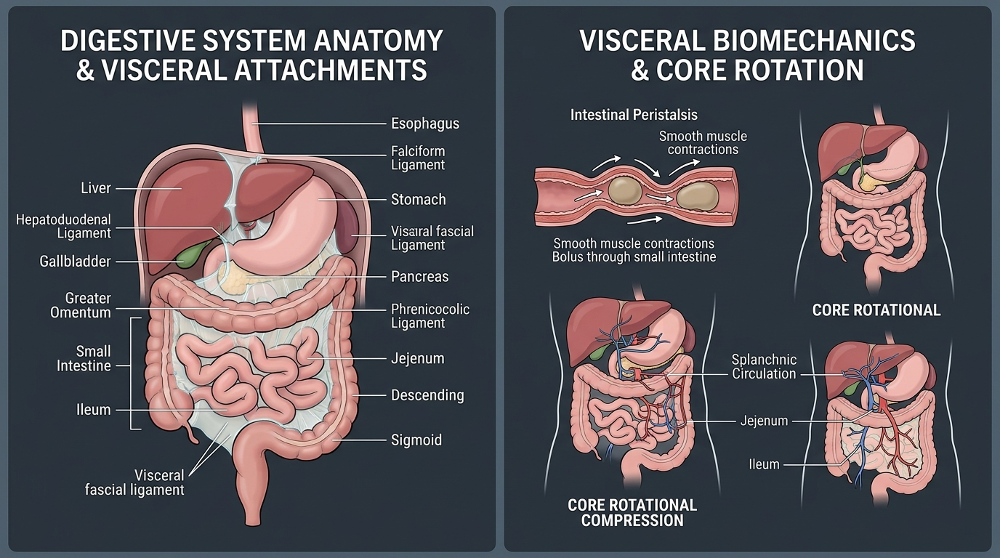

# Day 38: Digestive System: GI Anatomy, Peristalsis, Visceral Fascia & Core Mobility

---

## 🎯 Learning Objectives
* **Dissect Alimentary Tract Topography & Accessory Organs:** Map the structural continuum from the esophagus, stomach (cardia, fundus, body, pylorus), small intestine (duodenum, jejunum, ileum), to the large intestine (colon, rectum), alongside the liver, gallbladder, and pancreas.
* **Master Peritoneal Ligaments & Visceral Biomechanics:** Detail the mechanical suspensory fascial connections (**Greater/Lesser Omentum**, **Mesentery Proper**, **Falciform Ligament**, **Phrenicocolic Ligament**, and **Ligament of Treitz**).
* **Deconstruct Gastrointestinal Motility & The Enteric Nervous System (ENS):** Explain the pacemaker activity of the **Interstitial Cells of Cajal (ICC)**, the **Myenteric (Auerbach’s)** and **Submucosal (Meissner’s)** plexuses, and the **Migrating Motor Complex (MMC)**.
* **Analyze Splanchnic Hemodynamics & Exercise Hypoperfusion:** Quantify how sympathetic vasoconstriction shunts blood from the mesenteric circulation ($>80\%$ reduction) to working skeletal muscles during intense calisthenics.
* **Apply Visceral Manipulation to Core Twists & Kriyas:** Synthesize the biomechanical effects of rotational asanas (*Ardha Matsyendrasana, Marichyasana*) and abdominal kriyas (*Agnisar, Nauli*) on visceral sliding, lymphatic clearance, and intestinal transit.

---

## 🔬 1. Functional Anatomy of the Gastrointestinal Tract

The human digestive system comprises a continuous muscular alimentary tube ($\approx 9\text{ meters}$ in length) and specialized accessory metabolic glands.



### Alimentary Canal & Accessory Organs Matrix

| Organ / Segment | Anatomical Regions & Sphincters | Histological Characteristics | Physiological & Mechanical Function |
| :--- | :--- | :--- | :--- |
| **Esophagus** | Cervical, Thoracic, and Abdominal portions; **Upper (UES)** & **Lower (LES)** Sphincters | Upper $1/3$ striated skeletal muscle, middle $1/3$ mixed, lower $1/3$ smooth muscle | Propels bolus via coordinated primary/secondary peristaltic waves; LES prevents gastric reflux |
| **Stomach** | **Cardia**, **Fundus**, **Body**, **Pyloric Antrum/Canal**; **Pyloric Sphincter** | 3 smooth muscle layers (outer longitudinal, middle circular, **inner oblique**); rugae folds | Mechanical churning, hydrochloric acid ($HCl$) and pepsinogen secretion; converts bolus to acidic chyme |
| **Duodenum** | $C$-shaped retroperitoneal loop ($25\text{ cm}$); Major Duodenal Papilla (Ampulla of Vater) | **Brunner’s Glands** (alkaline bicarbonate secretion); receives bile and pancreatic juice | Neutralizes acidic chyme; initiates lipid emulsification and enzymatic digestion |
| **Jejunum & Ileum** | Intraperitoneal loops ($\approx 6\text{ meters}$); anchored by the Mesentery | **Plicae Circulares**, Villi, Microvilli ($200\text{ m}^2$ surface area); Peyer’s patches in ileum | Primary site of nutrient absorption ($90\%$) and immune surveillance (GALT) |
| **Large Intestine (Colon)** | **Cecum, Ascending, Transverse, Descending, Sigmoid Colon**, Rectum | **Teniae Coli** (3 longitudinal bands), **Haustra** (sacculations), **Epiploic Appendages** | Reabsorption of water and electrolytes ($1.5\text{ L/day}$); microbial fermentation and fecal compaction |
| **Liver & Gallbladder** | 4 lobes (Right, Left, Caudate, Quadrate); Gallbladder stores bile | Hexagonal hepatic lobules; dual blood supply (Hepatic Artery $25\%$, **Hepatic Portal Vein $75\%$**) | Metabolic filtration, gluconeogenesis, glycogen storage, plasma protein synthesis, and bile secretion |
| **Pancreas** | Head (in duodenal curve), Neck, Body, Tail (contacts spleen) | Acinar cells (exocrine: amylase, lipase, proteases) & Islets of Langerhans (endocrine: insulin/glucagon) | Delivers digestive enzymes into duodenum and regulates whole-body glucose homeostasis |

---

## 🛡️ 2. Peritoneal Reflections & Visceral Suspensory Ligaments

The organs within the abdominopelvic cavity do not float freely; they are tethered to the posterior abdominal wall and diaphragm by specialized folds of peritoneum (**Mesenteries**, **Omenta**, and **Visceral Ligaments**).

```
VISCERAL SUSPENSORY NETWORK:

    [Respiratory Diaphragm]
           │
           ├────────────────────────► Falciform & Coronary Ligaments ──► [LIVER]
           │                                                               │
           ├────────────────────────► Phrenicocolic Ligament               │ (Lesser Omentum:
           │                          (Suspends Splenic Flexure & Spleen)  │  Hepatogastric &
           │                                                               │  Hepatoduodenal)
           ▼                                                               ▼
  [Transverse Mesocolon] ◄────────────────────────────────────────── [STOMACH]
           │                                                               │
           ▼                                                               ▼
  [Mesentery Proper] ──► [Jejunum & Ileum]                       [Greater Omentum]
  (Anchors Small Intestine to Lumbar Spine L2)               (Extends down over intestines)
```

### Key Visceral Ligament Functions Table

| Peritoneal Ligament / Structure | Anatomical Attachments | Structures Enclosed | Movement & Biomechanical Relevance |
| :--- | :--- | :--- | :--- |
| **Greater Omentum** | Greater curvature of stomach $\rightarrow$ draping over intestines $\rightarrow$ transverse colon | Adipose tissue, epiploic vessels, macrophages | *"The Abdominal Policeman"*; migrates and adheres to areas of inflammation/trauma to isolate infection |
| **Lesser Omentum** | Liver $\rightarrow$ Lesser curvature of stomach & Duodenum | **Portal Triad** (Hepatic Artery, Portal Vein, Common Bile Duct) in free edge | Transmits neurovascular supply to liver; subject to torsion during extreme thoracic rotation |
| **Falciform & Coronary Ligaments** | Liver $\rightarrow$ Anterior abdominal wall & inferior surface of diaphragm | Ligamentum Teres (obliterated umbilical vein) | Mechanically couples liver mobility directly to diaphragmatic respiration excursions |
| **Phrenicocolic Ligament** | Left colic (splenic) flexure $\rightarrow$ Diaphragm at $10^{\text{th}}\text{–}11^{\text{th}}$ rib | Peritoneal fold supporting the base of the **Spleen** | Structural shelf (*sustentaculum lienis*); tensed during lateral spinal flexion to the right |
| **Ligament of Treitz** (Suspensory muscle of duodenum) | Right crus of diaphragm $\rightarrow$ Duodenojejunal flexure | Fibromuscular band derived from skeletal & smooth muscle | Widens duodenojejunal angle during diaphragmatic contraction to facilitate chyme transit |

---

## ⚡ 3. The Enteric Nervous System & Splanchnic Hemodynamics

Often termed the *"Second Brain"*, the **Enteric Nervous System (ENS)** comprises over $500\text{ million}$ neurons embedded in the gut wall, capable of autonomous reflex function independent of the CNS.

```
THE NEURAL PLEXUSES OF THE GUT WALL:

1. MYENTERIC (AUERBACH'S) PLEXUS
   • Location: Sandwiched between outer longitudinal and middle circular smooth muscle layers.
   • Function: Controls gastrointestinal MOTILITY, peristaltic velocity, and sphincter tone.
   
2. SUBMUCOSAL (MEISSNER'S) PLEXUS
   • Location: In the submucosal space between muscularis mucosae and inner circular muscle.
   • Function: Regulates local GLANDULAR SECRETION, mucosal absorption, and local blood flow.
```

### Splanchnic Blood Flow Redistribution During Exercise
* **Resting Baseline:** The splanchnic circulation receives $\approx 25\%$ of total cardiac output ($1.2\text{–}1.5\text{ L/min}$) for digestion and hepatic metabolism.
* **High-Intensity Calisthenics / Sprinting:** Profound sympathetic activation ($\alpha_1$-adrenergic vasoconstriction of mesenteric arterioles) **shunts up to $80\text{–}85\%$ of splanchnic blood volume** away from the viscera toward active skeletal muscles and myocardium.
* **Exercise-Induced Gastrointestinal Syndrome (EIGS):** Prolonged high-intensity exercise under dehydration causes acute splanchnic hypoperfusion, epithelial tight-junction breakdown, intestinal hyperpermeability ("leaky gut"), and abdominal cramping.

---

## 🧘 4. Movement Applications: Core Twists, Compressions & Kriyas

### Spinal Rotation & Visceral Shear Dynamics
* **Mechanical Compression in Asanas (*Ardha Matsyendrasana*, *Marichyasana III*):**
  * When rotating the torso, the abdominal viscera undergo non-uniform mechanical compression against the lumbar spine and pelvic floor.
  * **The "Sponge Effect":** Asymmetrical compression transiently decreases visceral capillary volume. Upon release of the twist, reactive hyperemia flushes fresh oxygenated blood through the mesenteric vascular beds and mobilizes stagnation in the portal vein.
* **Forward Bends (*Paschimottanasana*, *Pavanamuktasana*):**
  * Compresses the ascending and descending colon, assisting mechanical haustral propulsion of intraluminal gas and waste toward the sigmoid colon.

### Yogic Kriyas: Agnisar & Nauli Mechanics
* **Agnisar Kriya (अग्निसार क्रिया - Fire Purification):**
  * **Execution:** Following a complete exhalation and application of *Jalandhara Bandha*, the abdominal wall is rapidly, rhythmically snapped inward against the spine and relaxed repeatedly without inhaling.
  * **Biomechanics:** Dynamically massages the stomach, small intestine, and mesenteric root, mechanically stimulating the **Myenteric Plexus** and accelerating transit.
* **Nauli (नौली - Abdominal Rolling):**
  * Selective, isolated contraction of the **Rectus Abdominis** (creating a central vertical column, *Madhyana Nauli*), followed by coordinated lateral sweeping contractions of the internal/external obliques (*Vama Nauli* left, *Dakshina Nauli* right).
  * **Physiological Impact:** Generates extreme intra-cavitary pressure differentials that shear visceral peritoneal layers, preventing intra-abdominal fascial adhesions and optimizing visceral organ mobility.

---

## 🧪 5. Desk-Side Tactile Biomechanics Lab

### Experiment 1: The Agnisar Visceral Mobilization Drill
1. Stand with feet shoulder-width apart, knees slightly bent, hands resting firmly on lower thighs to stabilize the spine.
2. Inhale deeply through your nose, then exhale $100\%$ of the air forcefully out through your mouth.
3. Lock your throat (**Jalandhara Bandha** / chin tucked to sternum). Do NOT inhale.
4. Draw your abdominal wall deep inward toward your spine (**Uddiyana Bandha**), then rapidly thrust it outward, repeating this rhythmic pumping motion 10–15 times while holding the breath out.
5. Relax your belly, lift your head, and take a smooth, controlled nasal inhalation.
6. *Observation:* Feel the deep internal warmth and mechanical shearing across your abdominal viscera and mesenteric root.

### Experiment 2: Postprandial Splanchnic Shunt Observation
1. Reflect on the physiological difference between training on an empty stomach (fasted) versus within 45 minutes of a large, high-fat/protein meal.
2. *Physiological Analysis:* Postprandial digestion directs high blood flow into the mesenteric bed via parasympathetic tone. Attempting high-load isometric calisthenics (planche/levers) forces competitive sympathetic vasoconstriction, leading to gastric distress, nausea, and reduced skeletal muscle power output.

---

## 📚 6. Anatomical Cross-References
* **Abdominal Wall Anatomy:** [Transverse Abdominis, Obliques & Rectus Abdominis](../../muscles/thorax_abdomen/README.md).
* **Diaphragmatic Apertures:** [Day 32: Respiration Biomechanics & IAP](../day-032-respiration-iap/README.md).
* **Pelvic Floor Boundary:** [Pelvis & Perineal Musculature](../../muscles/pelvis_perineum/README.md).

---

## 📝 7. Daily Knowledge Retrieval Quiz

<details>
<summary><b>1. Differentiate the structural location and physiological roles of the Myenteric (Auerbach’s) and Submucosal (Meissner’s) plexuses.</b></summary>
<b>Answer:</b> 
• <b>Myenteric (Auerbach’s) Plexus:</b> Located between the outer longitudinal and middle circular smooth muscle layers of the muscularis externa; controls <b>gastrointestinal motility, peristaltic contractions, and sphincter tone</b>.
<br>
• <b>Submucosal (Meissner’s) Plexus:</b> Located in the submucosa layer; regulates <b>local mucosal secretions, enzyme release, nutrient absorption, and local submucosal blood flow</b>.
</details>

<details>
<summary><b>2. What is the Greater Omentum, and why is it clinically termed the "Abdominal Policeman"?</b></summary>
<b>Answer:</b> 
The <b>Greater Omentum</b> is a large, prominent peritoneal fold that descends from the greater curvature of the stomach, drapes over the small and large intestines, and loops back to attach to the transverse colon. It is termed the "Abdominal Policeman" because it contains abundant adipose tissue and macrophage-rich lymphoid aggregates (*milky spots*), allowing it to physically migrate and adhere to sites of peritoneal inflammation, perforation, or infection, isolating the diseased area and preventing widespread peritonitis.
</details>

<details>
<summary><b>3. Explain the mechanical coupling between the Respiratory Diaphragm and the Liver via peritoneal ligaments.</b></summary>
<b>Answer:</b> 
The liver is suspended from the inferior surface of the respiratory diaphragm by the <b>Falciform Ligament</b> and the anterior/posterior layers of the <b>Coronary Ligaments</b> (which delineate the <i>bare area of the liver</i>). Because of this direct fibrous attachment, every diaphragmatic descent during inhalation pushes the liver inferiorly by $2\text{–}5\text{ cm}$, providing a natural continuous mechanical massage that aids hepatic circulation and bile flow.
</details>

<details>
<summary><b>4. How does intense sympathetic activation during max-effort calisthenics alter splanchnic hemodynamics?</b></summary>
<b>Answer:</b> 
High-intensity exercise triggers intense sympathetic nervous outflow, causing $\alpha_1$-adrenergic vasoconstriction of the celiac, superior mesenteric, and inferior mesenteric arteries. This reduces splanchnic blood flow by up to <b>$80\text{–}85\%$</b>, shunting oxygenated blood away from gastrointestinal digestion toward actively contracting skeletal muscles and the myocardium.
</details>

<details>
<summary><b>5. Describe the muscular actions involved in performing Nauli (Abdominal Rolling) and its biomechanical effect on visceral fascia.</b></summary>
<b>Answer:</b> 
Nauli is performed on full exhalation breath retention (following Uddiyana Bandha). The practitioner selectively isolates and contracts the <b>Rectus Abdominis</b> (creating the central column, <i>Madhyana Nauli</i>), and then sequentially activates the left and right <b>Internal and External Obliques</b> to produce a lateral rolling wave (<i>Vama</i> and <i>Dakshina Nauli</i>). This generates large intra-abdominal shearing forces and pressure differentials that mobilize visceral peritoneal surfaces, prevent fascial adhesions, and stimulate gastrointestinal peristalsis.
</details>
