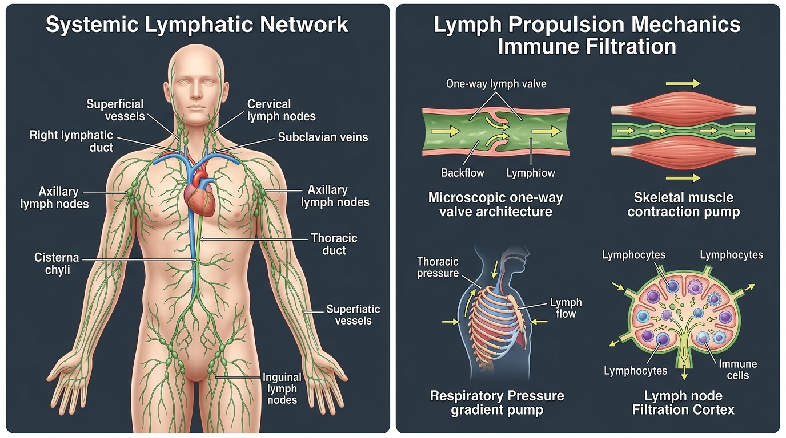

# Day 39: Lymphatic & Immune Systems: Lymphatic Vessels, Thoracic Duct & Inversion Drainage

---

## 🎯 Learning Objectives
* **Map Systemic Lymphatic Drainage Topography:** Contrast the vast drainage territory of the **Thoracic Duct** ($\approx 75\%$ of the body via the **Cisterna Chyli**) with the localized watershed of the **Right Lymphatic Duct** ($\approx 25\%$).
* **Dissect Initial Lymphatic Microarchitecture:** Detail the mechanics of endothelial microvalves, collagen **Anchoring Filaments**, and autonomous smooth-muscle **Lymphangion** contractility.
* **Master the 3 Physiological Lymph Propulsion Pumps:** Quantify the hydrodynamic propulsion generated by the **Skeletal Muscle Pump**, **Thoracoabdominal Respiratory Pump**, and **Arterial Pulsation Coupling**.
* **Differentiate Primary vs. Secondary Lymphoid Organs:** Analyze the immune filtration and surveillance architectures of the **Thymus**, **Bone Marrow**, **Spleen** (Red vs. White Pulp), **Lymph Nodes** (Cortex, Paracortex, Medulla), and **MALT/GALT**.
* **Apply Lymphatic Biomechanics to Movement Arts:** Formulate the immunological and interstitial decongestive mechanisms of **Dynamic Locomotion**, **Myofascial Shearing**, and **Inverted Postures (*Salamba Sarvangasana, Viparita Karani*)**.

---

## 🔬 1. Functional Anatomy of the Systemic Lymphatic Network

The lymphatic system is a low-pressure, one-way vascular drainage and immunological surveillance network that returns $2\text{ to }4\text{ Liters}$ of filtered interstitial fluid (lymph) back to the venous blood circulation daily.



### Systemic Drainage Territories & Terminal Duct Matrix

```
THE LYMPHATIC DRAINAGE WATERSHED DIVISIONS:

                  [HEAD & NECK]
               ┌────────┴────────┐
         (Right Side)       (Left Side)
               │                 │
         [RIGHT THORAX &    [LEFT THORAX &
          RIGHT ARM]         LEFT ARM]
               │                 │
               ▼                 │
     [RIGHT LYMPHATIC DUCT]      │
     Drains: Upper Right ~25%    │
     Empties: Right Venous Angle │
     (Junction of R. Internal    │
      Jugular & Subclavian Veins)│
                                 ▼
                         [THORACIC DUCT]
                         Drains: Entire Lower Body + Left Upper Body (~75%)
                         Origin: Cisterna Chyli (L1–L2 anterior to spine)
                         Empties: Left Venous Angle (L. Int. Jugular & Subclavian)
                                 ▲
               ┌─────────────────┴─────────────────┐
               │                                   │
      [Abdomen & Viscera]                [Bilateral Lower Limbs]
```

### Anatomical Drainage Territory Comparison

| Lymphatic Duct / Trunk | Anatomical Origin & Pathway | Drainage Territory | Terminal Venous Outlet |
| :--- | :--- | :--- | :--- |
| **Thoracic Duct (Left)** | Begins at **Cisterna Chyli** ($L_1\text{–}L_2$); ascends through aortic hiatus ($T_{12}$), crosses from right to left at $T_5$, arches over subclavian artery | **Both lower extremities**, pelvis, abdomen, left thoracic wall, left upper extremity, left head and neck ($\approx 75\%$ of body) | **Left Venous Angle** (Junction of Left Internal Jugular and Left Subclavian Veins) |
| **Right Lymphatic Duct** | Formed by convergence of right jugular, subclavian, and bronchomediastinal trunks ($\approx 1\text{–}2\text{ cm}$ long) | **Right side of head and neck**, right upper extremity, right hemithorax, and right lung/heart ($\approx 25\%$ of body) | **Right Venous Angle** (Junction of Right Internal Jugular and Right Subclavian Veins) |
| **Cisterna Chyli** | Dilated saccular reservoir ($5\text{–}7\text{ cm}$ long) anterior to $L_1\text{–}L_2$ bodies, between right crus of diaphragm and aorta | Receives fatty chyle from **Intestinal Trunk** and clear lymph from **Right/Left Lumbar Trunks** | Confluent origin of the Thoracic Duct |

---

## ⚙️ 2. Microarchitecture of Lymph Vessels & Lymphangions

Unlike the closed cardiovascular circuit driven by a central heart, the lymphatic system begins blindly as microscopic **Initial Lymphatic Capillaries** within the interstitial spaces.

```
INITIAL LYMPHATICS & LYMPHANGION ARCHITECTURE:

[Interstitial Space] ──► Increased Fluid Pressure / Edema
                                │
                                ▼
Tensions Collagen ANCHORING FILAMENTS attached to surrounding extracellular matrix
                                │
                                ▼
Pulls overlapping Endothelial Flap Valves OPEN ──► Interstitial Fluid enters Lumen
                                │
                                ▼
               [Collecting Lymphatic Vessel]
  ┌────────────────────────────────────────────────────────┐
  │ [One-Way Bicuspid Valve] ──► [LYMPHANGION CHAMBER] ──► │ [One-Way Bicuspid Valve]
  │ (Smooth muscle walls contract rhythmically @ 6-10 bpm) │
  └────────────────────────────────────────────────────────┘
```

### Cellular & Tissue Components
* **Initial Capillaries:** Lack pericytes and continuous basement membranes; consist of single-layer endothelial cells with overlapping edges forming **Primary Microvalves**.
* **Anchoring Filaments:** High-strength fibrillin and collagen fibrils tethered from endothelial cells into the extracellular matrix. When tissue swells with interstitial fluid, tension on anchoring filaments physically pulls the microvalves open.
* **Lymphangions (The Micro-Hearts):** The functional segment between two consecutive one-way bicuspid valves in collecting vessels. Endothelial shear and stretch trigger intrinsic myogenic contractions ($6\text{–}10\text{ bpm}$) mediated by autonomous pacemakers.

---

## 🛡️ 3. Primary vs. Secondary Lymphoid Organs & Node Filtration

```
LYMPH NODE INTERNAL FILTRATION ZONATION:

                   [Afferent Lymphatic Vessels]
                                │
                                ▼
                    [Subcapsular Sinus]
                                │
                                ▼
[CORTEX] ─────────────────► B-Cell Follicles & Germinal Centers
                                │
                                ▼
[PARACORTEX] ─────────────► T-Cell Zone & High Endothelial Venules (HEVs)
                                │
                                ▼
[MEDULLA] ────────────────► Medullary Cords (Plasma cells, Macrophages) & Sinuses
                                │
                                ▼
                   [Efferent Lymphatic Vessel] (Exits via Hilum)
```

### Lymphoid Organ Comparison Matrix

| Lymphoid Organ | Classification | Microscopic Compartments | Immunological Function |
| :--- | :--- | :--- | :--- |
| **Bone Marrow** | Primary Lymphoid | Trabecular bone spaces, hematopoietic stem cell niches | Site of all leukocyte genesis; **B-Cell maturation and selection** |
| **Thymus** | Primary Lymphoid | Cortex (positive selection) & Medulla (negative selection) | **T-Cell maturation, education**, and elimination of self-reactive clones (involutes after puberty) |
| **Lymph Nodes** | Secondary Lymphoid | Cortex (B cells), Paracortex (T cells), Medulla (plasma cells) | Filters foreign particulate matter and antigens from lymph; initiates adaptive immune responses |
| **Spleen** | Secondary Lymphoid | **Red Pulp** (sinusoids & cords of Billroth) & **White Pulp** (PALS & lymphoid follicles) | Red pulp destroys aged erythrocytes; white pulp filters blood-borne pathogens |
| **MALT / GALT** | Secondary Lymphoid | Peyer’s patches (ileum), tonsils, adenoids, appendix | Mucosal surface defense; secretes protective Secretory $IgA$ |

---

## ⚡ 4. The 3 Extrinsic Lymph Propulsion Engines

Because lymphatic vessels lack a centralized high-pressure cardiac pump, fluid return relies fundamentally on extrinsic biomechanical forces:

1. **The Skeletal Muscle Pump:**
   * Alternating contraction and relaxation of skeletal muscles (e.g., *Gastrocnemius, Soleus, Quadriceps*) compresses deep collecting lymphatics.
   * Internal one-way bicuspid valves ensure that extrinsic compression forces lymph strictly forward toward the central venous angles.
2. **The Thoracoabdominal Respiratory Pump:**
   * During **Diaphragmatic Inhalation**, the diaphragm descends, increasing intra-abdominal pressure ($+IAP$) while creating negative intrathoracic pressure ($-P_{pl} \approx -8\text{ mmHg}$).
   * This pressure differential mechanically squeezes the **Cisterna Chyli** and aspirates lymph upward through the thoracic duct into the thoracic cavity.
3. **Arterial Pulsation Coupling:**
   * Deep collecting lymphatic trunks are enveloped within common neurovascular sheaths alongside major arteries (e.g., femoral, brachial, carotid). Systolic expansion of the artery cyclically compresses the adjacent lymphatic vessel.

---

## 🧘 5. Movement Applications: Inversions, Locomotion & Immune Modulation

### Inverted Postures & Interstitial Fluid Dynamics
* **Passive Gravitational Hydrostatic Drainage (*Salamba Sarvangasana, Viparita Karani*):**
  * In standing, hydrostatic pressure in the feet reaches $+100\text{ mmHg}$, promoting interstitial transudation.
  * Inversions reverse this hydrostatic column, instantly reducing venous and lymphatic capillary pressure in the lower limbs to near $0\text{ mmHg}$.
  * This facilitates rapid reabsorption of interstitial edema into initial lymphatics and accelerates central lymph transport into the Thoracic Duct without metabolic muscular fatigue.

### Exercise Immunology & The "J-Curve" Model
* **Moderate Dynamic Locomotion (Crawling, Skipping, Primal Flow):**
  * Mobilizes natural killer (NK) cells, neutrophils, and circulating $T\text{-lymphocytes}$ via catecholamine release and shear stress, enhancing immune surveillance.
* **The "J-Curve" of Exercise Stress:**
  * **Sedentary:** Moderate infection risk.
  * **Regular Moderate Exercise:** **Lowest infection risk** (optimized immune surveillance and lymphatic turnover).
  * **Chronic Overtraining / Exhaustive Calisthenics:** **Elevated infection risk** due to sustained cortisol elevation, secretory $IgA$ suppression, and transient post-exercise immunosuppression ("open window").

---

## 🧪 6. Desk-Side Tactile Biomechanics Lab

### Experiment 1: The Diaphragmatic Cisterna Chyli Lymphatic Flush
1. Sit comfortably with a tall spine, or lie supine on your back.
2. Place one hand on your upper chest and one hand over your navel.
3. Perform 10 deep, slow diaphragmatic breaths with a 4-second inhalation, a 2-second hold, and a prolonged 6-second exhalation.
4. Focus on feeling the deep expansion of your lower abdomen and the gentle vacuum effect inside your chest during the exhalation phase.
5. *Biomechanics Explanation:* Deep diaphragmatic excursions create cyclic $\Delta P$ between the abdominal and thoracic cavities, actively pumping the **Cisterna Chyli** and propelling lymph through the **Thoracic Duct** into the subclavian vein.

### Experiment 2: The Calcaneal-Soleus Rebound Pump
1. Stand barefoot on a flat surface.
2. Perform 30 rapid, rhythmic calf raises, pushing firmly through the first two metatarsal heads, followed by gentle, rhythmic heel-drops onto the floor.
3. Notice the immediate reduction in foot heaviness and sensation of circulatory lightness.
4. *Biomechanics Explanation:* You have engaged the **Soleus Skeletal Muscle Pump**, forcing interstitial fluid into deep collecting lymphatics and propelling venous return against gravity.

---

## 📚 7. Anatomical Cross-References
* **Venous Circulatory Outlets:** [Day 36: Cardiovascular System](../day-036-cardiovascular-system/README.md).
* **Thoracoabdominal Pump Engine:** [Day 32: Respiration Biomechanics & IAP](../day-032-respiration-iap/README.md).
* **Deep Fascial Channels:** [Day 31: Fascial Lines & Myofascial Meridians](../day-031-fascial-lines/README.md).

---

## 📝 8. Daily Knowledge Retrieval Quiz

<details>
<summary><b>1. Differentiate the drainage territory of the Thoracic Duct from that of the Right Lymphatic Duct. Where do they each empty into the venous system?</b></summary>
<b>Answer:</b> 
• <b>Thoracic Duct:</b> Drains $\approx 75\%$ of the body (both lower extremities, pelvis, abdomen, left hemithorax, left upper limb, and left side of head and neck). It originates at the <b>Cisterna Chyli</b> ($L_1\text{–}L_2$) and empties into the <b>Left Venous Angle</b> (junction of the Left Internal Jugular and Left Subclavian Veins).
<br>
• <b>Right Lymphatic Duct:</b> Drains $\approx 25\%$ of the body (right side of head and neck, right upper limb, right hemithorax, and right lung/heart). It empties into the <b>Right Venous Angle</b> (junction of the Right Internal Jugular and Right Subclavian Veins).
</details>

<details>
<summary><b>2. How do Anchoring Filaments in initial lymphatic capillaries function during localized tissue edema?</b></summary>
<b>Answer:</b> 
Anchoring filaments (composed of collagen and fibrillin) mechanically connect the outer surfaces of lymphatic endothelial cells to the surrounding extracellular collagen matrix. When interstitial fluid volume increases (edema), the expanding interstitial matrix pulls taut on these anchoring filaments. This physically tugs the overlapping endothelial microvalves open, allowing high volumes of interstitial fluid, proteins, and cellular debris to rush into the lymphatic capillary lumen.
</details>

<details>
<summary><b>3. Explain how the Thoracoabdominal Respiratory Pump drives lymph upward through the Thoracic Duct.</b></summary>
<b>Answer:</b> 
During diaphragmatic inhalation, the diaphragm contracts and descends. This concurrently:
1. Increases <b>Intra-Abdominal Pressure ($+IAP$)</b>, mechanically compressing the Cisterna Chyli and abdominal lymph trunks.
2. Decreases <b>Intrathoracic Pressure ($-P_{pl}$)</b>, expanding the thoracic duct and creating a vacuum suction effect.
Because one-way valves prevent retrograde flow, this pressure gradient rapidly aspirates lymph upward from the abdominal reservoir into the thoracic duct.
</details>

<details>
<summary><b>4. Differentiate the anatomical structure and function of the Red Pulp versus the White Pulp of the Spleen.</b></summary>
<b>Answer:</b> 
• <b>Red Pulp:</b> Consists of splenic cords (Cords of Billroth) and venous sinusoids lined with macrophages. Its primary function is <b>mechanical filtration and phagocytic destruction of old, damaged, or malformed erythrocytes</b> and platelets.
<br>
• <b>White Pulp:</b> Consists of lymphoid tissue organized into the Periarteriolar Lymphoid Sheaths (PALS, rich in T-cells) and lymphoid follicles (rich in B-cells). Its primary function is <b>immunological surveillance and antigen presentation for blood-borne pathogens</b>.
</details>

<details>
<summary><b>5. Why is prolonged legs-up-the-wall posture (Viparita Karani) clinically and biomechanically effective for resolving lower extremity interstitial pooling?</b></summary>
<b>Answer:</b> 
In standing or seated postures, the hydrostatic column produces a $+80\text{ to }+100\text{ mmHg}$ pressure at the foot, impeding microvascular filtration reabsorption. Inverting the limbs in <i>Viparita Karani</i> removes this gravitational hydrostatic pressure, dropping venous and lymphatic pressures in the lower limbs to near zero. Gravitational gradient passively accelerates lymph flow through one-way bicuspid valves into the deep inguinal nodes and cisterna chyli without requiring active muscular metabolic expenditure or causing joint fatigue.
</details>
