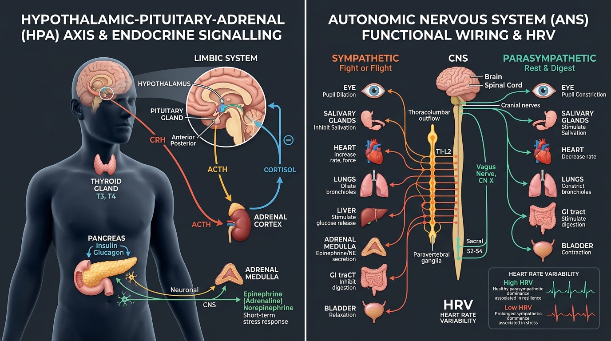

# Day 40: Endocrine & Nervous Systems Integration & Module 6 Comprehensive Systemic Assessment

---

## 🎯 Learning Objectives
* **Map Neuroendocrine Axis Architecture:** Detail the signaling pathways of the **Hypothalamic-Pituitary-Adrenal (HPA) Axis**, the **Hypothalamic-Pituitary-Thyroid (HPT) Axis**, and the endocrine pancreas (Insulin vs. Glucagon).
* **Dissect Autonomic Nervous System (ANS) Functional Wiring:** Contrast the **Sympathetic (Thoracolumbar $T_1\text{–}L_2$)** and **Parasympathetic (Craniosacral $CN\text{ III, VII, IX, X}$ & $S_2\text{–}S_4$)** nervous systems, including pre/postganglionic neurotransmitters and receptor distributions.
* **Master Vagal Neurobiology & Heart Rate Variability (HRV):** Quantify the role of the **Vagus Nerve ($CN\text{ X}$)** as the primary biological parasympathetic brake and interpret **HRV metrics (RMSSD, SDNN)** as real-time indicators of systemic recovery and autonomic flexibility.
* **Integrate Stress Physiology into Movement Modalities:** Contrast the neuroendocrine state required for maximal **Calisthenics Neural Priming (SAM Axis Activation)** with restorative down-regulation practices (**Pranayama, Savasana, Yoga Nidra**).
* **Complete Module 6 Board-Style Synthesis Examination:** Validate complete mastery across Days 36–40 with a rigorous 10-question board-style systemic examination.

---

## 🔬 1. Functional Anatomy of the Neuroendocrine System

The neuroendocrine system bridges high-speed electrical neuronal communication with prolonged, distributed chemical hormonal regulation.



### The Master Neuroendocrine Axes

```
THE HYPOTHALAMIC-PITUITARY-ADRENAL (HPA) AXIS:

                 [Psychological / Biomechanical Stress]
                                   │
                                   ▼
                           [HYPOTHALAMUS]
             Secretes: Corticotropin-Releasing Hormone (CRH)
                                   │
                                   ▼ (Hypophyseal Portal System)
                        [ANTERIOR PITUITARY]
             Secretes: Adrenocorticotropic Hormone (ACTH)
                                   │
                                   ▼ (Systemic Arterial Circulation)
                         [ADRENAL CORTEX]
             Secretes: CORTISOL (Zona Fasciculata)
                                   │
    ┌──────────────────────────────┴──────────────────────────────┐
    ▼                                                             ▼
[Systemic Stress Response]                              [Negative Feedback Loop]
• Gluconeogenesis (Liver)                               • High Cortisol inhibits CRH
• Lipolysis & Proteolysis (Energy mobilization)           release at Hypothalamus
• Transient Anti-Inflammatory & Immunosuppression       • Inhibits ACTH at Pituitary
```

### Major Endocrine Glands & Hormonal Actions Matrix

| Endocrine Gland | Functional Zonation / Cells | Hormones Produced | Primary Target & Movement Significance |
| :--- | :--- | :--- | :--- |
| **Hypothalamus** | Paraventricular, Supraoptic, and Arcuate Nuclei | **CRH, TRH, GnRH, GHRH** (Releasing Hormones); **Oxytocin, ADH** (Synthesized) | Master regulator of neuroendocrine homeostasis and circadian rhythms |
| **Anterior Pituitary (Adenohypophysis)** | Somatotrophs, Corticotrophs, Thyrotrophs | **Growth Hormone (GH)**, **ACTH**, **TSH**, **LH/FSH**, **Prolactin** | GH stimulates hepatic IGF-1 release for myofibrillar repair and collagen synthesis |
| **Posterior Pituitary (Neurohypophysis)** | Axon terminals from hypothalamic nuclei | **Antidiuretic Hormone (ADH / Vasopressin)**, **Oxytocin** | ADH regulates renal water retention and blood volume during sweat-heavy training |
| **Adrenal Cortex** | **Zona Glomerulosa**<br>**Zona Fasciculata**<br>**Zona Reticularis** | **Aldosterone** (Mineralocorticoid)<br>**Cortisol** (Glucocorticoid)<br>**DHEA / Androgens** | Aldosterone regulates $Na^+/K^+$ fluid balance; Cortisol mobilizes glucose and catabolizes amino acids under chronic stress |
| **Adrenal Medulla** | Modified postganglionic sympathetic **Chromaffin Cells** | **Epinephrine ($80\%$)** & **Norepinephrine ($20\%$)** | Elicits instant systemic "Fight-or-Flight" response: bronchodilation, tachycardia, glycogenolysis |
| **Thyroid Gland** | Follicular Cells & Parafollicular (C) Cells | **Thyroxine ($T_4$)**, **Triiodothyronine ($T_3$)**, **Calcitonin** | Regulates basal metabolic rate, mitochondrial ATP synthesis, and protein turnover |
| **Endocrine Pancreas** | **$\beta\text{-Cells}$** ($70\%$) & **$\alpha\text{-Cells}$** ($20\%$) | **Insulin** ($\beta$) & **Glucagon** ($\alpha$) | Insulin drives cellular glucose uptake and glycogen synthesis; Glucagon stimulates hepatic glycogenolysis |

---

## ⚡ 2. Functional Neuroanatomy of the Autonomic Nervous System (ANS)

The ANS operates involuntarily to maintain internal visceral homeostasis through two physiologically antagonistic divisions:

```
AUTONOMIC NEUROTRANSMITTER & WIRING MATRIX:

1. SYMPATHETIC DIVISION (Thoracolumbar Outflow T1–L2)
   [CNS: Intermediolateral Cell Column T1–L2]
              │ (Short Preganglionic Axon - Myelinated)
              ▼
   [Releases Acetylcholine (ACh) ──► Nicotinic Receptor]
              │
              ▼ [Paravertebral / Prevertebral Sympathetic Ganglion]
              │ (Long Postganglionic Axon - Unmyelinated)
              ▼
   [Releases NOREPINEPHRINE (NE) ──► Adrenergic Receptors: α1, α2, β1, β2, β3]
   (Exception: Adrenal Medulla receives preganglionic fibers directly to release Epinephrine into blood)

2. PARASYMPATHETIC DIVISION (Craniosacral Outflow CN III, VII, IX, X & S2–S4)
   [CNS: Brainstem Nuclei & Sacral Spinal Cord S2–S4]
              │ (Long Preganglionic Axon - Myelinated)
              ▼
   [Releases Acetylcholine (ACh) ──► Nicotinic Receptor]
              │
              ▼ [Terminal / Intramural Ganglia located directly ON or IN target organ]
              │ (Short Postganglionic Axon - Unmyelinated)
              ▼
   [Releases ACETYLCHOLINE (ACh) ──► Muscarinic Receptors: M1, M2, M3, M4, M5]
```

### Sympathetic vs. Parasympathetic Visceral Effector Matrix

| Target Organ / Tissue | Sympathetic Action (Fight-or-Flight / $\text{NE}$) | Receptor Type | Parasympathetic Action (Rest-and-Digest / $\text{ACh}$) | Receptor Type |
| :--- | :--- | :--- | :--- | :--- |
| **Heart (SA Node / Ventricles)** | $\uparrow$ Heart Rate ($\text{Chronotropy}$), $\uparrow$ Contractility ($\text{Inotropy}$) | $\beta_1$ | $\downarrow$ Heart Rate (Vagal Brake), $\downarrow$ Atrial contractility | $M_2$ |
| **Lungs (Bronchioles)** | **Bronchodilation** (expands airflow capacity) | $\beta_2$ | **Bronchoconstriction**, $\uparrow$ mucus secretion | $M_3$ |
| **Systemic Arterioles (Skin/Viscera)** | **Vasoconstriction** (shunts blood to muscle) | $\alpha_1$ | Minimal innervation (passive dilation) | — |
| **Coronary & Skeletal Arterioles** | **Vasodilation** (during exercise via adrenaline) | $\beta_2$ / local | Minimal | — |
| **Digestive Tract (Motility & Secretions)** | $\downarrow$ Peristalsis, constricts sphincters | $\alpha_1, \beta_2$ | $\uparrow$ Peristalsis, relaxes sphincters, $\uparrow$ secretions | $M_3$ |
| **Liver** | $\uparrow$ Glycogenolysis & Gluconeogenesis | $\alpha_1, \beta_2$ | Glycogen synthesis | — |
| **Pupil of Eye (Iris)** | **Mydriasis** (Pupil dilation via radial muscle) | $\alpha_1$ | **Miosis** (Pupil constriction via sphincter muscle) | $M_3$ |

---

## 📈 3. Vagal Tone & Heart Rate Variability (HRV)

The **Vagus Nerve (Cranial Nerve X)** carries $\approx 75\%$ of all parasympathetic efferent traffic in the body.

```
THE VAGAL BRAKE & RESPIRATORY SINUS ARRHYTHMIA (RSA):

[INHALATION (Sympathetic Phase)]
Diaphragm descends ──► Chest expands ──► Venous return momentarily drops ──►
SA Node Vagal Brake is TRANSIENTLY RELEASED ──► Heart Rate accelerates (Inter-beat interval shortens).

[EXHALATION (Parasympathetic Phase)]
Diaphragm relaxes ──► Thoracic volume decreases ──► Baroreceptor and pulmonary stretch ──►
VAGAL BRAKE APPLIED via Acetylcholine on M2 receptors ──► Heart Rate decelerates (Inter-beat interval lengthens).
```

### Heart Rate Variability (HRV) Biomarkers
* **Definition:** HRV measures the microscopic variation in time (milliseconds) between consecutive R-peaks of the QRS complex on an electrocardiogram (the **R-R interval**).
* **High HRV (Elevated RMSSD & High-Frequency Power):** Indicates high vagal tone, rapid autonomic adaptability, systemic recovery, and readiness for high-intensity training.
* **Low HRV (Depressed RMSSD):** Reflects prolonged sympathetic dominance, incomplete CNS recovery, accumulated tissue inflammation, or chronic psychological stress.

---

## 🧘 4. Movement Applications: High-Arousal Priming vs. Parasympathetic Recovery

### Calisthenics Neural Priming (The SAM Axis)
* **Pre-Max Isometric Lift (Planche / Iron Cross / 1RM):**
  * The athlete intentionally evokes a high-arousal sympathetic state via explosive breathing, visualization, and whole-body muscle irradiation.
  * **Physiological Cascade:** Sharp surge in **Epinephrine and Norepinephrine** accelerates nerve conduction velocity ($Q_{10}$), opens skeletal muscle capillary beds ($\beta_2$), elevates motor unit recruitment threshold, and sharpens visual focus.

### Restorative Down-Regulation (Pranayama, Savasana, Yoga Nidra)
* **Post-Training Recovery & Supercompensation:**
  * Muscular hypertrophy and neuromuscular repair only occur during parasympathetic dominance, when cortisol levels decline and Growth Hormone, Insulin, and Testosterone facilitate cellular protein synthesis.
* **The "Physiological Sigh" (Huberman / Vagal Reset):**
  * **Technique:** Two rapid consecutive nasal inhalations (the second inhale maximally re-inflating collapsed alveoli) followed by an extended, passive mouth exhalation ($2\times$ longer than the inhale).
  * **Biomechanical Result:** The prolonged exhalation increases intrathoracic pressure and activates the cardiac baroreflex, causing instant acetylcholine release from the vagus nerve to decelerate heart rate and down-regulate CNS arousal within seconds.

---

## 🧪 5. Desk-Side Tactile Biomechanics Lab

### Experiment 1: The Physiological Sigh & Vagal Reset Drill
1. Sit comfortably with your spine supported. Place your index and middle fingers on your radial artery to feel your pulse.
2. Inhale deeply through your nose to $80\%$ capacity, pause for a fraction of a second, and "top off" your lungs with a second sharp nasal sniff to $100\%$ capacity (re-opening collapsed alveoli).
3. Open your mouth and exhale very slowly, smoothly, and completely until empty ($6\text{–}8\text{ seconds}$).
4. Repeat this cycle 3 times while monitoring your radial pulse.
5. *Observation:* Feel the immediate physical slowing of your pulse rate during the prolonged exhalation phase, accompanied by a drop in shoulder girdle muscle tension.
6. *Biomechanics Explanation:* The prolonged exhalation mechanically increases intrathoracic pressure, activating the **Vagal Brake** on the SA node.

### Experiment 2: The Cold Water Oculocardiac / Dive Reflex Test
1. Check your baseline resting heart rate.
2. Fill a bowl with cold water ($10\text{–}15^\circ\text{C}$).
3. Take a calm breath in, submerge your face (specifically the forehead and ophthalmic area of the Trigeminal Nerve $CN\text{ V}$) for 15–20 seconds while holding your breath.
4. Immediately palpate your pulse upon lifting your face.
5. *Observation:* Notice an abrupt, marked bradycardia (heart rate drops by $15\text{–}30\text{ bpm}$).
6. *Biomechanics Explanation:* Cold water stimulation of the trigeminal afferents coupled with apnea triggers the **Mammalian Dive Reflex**, sending monosynaptic signals to the Vagus nucleus to instantly decelerate cardiac pacing and conserve oxygen.

---

## 📚 6. Anatomical Cross-References
* **Cardiovascular Pacing:** [Day 36: Cardiovascular System](../day-036-cardiovascular-system/README.md).
* **Respiratory Mechanics:** [Day 37: Respiratory System](../day-037-respiratory-system/README.md).
* **Enteric-Autonomic Axis:** [Day 38: Digestive System](../day-038-digestive-system/README.md).
* **Lymphatic Pumping:** [Day 39: Lymphatic & Immune Systems](../day-039-lymphatic-immune-systems/README.md).

---

## 🏆 7. Module 6 Board-Style Synthesis Examination

Validate your complete mastery of cardiovascular, respiratory, digestive, lymphatic, endocrine, and autonomic neurobiology across Module 6.

---

### Question 1 (Cardiac Cycle & Inversion Hemodynamics)
Explain how the Frank-Starling Law of the Heart operates during a sustained Headstand (*Salamba Shirshasana*). Contrast this with the left ventricular afterload experienced during a maximal-effort Planche hold.

<details>
<summary><b>View Board Answer & Rationale</b></summary>
<b>Answer:</b> 
<br>
• <b>Headstand (Inversion Hemodynamics):</b> Inversion eliminates the dependent hydrostatic venous column, rapidly draining $500\text{–}1000\text{ mL}$ of blood from the lower extremities into the central venous reservoir. This surges <b>Venous Return</b> and raises Left Ventricular <b>End-Diastolic Volume (EDV / Preload)</b>. In accordance with the <b>Frank-Starling Mechanism</b>, increased myocyte stretch enhances actin-myosin calcium sensitivity, automatically increasing <b>Stroke Volume ($SV$)</b> without requiring higher heart rates.
<br>
• <b>Planche (Isometric Afterload):</b> High-tension isometric upper-body contraction ($>80\%$ MVC) mechanically compresses intramuscular arterioles, activating the <b>Exercise Pressor Reflex</b>. This causes massive sympathetic peripheral vasoconstriction, driving <b>Total Peripheral Resistance ($TPR$)</b> and Mean Arterial Pressure ($MAP$) to extreme levels. The Left Ventricle faces a severe <b>Afterload</b> challenge (pressure overload), requiring high peak systolic wall tension to open the aortic valve.
</details>

---

### Question 2 (Vascular Physics & Poiseuille’s Law)
State Poiseuille’s Law of Resistance and explain why a minor reduction in arteriolar diameter produces profound shifts in local muscle blood flow during exercise.

<details>
<summary><b>View Board Answer & Rationale</b></summary>
<b>Answer:</b> 
<br>
$$R = \frac{8\eta L}{\pi r^4} \implies R \propto \frac{1}{r^4}$$
Vascular resistance ($R$) is inversely proportional to the <b>fourth power of vessel radius ($r$)</b>. Because of this exponential relationship:
• If an arteriolar radius is reduced by $50\%$ through sympathetic $\alpha_1$-adrenergic vasoconstriction, resistance increases by $2^4 = \mathbf{16\times}$, virtually shutting off perfusion to non-essential tissues (e.g., gut viscera).
• Conversely, local metabolic vasodilation ($\uparrow$ adenosine, $H^+$, $K^+$, nitric oxide) in actively contracting muscles increases arteriolar radius, causing a massive local surge in capillary perfusion (functional active hyperemia).
</details>

---

### Question 3 (Pulmonary Surfactant & The Law of Laplace)
Using the Law of Laplace ($\Delta P = \frac{2T}{r}$), explain how pulmonary surfactant secreted by Type II pneumocytes prevents the collapse of smaller alveoli into larger ones.

<details>
<summary><b>View Board Answer & Rationale</b></summary>
<b>Answer:</b> 
<br>
According to Laplace's Law, if surface tension ($T$) were constant, smaller alveoli (smaller radius $r$) would generate a much higher inward collapsing pressure ($\Delta P$) than larger alveoli, causing smaller alveoli to empty their gas into larger ones (progressive atelectasis). 
<br>
<b>Type II Pneumocytes</b> secrete <b>Pulmonary Surfactant</b> (phospholipids and proteins). As an alveolus deflates during exhalation and its surface area decreases, surfactant molecules become tightly packed together at the air-water interface, dramatically reducing surface tension ($T$). Consequently, the ratio $\frac{2T}{r}$ remains equalized across alveoli of varying diameters, stabilizing the small alveoli and preventing alveolar collapse.
</details>

---

### Question 4 (Spirometry & The Bohr Effect)
Differentiate Residual Volume ($RV$) from Functional Residual Capacity ($FRC$). What four biochemical factors induce a right-shift in the Oxyhemoglobin Dissociation Curve during heavy calisthenics?

<details>
<summary><b>View Board Answer & Rationale</b></summary>
<b>Answer:</b> 
<br>
• <b>Residual Volume ($RV$):</b> The volume of air remaining in the lungs after a maximal forced exhalation ($\approx 1.2\text{ L}$); it cannot be voluntarily exhaled and prevents alveolar collapse.
<br>
• <b>Functional Residual Capacity ($FRC$):</b> The volume remaining in the lungs at the end of a normal, passive tidal exhalation ($FRC = ERV + RV \approx 2.3\text{ L}$). It represents the resting elastic equilibrium of the respiratory system.
<br>
• <b>Bohr Effect Right-Shift Factors:</b>
1. <b>$\uparrow PaCO_2$</b> (Elevated partial pressure of carbon dioxide).
2. <b>$\downarrow \text{pH} / \uparrow H^+$</b> (Metabolic / lactic acidosis).
3. <b>$\uparrow \text{Temperature}$</b> (Hyperthermia from working muscles).
4. <b>$\uparrow \text{2,3-BPG}$</b> (2,3-Bisphosphoglycerate).
<br>
<i>Result:</i> Reduces hemoglobin's oxygen affinity, promoting rapid $O_2$ offloading to working myocytes.
</details>

---

### Question 5 (Enteric Nervous Plexuses & Splanchnic Hypoperfusion)
Compare the anatomical location and primary functions of the Myenteric (Auerbach’s) vs. Submucosal (Meissner’s) plexuses. Explain why training immediately after a heavy meal impairs both digestion and athletic power.

<details>
<summary><b>View Board Answer & Rationale</b></summary>
<b>Answer:</b> 
<br>
• <b>Myenteric (Auerbach’s) Plexus:</b> Located between the outer longitudinal and middle circular smooth muscle layers of the muscularis externa; controls <b>gastrointestinal motility and peristalsis</b>.
<br>
• <b>Submucosal (Meissner’s) Plexus:</b> Located in the submucosa; regulates <b>local glandular secretions, absorption, and submucosal blood flow</b>.
<br>
• <b>Postprandial Training Conflict:</b> Digestion requires parasympathetic dominance and high splanchnic blood flow ($1.5\text{ L/min}$). Intense exercise demands massive sympathetic outflow, triggering $\alpha_1$-adrenergic vasoconstriction that shunts up to $85\%$ of blood away from the gut to active muscles. This causes acute gastrointestinal ischemia, cramps, nausea, while simultaneously blunting muscular force output due to divided autonomic drive.
</details>

---

### Question 6 (Visceral Ligaments & Asana Mobility)
Detail the anatomical attachments and mechanical function of the Falciform Ligament and the Suspensory Ligament of Treitz. How do deep spinal twists (*Ardha Matsyendrasana*) mechanically stimulate mesenteric circulation?

<details>
<summary><b>View Board Answer & Rationale</b></summary>
<b>Answer:</b> 
<br>
• <b>Falciform Ligament:</b> Connects the anterior surface of the liver to the anterior abdominal wall and diaphragm, mechanically coupling liver excursion directly to diaphragmatic respiration.
<br>
• <b>Ligament of Treitz:</b> Connects the right crus of the diaphragm to the duodenojejunal flexure; contracting the diaphragm widens this junctional angle to facilitate chyme passage.
<br>
• <b>Mesenteric Twisting Mechanics:</b> In deep rotational asanas, asymmetrical compressive forces physically wring out the mesenteric vascular beds and portal venous system (the "sponge effect"). Upon releasing the twist, reactive hyperemia flushes oxygenated arterial blood through the mesenteric arcade and relieves venous pooling.
</details>

---

### Question 7 (Lymphatic Watersheds & Lymphangion Mechanics)
Contrast the drainage watershed of the Thoracic Duct with that of the Right Lymphatic Duct. What is a Lymphangion, and how does it generate autonomous lymph flow?

<details>
<summary><b>View Board Answer & Rationale</b></summary>
<b>Answer:</b> 
<br>
• <b>Thoracic Duct:</b> Originates at the <b>Cisterna Chyli</b> ($L_1\text{–}L_2$) and drains $\approx 75\%$ of the body (both lower extremities, pelvis, abdomen, left thorax, left arm, and left head/neck) into the <b>Left Venous Angle</b>.
<br>
• <b>Right Lymphatic Duct:</b> Drains $\approx 25\%$ of the body (right head/neck, right arm, right thorax, right lung/heart) into the <b>Right Venous Angle</b>.
<br>
• <b>Lymphangion:</b> The functional muscular segment between two adjacent one-way bicuspid valves in a collecting lymphatic vessel. When filled, stretch on the smooth muscle wall activates intrinsic stretch-sensitive pacemakers, triggering rhythmic, autonomous peristaltic contractions ($6\text{–}10\text{ bpm}$) that propel lymph forward.
</details>

---

### Question 8 (Extrinsic Lymphatic Pumps & Inversions)
Identify the three extrinsic physiological pumps responsible for propelling lymph against gravity. Explain why inverted postures (*Sarvangasana*) accelerate interstitial fluid clearance.

<details>
<summary><b>View Board Answer & Rationale</b></summary>
<b>Answer:</b> 
<br>
1. <b>Skeletal Muscle Pump:</b> Rhythmic muscle contractions compress deep lymphatic vessels against one-way valves.
2. <b>Thoracoabdominal Respiratory Pump:</b> Diaphragmatic descent simultaneously increases intra-abdominal pressure ($+IAP$) to squeeze the Cisterna Chyli and creates negative intrathoracic pressure ($-P_{pl}$) to aspirate lymph into the Thoracic Duct.
3. <b>Arterial Pulsation Coupling:</b> Systolic expansion of adjacent major arteries in shared neurovascular sheaths cyclically compresses lymphatic trunks.
<br>
• <b>Inversion Clearance:</b> Inversions reverse the $+100\text{ mmHg}$ gravitational hydrostatic pressure in lower limbs, dropping venous and lymphatic pressures to near zero. Fluid drains rapidly through one-way bicuspid valves into central reservoirs without muscular metabolic fatigue.
</details>

---

### Question 9 (Neuroendocrine Stress Architecture: SAM vs. HPA Axis)
Differentiate the Sympatho-Adrenomedullary (SAM) Axis from the Hypothalamic-Pituitary-Adrenal (HPA) Axis in terms of onset time, primary signaling messengers, and biological utility in athletic training.

<details>
<summary><b>View Board Answer & Rationale</b></summary>
<b>Answer:</b> 
<br>
• <b>SAM Axis (Acute / Immediate):</b> Neural wiring via preganglionic sympathetic fibers direct to the Adrenal Medulla; releases <b>Epinephrine and Norepinephrine</b> within milliseconds. Elicits rapid tachycardia, bronchodilation, glycogen breakdown, and heightened neuromuscular responsiveness for immediate maximal physical performance.
<br>
• <b>HPA Axis (Delayed / Prolonged):</b> Hormonal cascade ($Hypothalamus \rightarrow CRH \rightarrow Pituitary \rightarrow ACTH \rightarrow Adrenal Cortex \rightarrow \mathbf{Cortisol}$) with onset in minutes to hours. Cortisol mobilizes fuel substrates (gluconeogenesis, proteolysis) and suppresses non-essential systems (digestion, reproduction, immunity). Chronic, unmanaged HPA activation leads to muscle catabolism, connective tissue degradation, and overtraining syndrome.
</details>

---

### Question 10 (Autonomic Wiring & Heart Rate Variability Neurophysiology)
Describe the anatomical pathways and neurotransmitters of the Sympathetic vs. Parasympathetic divisions. Explain the physiological meaning of elevated RMSSD in Heart Rate Variability tracking.

<details>
<summary><b>View Board Answer & Rationale</b></summary>
<b>Answer:</b> 
<br>
• <b>Sympathetic Division:</b> Thoracolumbar outflow ($T_1\text{–}L_2$). Short preganglionic fibers release <b>Acetylcholine (ACh)</b> on nicotinic receptors in paravertebral ganglia; long postganglionic fibers release <b>Norepinephrine (NE)</b> on adrenergic receptors ($\alpha_1, \alpha_2, \beta_1, \beta_2$) on effector tissues.
<br>
• <b>Parasympathetic Division:</b> Craniosacral outflow ($CN\text{ III, VII, IX, X}$ and $S_2\text{–}S_4$). Long preganglionic fibers release <b>ACh</b> on nicotinic receptors in terminal ganglia near target organs; short postganglionic fibers release <b>ACh</b> on muscarinic receptors ($M_1\text{–}M_5$).
<br>
• <b>Elevated RMSSD in HRV:</b> Root Mean Square of Successive Differences (RMSSD) quantifies beat-to-beat variance in the R-R interval, which is mediated almost exclusively by rapid parasympathetic **Vagus Nerve ($CN\text{ X}$)** firing on the SA node. An elevated RMSSD indicates a robust, active vagal brake, high parasympathetic tone, comprehensive neuromuscular recovery, and superior autonomic adaptability.
</details>
