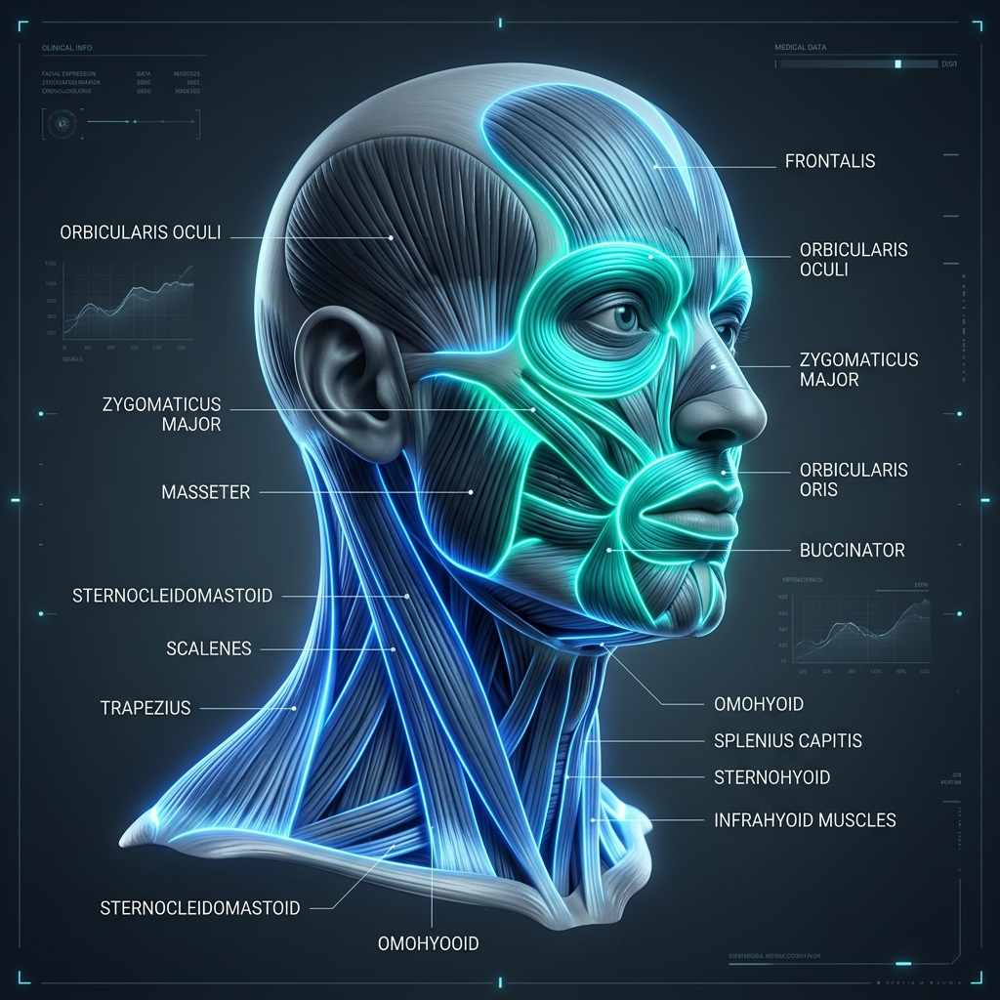

# 💀 Head, Face & Neck: Anatomy Reference

This section covers the structural classification, attachments (origins/insertions), nerve supply (innervations), and primary joint actions for the muscles of the head, face, and cervical spine.

---

## 🎨 Labeled Anatomical Illustration

---

## 1. Muscles of Facial Expression
These muscles typically originate on bone or fascia and insert into the skin or other muscles, allowing for a wide range of facial movements. All muscles of facial expression are innervated by the **Facial Nerve (CN VII)**.

| Muscle Name (Latin) | Origin | Insertion | Primary Action(s) |
| :--- | :--- | :--- | :--- |
| **Frontalis** (*Occipitofrontalis*) | Epicranial aponeurosis | Skin of eyebrows and forehead | Elevates eyebrows, wrinkles forehead skin |
| **Orbicularis Oculi** | Medial wall of orbit | Circular pathway around orbit | Closes eyelids (blinking, squinting) |
| **Zygomaticus Major** | Zygomatic bone | Corner of the mouth | Pulls corners of mouth upward (smiling) |
| **Orbicularis Oris** | Maxilla and mandible | Skin and muscle around lips | Closes and protrudes lips (puckering, kissing) |
| **Buccinator** | Alveolar processes of maxilla/mandible | Orbicularis oris | Compresses cheeks (whistling, sucking, keeps food between teeth) |
| **Platysma** | Fascia of chest (pectoralis/deltoid) | Lower border of mandible, skin of lower face | Depresses mandible, tenses skin of lower face/neck |
| **Nasalis** | Maxilla | Aponeurosis of bridge of nose | Flares nostrils, compresses nasal cartilages |

---

## 2. Muscles of Mastication (Chewing)
These muscles act on the temporomandibular joint (TMJ) to control mandibular elevation, depression, protrusion, retraction, and lateral deviation. They are all innervated by the **Mandibular branch of the Trigeminal Nerve (CN V3)**.

| Muscle Name (Latin) | Origin | Insertion | Primary Action(s) |
| :--- | :--- | :--- | :--- |
| **Masseter** | Zygomatic arch | Lateral surface of ramus/angle of mandible | Elevates mandible (closes jaw), protracts jaw |
| **Temporalis** | Temporal fossa of skull | Coronoid process of mandible | Elevates mandible, retracts mandible (posterior fibers) |
| **Medial Pterygoid** | Sphenoid, palatine, and maxilla bones | Medial surface of ramus/angle of mandible | Elevates and protracts mandible, moves jaw side-to-side |
| **Lateral Pterygoid** | Sphenoid bone (greater wing/lateral plate) | Condylar process of mandible, TMJ disc | Protracts mandible, depresses mandible, lateral deviation |

---

## 3. Anterior Neck & Hyoid Muscles
These muscles are divided into **Suprahyoid** (above the hyoid bone, which elevate it) and **Infrahyoid** (below the hyoid bone, which depress it). They are critical for swallowing, speech, and stabilizing the hyoid bone.

### Suprahyoid Muscles (Hyoid Elevators)
*   **Digastric:** Originates at mastoid notch (posterior) and mandible (anterior); inserts into hyoid bone. Elevates hyoid and depresses mandible. Innervation: CN V3 (anterior belly), CN VII (posterior belly).
*   **Mylohyoid:** Originates at mylohyoid line of mandible; inserts into hyoid. Elevates hyoid and floor of mouth. Innervation: CN V3.
*   **Geniohyoid:** Originates at mental spine of mandible; inserts into hyoid. Pulls hyoid anterosuperiorly. Innervation: C1 via Hypoglossal Nerve (CN XII).
*   **Stylohyoid:** Originates at styloid process of temporal bone; inserts into hyoid. Elevates and retracts hyoid. Innervation: CN VII.

### Infrahyoid Muscles (Hyoid Depressors)
*   **Sternohyoid:** Originates at manubrium of sternum; inserts into hyoid. Depresses hyoid. Innervation: Ansa cervicalis (C1-C3).
*   **Sternothyroid:** Originates at manubrium; inserts into thyroid cartilage. Depresses larynx and thyroid cartilage. Innervation: Ansa cervicalis (C1-C3).
*   **Thyrohyoid:** Originates at thyroid cartilage; inserts into hyoid. Depresses hyoid, elevates larynx. Innervation: C1 via CN XII.
*   **Omohyoid:** Originates at superior border of scapula; inserts into hyoid. Depresses and retracts hyoid. Innervation: Ansa cervicalis (C1-C3).

---

## 4. Lateral & Posterior Cervical Muscles
These muscles control head movements (flexion, extension, lateral bending, rotation) and stabilize the cervical spine.

| Muscle Name (Latin) | Origin | Insertion | Innervation | Primary Action(s) |
| :--- | :--- | :--- | :--- | :--- |
| **Sternocleidomastoid** (SCM) | Manubrium of sternum & clavicle | Mastoid process of temporal bone | Accessory Nerve (CN XI), C2-C3 nerves | **Bilateral:** Flexes neck. **Unilateral:** Rotates head to opposite side, laterally flexes to same side |
| **Scalenes** (*Anterior, Medius, Posterior*) | Transverse processes of C2-C7 | Ribs 1 and 2 | Anterior rami of C3-C8 | Elevate ribs 1-2 (forced inspiration), laterally flex and rotate neck |
| **Splenius Capitis** | Ligamentum nuchae, spinous processes of C7-T3 | Mastoid process & occipital bone | Posterior rami of C3-C4 | **Bilateral:** Extends head. **Unilateral:** Laterally flexes & rotates head to same side |
| **Splenius Cervicis** | Spinous processes of T3-T6 | Transverse processes of C1-C3 | Posterior rami of lower cervical nerves | **Bilateral:** Extends neck. **Unilateral:** Laterally flexes & rotates neck to same side |
| **Longus Colli & Longus Capitis** | Anterior bodies/transverse processes of C3-T3 | Anterior arch of atlas (C1), occipital bone | Anterior rami of C2-C6 | Deep cervical flexors. Flex head and neck, stabilize cervical lordosis |

---

## 🤸 Study & Practice Links
*   **[Skeletal Reference: Skull & Hyoid Bones](../../../bones/regions/01_skull_hyoid.md)**
*   **[Pose Corrections & Movement Applications](./pose_corrections.md)**
*   **[Master Muscle Directory](../../README.md)**
