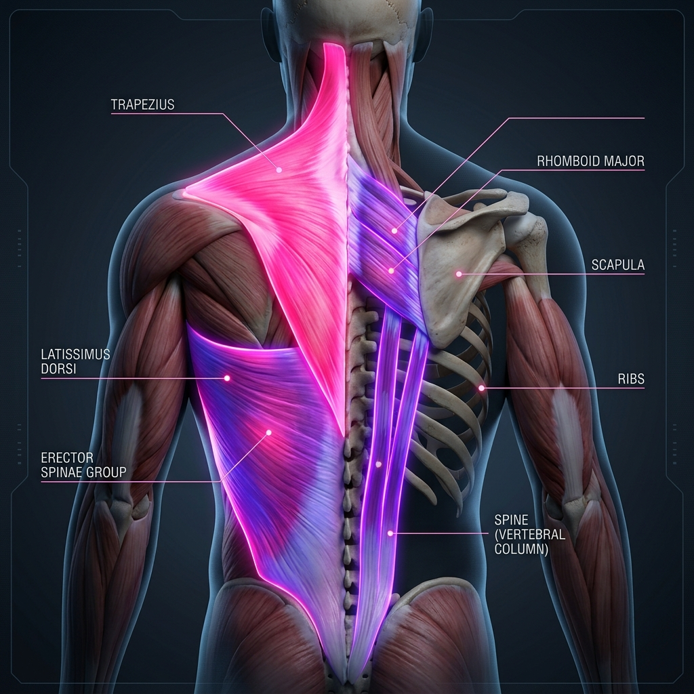

# 🦴 Muscles of the Back & Spine: Anatomy Reference

The muscles of the back are organized into three layers: superficial (which control shoulder girdle and upper limb movements), intermediate (which assist in respiration), and deep/intrinsic (which directly move and stabilize the vertebral column).

---

## 🎨 Labeled Anatomical Illustration

---

## 1. Superficial Layer (Appendicular Back Muscles)
These muscles are anatomically situated on the back but act functionally on the scapula and humerus to control shoulder movements. They are innervated by cranial and systemic brachial plexus nerves.

| Muscle Name (Latin) | Origin | Insertion | Innervation | Primary Action(s) |
| :--- | :--- | :--- | :--- | :--- |
| **Trapezius** | Occipital bone, ligamentum nuchae, spinous processes of C7-T12 | Lateral clavicle, acromion, and spine of scapula | Accessory Nerve (CN XI), proprioception C3-C4 | **Upper:** Elevates scapula. **Middle:** Retracts (adducts) scapula. **Lower:** Depresses scapula. **Upper/Lower:** Upwardly rotates scapula. |
| **Latissimus Dorsi** | Spinous processes of T7-L5, thoracolumbar fascia, iliac crest, lower ribs | Intertubercular sulcus (bicipital groove) of humerus | Thoracodorsal nerve (C6-C8) | Extends, adducts, and internally (medially) rotates the humerus |
| **Levator Scapulae** | Transverse processes of C1-C4 | Superior angle and medial border of scapula | Dorsal scapular nerve (C5), C3-C4 | Elevates scapula, downwardly rotates scapula, laterally flexes neck |
| **Rhomboid Major** | Spinous processes of T2-T5 | Medial border of scapula (below spine) | Dorsal scapular nerve (C4-C5) | Retracts scapula, downwardly rotates scapula, fixes scapula to thoracic wall |
| **Rhomboid Minor** | Ligamentum nuchae, spinous processes of C7-T1 | Medial border of scapula (at spine) | Dorsal scapular nerve (C4-C5) | Retracts scapula, downwardly rotates scapula |

---

## 2. Intermediate Layer (Respiratory Back Muscles)
These thin muscles lie underneath the superficial layer and are attached to the ribs. They are innervated by the intercostal nerves and assist in thoracic cage volume adjustments.

*   **Serratus Posterior Superior:** Originates from ligamentum nuchae and spinous processes of C7-T3; inserts into ribs 2-5. Action: Elevates ribs (assists in inspiration). Innervation: Intercostal nerves 2-5.
*   **Serratus Posterior Inferior:** Originates from spinous processes of T11-L2; inserts into ribs 9-12. Action: Depresses ribs (assists in expiration). Innervation: Intercostal nerves 9-12.

---

## 3. Deep / Intrinsic Layer (True Back Muscles)
These muscles are covered by deep fascia and are directly responsible for movements of the vertebral column and head. They are all innervated by the **posterior (dorsal) rami of spinal nerves**.

### A. Superficial Intrinsic (Splenius Muscles)
*   *Covered in Detail in [Head, Face & Neck Anatomy](../01_head_neck_face/anatomy.md)*. Splenius Capitis and Splenius Cervicis run from the spine up to the skull/upper cervical vertebrae, extending and rotating the head.

### B. Intermediate Intrinsic: Erector Spinae Group
The **Erector Spinae** runs vertically along the spine, divided into three columns (lateral to medial: Iliocostalis, Longissimus, Spinalis). 
*   **Bilateral Action:** Extends the vertebral column and head (keeps spine upright).
*   **Unilateral Action:** Laterally flexes (bends sideways) the vertebral column.

| Column | Muscle (Latin) | Key Attachments |
| :--- | :--- | :--- |
| **Lateral Column** | **Iliocostalis** (*Lumborum, Thoracis, Cervicis*) | Common origin (iliac crest, sacrum) to ribs and transverse processes of lower cervical vertebrae |
| **Middle Column** | **Longissimus** (*Thoracis, Cervicis, Capitis*) | Common origin to transverse processes of thoracic/cervical vertebrae, ribs, and mastoid process |
| **Medial Column** | **Spinalis** (*Thoracis, Cervicis, Capitis*) | Spinous processes of upper lumbar/thoracic vertebrae to spinous processes of upper thoracic/cervical vertebrae |

### C. Deep Intrinsic: Transversospinalis Group
These muscles run obliquely from transverse processes to spinous processes of superior vertebrae, filling the groove between them. They are critical stabilizers of individual motion segments.

| Muscle Group (Latin) | Length / Span | Key Actions |
| :--- | :--- | :--- |
| **Semispinalis** (*Thoracis, Cervicis, Capitis*) | Spans 4-6 segments | Extends head/neck and thoracic spine; rotates them to opposite side |
| **Multifidus** | Spans 2-4 segments (thickest in lumbar region) | Stabilizes individual lumbar vertebrae during movement; assists in extension and contralateral rotation |
| **Rotatores** (*Breves and Longi*) | Spans 1-2 segments (prominent in thoracic region) | Local posture sensing (proprioception) and fine rotational adjustments |

---

## 🤸 Study & Practice Links
*   **[Skeletal Reference: Vertebrae & Thorax](../../../bones/regions/02_vertebrae_thorax.md)**
*   **[Pose Corrections & Movement Applications](./pose_corrections.md)**
*   **[Master Muscle Directory](../../README.md)**
