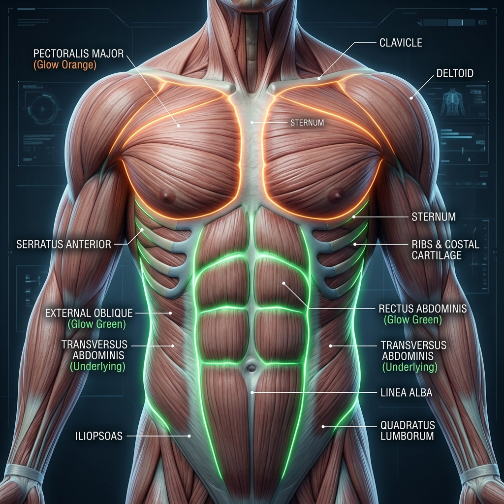

# 🫁 Muscles of the Thorax & Abdomen: Anatomy Reference

This section details the muscles of the chest, respiration, anterior abdominal wall, and deep posterior abdominal stabilizers. These muscles are fundamental to breathing, maintaining intra-abdominal pressure (IAP), and stabilizing the trunk during full-body movement.

---

## 🎨 Labeled Anatomical Illustration

---

## 1. Anterior Thorax & Pectoral Region
These muscles connect the anterior chest wall to the scapula, clavicle, and humerus, governing pushing movements and chest breathing mechanics.

| Muscle Name (Latin) | Origin | Insertion | Innervation | Primary Action(s) |
| :--- | :--- | :--- | :--- | :--- |
| **Pectoralis Major** | Clavicular head (medial clavicle), sternocostal head (sternum, ribs 1-6) | Lateral lip of intertubercular groove of humerus | Medial & lateral pectoral nerves (C5-T1) | Adducts, flexes, and internally rotates humerus; draws scapula anteriorly/inferiorly |
| **Pectoralis Minor** | Anterior surfaces of ribs 3-5 | Coracoid process of scapula | Medial pectoral nerve (C8-T1) | Stabilizes scapula by drawing it anteriorly and inferiorly (depression) |
| **Serratus Anterior** | External surfaces of ribs 1-8 | Anterior surface of medial border of scapula | Long thoracic nerve (C5-C7) | Protracts scapula and holds it flat against the thoracic wall; upwardly rotates scapula |
| **Subclavius** | Junction of rib 1 and its costal cartilage | Inferior surface of clavicle | Nerve to subclavius (C5-C6) | Depresses and anchors clavicle during shoulder girdle movements |

---

## 2. Muscles of Respiration & Intercostals
These muscles are specialized to expand and contract the thoracic cavity to regulate breathing.

*   **Diaphragm:** Originates at xiphoid process, lower 6 costal cartilages, and L1-L3 vertebrae; inserts into the central tendon of the diaphragm. **Action:** Primary muscle of respiration; contracts inferiorly, flattening to increase thoracic volume during inspiration. **Innervation:** **Phrenic Nerve (C3-C5)** ("C3, 4, 5 keep the diaphragm alive").
*   **External Intercostals:** Originates at inferior border of rib above; inserts into superior border of rib below. **Action:** Elevates ribs during inspiration. **Innervation:** Intercostal nerves (T1-T11).
*   **Internal & Innermost Intercostals:** Originates at superior border of rib below; inserts into inferior border of rib above. **Action:** Depresses ribs during active/forced expiration. **Innervation:** Intercostal nerves (T1-T11).

---

## 3. Anterior & Lateral Abdominal Wall
These muscles form a multi-layered girdle around the organs, supporting spinal flexions, rotations, and core stabilization.

| Muscle Name (Latin) | Origin | Insertion | Innervation | Primary Action(s) |
| :--- | :--- | :--- | :--- | :--- |
| **Rectus Abdominis** | Pubic crest and symphysis | Xiphoid process and costal cartilages of ribs 5-7 | Thoracoabdominal nerves (T7-T12) | Flexes lumbar spine, compresses abdominal viscera, stabilizes pelvis |
| **External Oblique** | External surfaces of ribs 5-12 | Linea alba, pubic tubercle, anterior half of iliac crest | Thoracoabdominal nerves (T7-T12), subcostal nerve | **Bilateral:** Flexes spine. **Unilateral:** Rotates spine to opposite side; laterally flexes |
| **Internal Oblique** | Thoracolumbar fascia, anterior 2/3 of iliac crest, inguinal ligament | Inferior borders of ribs 10-12, linea alba, pubis | Thoracoabdominal nerves (T7-T12), L1 nerves | **Bilateral:** Flexes spine. **Unilateral:** Rotates spine to same side; laterally flexes |
| **Transversus Abdominis** | Costal cartilages of ribs 7-12, thoracolumbar fascia, iliac crest | Linea alba, pubic crest | Thoracoabdominal nerves (T7-T12), L1 nerves | Compresses abdominal contents; increases intra-abdominal pressure (IAP) |

---

## 4. Posterior Abdominal Wall
These deep muscles act on the lumbar spine and hip joint, linking the trunk to the lower extremity.

| Muscle Name (Latin) | Origin | Insertion | Innervation | Primary Action(s) |
| :--- | :--- | :--- | :--- | :--- |
| **Quadratus Lumborum** (QL) | Iliac crest and iliolumbar ligament | Transverse processes of L1-L4, inferior border of rib 12 | Anterior rami of T12-L4 | **Bilateral:** Extends lumbar spine, fixes rib 12 during inspiration. **Unilateral:** Laterally flexes spine |
| **Psoas Major** | Transverse processes of L1-L5, bodies/discs of T12-L5 | Lesser trochanter of femur | Anterior rami of L1-L3 | Flexes hip joint; flexes trunk when femur is fixed |
| **Iliacus** | Iliac fossa and sacral ala | Lesser trochanter of femur | Femoral nerve (L2-L4) | Flexes hip joint; stabilizes hip |

---

## 🤸 Study & Practice Links
*   **[Skeletal Reference: Vertebrae & Thorax](../../../bones/regions/02_vertebrae_thorax.md)**
*   **[Pose Corrections & Movement Applications](./pose_corrections.md)**
*   **[Master Muscle Directory](../../README.md)**
