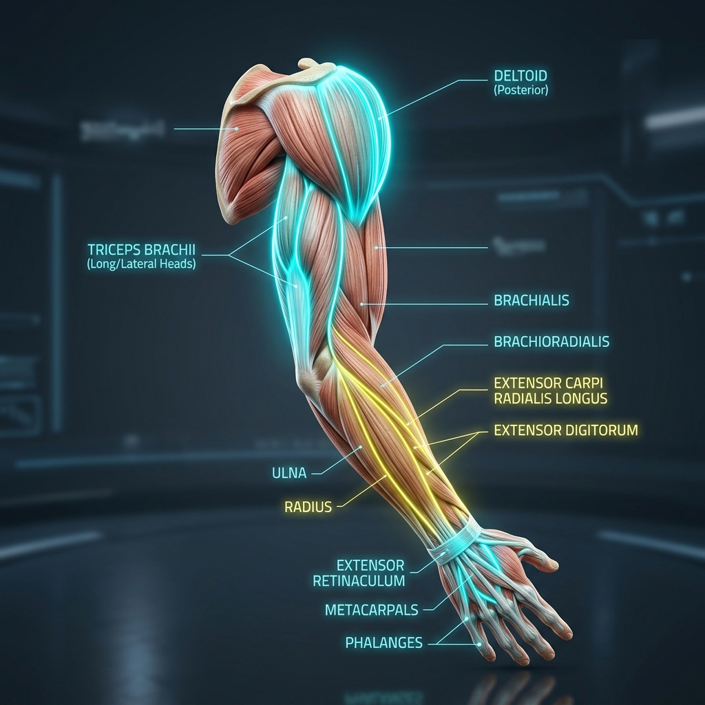

# 🦾 Muscles of the Upper Limb: Anatomy Reference

This section covers the muscles of the shoulder, upper arm, forearm, and intrinsic hand. These muscles coordinate scapular positioning, glenohumeral rotation, elbow flexion/extension, wrist mechanics, and finger articulation.

---

## 🎨 Labeled Anatomical Illustration

---

## 1. Shoulder & Rotator Cuff Muscles
The shoulder has a wide range of motion at the cost of stability. The rotator cuff muscles act as dynamic stabilizers to keep the head of the humerus centered in the shallow glenoid cavity.

| Muscle Name (Latin) | Origin | Insertion | Innervation | Primary Action(s) |
| :--- | :--- | :--- | :--- | :--- |
| **Deltoid** | Lateral clavicle, acromion, and spine of scapula | Deltoid tuberosity of humerus | Axillary nerve (C5-C6) | **Anterior:** Flexes & internally rotates humerus. **Middle:** Abducts humerus. **Posterior:** Extends & externally rotates humerus. |
| **Teres Major** | Inferior angle of scapula | Medial lip of intertubercular groove of humerus | Lower subscapular nerve (C5-C6) | Adducts and internally rotates humerus; assists in extension |
| **Supraspinatus** (Cuff) | Supraspinous fossa of scapula | Greater tubercle of humerus | Suprascapular nerve (C5-C6) | Initiates abduction of humerus (first 15°); stabilizes glenohumeral joint |
| **Infraspinatus** (Cuff) | Infraspinous fossa of scapula | Greater tubercle of humerus | Suprascapular nerve (C5-C6) | Externally (laterally) rotates humerus; stabilizes glenohumeral joint |
| **Teres Minor** (Cuff) | Lateral border of scapula | Greater tubercle of humerus | Axillary nerve (C5-C6) | Externally rotates humerus; stabilizes glenohumeral joint |
| **Subscapularis** (Cuff) | Subscapular fossa of scapula | Lesser tubercle of humerus | Upper & lower subscapular nerves (C5-C6) | Internally (medially) rotates humerus; stabilizes glenohumeral joint |

---

## 2. Muscles of the Arm (Brachium)
These muscles span the elbow joint to control flexion and extension, and some also act on the shoulder.

| Muscle Name (Latin) | Origin | Insertion | Innervation | Primary Action(s) |
| :--- | :--- | :--- | :--- | :--- |
| **Biceps Brachii** | **Long Head:** Supraglenoid tubercle. **Short Head:** Coracoid process of scapula | Radial tuberosity, bicipital aponeurosis | Musculocutaneous nerve (C5-C6) | Supinates forearm; flexes forearm at elbow joint; weak flexor of shoulder |
| **Brachialis** | Distal half of anterior humerus | Coronoid process and tuberosity of ulna | Musculocutaneous nerve (C5-C6) | Primary/pure flexor of elbow joint (active in all forearm positions) |
| **Coracobrachialis** | Coracoid process of scapula | Medial shaft of humerus | Musculocutaneous nerve (C5-C7) | Flexes and adducts humerus at shoulder joint |
| **Triceps Brachii** | **Long Head:** Infraglenoid tubercle. **Lateral Head:** Posterior humerus. **Medial Head:** Posterior humerus | Olecranon process of ulna | Radial nerve (C6-C8) | Primary extensor of elbow; long head assists in shoulder extension/adduction |
| **Anconeus** | Lateral epicondyle of humerus | Lateral surface of olecranon | Radial nerve (C7-T1) | Assists triceps in elbow extension; stabilizes elbow joint |

---

## 3. Muscles of the Forearm (Antebrachium)
These are divided into **flexors** (primarily anterior and medial) and **extensors** (primarily posterior and lateral).

### A. Anterior Compartment (Flexors & Pronators)
Most superficial flexors share a **Common Flexor Origin** at the **Medial Epicondyle** of the humerus.

*   **Superficial Layer:**
    *   **Pronator Teres:** Pronates forearm, flexes elbow. Innervation: Median nerve.
    *   **Flexor Carpi Radialis (FCR):** Flexes and abducts (radially deviates) wrist. Innervation: Median nerve.
    *   **Palmaris Longus:** Weak flexor of wrist, tenses palmar aponeurosis (absent in ~15% of population). Innervation: Median nerve.
    *   **Flexor Carpi Ulnaris (FCU):** Flexes and adducts (ulnarly deviates) wrist. Innervation: Ulnar nerve.
*   **Intermediate Layer:**
    *   **Flexor Digitorum Superficialis (FDS):** Flexes proximal interphalangeal (PIP) joints of fingers 2-5, flexes wrist. Innervation: Median nerve.
*   **Deep Layer:**
    *   **Flexor Digitorum Profundus (FDP):** Flexes distal interphalangeal (DIP) joints of fingers 2-5. Innervation: Median nerve (lateral half), Ulnar nerve (medial half).
    *   **Flexor Pollicis Longus (FPL):** Flexes interphalangeal joint of thumb. Innervation: Median nerve (anterior interosseous).
    *   **Pronator Quadratus:** Deepest muscle; pronates forearm. Innervation: Median nerve.

### B. Posterior Compartment (Extensors & Supinator)
Most superficial extensors share a **Common Extensor Origin** at the **Lateral Epicondyle** of the humerus. All are innervated by the **Radial Nerve** (or its deep/interosseous branches).

*   **Superficial Layer:**
    *   **Brachioradialis:** Flexes elbow (especially when forearm is semi-pronated).
    *   **Extensor Carpi Radialis Longus (ECRL) & Brevis (ECRB):** Extend and abduct wrist.
    *   **Extensor Digitorum:** Extends fingers 2-5, extends wrist.
    *   **Extensor Digiti Minimi:** Extends little finger.
    *   **Extensor Carpi Ulnaris (ECU):** Extends and adducts wrist.
*   **Deep Layer:**
    *   **Supinator:** Supinates forearm (acts with biceps brachii).
    *   **Abductor Pollicis Longus (APL):** Abducts thumb and wrist.
    *   **Extensor Pollicis Brevis (EPB) & Longus (EPL):** Extend thumb joints.
    *   **Extensor Indicis:** Extends index finger.

---

## 4. Intrinsic Muscles of the Hand
These small muscles are contained entirely within the hand and coordinate fine-motor movements and grip adjustments. They are primarily innervated by the **Ulnar Nerve**, except the thenar muscles and lateral two lumbricals (innervated by the **Median Nerve**).

*   **Thenar Group (Thumb Base):** *Abductor Pollicis Brevis, Flexor Pollicis Brevis, Opponens Pollicis*. Pull the thumb across the palm (opposition, abduction, flexion).
*   **Hypothenar Group (Little Finger Base):** *Abductor Digiti Minimi, Flexor Digiti Minimi Brevis, Opponens Digiti Minimi*. Control movement of the little finger.
*   **Adductor Pollicis:** Adducts the thumb (powerful pinch grip).
*   **Lumbricals (4):** Flex metacarpophalangeal (MCP) joints while extending interphalangeal (IP) joints.
*   **Interossei (7):**
    *   **Dorsal Interossei (4):** **Abduct** fingers (**DAB** - Dorsal ABducts).
    *   **Palmar Interossei (3):** **Adduct** fingers (**PAD** - Palmar ADducts).

---

## 🤸 Study & Practice Links
*   **[Skeletal Reference: Pectoral & Upper Limb Bones](../../../bones/regions/03_pectoral_upper_limb.md)**
*   **[Pose Corrections & Movement Applications](./pose_corrections.md)**
*   **[Master Muscle Directory](../../README.md)**
