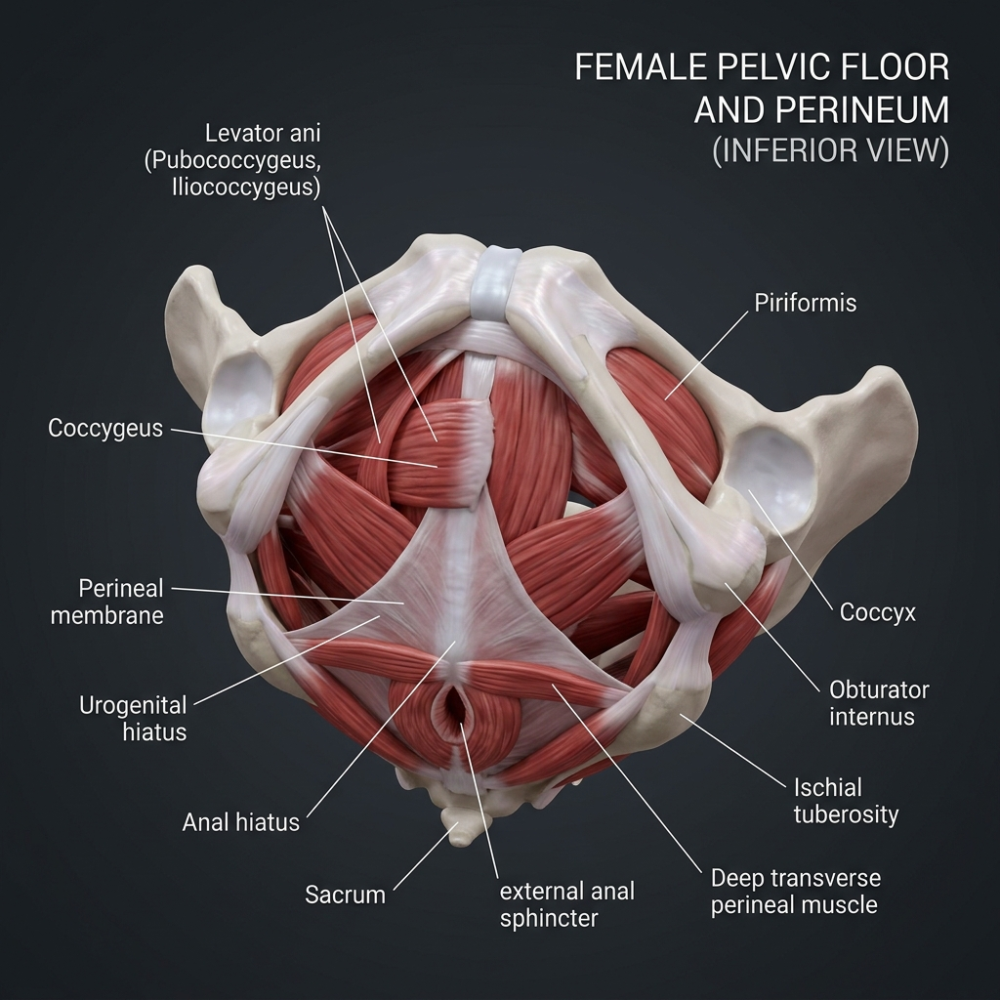

# 🪹 Muscles of the Pelvis & Perineum: Anatomy Reference

This section covers the musculature of the pelvic floor (pelvic diaphragm) and the perineum. These muscles support the pelvic organs, control continence, and work as the structural base of the deep core stabilization system.

---

## 🎨 Labeled Anatomical Illustration

---

## 1. The Pelvic Diaphragm (Pelvic Floor)
The pelvic diaphragm forms a funnel-shaped muscular floor that closes off the pelvic outlet, dividing the pelvis from the perineum. It is primarily composed of the **Levator Ani** group and **Coccygeus**.

| Muscle Group (Latin) | Subdivisions | Attachments (Origin & Insertion) | Innervation | Primary Action(s) |
| :--- | :--- | :--- | :--- | :--- |
| **Levator Ani** | **Puborectalis** | Pubis bone to loop around the rectum | Nerve to levator ani (S4), inferior rectal nerve (S3-S4) | Forms puborectal sling; preserves fecal continence by bending the anal canal |
| | **Pubococcygeus** | Pubis bone to coccyx and anococcygeal body | Nerve to levator ani (S4) | Supports pelvic viscera; elevates pelvic floor |
| | **Iliococcygeus** | Tendinous arch of levator ani (obturator fascia) to coccyx | Nerve to levator ani (S4) | Supports pelvic viscera; forms muscular sheet of floor |
| **Coccygeus** (*Ischiococcygeus*) | — | Ischial spine to lower sacrum and coccyx | Anterior rami of S4-S5 | Pulls coccyx forward after defecation; supports pelvic floor |

---

## 2. Muscles of the Perineum
The perineum lies inferior to the pelvic diaphragm. It is divided anatomically into two triangles by a transverse line between the ischial tuberosities: the **Urogenital Triangle** (anterior) and the **Anal Triangle** (posterior).

### A. Urogenital Triangle Muscles
These muscles control external genitalia function and urethral closure.

*   **Superficial Compartment:**
    *   **Ischiocavernosus:** Originates at ischial tuberosity/ramus; inserts into crus of clitoris/penis. **Action:** Maintains erection by compressing deep veins. **Innervation:** Pudendal nerve (S2-S4).
    *   **Bulbospongiosus:** Originates at perineal body/midline raphe; inserts into bulb of penis/clitoris and perineal membrane. **Action:** Empties urethra; assists in erection. **Innervation:** Pudendal nerve.
    *   **Superficial Transverse Perineal:** Originates at ischial ramus; inserts into perineal body. **Action:** Stabilizes the perineal body. **Innervation:** Pudendal nerve.
*   **Deep Compartment:**
    *   **Deep Transverse Perineal:** Originates at ischial ramus; inserts into perineal body/medial raphe. **Action:** Stabilizes perineal body. **Innervation:** Pudendal nerve.
    *   **External Urethral Sphincter:** Surrounds urethra. **Action:** Constricts urethra voluntarily (prevents urination). **Innervation:** Pudendal nerve.

### B. Anal Triangle Muscles
This posterior region contains the anal canal opening.

*   **External Anal Sphincter:** Surrounds the anal canal. **Action:** Keeps anal canal closed (voluntary fecal control). **Innervation:** Pudendal nerve (S2-S4) via inferior rectal nerve.

---

## 🤸 Study & Practice Links
*   **[Skeletal Reference: Pelvic & Lower Limb Bones](../../../bones/regions/04_pelvic_lower_limb.md)**
*   **[Pose Corrections & Movement Applications](./pose_corrections.md)**
*   **[Master Muscle Directory](../../README.md)**
