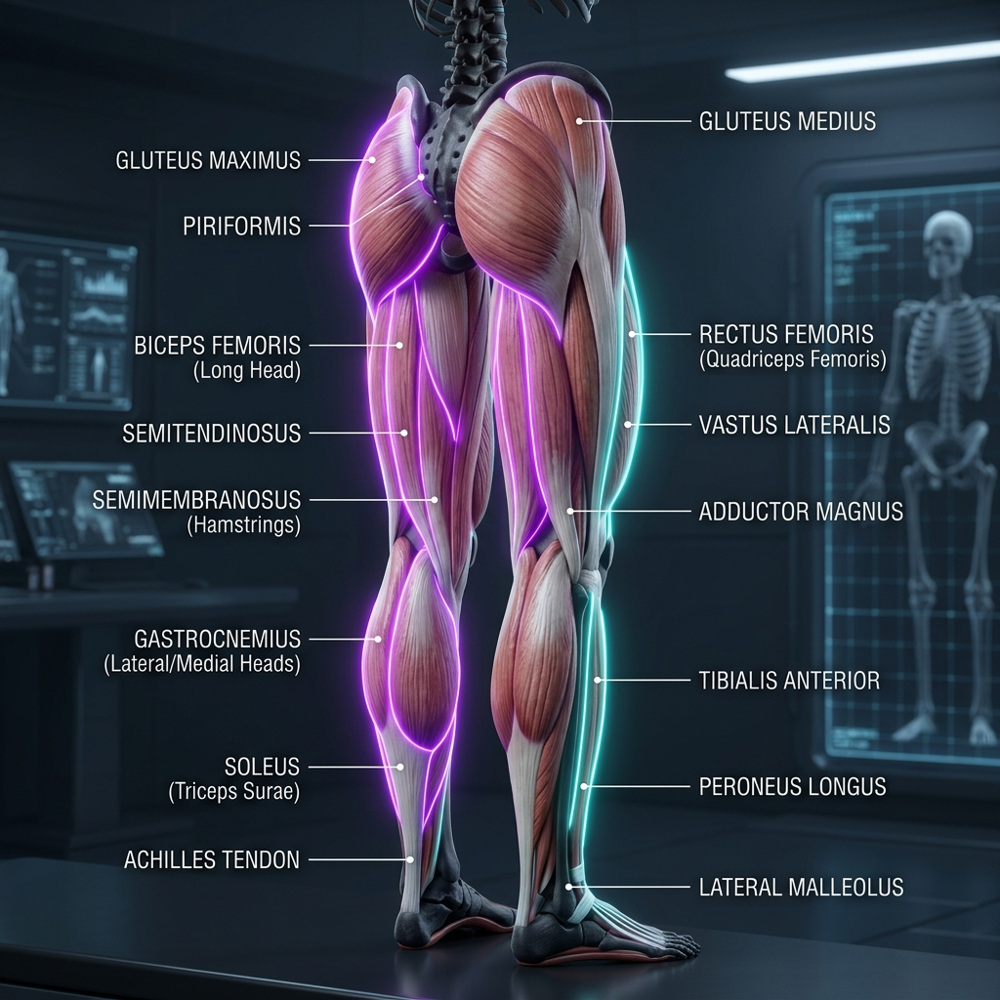

# 🦵 Muscles of the Lower Limb: Anatomy Reference

This section details the muscles of the gluteal region, thigh, leg, and foot. These muscles bear the weight of the human body, drive locomotion, stabilize the pelvis, and control complex ankle-knee-hip kinematics.

---

## 🎨 Labeled Anatomical Illustration

---

## 1. Gluteal Region & Deep Hip Rotators
These muscles form the posterior hip girdle, responsible for hip extension, abduction, and rotation, which are crucial for maintaining an upright posture and pelvic alignment.

| Muscle Name (Latin) | Origin | Insertion | Innervation | Primary Action(s) |
| :--- | :--- | :--- | :--- | :--- |
| **Gluteus Maximus** | Ilium, sacrum, coccyx, aponeurosis of erector spinae | Iliotibial (IT) band and gluteal tuberosity of femur | Inferior gluteal nerve (L5-S2) | Primary hip extensor; externally rotates femur; stabilizes pelvis |
| **Gluteus Medius** | Outer surface of ilium | Lateral aspect of greater trochanter of femur | Superior gluteal nerve (L4-S1) | Abducts and internally rotates femur; stabilizes pelvis during single-leg stance |
| **Gluteus Minimus** | Outer surface of ilium (below medius) | Anterior aspect of greater trochanter | Superior gluteal nerve (L4-S1) | Abducts and internally rotates femur; stabilizes pelvis |
| **Tensor Fasciae Latae** (TFL) | Anterior superior iliac spine (ASIS), outer iliac crest | Iliotibial (IT) band | Superior gluteal nerve (L4-S1) | Abducts, flexes, and internally rotates femur; tenses the IT band |
| **Piriformis** (Deep) | Anterior surface of sacrum | Superior border of greater trochanter | Nerve to piriformis (S1-S2) | Externally rotates extended hip; abducts flexed hip; stabilizes head of femur |
| **Obturator Internus** | Inner surface of obturator membrane & surrounding bone | Medial surface of greater trochanter | Nerve to obturator internus (L5-S1) | Externally rotates femur; stabilizes hip joint |
| **Gemelli** (*Superior/Inferior*) | Ischial spine (Sup) & Ischial tuberosity (Inf) | Medial surface of greater trochanter | Nerve to obturator internus (Sup), Nerve to quadratus femoris (Inf) | Externally rotates femur; stabilizes hip joint |
| **Quadratus Femoris** | Lateral border of ischial tuberosity | Quadrate tubercle of intertrochanteric crest | Nerve to quadratus femoris (L5-S1) | Externally rotates femur; stabilizes hip joint |

---

## 2. Muscles of the Thigh
The thigh is divided into three compartments: Anterior (knee extensors/hip flexors), Posterior (hamstrings/knee flexors), and Medial (adductors).

### A. Anterior Compartment
*   **Sartorius:** Originates at ASIS; inserts into medial proximal tibia (**pes anserinus**). **Action:** Flexes, abducts, and externally rotates hip; flexes knee ("tailor's pose"). **Innervation:** Femoral nerve (L2-L3).
*   **Quadriceps Femoris:** Primary knee extensor group. All insert into the patella via the quadriceps tendon, which continues to the tibial tuberosity via the patellar ligament. All are innervated by the **Femoral Nerve (L2-L4)**.

| Muscle (Latin) | Origin | Action |
| :--- | :--- | :--- |
| **Rectus Femoris** | Anterior inferior iliac spine (AIIS) | Flexes hip; extends knee (spans two joints) |
| **Vastus Lateralis** | Greater trochanter, linea aspera | Extends knee |
| **Vastus Medialis** | Intertrochanteric line, linea aspera | Extends knee; stabilizes patellar tracking |
| **Vastus Intermedius** | Anterior/lateral shaft of femur | Extends knee (deep to rectus femoris) |

### B. Medial Compartment (Adductors)
These muscles pull the leg toward the midline. All are innervated by the **Obturator Nerve (L2-L4)**, except pectineus and the hamstring part of adductor magnus.

*   **Pectineus:** Originates at pectineal line of pubis; inserts into pectineal line of femur. **Action:** Adducts and flexes hip. **Innervation:** Femoral nerve (sometimes obturator).
*   **Adductor Longus:** Originates at body of pubis; inserts into middle third of linea aspera. **Action:** Adducts hip.
*   **Adductor Brevis:** Originates at body and inferior ramus of pubis; inserts into proximal linea aspera. **Action:** Adducts hip.
*   **Adductor Magnus:** Large triangular muscle with two parts:
    *   *Adductor Part:* Pubic ramus to linea aspera. Adducts and flexes hip. Innervated by obturator nerve.
    *   *Hamstring Part:* Ischial tuberosity to adductor tubercle of femur. Extends hip. Innervated by tibial nerve (L4).
*   **Gracilis:** Originates at body/inferior ramus of pubis; inserts into medial proximal tibia (**pes anserinus**). **Action:** Adducts hip; flexes and internally rotates knee.

### C. Posterior Compartment (Hamstrings)
These muscles extend the hip and flex the knee. They all originate from the **Ischial Tuberosity** (except the short head of biceps femoris) and are innervated by the **Tibial Nerve** (except the short head of biceps femoris).

*   **Biceps Femoris:**
    *   *Long Head:* Originates at ischial tuberosity. **Action:** Flexes knee, extends hip, externally rotates flexed knee. **Innervation:** Tibial nerve (L5-S2).
    *   *Short Head:* Originates at linea aspera of femur. **Action:** Flexes knee, externally rotates flexed knee. **Innervation:** Common fibular/peroneal nerve (L5-S2).
    *   *Insertion:* Head of fibula and lateral condyle of tibia.
*   **Semitendinosus:** Originates at ischial tuberosity; inserts into medial proximal tibia (**pes anserinus**). **Action:** Flexes knee, extends hip, internally rotates flexed knee. **Innervation:** Tibial nerve (L5-S2).
*   **Semimembranosus:** Originates at ischial tuberosity; inserts into posterior medial condyle of tibia. **Action:** Flexes knee, extends hip, internally rotates flexed knee. **Innervation:** Tibial nerve (L5-S2).

---

## 3. Muscles of the Leg (Crus)
The lower leg is divided into three compartments: Anterior (dorsiflexors), Lateral (evertors), and Posterior (plantarflexors).

### A. Anterior Compartment
All are innervated by the **Deep Fibular/Peroneal Nerve (L4-S1)**.
*   **Tibialis Anterior:** Originates at lateral condyle/shaft of tibia; inserts into medial cuneiform and 1st metatarsal. **Action:** Dorsiflexes ankle; inverts foot.
*   **Extensor Digitorum Longus:** Extends toes 2-5; dorsiflexes ankle.
*   **Extensor Hallucis Longus:** Extends big toe (hallux); dorsiflexes ankle.
*   **Fibularis (Peroneus) Tertius:** Dorsiflexes ankle; everts foot.

### B. Lateral Compartment
All are innervated by the **Superficial Fibular/Peroneal Nerve (L5-S2)**.
*   **Fibularis (Peroneus) Longus:** Originates at head/proximal shaft of fibula; loops under foot to insert into medial cuneiform and 1st metatarsal. **Action:** Everts foot; plantarflexes ankle; supports transverse arch of foot.
*   **Fibularis (Peroneus) Brevis:** Originates at distal shaft of fibula; inserts into tuberosity of 5th metatarsal. **Action:** Everts foot; plantarflexes ankle.

### C. Posterior Compartment
All are innervated by the **Tibial Nerve (L4-S3)**.
*   **Superficial Layer:**
    *   **Gastrocnemius:** Two heads originate at medial and lateral condyles of femur; insert into calcaneus bone via the **Achilles (Calcaneal) Tendon**. **Action:** Plantarflexes ankle; flexes knee (spans two joints).
    *   **Soleus:** Originates at proximal fibula and tibia; inserts into calcaneus via Achilles tendon. **Action:** Primary ankle plantarflexor (highly active in standing posture).
    *   **Plantaris:** Small, rudimental muscle; inserts into calcaneus. **Action:** Weakly assists gastrocnemius.
*   **Deep Layer:**
    *   **Popliteus:** Unlocks the knee joint by externally rotating the femur on a fixed tibia to initiate knee flexion.
    *   **Tibialis Posterior:** Originates at interosseous membrane, tibia, and fibula; inserts into navicular and tarsal/metatarsal bones on plantar foot surface. **Action:** Primary inverter of foot; plantarflexes ankle; supports medial longitudinal arch of foot.
    *   **Flexor Digitorum Longus:** Flexes toes 2-5; plantarflexes ankle; supports arches.
    *   **Flexor Hallucis Longus:** Flexes big toe; plantarflexes ankle.

---

## 4. Intrinsic Muscles of the Foot
These muscles stabilize the arches of the foot and coordinate toe movements.
*   **Dorsal Surface:** *Extensor Digitorum Brevis, Extensor Hallucis Brevis* (extend toes).
*   **Plantar Surface (4 layers):**
    *   *Layer 1 (Superficial):* **Abductor Hallucis** (abducts big toe), **Flexor Digitorum Brevis** (flexes toes 2-4), **Abductor Digiti Minimi** (abducts little toe).
    *   *Layer 2:* **Quadratus Plantae** (corrects pull of flexor digitorum longus), **Lumbricals (4)** (flex MCP, extend IP joints).
    *   *Layer 3:* **Flexor Hallucis Brevis** (flexes big toe), **Adductor Hallucis** (adducts big toe, supports transverse arch), **Flexor Digiti Minimi Brevis** (flexes little toe).
    *   *Layer 4 (Deepest):* **Plantar Interossei (3)** (adduct toes), **Dorsal Interossei (4)** (abduct toes).

---

## 🤸 Study & Practice Links
*   **[Skeletal Reference: Pelvic & Lower Limb Bones](../../../bones/regions/04_pelvic_lower_limb.md)**
*   **[Pose Corrections & Movement Applications](./pose_corrections.md)**
*   **[Master Muscle Directory](../../README.md)**
